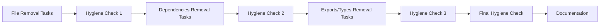

# Phase 1 Cleanup Guide - High Impact, Low Risk

**Feature ID**: `a5cf6f83-6824-4dd1-97c9-cdd0580ef63d`  
**Status**: Planning  
**Priority**: High  
**Target Completion**: Week 1

---

## 🎯 **Phase 1 Overview**

Phase 1 focuses on removing dead code and unused dependencies identified by knip analysis. 
This phase poses minimal risk to functionality while providing significant cleanup benefits.

**Expected Impact**:

- **18 unused files** removed
- **35 unused dependencies** removed
- **45 unused devDependencies** removed
- **41 unused exports** removed
- **34 unused types** removed

---

## 📋 **Task Breakdown**

### **Phase 1A: File Removal (3 tasks)**

1. **Remove Unused Files - API Client Package** - 3 files
2. **Remove Unused Files - Express API Package** - 4 files
3. **Remove Unused Files - Client UI Package** - 11 files

### **Phase 1B: Dependencies Removal (3 tasks)**

1. **Remove Unused Dependencies - Client UI** - 8 packages
2. **Remove Unused Dependencies - Express API** - 12 packages
3. **Remove Unused Dependencies - Infrastructure** - 12 packages

### **Phase 1C: DevDependencies Removal (5 tasks)**

1. **Remove Unused DevDependencies - Root Package** - 10 packages
2. **Remove Unused DevDependencies - Client UI** - 8 packages
3. **Remove Unused DevDependencies - Express API** - 7 packages
4. **Remove Unused DevDependencies - Infrastructure** - 5 packages
5. **Remove Unused DevDependencies - Config Packages** - 8 packages

### **Phase 1D: Exports and Types Removal (6 tasks)**

1. **Remove Unused Exports - API Client Package** - 8 exports
2. **Remove Unused Exports - Express API** - 8 exports
3. **Remove Unused Exports - Client UI** - 25 exports
4. **Remove Unused Types - API Client Package** - 13 types
5. **Remove Unused Types - Express API** - 10 types
6. **Remove Unused Types - Client UI** - 11 types

### **Phase 1E: Hygiene Checks (4 tasks)**

1. **Hygiene Check 1 - After File Removal**
2. **Hygiene Check 2 - After Dependencies Removal**
3. **Hygiene Check 3 - After Exports and Types Removal**
4. **Final Hygiene Check - Phase 1 Complete**

### **Phase 1F: Documentation (1 task)**

1. **Phase 1 Cleanup Summary and Documentation**

---

## 🔄 **Workflow Dependencies**



---

## 🧪 **Hygiene Check Procedures**

### **Standard Hygiene Check Commands**

```bash
# 1. Linting
pnpm lint

# 2. Type Checking
pnpm type-check

# 3. Build Verification
pnpm build

# 4. Schema Generation
pnpm generate-schema

# 5. Knip Verification (after final cleanup)
pnpm knip
```

### **Hygiene Check 1 - After File Removal**

- **Purpose**: Verify that removing unused files didn't break functionality
- **Commands**: lint, type-check, build, generate-schema
- **Success Criteria**: All commands pass without errors

### **Hygiene Check 2 - After Dependencies Removal**

- **Purpose**: Verify that removing unused dependencies didn't break functionality
- **Commands**: lint, type-check, build, generate-schema
- **Success Criteria**: All commands pass without errors

### **Hygiene Check 3 - After Exports and Types Removal**

- **Purpose**: Verify that removing unused exports/types didn't break functionality
- **Commands**: lint, type-check, build, generate-schema
- **Success Criteria**: All commands pass without errors

### **Final Hygiene Check - Phase 1 Complete**

- **Purpose**: Comprehensive verification that all cleanup was successful
- **Commands**: lint, type-check, build, generate-schema, knip
- **Success Criteria**: All commands pass + knip shows significant reduction in unused items

---

## 📊 **Success Metrics**

### **File Cleanup**

- **Before**: 18 unused files
- **After**: 0 unused files
- **Target**: 100% removal

### **Dependencies Cleanup**

- **Before**: 35 unused dependencies
- **After**: 0 unused dependencies
- **Target**: 100% removal

### **DevDependencies Cleanup**

- **Before**: 45 unused devDependencies
- **After**: 0 unused devDependencies
- **Target**: 100% removal

### **Exports Cleanup**

- **Before**: 41 unused exports
- **After**: 0 unused exports
- **Target**: 100% removal

### **Types Cleanup**

- **Before**: 34 unused types
- **After**: 0 unused types
- **Target**: 100% removal

---

## ⚠️ **Risk Mitigation**

### **Low Risk Activities**

- Removing unused files (already confirmed by knip)
- Removing unused dependencies (already confirmed by knip)
- Removing unused devDependencies (already confirmed by knip)

### **Medium Risk Activities**

- Removing unused exports (may affect external consumers)
- Removing unused types (may affect type definitions)

### **Risk Mitigation Strategies**

1. **Incremental removal** - Remove items in small batches
2. **Hygiene checks** - Run after each batch
3. **Rollback capability** - Git commits after each successful batch
4. **External validation** - Verify no breaking changes for consumers

---

## 🚀 **Getting Started**

1. **Start with file removal** - Lowest risk, highest impact
2. **Run hygiene checks** - Ensure functionality preserved
3. **Move to dependencies** - Remove unused packages
4. **Run hygiene checks** - Verify no breaking changes
5. **Clean up exports/types** - Remove dead code
6. **Final verification** - Comprehensive testing
7. **Document results** - Update cleanup audit

---

## 📝 **Notes**

- All tasks are marked as **High Priority** due to cleanup urgency
- **Complexity ratings** range from 2-5 based on scope and risk
- **Dependencies** ensure proper workflow progression
- **Hygiene checks** prevent functionality regression
- **Documentation** ensures knowledge preservation

---

_This guide was generated for the Phase 1 cleanup of the macro-ai codebase. Follow the task dependencies 
and run hygiene checks at each stage to ensure successful cleanup._
