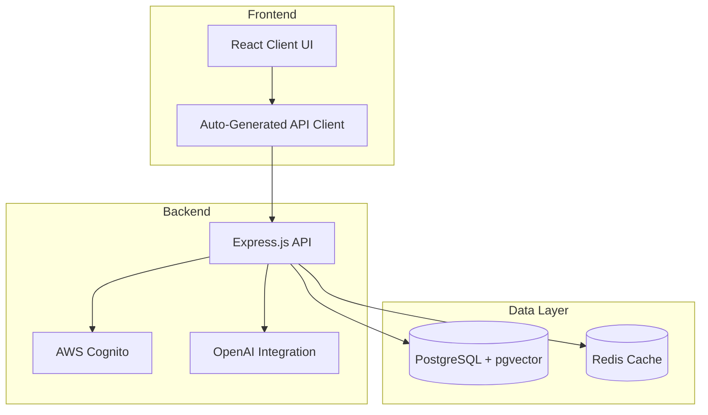

# Macro AI

[](https://github.com/RussOakham/macro-ai/actions/workflows/hygiene-checks.yml)
[](https://github.com/RussOakham/macro-ai/actions/workflows/hygiene-checks.yml)
[](https://www.typescriptlang.org/)
[](https://nodejs.org/)
[](https://pnpm.io/)

**Macro AI** is a modern, full-stack AI-powered chat application built with enterprise-grade architecture and
best practices. This monorepo contains a complete ecosystem including a React frontend, Express.js API,
auto-generated TypeScript clients, and comprehensive documentation.

Despite this being a personal project, the application has been developed, tested, secured, deployed and documented
with the same attention to detail and quality as any enterprise application.

## 🚀 Quick Start

Get up and running in minutes:

```bash
# Clone and install
git clone https://github.com/RussOakham/macro-ai.git
cd macro-ai
pnpm install

# Set up environment
cp apps/express-api/.env.example apps/express-api/.env
cp apps/client-ui/.env.example apps/client-ui/.env
# Edit .env files with your configuration

# Start development servers
pnpm dev
```

**📚 [Complete Setup Guide →](./docs/getting-started/development-setup.md)**

## ✨ Features

- **🤖 AI-Powered Chat**: Real-time streaming conversations with OpenAI integration
- **🔐 Secure Authentication**: AWS Cognito with JWT tokens and refresh rotation
- **🎯 Type-Safe API**: Auto-generated TypeScript clients with runtime validation
- **🔍 Semantic Search**: Vector embeddings with PostgreSQL + pgvector
- **📱 Modern UI**: React with Tailwind CSS and shadcn/ui components
- **🚀 Production Ready**: Comprehensive monitoring, logging, and error handling
- **📚 Full Documentation**: Complete guides, API references, and architectural decisions

## 🏗️ Architecture Overview



**📖 [Detailed Architecture →](./docs/architecture/system-architecture.md)**

## 📁 Repository Structure

### Applications

- **`apps/client-ui/`** - React frontend with Vite, TypeScript, and Tailwind CSS
- **`apps/express-api/`** - Express.js API with OpenAPI specification and Zod validation

### Packages

- **`packages/ui-library/`** - Shared UI components and design system
- **`packages/macro-ai-api-client/`** - Auto-generated TypeScript API client
- **`packages/config-typescript/`** - Shared TypeScript configurations
- **`packages/config-eslint/`** - Shared ESLint configurations

### Documentation

- **`docs/`** - Comprehensive documentation including guides, references, and ADRs

## 📖 Documentation

Our comprehensive documentation covers everything from getting started to advanced deployment strategies:

### 🚀 Getting Started

- **[Development Setup](./docs/getting-started/development-setup.md)** - Complete environment setup guide
- **[Environment Configuration](./docs/getting-started/environment-configuration.md)** - Configuration management
- **[Troubleshooting](./docs/getting-started/troubleshooting.md)** - Common issues and solutions

### 🏗️ Architecture & Design

- **[System Architecture](./docs/architecture/system-architecture.md)** - High-level system design
- **[Data Flow](./docs/architecture/data-flow.md)** - Request/response cycles and streaming
- **[Database Design](./docs/architecture/database-design.md)** - PostgreSQL schema and pgvector integration
- **[Security Architecture](./docs/architecture/security-architecture.md)** - Security patterns and best practices
- **[Technology Stack](./docs/architecture/technology-stack.md)** - Technology choices and rationale

### 💻 Development

- **[API Development](./docs/development/api-development.md)** - OpenAPI and Zod integration
- **[Error Handling](./docs/development/error-handling.md)** - Go-style error handling patterns
- **[Testing Strategy](./docs/development/testing-strategy.md)** - Unit testing with Vitest
- **[Coding Standards](./docs/development/coding-standards.md)** - Code style and best practices
- **[Monorepo Management](./docs/development/monorepo-management.md)** - Workspace organization

### 🚀 Deployment & Operations

- **[AWS Deployment](./docs/deployment/aws-deployment.md)** - Infrastructure as Code with CDK
- **[CI/CD Pipeline](./docs/deployment/ci-cd-pipeline.md)** - GitHub Actions automation
- **[Environment Setup](./docs/deployment/environment-setup.md)** - Production configuration
- **[Monitoring & Logging](./docs/deployment/monitoring-logging.md)** - Observability strategies

### 🔧 Operations

- **[Release Process](./docs/operations/release-process.md)** - Semantic versioning and releases
- **[Database Operations](./docs/operations/database-operations.md)** - Schema management and maintenance
- **[Incident Response](./docs/operations/incident-response.md)** - Troubleshooting and emergency procedures
- **[Merge Strategy](./docs/operations/merge-strategy.md)** - Git flow-based development workflow

### 🎯 Features

- **[Authentication System](./docs/features/authentication/README.md)** - AWS Cognito integration
- **[Chat System](./docs/features/chat-system/README.md)** - AI-powered conversations with streaming
- **[API Client](./docs/features/api-client/README.md)** - Auto-generated TypeScript clients
- **[User Management](./docs/features/user-management/README.md)** - Profile and data management

### 📚 Reference

- **[API Reference](./docs/reference/api-reference.md)** - Complete API documentation
- **[Configuration Reference](./docs/reference/configuration-reference.md)** - Environment variables and settings
- **[Database Schema](./docs/reference/database-schema.md)** - Complete schema documentation
- **[Glossary](./docs/reference/glossary.md)** - Terms and definitions

### 🏛️ Architecture Decision Records (ADRs)

- **[ADR-001: Error Handling Strategy](./docs/adr/001-error-handling-strategy.md)** - Go-style error handling
- **[ADR-002: Authentication Approach](./docs/adr/002-authentication-approach.md)** - AWS Cognito selection
- **[ADR-003: Database Technology](./docs/adr/003-database-technology.md)** - PostgreSQL + pgvector
- **[ADR-004: API Client Generation](./docs/adr/004-api-client-generation.md)** - Automated client generation

## 🛠️ Development Commands

The monorepo includes several scripts for efficient development:

```bash
# Development
pnpm dev              # Start all development servers
pnpm build            # Build all packages and applications
pnpm test             # Run all tests
pnpm lint             # Run ESLint across the codebase
pnpm format           # Check code formatting
pnpm format:fix       # Fix formatting issues

# Commits
pnpm commit           # Use commitizen for standardized commits

# Package-specific development servers
pnpm ui               # Start React frontend development server
pnpm api              # Start Express API development server
```

## 🤝 Contributing

We welcome contributions! Please read our contributing guidelines:

1. **[Development Setup](./docs/getting-started/development-setup.md)** - Set up your development environment
2. **[Coding Standards](./docs/development/coding-standards.md)** - Follow our code style guidelines
3. **[Testing Strategy](./docs/development/testing-strategy.md)** - Write comprehensive tests
4. **[Merge Strategy](./docs/operations/merge-strategy.md)** - Follow our Git Flow workflow

### Code Quality Standards

- ✅ TypeScript with strict mode enabled
- ✅ ESLint and Prettier for code formatting
- ✅ Comprehensive unit tests with Vitest
- ✅ Go-style error handling patterns
- ✅ Semantic commit messages

## 📄 License

This project is licensed under the MIT License - see the [LICENSE](LICENSE) file for details.

## 🔗 Links

- **[Documentation](./docs/README.md)** - Complete documentation index
- **[API Documentation](http://localhost:3040/api-docs)** - Interactive Swagger UI (when running locally)
- **[GitHub Actions](https://github.com/RussOakham/macro-ai/actions)** - CI/CD pipeline status
- **[Issues](https://github.com/RussOakham/macro-ai/issues)** - Bug reports and feature requests
