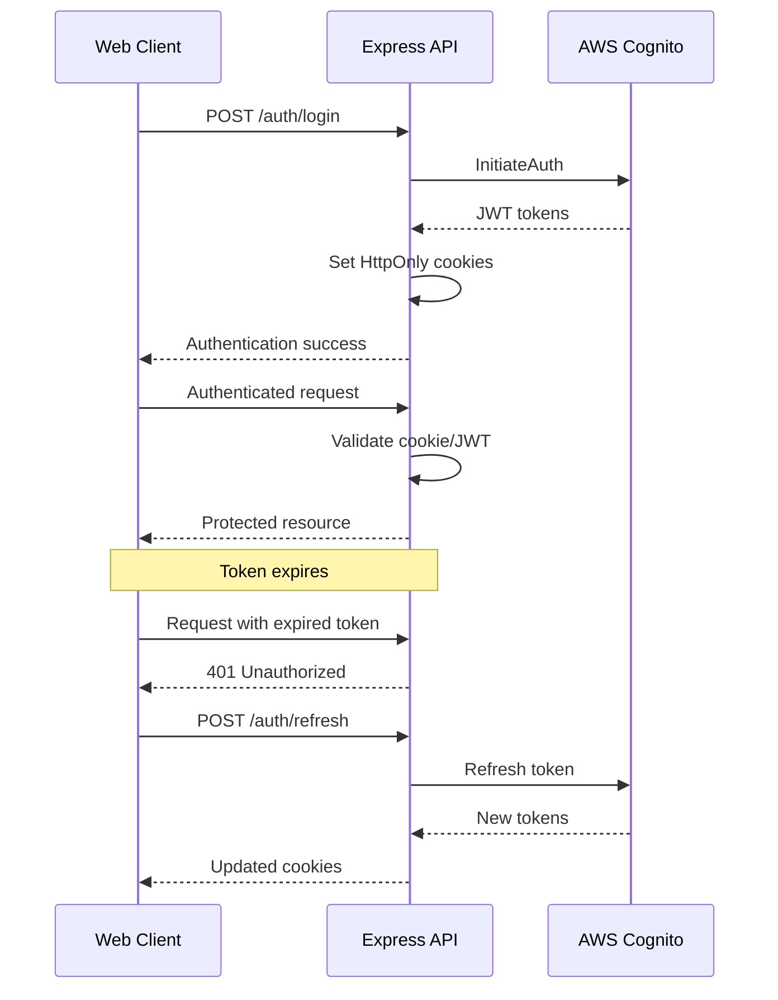

# ADR-002: Authentication Approach

## Status

✅ **ACCEPTED** - Implemented and in production use

## Context

The Macro AI application requires a robust authentication system to secure user accounts, manage sessions, and
protect API endpoints. We needed to choose between building a custom authentication solution or leveraging an
existing service, considering factors like security, scalability, compliance, and development velocity.

## Decision

We will use **AWS Cognito** as our primary authentication provider with **cookie-based session management**
for web clients and **API key authentication** for programmatic access.

### Key Components

1. **AWS Cognito User Pool** for user management and authentication
2. **JWT tokens** for stateless authentication
3. **HttpOnly cookies** for secure web session management
4. **API keys** for service-to-service authentication
5. **Refresh token rotation** for enhanced security

## Rationale

### Why AWS Cognito?

#### ✅ Advantages

- **Security**: Enterprise-grade security with built-in protection against common attacks
- **Compliance**: SOC 2, HIPAA, and other compliance certifications
- **Scalability**: Handles millions of users without infrastructure management
- **Features**: Built-in MFA, password policies, account recovery, email verification
- **Integration**: Native AWS service integration for future expansion
- **Cost-Effective**: Pay-per-active-user pricing model
- **Maintenance**: Fully managed service reduces operational overhead

#### ❌ Disadvantages

- **Vendor Lock-in**: Tight coupling to AWS ecosystem
- **Customization Limits**: Some UI and flow customization constraints
- **Learning Curve**: Team needs to learn Cognito-specific concepts
- **Debugging**: Less control over authentication flow debugging

### Why Cookie-Based Sessions?

#### ✅ Advantages

- **Security**: HttpOnly cookies prevent XSS attacks
- **Automatic Management**: Browser handles cookie storage and transmission
- **CSRF Protection**: SameSite cookie attributes provide CSRF protection
- **User Experience**: Seamless authentication without manual token management

#### ❌ Disadvantages

- **Mobile Limitations**: Cookies less suitable for mobile applications
- **CORS Complexity**: Cross-origin requests require careful configuration

### Why API Key Authentication?

#### ✅ Advantages

- **Simplicity**: Easy to implement and understand
- **Programmatic Access**: Ideal for service-to-service communication
- **Long-lived**: Suitable for automated systems and integrations
- **Revocable**: Can be easily revoked without affecting user sessions

## Implementation Details

### Authentication Flow



### Security Configuration

```typescript
// Cookie security configuration
const cookieOptions = {
	httpOnly: true, // Prevent XSS access
	secure: process.env.NODE_ENV === 'production', // HTTPS only in production
	sameSite: 'strict' as const, // CSRF protection
	domain: config.cookieDomain, // Domain restriction
	maxAge: 60 * 60 * 1000, // 1 hour expiration
	path: '/', // Available site-wide
}

// Cognito configuration
const cognitoConfig = {
	region: config.awsCognitoRegion,
	userPoolId: config.awsCognitoUserPoolId,
	clientId: config.awsCognitoUserPoolClientId,
	clientSecret: config.awsCognitoUserPoolSecretKey,

	// Security policies
	passwordPolicy: {
		minimumLength: 8,
		requireUppercase: true,
		requireLowercase: true,
		requireNumbers: true,
		requireSymbols: true,
	},

	// MFA configuration
	mfaConfiguration: 'OPTIONAL',
	mfaTypes: ['SMS_MFA', 'SOFTWARE_TOKEN_MFA'],
}
```

### Token Management

```typescript
// JWT token validation
export class TokenValidator {
	async validateToken(token: string): Promise<Result<CognitoUser>> {
		try {
			// Verify JWT signature and expiration
			const decoded = jwt.verify(token, this.getPublicKey(), {
				algorithms: ['RS256'],
				issuer: `https://cognito-idp.${config.awsCognitoRegion}.amazonaws.com/${config.awsCognitoUserPoolId}`,
				audience: config.awsCognitoUserPoolClientId,
			})

			// Extract user information
			const user = this.extractUserFromToken(decoded)
			return [user, null]
		} catch (error) {
			return [null, new AuthenticationError('Invalid token')]
		}
	}

	async refreshTokens(refreshToken: string): Promise<Result<TokenSet>> {
		const [response, error] = await tryCatch(
			this.cognitoClient.send(
				new InitiateAuthCommand({
					AuthFlow: 'REFRESH_TOKEN_AUTH',
					ClientId: config.awsCognitoUserPoolClientId,
					AuthParameters: {
						REFRESH_TOKEN: refreshToken,
					},
				}),
			),
			'TokenValidator.refreshTokens',
		)

		if (error || !response.AuthenticationResult) {
			return [null, new AuthenticationError('Token refresh failed')]
		}

		return [response.AuthenticationResult, null]
	}
}
```

## Alternatives Considered

### 1. Custom Authentication System

#### ✅ Advantages

- **Full Control**: Complete customization of authentication flow
- **No Vendor Lock-in**: Technology-agnostic implementation
- **Cost Control**: Predictable infrastructure costs

#### ❌ Disadvantages

- **Security Risk**: Higher chance of security vulnerabilities
- **Development Time**: Significant development and testing effort
- **Maintenance Burden**: Ongoing security updates and patches
- **Compliance**: Need to implement compliance features from scratch

**Decision**: Rejected due to security risks and development overhead

### 2. Auth0

#### ✅ Advantages

- **Developer Experience**: Excellent documentation and SDKs
- **Customization**: Highly customizable authentication flows
- **Features**: Rich feature set with social logins, SSO, etc.

#### ❌ Disadvantages

- **Cost**: More expensive than Cognito for our scale
- **Vendor Lock-in**: Similar lock-in concerns as Cognito
- **AWS Integration**: Less seamless integration with AWS services

**Decision**: Rejected due to higher costs and less AWS integration

### 3. Firebase Authentication

#### ✅ Advantages

- **Ease of Use**: Simple setup and integration
- **Real-time**: Real-time authentication state changes
- **Social Logins**: Built-in social authentication providers

#### ❌ Disadvantages

- **Google Lock-in**: Ties us to Google Cloud ecosystem
- **Limited Enterprise Features**: Fewer enterprise-grade features
- **Pricing**: Can become expensive at scale

**Decision**: Rejected due to Google ecosystem lock-in

### 4. Session-Based Authentication (Traditional)

#### ✅ Advantages

- **Simplicity**: Well-understood traditional approach
- **Server Control**: Full server-side session management
- **Revocation**: Easy session revocation

#### ❌ Disadvantages

- **Scalability**: Requires session storage and management
- **Stateful**: Complicates horizontal scaling
- **Mobile Unfriendly**: Not suitable for mobile applications

**Decision**: Rejected due to scalability concerns

## Implementation Timeline

### Phase 1: Core Authentication ✅ COMPLETED

- AWS Cognito User Pool setup
- Basic login/logout functionality
- JWT token validation
- Cookie-based session management

### Phase 2: Enhanced Security ✅ COMPLETED

- Refresh token rotation
- Rate limiting on auth endpoints
- Password policy enforcement
- Account lockout protection

### Phase 3: API Key Authentication ✅ COMPLETED

- API key generation and management
- API key validation middleware
- Rate limiting for API key usage

### Phase 4: Advanced Features 📋 PLANNED

- Multi-factor authentication (MFA)
- Social login providers
- Single Sign-On (SSO) integration
- Advanced audit logging

## Consequences

### Positive Consequences

- **Security**: Enterprise-grade security without custom implementation
- **Scalability**: Handles user growth without infrastructure changes
- **Compliance**: Built-in compliance features reduce regulatory burden
- **Development Speed**: Faster time-to-market with managed service
- **Reliability**: AWS SLA and uptime guarantees

### Negative Consequences

- **Vendor Lock-in**: Difficult to migrate away from AWS Cognito
- **Cost Scaling**: Costs increase with user base growth
- **Customization Limits**: Some authentication flow limitations
- **Learning Curve**: Team needs Cognito-specific knowledge

### Mitigation Strategies

- **Abstraction Layer**: Implement authentication service abstraction to ease potential migration
- **Cost Monitoring**: Regular cost analysis and optimization
- **Documentation**: Comprehensive documentation of Cognito integration
- **Training**: Team training on Cognito best practices

## Monitoring and Success Metrics

### Key Metrics

- **Authentication Success Rate**: > 99.5%
- **Token Refresh Success Rate**: > 99.9%
- **Average Login Time**: < 2 seconds
- **Security Incidents**: Zero authentication-related breaches
- **User Experience**: < 1% authentication-related support tickets

### Monitoring Implementation

```typescript
// Authentication metrics tracking
export class AuthMetrics {
	trackLoginAttempt(success: boolean, duration: number, method: string) {
		metrics.increment('auth.login.attempts', {
			success: success.toString(),
			method,
		})

		metrics.histogram('auth.login.duration', duration, {
			method,
		})
	}

	trackTokenRefresh(success: boolean, reason?: string) {
		metrics.increment('auth.token.refresh', {
			success: success.toString(),
			reason: reason || 'scheduled',
		})
	}
}
```

## Review and Updates

This ADR should be reviewed:

- **Quarterly**: Assess performance metrics and user feedback
- **Before Major Changes**: Any significant authentication system modifications
- **Security Reviews**: During security audits and penetration testing
- **Cost Reviews**: During budget planning and cost optimization reviews

**Last Reviewed**: Current
**Next Review**: Quarterly
**Reviewers**: Architecture Team, Security Team, DevOps Team
