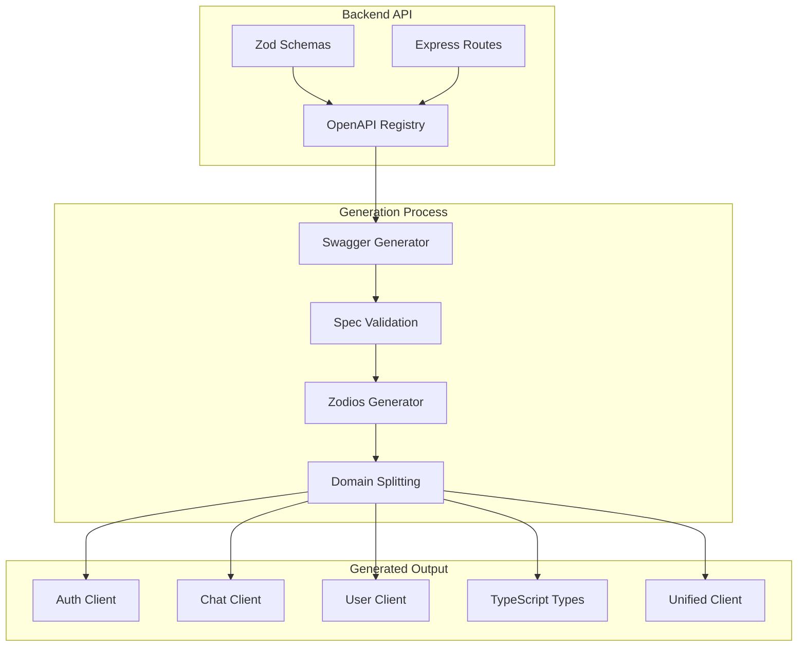

# ADR-004: API Client Generation Strategy

## Status

✅ **ACCEPTED** - Implemented and in production use

## Context

The Macro AI application requires a robust API client for the frontend application to communicate with the
backend API. We needed to choose between manually maintaining API client code or implementing an automated
generation system. Key considerations included:

1. **Type Safety**: Ensuring compile-time type checking between frontend and backend
2. **Maintenance Overhead**: Minimizing manual synchronization between API changes and client code
3. **Developer Experience**: Providing excellent autocomplete and error detection
4. **Code Quality**: Generating clean, readable, and maintainable client code
5. **Build Integration**: Seamless integration with our monorepo build system
6. **Backward Compatibility**: Supporting existing code while enabling modern patterns

## Decision

We will implement **automated API client generation** using:

1. **OpenAPI 3.0.0 specification** generated from Zod schemas and Express routes
2. **Zodios client generator** for type-safe TypeScript client generation
3. **Modular client architecture** with domain-specific clients (auth, chat, user)
4. **Automated build integration** with zero-maintenance regeneration
5. **Backward compatibility layer** for existing code migration

## Rationale

### Why Automated Generation?

#### ✅ Advantages

- **Type Safety**: Compile-time validation of API requests and responses
- **Zero Maintenance**: Automatic synchronization with API changes
- **Consistency**: Uniform error handling and request patterns
- **Documentation**: Self-documenting API with generated types
- **Productivity**: Faster development with autocomplete and validation
- **Reliability**: Eliminates manual synchronization errors

#### ❌ Disadvantages

- **Build Complexity**: Additional build step and tooling requirements
- **Learning Curve**: Team needs to understand generation pipeline
- **Debugging**: Generated code can be harder to debug
- **Customization**: Limited ability to customize generated client behavior

### Why OpenAPI + Zod?

#### ✅ Advantages

- **Single Source of Truth**: API schemas defined once in backend code
- **Runtime Validation**: Zod provides both compile-time and runtime validation
- **Rich Ecosystem**: Extensive tooling for OpenAPI specifications
- **Standards Compliance**: Industry-standard API documentation format
- **Tooling Integration**: Works with Swagger UI, Postman, and other tools

#### ❌ Disadvantages

- **Schema Complexity**: Complex schemas can be verbose to define
- **Generation Overhead**: Build-time generation adds complexity
- **Version Management**: Need to manage OpenAPI spec versions

### Why Zodios?

#### ✅ Advantages

- **Type Safety**: Full TypeScript integration with Zod schemas
- **Runtime Validation**: Validates responses against schemas
- **Axios Integration**: Built on familiar Axios HTTP client
- **Error Handling**: Structured error handling with type safety
- **Lightweight**: Minimal runtime overhead

#### ❌ Disadvantages

- **Ecosystem**: Smaller ecosystem compared to alternatives like OpenAPI Generator
- **Customization**: Limited customization options for generated code
- **Documentation**: Less comprehensive documentation than mature alternatives

## Implementation Details

### Generation Pipeline



### Schema Registration System

```typescript
// Automatic schema registration with OpenAPI metadata
import {
	registerZodSchema,
	registerApiRoute,
} from '../../utils/swagger/openapi-registry.ts'

// Register schema with OpenAPI documentation
const createChatRequestSchema = registerZodSchema(
	'CreateChatRequest',
	z
		.object({
			title: z.string().min(1).max(255).openapi({
				description: 'Chat title',
				example: 'My New Chat',
			}),
		})
		.openapi({
			description: 'Request body for creating a new chat',
		}),
)

// Register API route with full documentation
registerApiRoute({
	method: 'post',
	path: '/api/chats',
	summary: 'Create a new chat',
	description: 'Creates a new chat conversation for the authenticated user',
	tags: ['Chat'],
	request: {
		body: {
			content: {
				'application/json': {
					schema: createChatRequestSchema,
				},
			},
		},
	},
	responses: {
		'201': {
			description: 'Chat created successfully',
			content: {
				'application/json': {
					schema: chatResponseSchema,
				},
			},
		},
	},
	security: [{ bearerAuth: [] }],
})
```

### Modular Client Generation

```typescript
// Generated domain-specific client
import { makeApi, Zodios } from '@zodios/core'
import { z } from 'zod'

const chatEndpoints = makeApi([
	{
		method: 'get',
		path: '/chats',
		description: 'Get user chats',
		response: z.object({
			success: z.boolean(),
			data: z.object({
				chats: z.array(chatSchema),
				pagination: paginationSchema,
			}),
		}),
		errors: [
			{
				status: 401,
				description: 'Authentication required',
				schema: errorResponseSchema,
			},
		],
	},
	{
		method: 'post',
		path: '/chats',
		description: 'Create new chat',
		requestFormat: 'json',
		parameters: [
			{
				name: 'body',
				type: 'Body',
				schema: createChatRequestSchema,
			},
		],
		response: chatResponseSchema,
	},
])

export const chatClient = new Zodios(chatEndpoints)
export function createChatClient(baseUrl: string, options?: ZodiosOptions) {
	return new Zodios(baseUrl, chatEndpoints, options)
}
```

### Build Integration

```typescript
// Automated generation script
export async function generateApiClient(): Promise<void> {
  console.log('🔄 Fetching OpenAPI specification...')

  const response = await fetch('http://localhost:3030/swagger.json')
  if (!response.ok) {
    throw new Error(`Failed to fetch OpenAPI spec: ${response.statusText}`)
  }

  const openApiDoc = await response.json()

  console.log('🏗️ Generating domain-specific clients...')
  await generateDomainClients(openApiDoc)

  console.log('🔗 Generating unified client...')
  await generateUnifiedClient()

  console.log('📝 Generating TypeScript types...')
  await generateTypeDefinitions(openApiDoc)

  console.log('✅ API client generation completed')
}

// Package.json scripts integration
{
  "scripts": {
    "generate": "tsx scripts/generate-modular.ts",
    "build": "pnpm generate && tsc",
    "dev": "pnpm generate && tsc --watch"
  }
}
```

## Alternatives Considered

### 1. Manual Client Maintenance

#### ✅ Advantages

- **Full Control**: Complete control over client implementation
- **Simplicity**: No build-time generation complexity
- **Debugging**: Easy to debug and modify client code

#### ❌ Disadvantages

- **Maintenance Burden**: Manual synchronization with API changes
- **Error Prone**: High risk of client-server inconsistencies
- **Type Safety**: Difficult to maintain type safety across changes
- **Productivity**: Slower development due to manual updates

**Decision**: Rejected due to maintenance overhead and error risk

### 2. OpenAPI Generator (Java-based)

#### ✅ Advantages

- **Mature Ecosystem**: Well-established with extensive community
- **Language Support**: Supports many programming languages
- **Customization**: Highly customizable with templates
- **Documentation**: Comprehensive documentation and examples

#### ❌ Disadvantages

- **Java Dependency**: Requires Java runtime in build environment
- **Generated Code Quality**: Often produces verbose, hard-to-read code
- **TypeScript Support**: Less optimal TypeScript integration
- **Customization Complexity**: Template customization can be complex

**Decision**: Rejected due to Java dependency and code quality concerns

### 3. GraphQL with Code Generation

#### ✅ Advantages

- **Type Safety**: Excellent TypeScript integration
- **Efficient Queries**: Client can request exactly what it needs
- **Real-time**: Built-in subscription support
- **Tooling**: Excellent development tools and IDE integration

#### ❌ Disadvantages

- **Architecture Change**: Would require complete API redesign
- **Learning Curve**: Team would need to learn GraphQL
- **Complexity**: Additional complexity for simple CRUD operations
- **Ecosystem**: Would need to change entire backend architecture

**Decision**: Rejected due to architectural impact and learning curve

### 4. tRPC

#### ✅ Advantages

- **End-to-End Type Safety**: Excellent TypeScript integration
- **Developer Experience**: Great DX with minimal boilerplate
- **Real-time**: Built-in subscription support
- **Performance**: Optimized for TypeScript applications

#### ❌ Disadvantages

- **Architecture Lock-in**: Tight coupling between frontend and backend
- **REST Compatibility**: Would lose REST API benefits
- **Learning Curve**: Team would need to learn tRPC patterns
- **Ecosystem**: Smaller ecosystem compared to REST

**Decision**: Rejected due to architectural constraints and REST API requirements

### 5. Swagger Codegen

#### ✅ Advantages

- **OpenAPI Native**: Built specifically for OpenAPI specifications
- **Multiple Languages**: Supports many target languages
- **Active Development**: Actively maintained project

#### ❌ Disadvantages

- **Code Quality**: Generated code often verbose and hard to read
- **TypeScript Integration**: Less optimal TypeScript support
- **Customization**: Limited customization without template modification
- **Runtime Dependencies**: Often includes heavy runtime dependencies

**Decision**: Rejected due to code quality and TypeScript integration concerns

## Implementation Timeline

### Phase 1: Foundation ✅ COMPLETED

- OpenAPI specification generation from Zod schemas
- Basic Zodios client generation
- Build system integration

### Phase 2: Modular Architecture ✅ COMPLETED

- Domain-specific client generation (auth, chat, user)
- Unified client for backward compatibility
- Type definition generation

### Phase 3: Developer Experience ✅ COMPLETED

- Automated build integration
- Development-time regeneration
- Error handling and validation

### Phase 4: Advanced Features 📋 PLANNED

- Client-side caching integration
- Request/response interceptors
- Advanced error recovery patterns
- Performance optimization

## Quality Assurance

### Validation Strategy

```typescript
// Generated client validation
export function validateGeneratedClient(
	openApiDoc: OpenAPIObject,
	generatedEndpoints: any[],
): ValidationResult {
	const errors: string[] = []
	const warnings: string[] = []

	// Check endpoint coverage
	const specEndpoints = extractEndpointsFromSpec(openApiDoc)
	const generatedPaths = generatedEndpoints.map(
		(e) => `${e.method.toUpperCase()} ${e.path}`,
	)

	for (const specEndpoint of specEndpoints) {
		if (!generatedPaths.includes(specEndpoint)) {
			errors.push(`Missing endpoint in generated client: ${specEndpoint}`)
		}
	}

	// Check schema validation
	for (const endpoint of generatedEndpoints) {
		if (!endpoint.response) {
			warnings.push(
				`No response schema for ${endpoint.method} ${endpoint.path}`,
			)
		}
	}

	return {
		isValid: errors.length === 0,
		errors,
		warnings,
		coverage: (generatedPaths.length / specEndpoints.length) * 100,
	}
}
```

### Testing Strategy

```typescript
// Automated testing of generated client
describe('Generated API Client', () => {
	it('should generate all required endpoints', () => {
		expect(authClient.api).toBeDefined()
		expect(chatClient.api).toBeDefined()
		expect(userClient.api).toBeDefined()
	})

	it('should maintain type safety', () => {
		// TypeScript compilation serves as the test
		const client = createChatClient('http://localhost:3030/api')

		// This should compile without errors
		const response = client.post('/chats', {
			title: 'Test Chat',
		})

		expect(response).toBeDefined()
	})

	it('should handle errors correctly', async () => {
		const client = createChatClient('http://localhost:3030/api')

		try {
			await client.post('/chats', {
				title: '', // Invalid title
			})
		} catch (error) {
			expect(error).toBeInstanceOf(ZodiosError)
		}
	})
})
```

## Performance Considerations

### Generation Performance

```typescript
// Optimized generation process
export class OptimizedGenerator {
	private cache = new Map<string, any>()

	async generateWithCaching(spec: OpenAPIObject): Promise<GeneratedClient> {
		const specHash = this.hashSpec(spec)

		if (this.cache.has(specHash)) {
			console.log('📦 Using cached generation result')
			return this.cache.get(specHash)
		}

		const result = await this.generateClient(spec)
		this.cache.set(specHash, result)

		return result
	}

	private hashSpec(spec: OpenAPIObject): string {
		return crypto.createHash('md5').update(JSON.stringify(spec)).digest('hex')
	}
}
```

### Runtime Performance

```typescript
// Client performance optimization
export function createOptimizedClient(baseUrl: string) {
	return new Zodios(baseUrl, endpoints, {
		// Enable response caching
		axiosConfig: {
			adapter: cacheAdapterEnhancer(axios.defaults.adapter!, {
				maxAge: 1000 * 60 * 5, // 5 minutes
				enabledByDefault: false,
			}),
		},

		// Validate only in development
		validate: process.env.NODE_ENV === 'development' ? 'response' : false,
	})
}
```

## Success Metrics

### Development Metrics

- **Generation Time**: < 30 seconds for full client generation
- **Type Safety**: 100% type coverage for API operations
- **Build Integration**: Zero manual intervention required
- **Error Detection**: Compile-time detection of API mismatches

### Runtime Metrics

- **Client Bundle Size**: < 50KB gzipped for domain clients
- **Request Performance**: No measurable overhead vs manual client
- **Error Handling**: Structured error responses with type safety
- **Developer Satisfaction**: Positive feedback on development experience

### Quality Metrics

- **API Coverage**: 100% endpoint coverage in generated client
- **Documentation**: Auto-generated documentation for all endpoints
- **Backward Compatibility**: Existing code continues to work
- **Test Coverage**: > 90% test coverage for generated client

## Monitoring and Maintenance

### Automated Monitoring

```typescript
// Generation health monitoring
export class GenerationMonitor {
	async monitorGeneration(): Promise<GenerationHealth> {
		const checks = await Promise.allSettled([
			this.checkSpecAvailability(),
			this.validateGeneratedOutput(),
			this.testClientFunctionality(),
			this.measureGenerationTime(),
		])

		return {
			status: this.aggregateStatus(checks),
			timestamp: new Date(),
			details: checks.map((check, index) => ({
				check: this.checkNames[index],
				status: check.status,
				result: check.status === 'fulfilled' ? check.value : check.reason,
			})),
		}
	}
}
```

## Review and Updates

This ADR should be reviewed:

- **Monthly**: Generation performance and developer feedback
- **Before API Changes**: Major API modifications or new endpoints
- **Tool Updates**: When updating Zodios or OpenAPI tooling
- **Performance Reviews**: When client bundle size or performance concerns arise

**Last Reviewed**: 2024-01-15
**Next Review**: 2024-02-15
**Reviewers**: Frontend Team, Backend Team, DevOps Team
