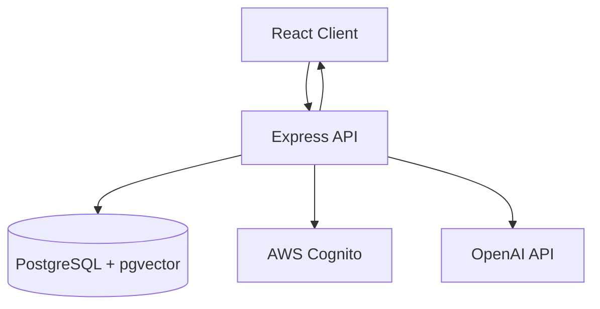

# Architecture Documentation

This section provides comprehensive documentation of the Macro AI system architecture, including high-level
design, data flows, security model, and technology decisions.

## 🏗️ Architecture Overview

Macro AI is built as a modern monorepo application with a React frontend, Express.js backend, PostgreSQL
database with pgvector for AI embeddings, and AWS Cognito for authentication.

## 📚 Architecture Documentation

### Core Architecture

- **[System Architecture](./system-architecture.md)** - High-level system overview and component diagrams

  - System components and relationships
  - Service boundaries and interactions
  - Deployment architecture
  - Scalability considerations

- **[Data Flow](./data-flow.md)** - Request/response flows and system interactions

  - Authentication flow diagrams
  - Chat system data flow
  - API request/response patterns
  - Error handling flow
  - Real-time streaming flows

- **[Technology Stack](./technology-stack.md)** - Technology decisions and architectural patterns
  - Frontend technology choices
  - Backend architecture decisions
  - Database and storage solutions
  - Third-party integrations
  - Development tooling

### Specialized Architecture

- **[Database Design](./database-design.md)** - Database schema and data relationships

  - PostgreSQL schema design
  - pgvector integration for embeddings
  - Drizzle ORM patterns and migrations
  - Data access layer architecture
  - Performance considerations

- **[Security Architecture](./security-architecture.md)** - Security model and integrations
  - AWS Cognito integration architecture
  - API security and authentication flows
  - Rate limiting and protection strategies
  - Security headers and CORS configuration
  - Data encryption and secure storage

## 🎯 Key Architectural Principles

### Design Principles

- **Monorepo Structure**: Efficient code sharing and dependency management
- **Type Safety**: End-to-end TypeScript with runtime validation
- **Go-Style Error Handling**: Consistent error patterns across the application
- **Repository Pattern**: Clean separation of data access logic
- **Auto-Generated Clients**: OpenAPI-driven client generation for type safety

### Scalability Patterns

- **Modular Architecture**: Domain-driven feature organization
- **Streaming Responses**: Real-time AI chat with efficient data transfer
- **Vector Search**: Semantic search capabilities with pgvector
- **Caching Strategies**: Efficient data retrieval and performance optimization

## 🔄 System Interactions

## 📋 Architecture Decision Records

Key architectural decisions are documented in [ADRs](../adr/README.md):

- [Error Handling Strategy](../adr/001-error-handling-strategy.md)
- [Authentication Approach](../adr/002-authentication-approach.md)
- [Database Technology](../adr/003-database-technology.md)
- [API Client Generation](../adr/004-api-client-generation.md)

## 🔗 Related Documentation

- **[Getting Started](../getting-started/README.md)** - Set up the development environment
- **[Development Guidelines](../development/README.md)** - Development patterns and practices
- **[Features](../features/README.md)** - Feature-specific architecture details
- **[Deployment](../deployment/README.md)** - Deployment architecture and strategies

## 🎯 Architecture Goals

- **Developer Experience**: Easy to understand, develop, and maintain
- **Type Safety**: Comprehensive TypeScript coverage with runtime validation
- **Performance**: Efficient data flows and optimized database queries
- **Scalability**: Architecture that grows with the application
- **Security**: Robust security model with defense in depth
- **Maintainability**: Clean code patterns and comprehensive documentation

---

**Explore**: [System Architecture](./system-architecture.md) →
