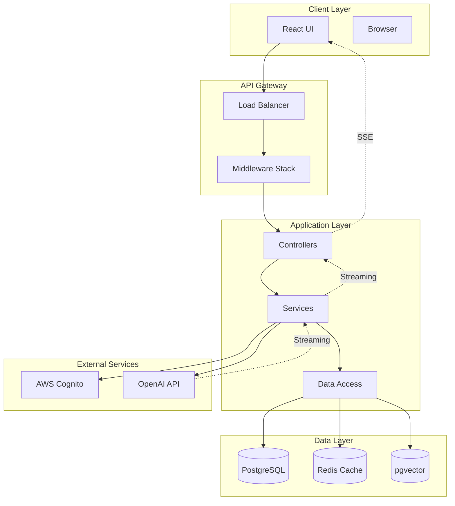
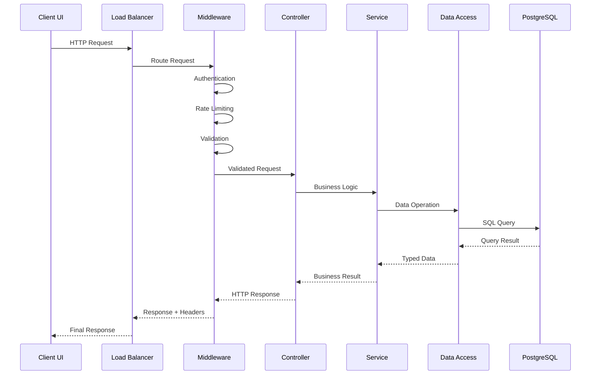
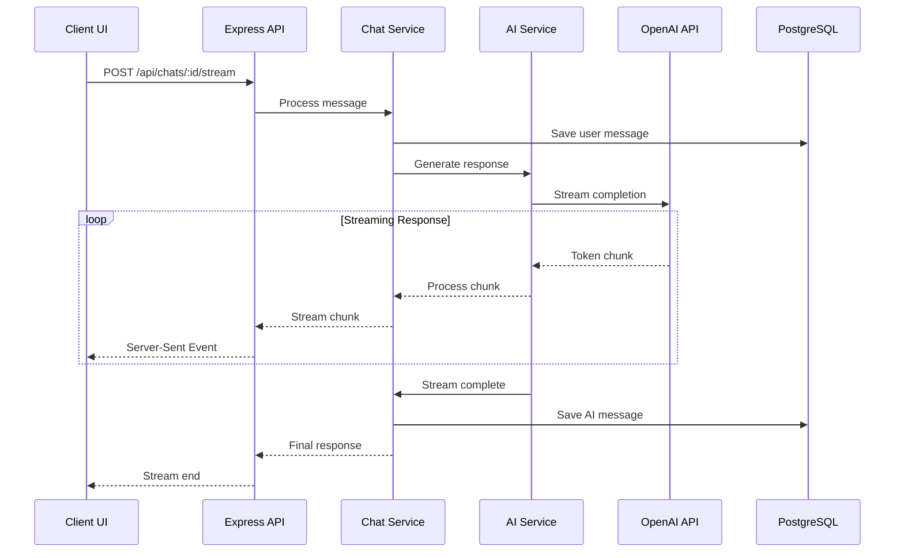
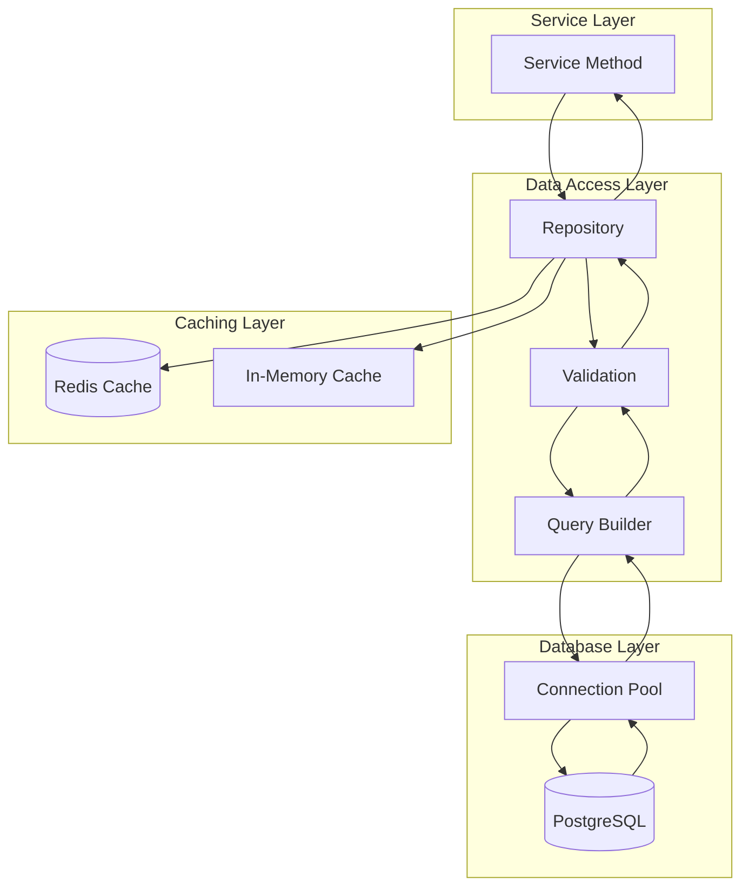
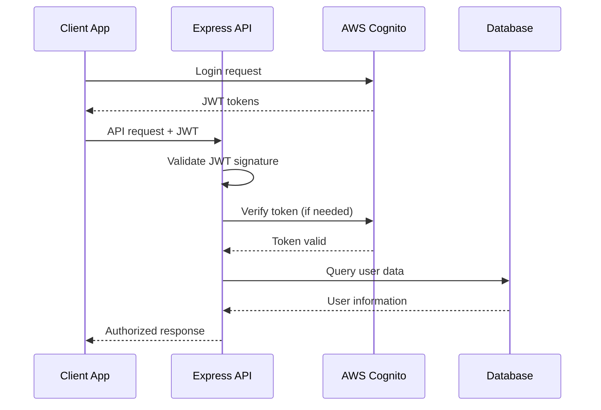
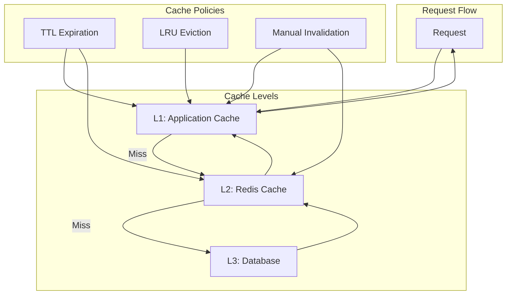
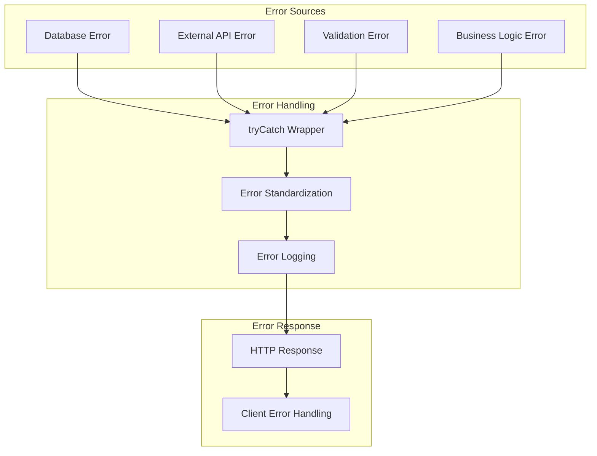

# Data Flow Architecture

## Current Implementation Status ✅ PRODUCTION-READY

This document provides comprehensive documentation of data flow patterns throughout the Macro AI application,
including request/response cycles, streaming data handling, database operations, and external service integrations.
The data flow architecture is **fully implemented and production-ready** with optimized patterns for performance
and scalability.

## 🔄 High-Level Data Flow

### System Data Flow Overview



### Data Flow Principles ✅ IMPLEMENTED

1. **Unidirectional Flow**: Data flows in predictable patterns from client to server
2. **Layer Separation**: Clear boundaries between presentation, business, and data layers
3. **Error Propagation**: Consistent error handling through Go-style Result tuples
4. **Streaming Support**: Real-time data streaming for AI responses
5. **Caching Strategy**: Multi-level caching for performance optimization
6. **Type Safety**: End-to-end TypeScript type safety

## 🌐 Request/Response Flow

### Standard API Request Flow ✅ IMPLEMENTED



### Request Processing Layers ✅ IMPLEMENTED

#### 1. Middleware Layer

```typescript
// Request processing pipeline
interface RequestPipeline {
	authentication: (req: Request) => Promise<Result<AuthenticatedUser>>
	rateLimiting: (req: Request) => Promise<Result<void>>
	validation: (req: Request) => Promise<Result<ValidatedRequest>>
	logging: (req: Request) => void
	errorHandling: (error: Error) => Response
}

// Example middleware implementation
export const authenticationMiddleware = async (
	req: Request,
	res: Response,
	next: NextFunction,
) => {
	const [user, error] = await tryCatch(
		authenticateRequest(req),
		'authenticationMiddleware',
	)

	if (error) {
		return res.status(401).json({
			success: false,
			error: 'Authentication failed',
			code: 'UNAUTHORIZED',
		})
	}

	req.user = user
	next()
}
```

#### CORS Configuration for Credentials ✅ IMPLEMENTED

**Secure CORS Setup**: The application uses explicit origins instead of wildcards to enable credential support:

```typescript
// CORS middleware configuration
app.use(
	cors({
		origin: ['http://localhost:3000', 'http://localhost:3030'],
		credentials: true, // Enable cookies and authorization headers
		exposedHeaders: ['set-cookie', 'cache-control'],
		methods: ['GET', 'POST', 'PUT', 'DELETE', 'OPTIONS'],
		allowedHeaders: [
			'Origin',
			'X-Requested-With',
			'Content-Type',
			'Accept',
			'Authorization',
			'X-API-KEY',
			'Cache-Control',
		],
		maxAge: 86400, // 24 hours
	}),
)
```

**Key Security Points**:

- ✅ **Explicit Origins**: Uses specific allowed origins instead of `'*'` wildcard
- ✅ **Credentials Enabled**: `credentials: true` allows cookies and auth headers
- ✅ **Secure Headers**: Exposes only necessary headers to the client
- ✅ **Method Restrictions**: Limits allowed HTTP methods
- ✅ **Preflight Caching**: 24-hour cache for OPTIONS requests

**Why This Matters**: Using `Access-Control-Allow-Origin: '*'` with credentials would cause browsers to block requests.
The explicit origin list ensures secure credential handling while maintaining CORS compliance.

#### 2. Controller Layer

```typescript
// Controller data flow pattern
export class ChatController {
	constructor(private chatService: IChatService) {}

	async createChat(req: Request, res: Response): Promise<void> {
		// 1. Extract and validate input
		const [validatedInput, validationError] = await tryCatch(
			createChatSchema.parseAsync(req.body),
			'ChatController.createChat - validation',
		)

		if (validationError) {
			res.status(400).json({
				success: false,
				error: 'Invalid input',
				details: validationError.message,
			})
			return
		}

		// 2. Call service layer
		const [chat, serviceError] = await this.chatService.createChat(
			req.user.id,
			validatedInput.title,
		)

		if (serviceError) {
			res.status(serviceError.statusCode).json({
				success: false,
				error: serviceError.message,
				code: serviceError.code,
			})
			return
		}

		// 3. Return success response
		res.status(201).json({
			success: true,
			data: chat,
		})
	}
}
```

#### 3. Service Layer

```typescript
// Service layer data transformation
export class ChatService implements IChatService {
	constructor(
		private chatDataAccess: IChatDataAccess,
		private messageDataAccess: IMessageDataAccess,
		private aiService: IAIService,
	) {}

	async createChat(userId: string, title: string): Promise<Result<Chat>> {
		// 1. Validate business rules
		if (!title.trim()) {
			return [null, new ValidationError('Chat title cannot be empty')]
		}

		// 2. Create chat record
		const [chat, createError] = await this.chatDataAccess.create({
			userId,
			title: title.trim(),
		})

		if (createError) {
			return [null, createError]
		}

		// 3. Log business event
		logger.info({ userId, chatId: chat.id, title }, 'Chat created successfully')

		return [chat, null]
	}
}
```

## 🔄 Streaming Data Flow

### AI Response Streaming ✅ IMPLEMENTED



### Streaming Implementation ✅ IMPLEMENTED

#### Server-Side Streaming

```typescript
// Streaming endpoint implementation
export async function streamChatResponse(req: Request, res: Response) {
	const { chatId } = req.params
	const { message } = req.body

	// Set up Server-Sent Events
	res.writeHead(200, {
		'Content-Type': 'text/plain; charset=utf-8',
		'Cache-Control': 'no-cache',
		Connection: 'keep-alive',
		'Transfer-Encoding': 'chunked',
		'X-Accel-Buffering': 'no', // Disable nginx buffering
		// CORS headers are handled by the main CORS middleware
		// which sets specific origins and credentials: true
	})

	try {
		// Save user message
		const [userMessage, saveError] = await chatService.addMessage(
			chatId,
			'user',
			message,
			req.user.id,
		)

		if (saveError) {
			res.write(`Error: ${saveError.message}`)
			res.end()
			return
		}

		// Generate streaming response
		const responseGenerator = chatService.generateStreamingResponse(
			chatId,
			message,
			req.user.id,
		)

		let fullResponse = ''

		for await (const chunk of responseGenerator) {
			fullResponse += chunk
			res.write(chunk)
		}

		// Save complete AI response
		await chatService.addMessage(chatId, 'assistant', fullResponse, req.user.id)

		res.end()
	} catch (error) {
		logger.error({ error, chatId, userId: req.user.id }, 'Streaming error')
		res.write(`Error: ${error.message}`)
		res.end()
	}
}
```

#### Client-Side Streaming

```typescript
// Client-side streaming consumption
export function useEnhancedChat(chatId: string) {
	const {
		messages,
		input,
		handleInputChange,
		handleSubmit: originalHandleSubmit,
		isLoading,
		error,
	} = useChat({
		api: `/api/chats/${chatId}/stream`,
		streamProtocol: 'text',
		onFinish: async () => {
			// Invalidate cache after streaming completes
			await queryClient.invalidateQueries({ queryKey: ['chats', chatId] })
		},
		onError: (error) => {
			logger.error('Chat streaming error:', error)
		},
	})

	const handleSubmit = async (e: React.FormEvent) => {
		const [result, submitError] = await tryCatch(
			originalHandleSubmit(e),
			'useEnhancedChat.handleSubmit',
		)

		if (submitError) {
			console.error('Submit error:', submitError)
			return
		}

		return result
	}

	return {
		messages,
		input,
		handleInputChange,
		handleSubmit,
		isLoading,
		error,
		status: isLoading ? 'streaming' : 'ready',
	}
}
```

## 🗄️ Database Data Flow

### CRUD Operations Flow ✅ IMPLEMENTED



### Data Access Patterns ✅ IMPLEMENTED

#### Repository Pattern Implementation

```typescript
// Data access with caching
export class ChatDataAccess implements IChatDataAccess {
	constructor(
		private db: Database,
		private cache: CacheService,
	) {}

	async findById(id: string): Promise<Result<Chat | null>> {
		// 1. Check cache first
		const cacheKey = `chat:${id}`
		const cached = await this.cache.get<Chat>(cacheKey)

		if (cached) {
			return [cached, null]
		}

		// 2. Query database
		const [result, error] = await tryCatch(
			this.db.select().from(chatsTable).where(eq(chatsTable.id, id)).limit(1),
			'ChatDataAccess.findById',
		)

		if (error) {
			return [null, error]
		}

		const chat = result[0] || null

		// 3. Update cache
		if (chat) {
			await this.cache.set(cacheKey, chat, 1800) // 30 minutes
		}

		return [chat, null]
	}

	async create(data: CreateChatData): Promise<Result<Chat>> {
		// 1. Validate input
		const [validatedData, validationError] = await tryCatch(
			insertChatSchema.parseAsync(data),
			'ChatDataAccess.create - validation',
		)

		if (validationError) {
			return [null, validationError]
		}

		// 2. Insert into database
		const [result, insertError] = await tryCatch(
			this.db.insert(chatsTable).values(validatedData).returning(),
			'ChatDataAccess.create - insert',
		)

		if (insertError) {
			return [null, insertError]
		}

		const chat = result[0]
		if (!chat) {
			return [null, new InternalError('Failed to create chat')]
		}

		// 3. Update cache
		await this.cache.set(`chat:${chat.id}`, chat, 1800)

		// 4. Invalidate related caches
		await this.cache.invalidate(`user:${chat.userId}:chats:*`)

		return [chat, null]
	}
}
```

### Vector Data Flow ✅ IMPLEMENTED

#### Embedding Generation and Storage

```typescript
// Vector data flow for semantic search
export class VectorService implements IVectorService {
	constructor(
		private vectorDataAccess: IVectorDataAccess,
		private aiService: IAIService,
	) {}

	async createMessageEmbedding(
		messageId: string,
		content: string,
		userId: string,
		chatId: string,
	): Promise<Result<ChatVector>> {
		// 1. Generate embedding using AI service
		const [embedding, embeddingError] =
			await this.aiService.generateEmbedding(content)

		if (embeddingError) {
			return [null, embeddingError]
		}

		// 2. Store vector in database
		const [vector, storeError] = await this.vectorDataAccess.createVector({
			messageId,
			userId,
			chatId,
			content,
			embedding,
		})

		if (storeError) {
			return [null, storeError]
		}

		return [vector, null]
	}

	async semanticSearch(
		query: string,
		userId: string,
		options: SemanticSearchOptions,
	): Promise<Result<SemanticSearchResult[]>> {
		// 1. Generate query embedding
		const [queryEmbedding, embeddingError] =
			await this.aiService.generateEmbedding(query)

		if (embeddingError) {
			return [null, embeddingError]
		}

		// 2. Perform vector similarity search
		const [results, searchError] = await this.vectorDataAccess.semanticSearch({
			...options,
			queryEmbedding,
			userId,
		})

		if (searchError) {
			return [null, searchError]
		}

		return [results, null]
	}
}
```

## 🔗 External Service Integration

### Authentication Flow ✅ IMPLEMENTED



### AI Service Integration ✅ IMPLEMENTED

```typescript
// AI service data flow
export class AIService implements IAIService {
	constructor(private openaiClient: OpenAI) {}

	async generateResponse(
		messages: ChatMessage[],
		options: GenerationOptions = {},
	): Promise<Result<string>> {
		const [response, error] = await tryCatch(
			this.openaiClient.chat.completions.create({
				model: 'gpt-4',
				messages: messages.map((msg) => ({
					role: msg.role as 'user' | 'assistant' | 'system',
					content: msg.content,
				})),
				max_tokens: options.maxTokens || 1000,
				temperature: options.temperature || 0.7,
			}),
			'AIService.generateResponse',
		)

		if (error) {
			return [null, error]
		}

		const content = response.choices[0]?.message?.content
		if (!content) {
			return [null, new InternalError('No response content generated')]
		}

		return [content, null]
	}

	async *generateStreamingResponse(
		messages: ChatMessage[],
		options: GenerationOptions = {},
	): AsyncGenerator<string> {
		try {
			const stream = await this.openaiClient.chat.completions.create({
				model: 'gpt-4',
				messages: messages.map((msg) => ({
					role: msg.role as 'user' | 'assistant' | 'system',
					content: msg.content,
				})),
				max_tokens: options.maxTokens || 1000,
				temperature: options.temperature || 0.7,
				stream: true,
			})

			for await (const chunk of stream) {
				const content = chunk.choices[0]?.delta?.content
				if (content) {
					yield content
				}
			}
		} catch (error) {
			logger.error({ error }, 'Streaming generation error')
			throw error
		}
	}
}
```

## 📊 Caching Data Flow

### Multi-Level Caching Strategy ✅ IMPLEMENTED



### Cache Implementation ✅ IMPLEMENTED

```typescript
// Multi-level caching service
export class CacheService {
	private memoryCache = new Map<string, { data: any; expires: number }>()

	constructor(private redis: Redis) {}

	async get<T>(key: string): Promise<T | null> {
		// L1: Check memory cache
		const memoryItem = this.memoryCache.get(key)
		if (memoryItem && memoryItem.expires > Date.now()) {
			return memoryItem.data
		}

		// L2: Check Redis cache
		const redisValue = await this.redis.get(key)
		if (redisValue) {
			const data = JSON.parse(redisValue)

			// Update memory cache
			this.memoryCache.set(key, {
				data,
				expires: Date.now() + 300000, // 5 minutes
			})

			return data
		}

		return null
	}

	async set<T>(key: string, value: T, ttl: number = 3600): Promise<void> {
		// Set in Redis with TTL
		await this.redis.setex(key, ttl, JSON.stringify(value))

		// Set in memory cache with shorter TTL
		this.memoryCache.set(key, {
			data: value,
			expires: Date.now() + Math.min(ttl * 1000, 300000), // Max 5 minutes
		})
	}

	async invalidate(pattern: string): Promise<void> {
		// Invalidate Redis keys
		const keys = await this.redis.keys(pattern)
		if (keys.length > 0) {
			await this.redis.del(...keys)
		}

		// Invalidate memory cache
		for (const key of this.memoryCache.keys()) {
			if (key.match(pattern.replace('*', '.*'))) {
				this.memoryCache.delete(key)
			}
		}
	}
}
```

## 🔍 Error Flow Patterns

### Error Propagation ✅ IMPLEMENTED



### Error Handling Implementation ✅ IMPLEMENTED

```typescript
// Standardized error flow
export async function handleControllerError(
	operation: () => Promise<any>,
	context: string,
	res: Response,
): Promise<void> {
	const [result, error] = await tryCatch(operation(), context)

	if (error) {
		// Log error with context
		logger.error(
			{
				error: error.message,
				stack: error.stack,
				context,
				statusCode: error.statusCode,
			},
			'Controller error occurred',
		)

		// Return standardized error response
		res.status(error.statusCode || 500).json({
			success: false,
			error: error.message,
			code: error.code || 'INTERNAL_SERVER_ERROR',
			...(process.env.NODE_ENV === 'development' && {
				stack: error.stack,
			}),
		})
		return
	}

	// Success response
	res.json({
		success: true,
		data: result,
	})
}
```

## 📚 Related Documentation

- **[System Architecture](./system-architecture.md)** - Overall system design and component relationships
- **[Database Design](./database-design.md)** - Database schema and data modeling
- **[Technology Stack](./technology-stack.md)** - Technology choices and integration patterns
- **[API Development](../development/api-development.md)** - API design and implementation patterns
- **[Error Handling](../development/error-handling.md)** - Error handling strategies and implementation
