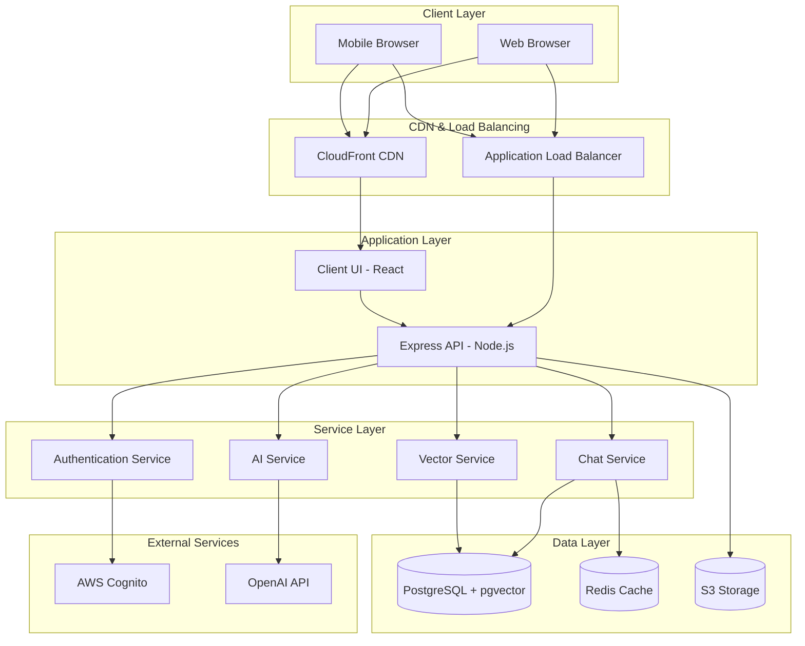
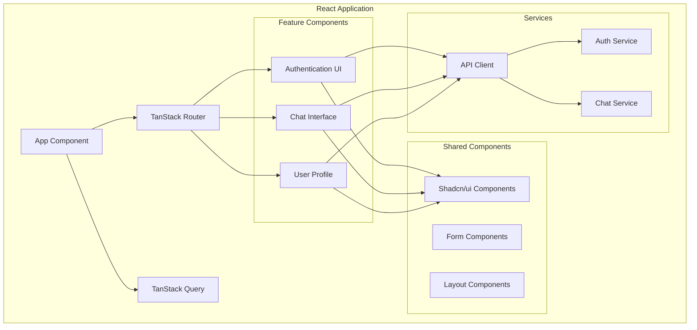
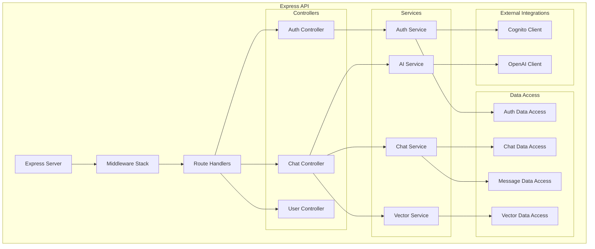
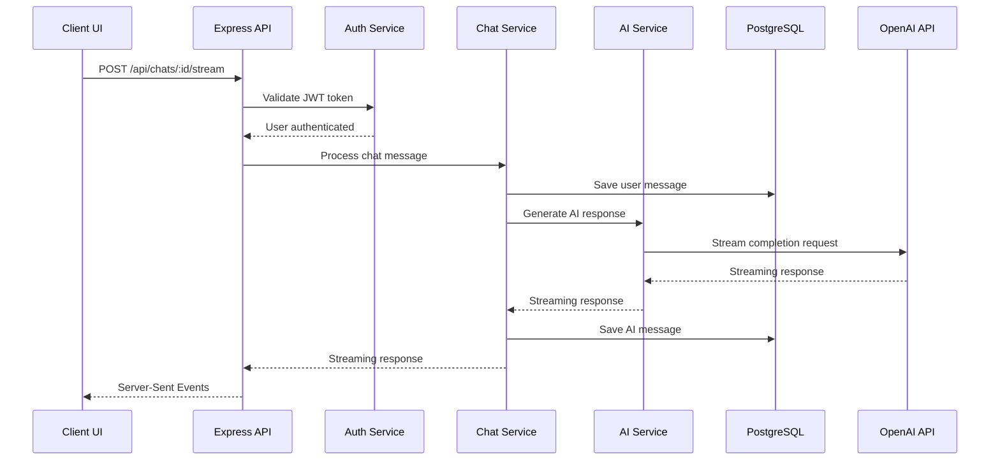
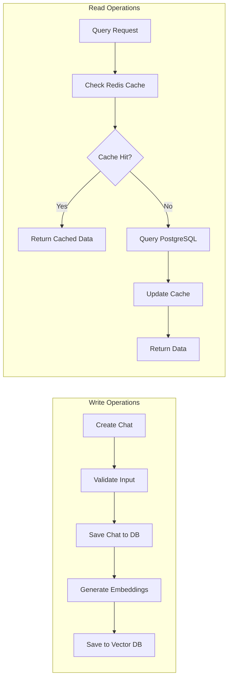
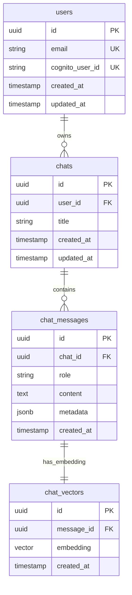
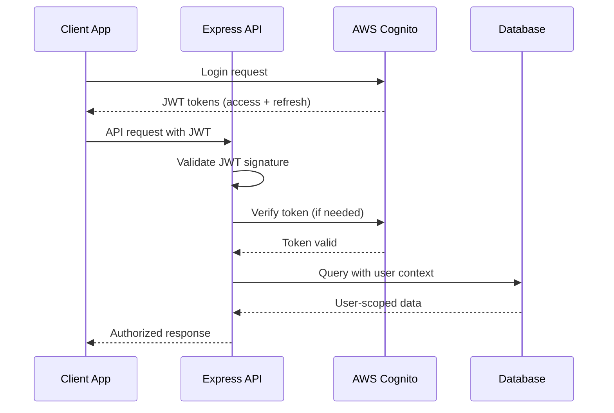
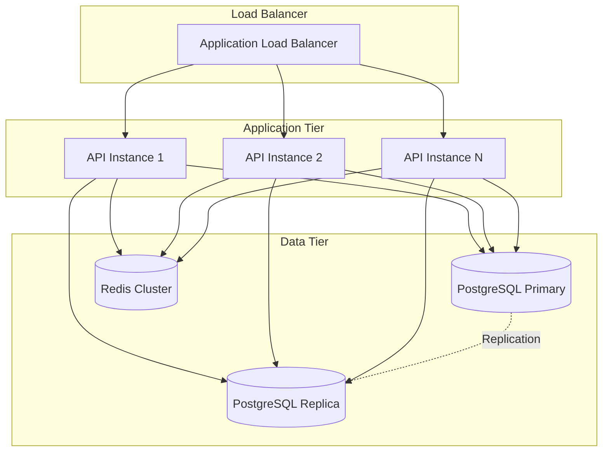
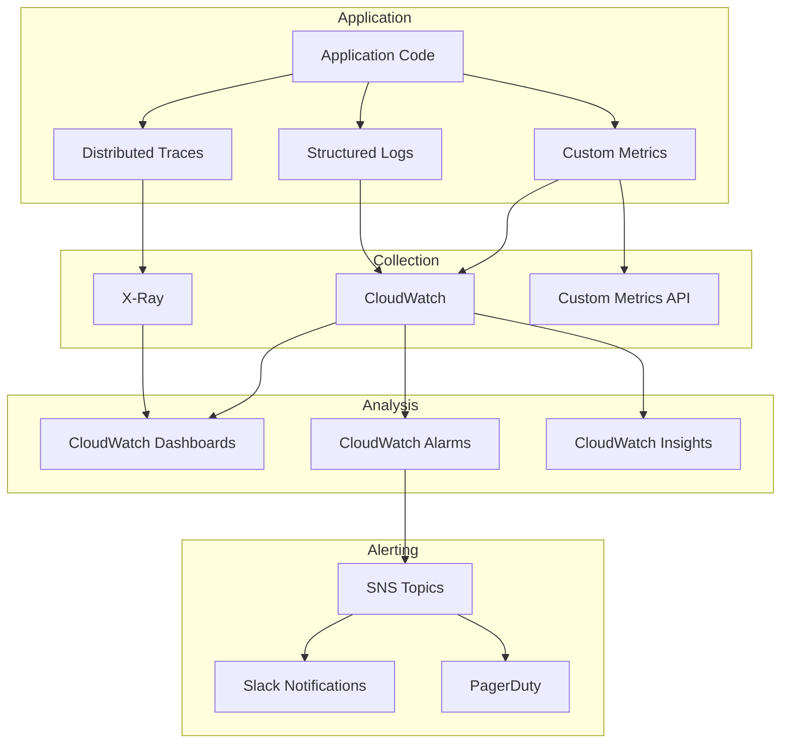

# System Architecture

## Current Implementation Status ✅ PRODUCTION-READY

This document provides a comprehensive overview of the Macro AI system architecture, including high-level component
relationships, data flow patterns, and architectural decisions. The system architecture is **fully implemented and
production-ready** with a modern, scalable design supporting AI-powered chat functionality.

## 🏗️ High-Level Architecture

### System Overview



### Architecture Principles ✅ IMPLEMENTED

1. **Separation of Concerns**: Clear boundaries between UI, API, and data layers
2. **Microservice-Ready**: Service-oriented architecture within the monolith
3. **Scalability**: Horizontal scaling capabilities with stateless design
4. **Resilience**: Error handling, retry mechanisms, and graceful degradation
5. **Security**: Authentication, authorization, and data protection
6. **Observability**: Comprehensive logging, monitoring, and tracing

## 🎯 Component Architecture

### Frontend Architecture ✅ PRODUCTION-READY

#### React Application Structure



**Key Technologies**:

- **React 19**: Latest React with React Compiler optimization
- **TanStack Router**: Type-safe routing with data preloading
- **TanStack Query**: Server state management and caching
- **Vercel AI SDK**: Streaming chat responses
- **Shadcn/ui**: Modern component library with theme support
- **Tailwind CSS**: Utility-first CSS framework

#### State Management Strategy

```typescript
// Global state management approach
interface ApplicationState {
	// Server state managed by TanStack Query
	serverState: {
		user: UserData
		chats: ChatData[]
		messages: MessageData[]
	}

	// Client state managed by React hooks
	clientState: {
		theme: 'light' | 'dark' | 'system'
		sidebarOpen: boolean
		currentChatId: string | null
	}

	// Streaming state managed by AI SDK
	streamingState: {
		isStreaming: boolean
		currentMessage: string
		error: Error | null
	}
}
```

### Backend Architecture ✅ PRODUCTION-READY

#### Express API Structure



**Architectural Layers**:

1. **Controller Layer**: HTTP request/response handling and validation
2. **Service Layer**: Business logic and orchestration
3. **Data Access Layer**: Database operations and queries
4. **Integration Layer**: External service communication

#### Service Architecture Pattern

```typescript
// Service interface pattern
interface IChatService {
	createChat(userId: string, title: string): Promise<Result<Chat>>
	getChatById(chatId: string, userId: string): Promise<Result<ChatWithMessages>>
	sendMessage(
		chatId: string,
		message: string,
		userId: string,
	): Promise<Result<void>>
	generateStreamingResponse(
		chatId: string,
		message: string,
	): AsyncGenerator<string>
}

// Implementation with dependency injection
class ChatService implements IChatService {
	constructor(
		private chatDataAccess: IChatDataAccess,
		private messageDataAccess: IMessageDataAccess,
		private aiService: IAIService,
		private vectorService: IVectorService,
	) {}

	async createChat(userId: string, title: string): Promise<Result<Chat>> {
		// Business logic implementation
	}
}
```

## 🔄 Data Flow Architecture

### Request/Response Flow



### Data Persistence Flow



### Streaming Architecture

```mermaid
graph TB
    subgraph "Client Side"
        CHAT_UI[Chat Interface]
        USE_CHAT[useChat Hook]
        STREAM_HANDLER[Stream Handler]
    end

    subgraph "Server Side"
        STREAM_ENDPOINT[/api/chats/:id/stream]
        CHAT_SERVICE[Chat Service]
        AI_SERVICE[AI Service]
        OPENAI_STREAM[OpenAI Stream]
    end

    CHAT_UI --> USE_CHAT
    USE_CHAT --> STREAM_HANDLER
    STREAM_HANDLER --> STREAM_ENDPOINT

    STREAM_ENDPOINT --> CHAT_SERVICE
    CHAT_SERVICE --> AI_SERVICE
    AI_SERVICE --> OPENAI_STREAM

    OPENAI_STREAM -.->|Streaming Response| AI_SERVICE
    AI_SERVICE -.->|Streaming Response| CHAT_SERVICE
    CHAT_SERVICE -.->|Streaming Response| STREAM_ENDPOINT
    STREAM_ENDPOINT -.->|Server-Sent Events| STREAM_HANDLER
```

## 🗄️ Database Architecture

### PostgreSQL Schema Design ✅ IMPLEMENTED



### Data Access Patterns

#### Repository Pattern Implementation

```typescript
// Base repository interface
interface IRepository<T> {
	findById(id: string): Promise<Result<T | null>>
	create(data: Partial<T>): Promise<Result<T>>
	update(id: string, data: Partial<T>): Promise<Result<T>>
	delete(id: string): Promise<Result<void>>
}

// Chat repository implementation
class ChatDataAccess implements IRepository<Chat> {
	constructor(private db: Database) {}

	async findById(id: string): Promise<Result<Chat | null>> {
		const [result, error] = await tryCatch(
			this.db.select().from(chats).where(eq(chats.id, id)).limit(1),
			'ChatDataAccess.findById',
		)

		if (error) return [null, error]
		return [result[0] || null, null]
	}

	async findByUserIdWithMessages(
		userId: string,
	): Promise<Result<ChatWithMessages[]>> {
		// Complex query with joins and relationships
	}
}
```

#### Caching Strategy

```typescript
// Redis caching layer
class CacheService {
	constructor(private redis: Redis) {}

	async get<T>(key: string): Promise<T | null> {
		const cached = await this.redis.get(key)
		return cached ? JSON.parse(cached) : null
	}

	async set<T>(key: string, value: T, ttl: number = 3600): Promise<void> {
		await this.redis.setex(key, ttl, JSON.stringify(value))
	}

	async invalidate(pattern: string): Promise<void> {
		const keys = await this.redis.keys(pattern)
		if (keys.length > 0) {
			await this.redis.del(...keys)
		}
	}
}

// Usage in service layer
class ChatService {
	async getChatById(chatId: string): Promise<Result<Chat | null>> {
		// Check cache first
		const cached = await this.cache.get<Chat>(`chat:${chatId}`)
		if (cached) return [cached, null]

		// Query database
		const [chat, error] = await this.chatDataAccess.findById(chatId)
		if (error) return [null, error]

		// Update cache
		if (chat) {
			await this.cache.set(`chat:${chatId}`, chat, 1800) // 30 minutes
		}

		return [chat, null]
	}
}
```

## 🔐 Security Architecture

### Authentication & Authorization Flow



### Security Layers

1. **Transport Security**: HTTPS/TLS encryption
2. **Authentication**: AWS Cognito JWT tokens
3. **Authorization**: Role-based access control
4. **Input Validation**: Zod schema validation
5. **Rate Limiting**: Request throttling and abuse prevention
6. **Data Protection**: Encryption at rest and in transit

## 🚀 Scalability Architecture

### Horizontal Scaling Strategy



### Performance Optimization

#### Caching Strategy

```typescript
// Multi-level caching
interface CachingStrategy {
	// Level 1: In-memory application cache
	applicationCache: Map<string, any>

	// Level 2: Redis distributed cache
	distributedCache: Redis

	// Level 3: CDN edge cache
	edgeCache: CloudFront
}

// Cache-aside pattern implementation
async function getChatWithCache(chatId: string): Promise<Chat | null> {
	// L1: Check application cache
	if (applicationCache.has(chatId)) {
		return applicationCache.get(chatId)
	}

	// L2: Check Redis cache
	const cached = await redis.get(`chat:${chatId}`)
	if (cached) {
		const chat = JSON.parse(cached)
		applicationCache.set(chatId, chat)
		return chat
	}

	// L3: Query database
	const chat = await database.getChatById(chatId)
	if (chat) {
		// Update all cache levels
		applicationCache.set(chatId, chat)
		await redis.setex(`chat:${chatId}`, 1800, JSON.stringify(chat))
	}

	return chat
}
```

#### Database Optimization

```sql
-- Optimized indexes for common queries
CREATE INDEX CONCURRENTLY idx_chats_user_id_created_at
ON chats (user_id, created_at DESC);

CREATE INDEX CONCURRENTLY idx_chat_messages_chat_id_created_at
ON chat_messages (chat_id, created_at ASC);

CREATE INDEX CONCURRENTLY idx_chat_vectors_embedding_cosine
ON chat_vectors USING ivfflat (embedding vector_cosine_ops);

-- Partitioning strategy for large tables
CREATE TABLE chat_messages_2024 PARTITION OF chat_messages
FOR VALUES FROM ('2024-01-01') TO ('2025-01-01');
```

## 🔍 Monitoring & Observability

### Observability Stack



### Health Check Architecture

```typescript
// Comprehensive health check system
interface HealthCheckSystem {
	checks: {
		database: DatabaseHealthCheck
		redis: RedisHealthCheck
		cognito: CognitoHealthCheck
		openai: OpenAIHealthCheck
		dependencies: DependencyHealthCheck[]
	}

	aggregateHealth(): HealthStatus
	generateReport(): HealthReport
}

// Implementation with circuit breaker pattern
class HealthCheckService {
	private circuitBreakers = new Map<string, CircuitBreaker>()

	async performHealthCheck(): Promise<HealthReport> {
		const checks = await Promise.allSettled([
			this.checkDatabase(),
			this.checkRedis(),
			this.checkCognito(),
			this.checkOpenAI(),
		])

		return this.aggregateResults(checks)
	}
}
```

## 📚 Related Documentation

### Technical Architecture

- **[Database Design](./database-design.md)** - Detailed database schema and relationships
- **[Data Flow](./data-flow.md)** - Data movement and processing patterns
- **[Technology Stack](./technology-stack.md)** - Technology choices and rationale
- **[Security Architecture](./security-architecture.md)** - Security implementation details
- **[AWS Deployment](../deployment/aws-deployment.md)** - Cloud infrastructure architecture

### Product Strategy

- **[Multi-Model Architecture Design](../product/requirements/technical-designs/multi-model-architecture.md)** - Strategic
  multi-model technical requirements
- **[Response Sources Implementation](../product/requirements/technical-designs/response-sources-implementation.md)** -
  Source attribution technical design
- **[Product Roadmap](../product/strategy/product-roadmap.md)** - Strategic context for architecture evolution
- **[Success Metrics](../product/strategy/success-metrics.md)** - Performance targets for system architecture
