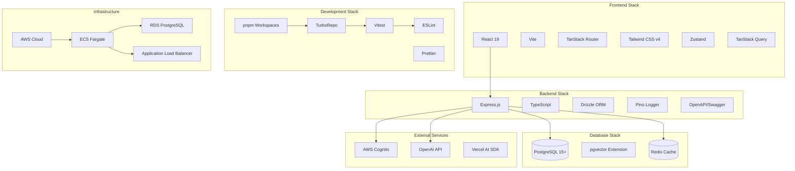

# Technology Stack

## Current Implementation Status ✅ PRODUCTION-READY

This document provides comprehensive documentation of the technology stack used in the Macro AI application,
including frontend and backend technologies, development tools, testing frameworks, and deployment infrastructure.
The technology stack is **fully implemented and production-ready** with modern, scalable, and maintainable
technology choices.

## 🏗️ Architecture Overview

### Technology Stack Summary ✅ IMPLEMENTED



## 🎨 Frontend Technologies

### Core Frontend Stack ✅ IMPLEMENTED

#### React 19 with Modern Features

```json
{
	"react": "^19.0.0",
	"react-dom": "^19.0.0"
}
```

**Key Features**:

- **React Compiler**: Automatic optimization with `babel-plugin-react-compiler`
- **Concurrent Features**: Suspense, transitions, and concurrent rendering
- **Server Components**: Ready for future SSR implementation
- **Modern Hooks**: Enhanced useState, useEffect, and custom hooks

**Implementation Example**:

```typescript
// Modern React component with compiler optimization
export function ChatInterface() {
  const [messages, setMessages] = useState<Message[]>([])
  const { mutate: sendMessage, isPending } = useMutation({
    mutationFn: chatService.sendMessage,
    onSuccess: (newMessage) => {
      setMessages(prev => [...prev, newMessage])
    }
  })

  return (
    <div className="chat-interface">
      <MessageList messages={messages} />
      <MessageInput onSend={sendMessage} disabled={isPending} />
    </div>
  )
}
```

#### Vite Build System

```json
{
	"vite": "^5.4.1",
	"@vitejs/plugin-react": "^4.3.4"
}
```

**Configuration Features**:

- **Fast HMR**: Sub-second hot module replacement
- **TypeScript Support**: Native TypeScript compilation
- **Plugin Ecosystem**: React, TanStack Router, and Tailwind integration
- **Optimized Builds**: Tree-shaking and code splitting

#### TanStack Router

```json
{
	"@tanstack/react-router": "^1.97.3",
	"@tanstack/router-plugin": "^1.97.3"
}
```

**Key Features**:

- **Type-Safe Routing**: Full TypeScript integration with route parameters
- **Code Splitting**: Automatic route-based code splitting
- **Search Params**: Type-safe search parameter handling
- **Nested Layouts**: Hierarchical route layouts

**Route Configuration**:

```typescript
// Type-safe route definition
export const chatRoute = createFileRoute('/chats/$chatId')({
	component: ChatPage,
	loader: async ({ params }) => {
		const [chat, error] = await chatService.getChat(params.chatId)
		if (error) throw redirect({ to: '/chats' })
		return { chat }
	},
	validateSearch: z.object({
		message: z.string().optional(),
	}),
})
```

#### Tailwind CSS v4

```json
{
	"@tailwindcss/vite": "^4.0.0",
	"tailwindcss": "catalog:",
	"tailwindcss-animate": "^1.0.7"
}
```

**Modern Features**:

- **CSS-First Configuration**: Native CSS custom properties
- **Container Queries**: Modern responsive design patterns
- **Design Tokens**: Semantic color system with theme support
- **Performance**: Optimized CSS generation

**Theme Configuration**:

```css
@import 'tailwindcss';

@theme {
	--color-primary: #3b82f6;
	--color-secondary: #64748b;
	--color-background: #ffffff;
	--color-foreground: #0f172a;

	@media (prefers-color-scheme: dark) {
		--color-background: #0f172a;
		--color-foreground: #f8fafc;
	}
}
```

### State Management ✅ IMPLEMENTED

#### Zustand for Global State

```json
{
	"zustand": "^5.0.3"
}
```

**Store Implementation**:

```typescript
// Type-safe Zustand store
interface AuthStore {
	user: User | null
	isAuthenticated: boolean
	login: (credentials: LoginCredentials) => Promise<void>
	logout: () => void
}

export const useAuthStore = create<AuthStore>((set, get) => ({
	user: null,
	isAuthenticated: false,

	login: async (credentials) => {
		const [user, error] = await authService.login(credentials)
		if (error) throw error

		set({ user, isAuthenticated: true })
	},

	logout: () => {
		authService.logout()
		set({ user: null, isAuthenticated: false })
	},
}))
```

#### TanStack Query for Server State

```json
{
	"@tanstack/react-query": "^5.66.0",
	"@tanstack/react-query-devtools": "^5.66.0"
}
```

**Query Implementation**:

```typescript
// Server state management with caching
export function useChats() {
	return useQuery({
		queryKey: ['chats'],
		queryFn: async () => {
			const [chats, error] = await chatService.getChats()
			if (error) throw error
			return chats
		},
		staleTime: 5 * 60 * 1000, // 5 minutes
		gcTime: 10 * 60 * 1000, // 10 minutes
	})
}

export function useChatMutation() {
	const queryClient = useQueryClient()

	return useMutation({
		mutationFn: chatService.createChat,
		onSuccess: () => {
			queryClient.invalidateQueries({ queryKey: ['chats'] })
		},
	})
}
```

## 🔧 Backend Technologies

### Core Backend Stack ✅ IMPLEMENTED

#### Express.js with TypeScript

```json
{
	"express": "^4.21.2",
	"typescript": "catalog:",
	"@types/express": "^5.0.0"
}
```

**Server Configuration**:

```typescript
// Type-safe Express server setup
import express from 'express'
import cors from 'cors'
import helmet from 'helmet'
import { pinoHttp } from 'pino-http'

const app = express()

// Security middleware
app.use(helmet())
app.use(
	cors({
		origin: process.env.CLIENT_URL,
		credentials: true,
	}),
)

// Logging middleware
app.use(
	pinoHttp({
		logger: logger,
		customLogLevel: (req, res, err) => {
			if (res.statusCode >= 400 && res.statusCode < 500) return 'warn'
			if (res.statusCode >= 500 || err) return 'error'
			return 'info'
		},
	}),
)

// JSON parsing with size limits
app.use(express.json({ limit: '10mb' }))
app.use(express.urlencoded({ extended: true, limit: '10mb' }))
```

#### Drizzle ORM

```json
{
	"drizzle-orm": "^0.36.4",
	"drizzle-kit": "^0.31.1",
	"drizzle-zod": "^0.5.1"
}
```

**Schema Definition**:

```typescript
// Type-safe database schema
export const usersTable = pgTable(
	'users',
	{
		id: uuid('id').primaryKey(),
		email: varchar('email', { length: 255 }).notNull().unique(),
		emailVerified: boolean('email_verified').default(false),
		firstName: varchar('first_name', { length: 255 }),
		lastName: varchar('last_name', { length: 255 }),
		createdAt: timestamp('created_at').defaultNow(),
		updatedAt: timestamp('updated_at').defaultNow(),
	},
	(users) => [uniqueIndex('email_idx').on(users.email)],
)

// Auto-generated Zod schemas
export const insertUserSchema = createInsertSchema(usersTable)
export const selectUserSchema = createSelectSchema(usersTable)
```

#### Pino Logger

```json
{
	"pino": "catalog:",
	"pino-pretty": "catalog:",
	"pino-http": "^10.3.0"
}
```

**Logging Configuration**:

```typescript
// Structured logging setup
export const logger = pino({
	level: process.env.LOG_LEVEL || 'info',
	transport:
		process.env.NODE_ENV === 'development'
			? {
					target: 'pino-pretty',
					options: {
						colorize: true,
						translateTime: 'SYS:standard',
						ignore: 'pid,hostname',
					},
				}
			: undefined,
	formatters: {
		level: (label) => ({ level: label }),
	},
	timestamp: pino.stdTimeFunctions.isoTime,
})
```

### API Documentation ✅ IMPLEMENTED

#### OpenAPI/Swagger Integration

```json
{
	"@asteasolutions/zod-to-openapi": "^7.2.0",
	"swagger-ui-express": "^5.0.1"
}
```

**Schema Registration**:

```typescript
// Automatic OpenAPI generation
import { registerZodSchema } from '../utils/swagger/openapi-registry'

export const userSchema = registerZodSchema(
	'User',
	selectUserSchema.openapi({
		description: 'User profile information',
		example: {
			id: '123e4567-e89b-12d3-a456-426614174000',
			email: 'user@example.com',
			firstName: 'John',
			lastName: 'Doe',
		},
	}),
)
```

## 🗄️ Database Technologies

### PostgreSQL with Extensions ✅ IMPLEMENTED

#### PostgreSQL 15+

```sql
-- Database version and extensions
SELECT version();
-- PostgreSQL 15.x

CREATE EXTENSION IF NOT EXISTS "uuid-ossp";
CREATE EXTENSION IF NOT EXISTS "pgvector";
```

**Key Features**:

- **ACID Compliance**: Full transaction support
- **JSON Support**: Native JSONB for flexible data
- **Full-Text Search**: Built-in search capabilities
- **Vector Extensions**: pgvector for AI embeddings

#### pgvector Extension

```sql
-- Vector similarity search
CREATE TABLE chat_vectors (
  id UUID PRIMARY KEY DEFAULT gen_random_uuid(),
  user_id UUID NOT NULL,
  embedding VECTOR(1536), -- OpenAI embedding dimensions
  content TEXT NOT NULL,
  created_at TIMESTAMP DEFAULT NOW()
);

-- Vector similarity index
CREATE INDEX ON chat_vectors USING ivfflat (embedding vector_cosine_ops);
```

**Vector Operations**:

```typescript
// Vector similarity search
export async function semanticSearch(
	queryEmbedding: number[],
	userId: string,
	limit: number = 10,
): Promise<Result<SemanticSearchResult[]>> {
	const [results, error] = await tryCatch(
		db.execute(sql`
      SELECT 
        content,
        1 - (embedding <=> ${queryEmbedding}) as similarity
      FROM chat_vectors 
      WHERE user_id = ${userId}
        AND 1 - (embedding <=> ${queryEmbedding}) > 0.7
      ORDER BY similarity DESC 
      LIMIT ${limit}
    `),
		'semanticSearch',
	)

	return [results, error]
}
```

## 🛠️ Development Tools

### Package Management ✅ IMPLEMENTED

#### pnpm Workspaces

```yaml
# pnpm-workspace.yaml
packages:
  - 'apps/*'
  - 'packages/*'
```

**Workspace Benefits**:

- **Efficient Storage**: Shared dependencies across packages
- **Fast Installs**: Content-addressable storage
- **Strict Dependencies**: No phantom dependencies
- **Monorepo Support**: Native workspace management

#### TurboRepo Build System

```json
{
	"turbo": "^2.5.5"
}
```

**Pipeline Configuration**:

```json
{
	"$schema": "https://turbo.build/schema.json",
	"tasks": {
		"build": {
			"dependsOn": ["^build"],
			"outputs": ["dist/**"],
			"env": ["NODE_ENV", "API_KEY"]
		},
		"dev": {
			"cache": false,
			"persistent": true
		},
		"test": {
			"dependsOn": ["^build"]
		}
	}
}
```

### Testing Framework ✅ IMPLEMENTED

#### Vitest Testing

```json
{
	"vitest": "^3.1.2",
	"@vitest/ui": "^3.1.2",
	"@vitest/coverage-v8": "catalog:"
}
```

**Test Configuration**:

```typescript
// vitest.config.ts
export default defineConfig({
	test: {
		globals: true,
		environment: 'jsdom', // For React components
		setupFiles: ['./src/test/setup.ts'],
		coverage: {
			provider: 'v8',
			reporter: ['text', 'json', 'html'],
			threshold: {
				global: {
					branches: 80,
					functions: 80,
					lines: 80,
					statements: 80,
				},
			},
		},
	},
})
```

#### Testing Libraries

```json
{
	"@testing-library/react": "^16.3.0",
	"@testing-library/jest-dom": "^6.6.4",
	"@testing-library/user-event": "^14.6.1"
}
```

**Test Implementation**:

```typescript
// Component testing with React Testing Library
import { render, screen, fireEvent } from '@testing-library/react'
import { ChatMessage } from './ChatMessage'

describe('ChatMessage', () => {
  it('renders user message correctly', () => {
    render(
      <ChatMessage
        message={{ role: 'user', content: 'Hello AI!' }}
        timestamp={new Date()}
      />
    )

    expect(screen.getByText('Hello AI!')).toBeInTheDocument()
    expect(screen.getByTestId('user-message')).toHaveClass('user-message')
  })
})
```

### Code Quality Tools ✅ IMPLEMENTED

#### ESLint Configuration

```json
{
	"eslint": "catalog:",
	"@repo/config-eslint": "workspace:*"
}
```

**Shared ESLint Config**:

```javascript
// packages/config-eslint/index.js
module.exports = {
	extends: [
		'eslint:recommended',
		'@typescript-eslint/recommended',
		'plugin:react/recommended',
		'plugin:react-hooks/recommended',
	],
	rules: {
		'@typescript-eslint/no-unused-vars': 'error',
		'react/react-in-jsx-scope': 'off',
		'prefer-const': 'error',
	},
}
```

#### Prettier Formatting

```json
{
	"prettier": "catalog:",
	"eslint-config-prettier": "catalog:"
}
```

**Prettier Configuration**:

```json
{
	"semi": false,
	"singleQuote": true,
	"tabWidth": 2,
	"trailingComma": "es5",
	"printWidth": 80,
	"useTabs": true
}
```

## 🌐 External Services

### Authentication ✅ IMPLEMENTED

#### AWS Cognito

```json
{
	"@aws-sdk/client-cognito-identity-provider": "catalog:"
}
```

**Cognito Integration**:

```typescript
// AWS Cognito service
export class CognitoService {
	private client: CognitoIdentityProviderClient

	constructor() {
		this.client = new CognitoIdentityProviderClient({
			region: config.aws.cognito.region,
		})
	}

	async authenticateUser(
		username: string,
		password: string,
	): Promise<Result<AuthenticationResult>> {
		const command = new InitiateAuthCommand({
			AuthFlow: 'USER_PASSWORD_AUTH',
			ClientId: config.aws.cognito.clientId,
			AuthParameters: {
				USERNAME: username,
				PASSWORD: password,
			},
		})

		const [response, error] = await tryCatch(
			this.client.send(command),
			'CognitoService.authenticateUser',
		)

		return [response?.AuthenticationResult || null, error]
	}
}
```

### AI Integration ✅ IMPLEMENTED

#### OpenAI API with Vercel AI SDK

```json
{
	"openai": "^4.73.1",
	"@ai-sdk/openai": "^1.2.12",
	"@ai-sdk/react": "^1.2.12"
}
```

**AI Service Implementation**:

```typescript
// OpenAI integration with streaming
import { openai } from '@ai-sdk/openai'
import { streamText } from 'ai'

export class AIService {
	async generateStreamingResponse(
		messages: Message[],
	): Promise<AsyncIterable<string>> {
		const result = await streamText({
			model: openai('gpt-4'),
			messages,
			temperature: 0.7,
			maxTokens: 1000,
		})

		return result.textStream
	}

	async generateEmbedding(text: string): Promise<Result<number[]>> {
		const [response, error] = await tryCatch(
			this.openaiClient.embeddings.create({
				model: 'text-embedding-ada-002',
				input: text,
			}),
			'AIService.generateEmbedding',
		)

		if (error) return [null, error]

		return [response.data[0]?.embedding || [], null]
	}
}
```

## 🚀 Infrastructure Technologies

### AWS Cloud Platform ✅ PLANNED

#### Container Orchestration

- **ECS Fargate**: Serverless container platform
- **Application Load Balancer**: Traffic distribution and SSL termination
- **Auto Scaling**: Automatic scaling based on demand
- **Service Discovery**: Internal service communication

#### Database Infrastructure

- **RDS PostgreSQL**: Managed database with automated backups
- **ElastiCache Redis**: In-memory caching layer
- **Parameter Store**: Secure configuration management
- **Secrets Manager**: Encrypted secrets storage

#### Monitoring and Observability

- **CloudWatch**: Metrics, logs, and alarms
- **X-Ray**: Distributed tracing
- **Application Insights**: Performance monitoring
- **Health Checks**: Automated health monitoring

## 📊 Technology Decision Matrix

### Frontend Technology Choices ✅ JUSTIFIED

| Technology     | Alternative       | Chosen                      | Reason                                         |
| -------------- | ----------------- | --------------------------- | ---------------------------------------------- |
| **React**      | Vue.js, Angular   | ✅ React 19                 | Ecosystem, team expertise, concurrent features |
| **Routing**    | React Router      | ✅ TanStack Router          | Type safety, performance, modern patterns      |
| **Styling**    | Styled Components | ✅ Tailwind CSS v4          | Performance, consistency, design system        |
| **State**      | Redux Toolkit     | ✅ Zustand + TanStack Query | Simplicity, server state separation            |
| **Build Tool** | Webpack, Parcel   | ✅ Vite                     | Speed, modern features, plugin ecosystem       |

### Backend Technology Choices ✅ JUSTIFIED

| Technology     | Alternative     | Chosen        | Reason                                    |
| -------------- | --------------- | ------------- | ----------------------------------------- |
| **Runtime**    | Deno, Bun       | ✅ Node.js    | Ecosystem maturity, team expertise        |
| **Framework**  | Fastify, Koa    | ✅ Express.js | Stability, middleware ecosystem           |
| **ORM**        | Prisma, TypeORM | ✅ Drizzle    | Performance, type safety, SQL-like syntax |
| **Database**   | MongoDB, MySQL  | ✅ PostgreSQL | ACID compliance, JSON support, extensions |
| **Validation** | Joi, Yup        | ✅ Zod        | TypeScript integration, runtime safety    |

### Development Tool Choices ✅ JUSTIFIED

| Technology          | Alternative  | Chosen       | Reason                                         |
| ------------------- | ------------ | ------------ | ---------------------------------------------- |
| **Package Manager** | npm, yarn    | ✅ pnpm      | Performance, disk efficiency, strict mode      |
| **Build System**    | Nx, Rush     | ✅ TurboRepo | Simplicity, caching, incremental builds        |
| **Testing**         | Jest, Mocha  | ✅ Vitest    | Vite integration, speed, modern features       |
| **Linting**         | TSLint, Rome | ✅ ESLint    | Ecosystem, configurability, TypeScript support |

## 📚 Related Documentation

- **[System Architecture](./system-architecture.md)** - Overall system design and component relationships
- **[Database Design](./database-design.md)** - Database technology choices and schema design
- **[Development Setup](../getting-started/development-setup.md)** - Setting up the development environment
- **[Monorepo Management](../development/monorepo-management.md)** - Workspace and build system management
- **[Testing Strategy](../development/testing-strategy.md)** - Testing frameworks and methodologies
