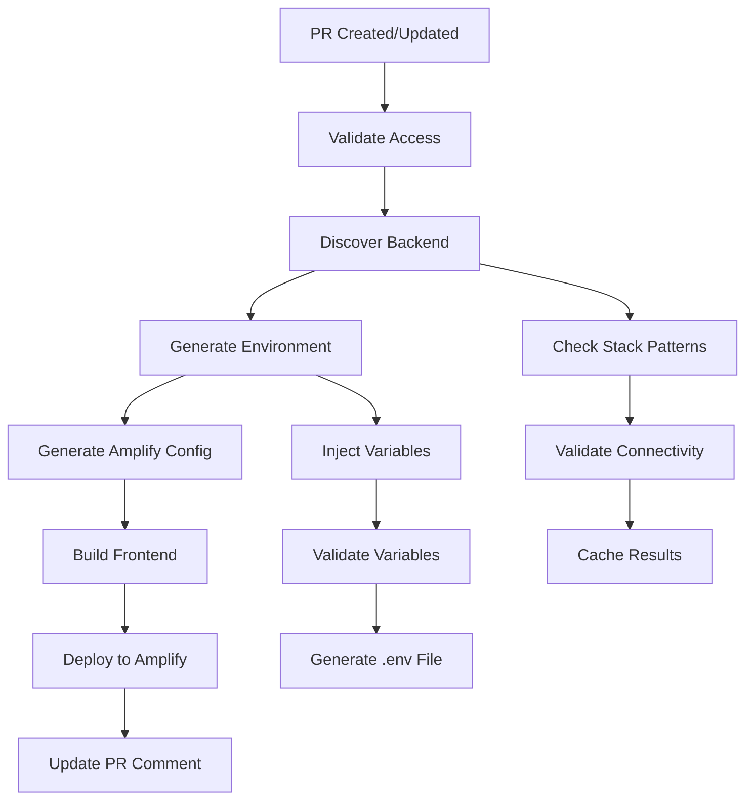
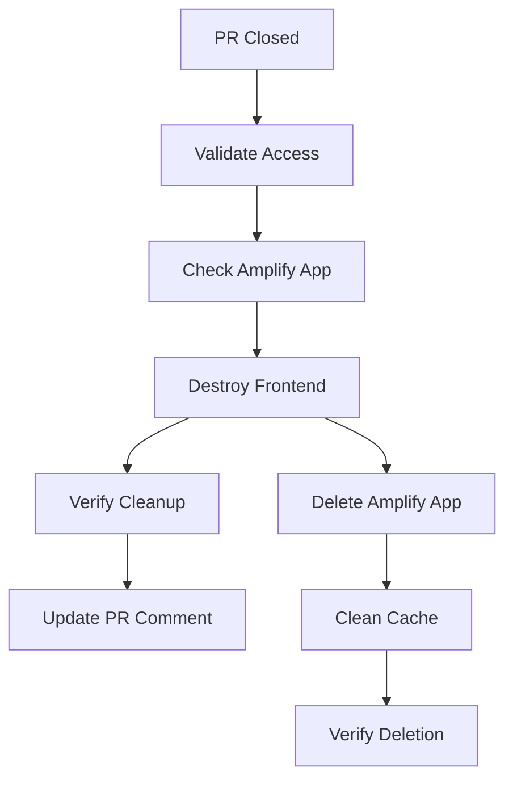

# Frontend Preview Workflow Integration

This guide covers the comprehensive integration of the frontend preview deployment system with GitHub Actions
workflows, including reusable actions and enhanced backend discovery.

## 📋 Overview

The frontend preview workflow integration provides a complete CI/CD pipeline for deploying frontend preview
environments with automatic backend discovery, environment variable generation, and Amplify configuration
management.

## 🏗️ Architecture

### Workflow Integration Components

```text
┌─────────────────────────────────────────────────────────────┐
│                GitHub Actions Workflows                    │
├─────────────────────────────────────────────────────────────┤
│                                                             │
│  ┌─────────────────┐    ┌─────────────────┐                │
│  │ deploy-frontend │    │ destroy-frontend│                │
│  │ -preview.yml    │    │ -preview.yml    │                │
│  └─────────────────┘    └─────────────────┘                │
│           │                       │                        │
│           ▼                       ▼                        │
│  ┌─────────────────┐    ┌─────────────────┐                │
│  │ Reusable Actions│    │ Integration     │                │
│  │ - discover-     │    │ Scripts         │                │
│  │   backend       │    │ - test-backend- │                │
│  │ - generate-     │    │   integration   │                │
│  │   frontend-env  │    │ - validate-     │                │
│  └─────────────────┘    │   workflows     │                │
│           │              └─────────────────┘                │
│           ▼                                                 │
│  ┌─────────────────┐                                       │
│  │ Backend Services│                                       │
│  │ - discovery     │                                       │
│  │ - resolution    │                                       │
│  │ - validation    │                                       │
│  └─────────────────┘                                       │
│                                                             │
└─────────────────────────────────────────────────────────────┘
```

## 🔧 Reusable GitHub Actions

### 1. Backend Discovery Action

**Location**: `.github/actions/discover-backend/action.yml`

**Purpose**: Discovers backend CloudFormation stacks and resolves API endpoints

**Inputs**:

- `environment` (required): Target environment name
- `pr-number` (optional): Pull request number for preview environments
- `validate-connectivity` (optional): Enable API endpoint validation
- `force-refresh` (optional): Force refresh of cached results
- `fallback-only` (optional): Skip discovery, use fallback only
- `aws-region` (optional): AWS region for discovery
- `timeout` (optional): Discovery timeout in seconds
- `debug` (optional): Enable debug output

**Outputs**:

- `backend-found`: Whether backend was discovered
- `api-endpoint`: Resolved API endpoint URL
- `stack-name`: CloudFormation stack name
- `resolution-method`: Resolution method used
- `fallback-used`: Whether fallback was used
- `connectivity-status`: API connectivity status
- `response-time`: API response time in milliseconds
- `discovery-result`: Complete discovery result as JSON

**Usage Example**:

```yaml
- name: Discover backend environment
  id: discover
  uses: ./.github/actions/discover-backend
  with:
    environment: ${{ needs.validate-access.outputs.env-name }}
    pr-number: ${{ github.event.pull_request.number }}
    validate-connectivity: 'true'
    aws-region: ${{ env.AWS_REGION }}
    debug: 'false'
```

### 2. Frontend Environment Generation Action

**Location**: `.github/actions/generate-frontend-env/action.yml`

**Purpose**: Generates environment variables for frontend builds with backend integration

**Inputs**:

- `environment` (required): Target environment name
- `pr-number` (optional): Pull request number
- `build-mode` (optional): Build mode (preview, staging, production)
- `api-endpoint` (optional): API endpoint URL (overrides discovery)
- `api-key` (required): API authentication key
- `backend-stack-name` (optional): Backend stack name
- `resolution-method` (optional): Backend resolution method
- `output-file` (optional): Output file for environment variables
- `include-build-metadata` (optional): Include build metadata
- `validate-variables` (optional): Validate generated variables
- `debug` (optional): Enable debug output

**⚠️ Security Warning for API Keys**:

**Critical**: The `api-key` input becomes a `VITE_API_KEY` environment variable that is
**publicly accessible** in the compiled frontend bundle. This means:

- **Never use sensitive API keys** - Any key provided will be visible to end users
- **Use public-safe keys only** - Keys must be designed for client-side exposure
- **Implement least-privilege access** - Keys should have minimal required permissions
- **Consider token-based auth** - Prefer Cognito/OIDC flows over static API keys
- **Rotate keys regularly** - Especially for preview environments

**Recommended Approach**: Use non-sensitive API keys for frontend builds and implement
proper authentication flows (JWT tokens, Cognito) for sensitive operations.

**Outputs**:

- `env-file`: Path to generated environment file
- `api-url`: Final API URL used
- `variables-count`: Number of variables generated
- `validation-result`: Validation result

**Usage Example**:

```yaml
- name: Generate environment configuration
  id: generate-env
  uses: ./.github/actions/generate-frontend-env
  with:
    environment: ${{ needs.validate-access.outputs.env-name }}
    pr-number: ${{ github.event.pull_request.number }}
    build-mode: 'preview'
    api-endpoint: ${{ needs.check-backend-environment.outputs.api-endpoint }}
    api-key: ${{ secrets.FRONTEND_API_KEY }}
    backend-stack-name: ${{ needs.check-backend-environment.outputs.stack-name }}
    resolution-method: ${{ needs.check-backend-environment.outputs.resolution-method }}
    output-file: '.env.preview'
    include-build-metadata: 'true'
    validate-variables: 'true'
    debug: 'false'
```

## 📊 Enhanced Workflow Integration

### Frontend Preview Deployment Workflow

**File**: `.github/workflows/deploy-frontend-preview.yml`

**Key Enhancements**:

#### 1. Enhanced Backend Discovery

```yaml
check-backend-environment:
  name: Check Backend Environment
  runs-on: ubuntu-latest
  needs: [validate-access]
  if: needs.validate-access.outputs.should-deploy == 'true'

  outputs:
    backend-exists: ${{ steps.discover.outputs.backend-found }}
    api-endpoint: ${{ steps.discover.outputs.api-endpoint }}
    stack-name: ${{ steps.discover.outputs.stack-name }}
    resolution-method: ${{ steps.discover.outputs.resolution-method }}
    fallback-used: ${{ steps.discover.outputs.fallback-used }}
    connectivity-status: ${{ steps.discover.outputs.connectivity-status }}

  steps:
    - name: Discover backend environment
      id: discover
      uses: ./.github/actions/discover-backend
      with:
        environment: ${{ needs.validate-access.outputs.env-name }}
        pr-number: ${{ github.event.pull_request.number }}
        validate-connectivity: 'true'
        aws-region: ${{ env.AWS_REGION }}
```

#### 2. Streamlined Environment Generation

```yaml
- name: Generate environment configuration
  id: generate-env
  uses: ./.github/actions/generate-frontend-env
  with:
    environment: ${{ needs.validate-access.outputs.env-name }}
    pr-number: ${{ github.event.pull_request.number }}
    build-mode: 'preview'
    api-endpoint: ${{ needs.check-backend-environment.outputs.api-endpoint }}
    api-key: ${{ secrets.FRONTEND_API_KEY }}
    include-build-metadata: 'true'
    validate-variables: 'true'
```

### Frontend Teardown Workflow

**File**: `.github/workflows/destroy-frontend-preview.yml`

**Integration Points**:

- Uses backend discovery for cleanup validation
- Integrates with environment management scripts
- Provides comprehensive logging and error handling

### Full-Stack Deployment Workflow

**File**: `.github/workflows/deploy-full-stack.yml`

**Enhanced Integration**:

- Coordinates backend and frontend deployments
- Uses backend discovery for API endpoint resolution
- Supports environment-specific deployment strategies

## 🧪 Workflow Testing and Validation

### Integration Test Workflow

**File**: `.github/workflows/test-workflow-integration.yml` (to be created)

**Purpose**: Tests the complete workflow integration system

**Test Coverage**:

- ✅ **Reusable Action Testing**: Tests all reusable actions independently
- ✅ **End-to-End Workflow Testing**: Tests complete deployment workflows
- ✅ **Backend Discovery Testing**: Validates discovery across environments
- ✅ **Environment Generation Testing**: Validates variable generation
- ✅ **Error Handling Testing**: Tests failure scenarios and recovery

### Manual Testing Scripts

**Integration Test Script**: `apps/client-ui/scripts/test-backend-integration.sh`

```bash
# Test all integration components
./scripts/test-backend-integration.sh

# Test specific components
./scripts/test-backend-integration.sh --test-suite discovery
./scripts/test-backend-integration.sh --test-suite resolution
./scripts/test-backend-integration.sh --test-suite integration

# Skip AWS-dependent tests
./scripts/test-backend-integration.sh --skip-aws-tests
```

## 🔄 Workflow Execution Flow

### Preview Deployment Flow



### Teardown Flow



## 📈 Monitoring and Observability

### Workflow Metrics

The enhanced workflows provide comprehensive metrics:

- **Deployment Success Rate**: Percentage of successful deployments
- **Backend Discovery Rate**: Percentage of successful backend discoveries
- **Average Deployment Time**: Time from trigger to completion
- **API Response Times**: Performance of discovered endpoints
- **Cache Hit Rate**: Effectiveness of discovery caching

### Logging and Debugging

**Enhanced Logging Features**:

- **Structured Output**: Consistent logging format across all steps
- **Debug Mode**: Detailed debugging information when enabled
- **Error Context**: Comprehensive error messages with context
- **Performance Metrics**: Timing information for all operations

**Debug Mode Activation**:

```yaml
# Enable debug mode in workflow
- uses: ./.github/actions/discover-backend
  with:
    debug: 'true'
```

### Error Handling and Recovery

**Robust Error Handling**:

- **Graceful Degradation**: Fallback to default URLs when discovery fails
- **Retry Logic**: Automatic retries for transient failures
- **Clear Error Messages**: Actionable error messages for troubleshooting
- **Rollback Capabilities**: Ability to rollback failed deployments

## 🔒 Security and Compliance

### Security Features

- **Least Privilege Access**: IAM roles with minimal required permissions
- **Credential Management**: Secure handling of API keys and tokens
- **Environment Isolation**: Proper isolation between environments
- **Audit Logging**: Comprehensive audit trail for all operations

### Compliance Considerations

- **Change Tracking**: All changes tracked through Git and workflow logs
- **Access Control**: Code owner validation for all deployments
- **Environment Validation**: Validation of environment configurations
- **Deployment Approval**: Manual approval gates for production deployments

## 🚨 Troubleshooting

### Common Issues

#### 1. Backend Discovery Failures

**Symptoms**: No backend found, fallback URLs used

**Debugging**:

```bash
# Enable debug mode in workflow
debug: 'true'

# Check discovery logs
# Look for "Backend Discovery Results" section in workflow logs
```

**Solutions**:

- Verify backend stack exists and is in correct state
- Check stack naming follows expected patterns
- Ensure AWS credentials have CloudFormation permissions

#### 2. Environment Generation Failures

**Symptoms**: Environment variable validation fails

**Debugging**:

```bash
# Check generated environment file
# Look for "Environment Generation Summary" in logs
```

**Solutions**:

- Verify all required secrets are configured
- Check API endpoint format and accessibility
- Validate environment variable patterns

#### 3. Workflow Permission Issues

**Symptoms**: AWS credential or permission errors

**Solutions**:

- Verify AWS role ARN is correctly configured
- Check IAM role has required permissions
- Ensure OIDC trust relationship is properly configured

### Debug Commands

```bash
# Test backend discovery locally
cd apps/client-ui
./scripts/backend-discovery-service.sh discover pr-123 --pr-number 123 --debug

# Test environment generation locally
./scripts/api-resolution-service.sh --environment pr-123 --pr-number 123 --debug

# Run integration tests
./scripts/test-backend-integration.sh --verbose
```

## 📚 Related Documentation

- [Frontend-Backend Integration System](../frontend/frontend-backend-integration.md)
- [Amplify Configuration Templates](../frontend/amplify-configuration-templates.md)
- [AWS IAM Permissions for Amplify](../deployment/aws-iam-amplify-permissions.md)
- [GitHub Workflows Overview](./github-workflows-overview.md)
- [CI/CD Setup Guide](../deployment/ci-cd-setup-guide.md)
