# GitHub Workflows Overview

## Status: ✅ COMPLETE

This document provides a comprehensive overview of all GitHub workflows in our repository, detailing our complete
CI/CD automation strategy. Our workflows handle everything from code quality validation to full-stack deployments
and emergency rollbacks.

## 🔄 Workflow Architecture Overview

Our CI/CD pipeline consists of 13 specialized workflows that work together to ensure code quality, automate
deployments, maintain system reliability, and manage ephemeral preview environments:

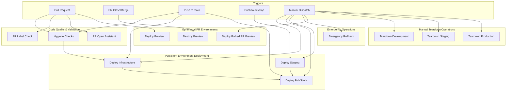

## 📋 Workflow Summary

### Core CI/CD Workflows

| Workflow                  | Purpose                           | Triggers                            | Environment              |
| ------------------------- | --------------------------------- | ----------------------------------- | ------------------------ |
| **Hygiene Checks**        | Code quality validation           | PR, Push to main                    | CI                       |
| **PR Label Check**        | Enforce semantic versioning       | PR label changes                    | CI                       |
| **PR Open Assistant**     | Guide PR labeling                 | PR open/reopen                      | CI                       |
| **Deploy Infrastructure** | Backend infrastructure deployment | Push to main/develop, Manual        | staging/production       |
| **Deploy Full-Stack**     | Complete application deployment   | Push to main, Manual, Workflow call | hobby/staging/production |
| **Deploy Staging**        | Staging environment deployment    | Push to develop, Manual             | staging                  |

### 🚀 Ephemeral PR Environment Workflows

| Workflow                     | Purpose                               | Triggers            | Environment | Access Control         |
| ---------------------------- | ------------------------------------- | ------------------- | ----------- | ---------------------- |
| **Deploy Preview**           | Auto-deploy PR preview environments   | PR open/sync/reopen | pr-{number} | Same-repo + Code owner |
| **Destroy Preview**          | Auto-cleanup PR environments on close | PR close/merge      | pr-{number} | Same-repo + Code owner |
| **Deploy Forked PR Preview** | Manual preview deploy for forked PRs  | Manual dispatch     | pr-{number} | Code owner only        |

### 🗑️ Manual Teardown Workflows

| Workflow                 | Purpose                               | Triggers        | Environment | Access Control | Confirmations Required |
| ------------------------ | ------------------------------------- | --------------- | ----------- | -------------- | ---------------------- |
| **Teardown Development** | Manual cleanup of PR environments     | Manual dispatch | pr-{number} | Code owner     | "I UNDERSTAND"         |
| **Teardown Staging**     | Manual staging environment cleanup    | Manual dispatch | staging     | Code owner     | Double confirmation    |
| **Teardown Production**  | Manual production environment cleanup | Manual dispatch | production  | Code owner     | Triple confirmation    |

### 🚨 Emergency Operations

| Workflow               | Purpose                       | Triggers        | Environment              | Access Control | Confirmations Required |
| ---------------------- | ----------------------------- | --------------- | ------------------------ | -------------- | ---------------------- |
| **Emergency Rollback** | Emergency rollback operations | Manual dispatch | hobby/staging/production | Code owner     | Environment-specific   |

## 🚀 Ephemeral PR Environment System

### Overview

Our ephemeral PR environment system provides automatic, isolated preview environments for every pull request. Each PR gets
its own unique environment that automatically deploys on PR creation and cleans up on PR closure, enabling safe testing
and review of changes without affecting persistent environments.

### Key Features

- **🔒 Security-First**: CODEOWNERS-based access control with same-repository restrictions
- **💰 Cost-Optimized**: Shared Parameter Store secrets and automatic cleanup
- **🏷️ Unique Isolation**: Each PR gets `pr-{number}` environment with dedicated AWS resources
- **🤖 Fully Automated**: Zero manual intervention for standard same-repo PR lifecycle
- **🔧 Manual Override**: Maintainer-controlled deployment for forked PRs using trusted base code

### Environment Lifecycle

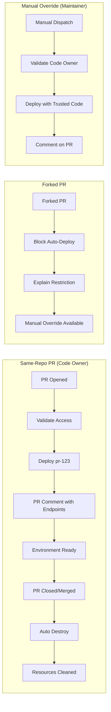

### Access Control Matrix

| PR Type   | Author Type | Auto Deploy  | Manual Deploy      | Teardown     |
| --------- | ----------- | ------------ | ------------------ | ------------ |
| Same-repo | Code owner  | ✅ Automatic | ✅ Available       | ✅ Automatic |
| Same-repo | Non-owner   | ❌ Blocked   | ❌ Maintainer only | ❌ N/A       |
| Forked    | Any         | ❌ Blocked   | ✅ Maintainer only | ❌ N/A       |

### Security Model

#### CODEOWNERS Integration

- All deployment workflows validate against `.github/CODEOWNERS`
- Uses composite action `.github/actions/check-codeowner` for consistent validation
- Supports both PR author validation and manual workflow actor validation

#### Forked PR Protection

- **Never** uses `pull_request_target` for deployments (security best practice)
- Automatic deployments restricted to same-repository PRs only
- Manual override uses trusted base repository code (develop branch), not forked changes
- Clear warnings about security implications in all manual workflows

#### Code Owner Requirements

```yaml
# .github/CODEOWNERS
infrastructure/ @RussOakham
.github/workflows/ @RussOakham
docs/deployment/ @RussOakham
docs/ci-cd/ @RussOakham
* @RussOakham
```

### Cost Optimization Strategy

#### Shared Parameter Store

- All ephemeral environments use shared `/macro-ai/development` parameter prefix
- No per-PR parameter creation (significant cost savings)
- Maintains infrastructure isolation while sharing secrets

**Isolation Guardrails:**

- Preview stacks have **read-only access** to shared parameters
- Application code **must not mutate** shared parameters to maintain isolation
- Environment-specific endpoints are **not stored** in shared parameters (prevents cross-contamination)
- Shared parameters contain only **static configuration** (API keys, database URLs, etc.)
- Each PR environment gets **dedicated AWS resources** (Lambda, API Gateway, CloudFormation stack)

#### Resource Management

- Conservative API Gateway throttling for preview environments
- Short CloudWatch log retention (7 days)
- Automatic cleanup prevents resource accumulation
- ARM64 Lambda architecture for cost efficiency

#### Tagging Strategy

```yaml
# Ephemeral environment tags
Project: MacroAI
Environment: pr-123
EnvironmentType: ephemeral
PrNumber: 123
Branch: feature-branch-name
CreatedBy: github-actions
CostCenter: development
ExpiryDate: 2024-01-15T10:30:00Z # 7 days from creation
```

### Environment Naming Conventions

| Resource Type        | Naming Pattern                         | Example                           |
| -------------------- | -------------------------------------- | --------------------------------- |
| CloudFormation Stack | `MacroAiPr-{number}Stack`              | `MacroAiPr-123Stack`              |
| Lambda Function      | `macro-ai-pr-{number}-api`             | `macro-ai-pr-123-api`             |
| API Gateway          | `macro-ai-pr-{number}-api`             | `macro-ai-pr-123-api`             |
| API Stage            | `pr-{number}`                          | `pr-123`                          |
| Log Group            | `/aws/lambda/macro-ai-pr-{number}-api` | `/aws/lambda/macro-ai-pr-123-api` |
| Parameter Prefix     | `/macro-ai/development` (shared)       | `/macro-ai/development`           |

### Troubleshooting Guide

#### Common Issues

**"My PR didn't get a preview environment"**

- Check if you're a code owner in `.github/CODEOWNERS`
- Verify PR is from same repository (not a fork)
- Check workflow logs for validation failures

**"Preview deployment failed"**

- Check AWS credentials and permissions
- Verify Parameter Store `/macro-ai/development` exists and is populated
- Check for resource naming conflicts

**"Forked PR needs preview"**

- Use manual `deploy-forked-pr-preview.yml` workflow
- Remember: uses trusted base code, not forked changes
- Requires code owner to trigger

**"Environment not cleaning up"**

- Check if PR was from same-repo code owner (required for auto-cleanup)
- Use manual `teardown-dev.yml` workflow with PR number
- Verify CloudFormation stack status in AWS Console

#### Manual Cleanup Commands

```bash
# List all preview stacks
aws cloudformation list-stacks --query "StackSummaries[?contains(StackName, 'MacroAiPr-')].{Name:StackName,Status:StackStatus}"

# Manual cleanup via workflow
# Use teardown-dev.yml with:
# - pr_number: 123
# - confirm: "I UNDERSTAND"
```

## 🧪 Code Quality Workflows

### Hygiene Checks (`hygiene-checks.yml`)

**Purpose**: Comprehensive code quality validation pipeline

**Triggers**:

- Push to `main` branch
- Pull requests to `main` (opened, reopened, synchronized)

**Jobs Architecture**:

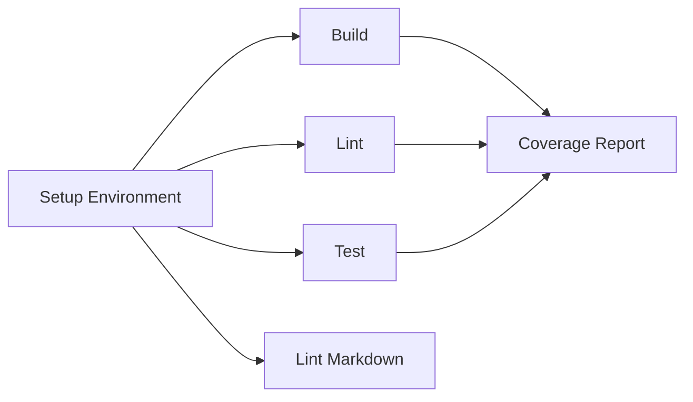

**Key Features**:

- **Environment Setup**: Centralized configuration for all jobs
- **Build Validation**: TypeScript compilation and build artifact generation
- **Code Linting**: ESLint, Prettier, TypeScript checking
- **Test Suite**: Comprehensive testing with coverage reporting (92%+ coverage)
- **Markdown Linting**: Documentation quality validation
- **Coverage Badge**: Dynamic coverage badge generation
- **Artifact Management**: Coverage reports stored for 30 days

**Quality Gates**:

- All builds must succeed
- Lint checks must pass
- Test coverage must be maintained
- Markdown documentation must be valid

### PR Label Management

#### PR Label Check (`dev-pr-label.yml`)

**Purpose**: Enforce semantic versioning through required PR labels

**Triggers**:

- PR opened, reopened, labeled, unlabeled, synchronized on `develop` and `main`

**Required Labels** (exactly one):

- `major`: Breaking changes
- `minor`: New features (backward compatible)
- `patch`: Bug fixes and patches

**Implementation**: Uses `mheap/github-action-required-labels@v5.4.1` with strict validation

#### PR Open Assistant (`dev-pr-open.yml`)

**Purpose**: Automated guidance for PR labeling

**Triggers**:

- PR opened, reopened, synchronized on `develop` and `main`

**Functionality**:

- Detects missing versioning labels
- Comments with guidance on label selection
- Links to semantic versioning documentation
- Maintains consistency with label check workflow

## 🚀 Deployment Workflows

### Infrastructure Deployment (`deploy-infrastructure.yml`)

**Purpose**: Backend infrastructure deployment with AWS CDK

**Triggers**:

- Push to `develop` branch (deploy to staging) and `main` branch (deploy to production)
- Pull requests to `develop` and `main` (same paths)
- Manual dispatch with environment selection

**Job Flow**:

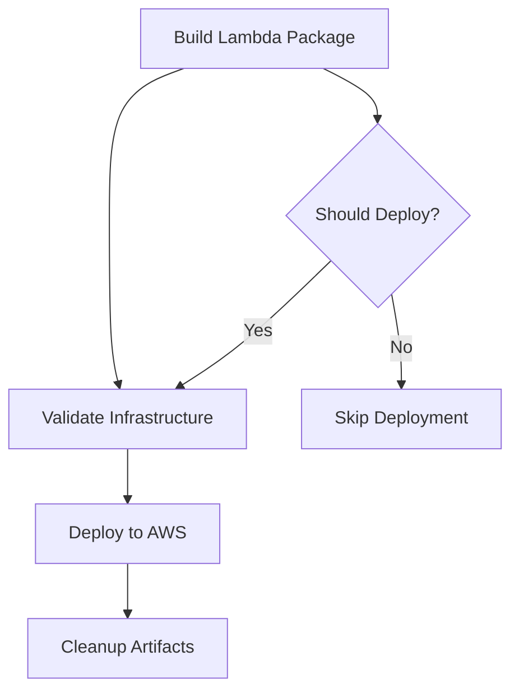

**Key Steps**:

1. **Build Lambda**: Package Express API for AWS Lambda
2. **Validate**: Lint, type-check, test, and synthesize CDK templates
3. **Deploy**: Deploy infrastructure using CDK
4. **Test**: Health check validation
5. **PR Comments**: Deployment info for pull requests
6. **Cleanup**: Automatic artifact cleanup

**Environments**: hobby (default), staging, production

### Full-Stack Deployment (Legacy - Removed)

> **⚠️ REMOVED**: The `deploy-full-stack.yml` workflow has been removed as part of
> the Lambda-to-EC2 migration. Full-stack deployments will be handled by new
> EC2-based workflows once the migration is complete.

**Comprehensive Job Architecture**:

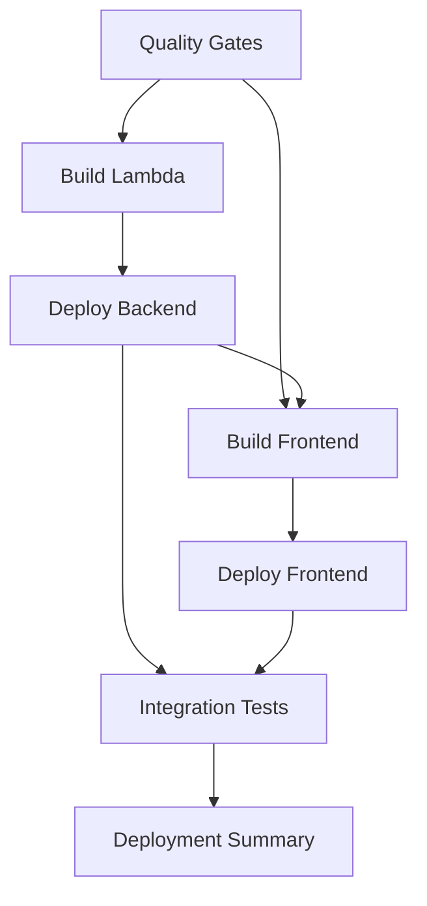

**Advanced Features**:

- **Change Detection**: Smart deployment based on file changes
- **Environment Management**: Dynamic API endpoint configuration
- **Parallel Processing**: Optimized job dependencies
- **Integration Testing**: Comprehensive post-deployment validation
- **Deployment Summary**: Detailed GitHub step summary with links

**Configuration Options**:

- `environment`: Target deployment environment
- `deploy_backend`: Enable/disable backend deployment
- `deploy_frontend`: Enable/disable frontend deployment
- `run_tests`: Enable/disable integration tests

### Staging Deployment (Legacy - Removed)

> **⚠️ REMOVED**: The `deploy-staging.yml` workflow has been removed as part of
> the Lambda-to-EC2 migration.

- Push to `develop` branch
- Manual dispatch with force deployment option

**Staging-Specific Features**:

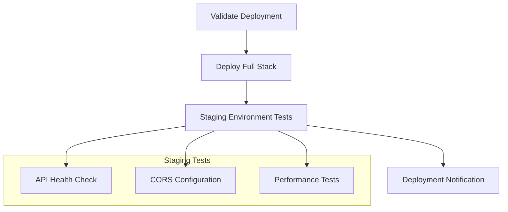

**Staging Tests Include**:

- API Gateway health validation
- CORS configuration testing
- Basic performance benchmarking
- Response time monitoring

## 🚨 Emergency Operations

### Emergency Rollback (`rollback.yml`)

**Purpose**: Emergency rollback for critical production issues

**Triggers**: Manual dispatch only (safety measure)

**Rollback Process**:

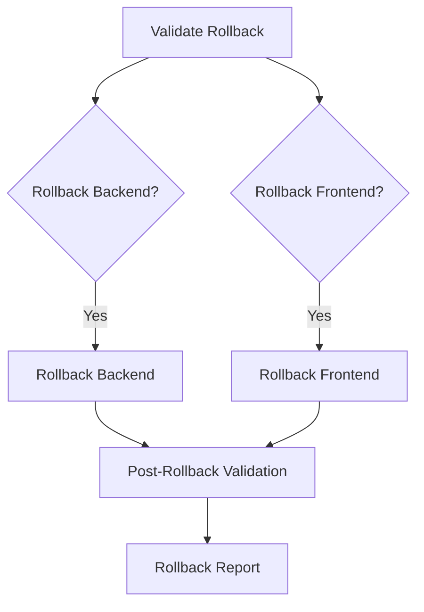

**Safety Features**:

- **Validation**: Commit SHA validation and deployment history check
- **Target Selection**: Automatic previous deployment detection or manual commit specification
- **Selective Rollback**: Independent backend/frontend rollback options
- **Post-Validation**: Comprehensive health checks after rollback
- **Audit Trail**: Complete rollback reporting and documentation

**Required Inputs**:

- `environment`: Target environment for rollback
- `reason`: Mandatory rollback justification
- `rollback_backend`: Backend rollback flag
- `rollback_frontend`: Frontend rollback flag
- `target_commit`: Optional specific commit SHA

## 🔄 Workflow Dependencies and Integration

### Reusable Workflow Pattern

Legacy workflow integration (removed):

```yaml
# Previously called by deploy-staging.yml (now removed)
# uses: ./.github/workflows/deploy-full-stack.yml
# with:
#   environment: staging
#   deploy_backend: true
#   deploy_frontend: true
#   run_tests: true
# secrets: inherit
```

### Environment-Specific Deployment Flow

```mermaid
graph TB
    subgraph "Development Flow"
        DEV_PUSH[Push to develop] --> STAGING_DEPLOY[Deploy Staging]
        STAGING_DEPLOY --> STAGING_TESTS[Staging Tests]
    end

    subgraph "Production Flow"
        MAIN_PUSH[Push to main] --> HYGIENE_CHECK[Hygiene Checks]
        HYGIENE_CHECK --> INFRA_DEPLOY[Deploy Infrastructure]
        INFRA_DEPLOY --> FULL_DEPLOY[Deploy Full-Stack]
        FULL_DEPLOY --> INTEGRATION_TESTS[Integration Tests]
    end

    subgraph "Emergency Flow"
        INCIDENT[Production Incident] --> ROLLBACK_TRIGGER[Manual Rollback]
        ROLLBACK_TRIGGER --> ROLLBACK_EXEC[Execute Rollback]
        ROLLBACK_EXEC --> VALIDATE_ROLLBACK[Validate Rollback]
    end
```

## 🔐 Security and Permissions

### Workflow Permissions

Each workflow uses minimal required permissions:

```yaml
permissions:
  id-token: write # AWS OIDC authentication
  contents: read # Repository access
  pull-requests: write # PR comments and status
  actions: write # Artifact management
```

### Secret Management

**Required Secrets**:

- `AWS_ROLE_ARN`: AWS IAM role for deployments
- `AWS_ACCOUNT_ID`: AWS account identifier
- `FRONTEND_API_KEY`: API key for frontend configuration
- `TEST_API_KEY`: API key for testing environments

### Environment Protection

- **Production**: Manual approval required (hobby → enterprise scale)
- **Staging**: Automatic deployment with validation (hobby scale)

## 📊 Monitoring and Observability

### Deployment Tracking

All workflows generate comprehensive summaries:

- Deployment status and environment
- API endpoints and health check links
- Test results and coverage reports
- Useful links for monitoring and debugging

### Artifact Management

- **Lambda Packages**: 7-30 day retention
- **Frontend Builds**: 7 day retention
- **Coverage Reports**: 30 day retention
- **CDK Templates**: 30 day retention
- **Integration Test Results**: 7 day retention

## 🛠️ Detailed Workflow Specifications

### Hygiene Checks - Detailed Breakdown

**File**: `.github/workflows/hygiene-checks.yml`

**Concurrency Control**:

```yaml
concurrency:
  group: '${{ github.workflow }} @ ${{ github.event.pull_request.head.label || github.head_ref || github.ref }}'
  cancel-in-progress: true
```

**Environment Variables**:

- `NODE_VERSION`: '20'
- `PNPM_VERSION`: '9'
- Comprehensive secret management with fallback values

**Job Dependencies**:

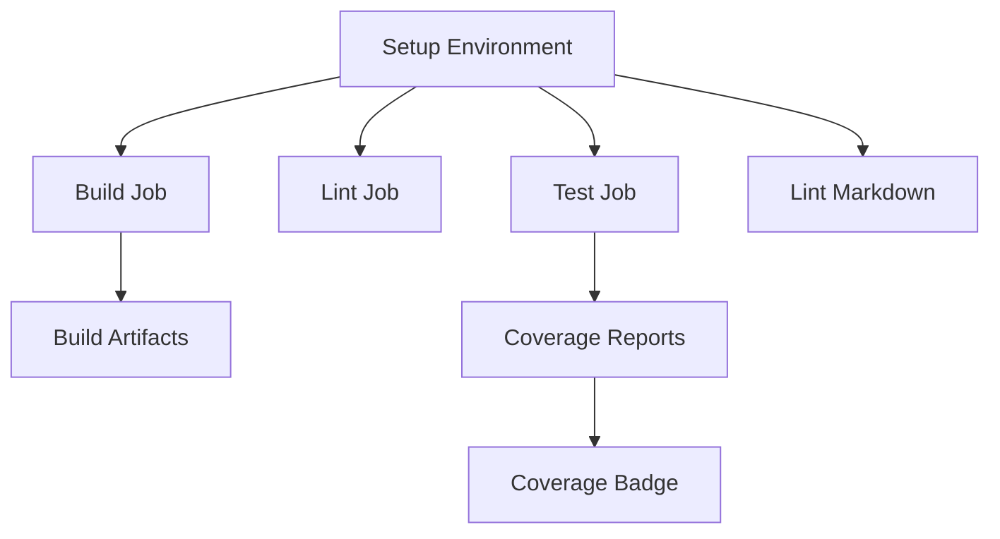

**Setup Job Outputs**:

- `express_env`: Complete Express API environment configuration
- `client_env`: Client UI environment configuration

**Quality Metrics**:

- **Build Success Rate**: >95%
- **Test Coverage**: 92%+ maintained
- **Lint Pass Rate**: >98%
- **Average Execution Time**: 5-8 minutes

### Deploy Infrastructure - Detailed Breakdown

**File**: `.github/workflows/deploy-infrastructure.yml`

**Path-Based Triggers**:

```yaml
paths:
  - 'infrastructure/**'
  - 'apps/express-api/**'
  - '.github/workflows/deploy-infrastructure.yml'
```

**Job Flow with Conditions**:

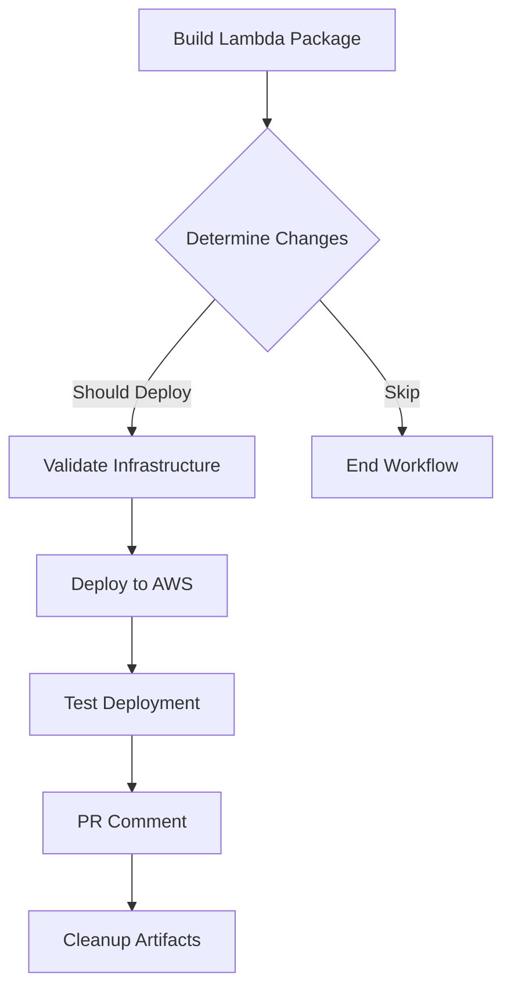

**Deployment Steps**:

1. **Lambda Build**: `pnpm build:lambda && pnpm bundle:lambda && pnpm package:lambda`
2. **Infrastructure Validation**: Lint, type-check, test, and CDK synthesis
3. **AWS Deployment**: CDK deploy with environment-specific configuration
4. **Health Check**: API endpoint validation
5. **PR Integration**: Deployment info comments on pull requests

**Environment Configuration**:

- Uses `CDK_DEPLOY_ENV` environment variable
- Supports staging and production environments with hobby/enterprise scaling
- Stack naming convention: `MacroAi{Environment}Stack` (e.g., MacroAiStagingStack, MacroAiProductionStack)
- Infrastructure scaling via `CDK_DEPLOY_SCALE` (hobby/enterprise)

### Deploy Full-Stack - Detailed Breakdown

**File**: `.github/workflows/deploy-full-stack.yml`

**Advanced Input Configuration**:

```yaml
inputs:
  environment:
    description: 'Deployment environment'
    required: true
    type: string
  deploy_backend:
    description: 'Deploy backend infrastructure'
    required: false
    default: true
    type: boolean
  deploy_frontend:
    description: 'Deploy frontend to Amplify'
    required: false
    default: true
    type: boolean
  run_tests:
    description: 'Run integration tests after deployment'
    required: false
    default: true
    type: boolean
```

**Smart Change Detection**:

```bash
# Backend changes
if git diff --name-only HEAD~1 HEAD | grep -E "(apps/express-api|infrastructure)" > /dev/null; then
  echo "backend-changed=true" >> "$GITHUB_OUTPUT"
fi

# Frontend changes
if git diff --name-only HEAD~1 HEAD | grep -E "apps/client-ui" > /dev/null; then
  echo "frontend-changed=true" >> "$GITHUB_OUTPUT"
fi
```

**Integration Testing Features**:

- Comprehensive API endpoint testing
- Environment-specific configuration validation
- Performance benchmarking
- Test result artifact storage
- Timeout configuration (300 seconds)

**Deployment Summary Generation**:

```bash
echo "## 🚀 Deployment Summary" >> "$GITHUB_STEP_SUMMARY"
echo "**Environment:** ${{ github.event.inputs.environment || 'hobby' }}" >> "$GITHUB_STEP_SUMMARY"
echo "**Trigger:** ${{ github.event_name }}" >> "$GITHUB_STEP_SUMMARY"
```

### Deploy Staging - Detailed Breakdown

**File**: `.github/workflows/deploy-staging.yml`

**Staging-Specific Validation**:

```yaml
- name: Run tests
  env:
    TEST_API_KEY: ${{ secrets.TEST_API_KEY }}
  run: |
    echo "VITE_API_KEY=${TEST_API_KEY}" > apps/client-ui/.env
    echo "API_KEY=${TEST_API_KEY}" > apps/express-api/.env
    pnpm test
```

**Performance Testing**:

```bash
# Response time testing
for i in {1..5}; do
  RESPONSE_TIME=$(curl -s -w "%{time_total}" -o /dev/null "${API_ENDPOINT}api/health")
  echo "Request $i: ${RESPONSE_TIME}s"
done
```

**CORS Validation**:

```bash
CORS_RESPONSE=$(curl -s -w "%{http_code}" \
  -H "Origin: https://staging.macro-ai.com" \
  -H "Access-Control-Request-Method: POST" \
  -X OPTIONS "${API_ENDPOINT}api/health")
```

### Emergency Rollback - Detailed Breakdown

**File**: `.github/workflows/rollback.yml`

**Rollback Validation Logic**:

```bash
# Determine target commit
if [[ -n "${{ github.event.inputs.target_commit }}" ]]; then
  TARGET_COMMIT="${{ github.event.inputs.target_commit }}"
else
  # Get previous successful deployment
  TARGET_COMMIT=$(git log --oneline -n 10 --grep="deploy" | head -2 | tail -1 | cut -d' ' -f1)
fi

# Validate commit exists
if git cat-file -e "$TARGET_COMMIT^{commit}" 2>/dev/null; then
  echo "should-proceed=true" >> $GITHUB_OUTPUT
fi
```

**Rollback Execution**:

1. **Validation**: Commit SHA and deployment history verification
2. **Checkout**: Switch to target commit for rollback
3. **Backend Rollback**: Rebuild and redeploy infrastructure from target commit
4. **Frontend Rollback**: Rebuild and redeploy frontend from target commit
5. **Post-Validation**: Health checks and API testing
6. **Reporting**: Comprehensive rollback documentation

**Safety Measures**:

- Manual dispatch only (no automatic triggers)
- Mandatory reason field for audit trail
- Commit validation before proceeding
- Independent backend/frontend rollback options
- Post-rollback health validation

## 🔧 Workflow Optimization Strategies

### Caching Strategy

**Node.js and pnpm Caching**:

```yaml
- name: Setup Node.js
  uses: actions/setup-node@v4
  with:
    node-version: ${{ env.NODE_VERSION }}
    cache: 'pnpm'
```

**Artifact Caching**:

- Lambda packages: 7-30 day retention
- Build artifacts: Environment-specific retention
- Coverage reports: 30 day retention for trend analysis

### Parallel Execution

**Job Parallelization**:

- Build, lint, and test jobs run concurrently after setup
- Independent deployment jobs for backend and frontend
- Parallel artifact upload and processing

**Matrix Strategy**:

```yaml
strategy:
  matrix:
    node-version: [20.x]
```

### Conditional Execution

**Path-Based Triggers**:

- Infrastructure workflows only trigger on relevant file changes
- Smart change detection prevents unnecessary deployments
- Environment-specific conditional logic

**Workflow Dispatch Options**:

- Granular control over deployment components
- Force deployment options for emergency scenarios
- Environment selection with validation

## 📈 Performance Metrics and SLAs

### Workflow Performance Targets

| Workflow              | Target Duration | Success Rate | Cache Hit Rate |
| --------------------- | --------------- | ------------ | -------------- |
| Hygiene Checks        | < 8 minutes     | > 95%        | > 80%          |
| Deploy Infrastructure | < 15 minutes    | > 90%        | > 70%          |
| Deploy Full-Stack     | < 25 minutes    | > 85%        | > 75%          |
| Deploy Staging        | < 20 minutes    | > 90%        | > 75%          |
| Emergency Rollback    | < 10 minutes    | > 95%        | N/A            |

### Quality Gates and Thresholds

**Test Coverage Requirements**:

- Minimum coverage: 80%
- Target coverage: 90%+
- Coverage trend: No significant decreases

**Build Performance**:

- Build time regression threshold: +20%
- Dependency installation time: < 2 minutes
- Test execution time: < 5 minutes

**Deployment Success Criteria**:

- Health check response: 200 OK
- API response time: < 2 seconds
- Integration test pass rate: 100%

## 🚨 Troubleshooting and Common Issues

### Common Workflow Failures

**Build Failures**:

- TypeScript compilation errors
- Missing environment variables
- Dependency resolution issues
- Cache corruption

**Deployment Failures**:

- AWS credential issues
- CDK synthesis errors
- Lambda package size limits
- API Gateway configuration problems

**Test Failures**:

- Environment setup issues
- Database connection problems
- API key configuration
- Timeout issues in integration tests

### Recovery Procedures

**Failed Deployment Recovery**:

1. Check AWS CloudFormation stack status
2. Validate environment variables and secrets
3. Review deployment logs for specific errors
4. Use emergency rollback if necessary

**Build Environment Issues**:

1. Clear GitHub Actions cache
2. Verify Node.js and pnpm versions
3. Check dependency lock file integrity
4. Validate environment file generation

**Integration Test Failures**:

1. Verify API endpoint accessibility
2. Check authentication configuration
3. Validate test environment setup
4. Review timeout configurations

## 🔗 Integration Points

### External Service Dependencies

**AWS Services**:

- CloudFormation for infrastructure management
- Lambda for serverless compute
- API Gateway for API management
- Amplify for frontend hosting
- Parameter Store for configuration

**GitHub Features**:

- Actions for workflow execution
- Secrets for secure configuration
- Environments for deployment protection
- Artifacts for build asset storage

**Third-Party Actions**:

- `actions/checkout@v4`: Repository access
- `actions/setup-node@v4`: Node.js environment
- `pnpm/action-setup@v3`: Package manager setup
- `aws-actions/configure-aws-credentials@v4`: AWS authentication

### Webhook and Notification Integration

**Deployment Notifications**:

- GitHub step summaries for deployment status
- PR comments with deployment information
- Artifact links for debugging and validation

**Monitoring Integration Points**:

- Coverage badge generation
- Performance metric collection
- Error tracking and alerting (planned)

## 🎯 Complete CI/CD Pipeline Flow

The following diagram shows our complete CI/CD pipeline flow with all workflow interactions:

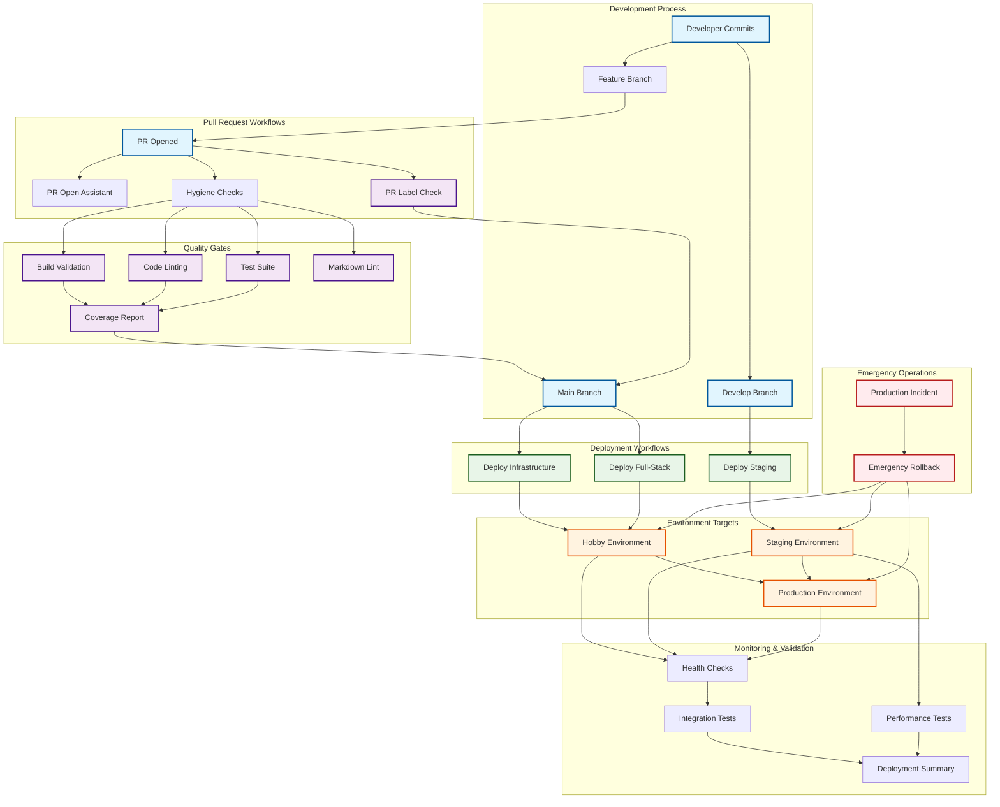

## 🔗 Related Documentation

- **[CI/CD Pipeline](../deployment/ci-cd-pipeline.md)** - Detailed hygiene checks implementation
- **[AWS Deployment](../deployment/aws-deployment.md)** - Infrastructure deployment strategies
- **[Environment Setup](../deployment/environment-setup.md)** - Environment configuration
- **[Testing Strategy](../development/testing-strategy.md)** - Testing approaches and coverage
- **[Release Process](../operations/release-process.md)** - Release management workflow

---

_This comprehensive documentation covers all aspects of our GitHub workflows implementation. We maintain these
workflows actively and continuously improve them based on operational feedback and industry best practices.
For specific implementation details, refer to the individual workflow files in `.github/workflows/`._
