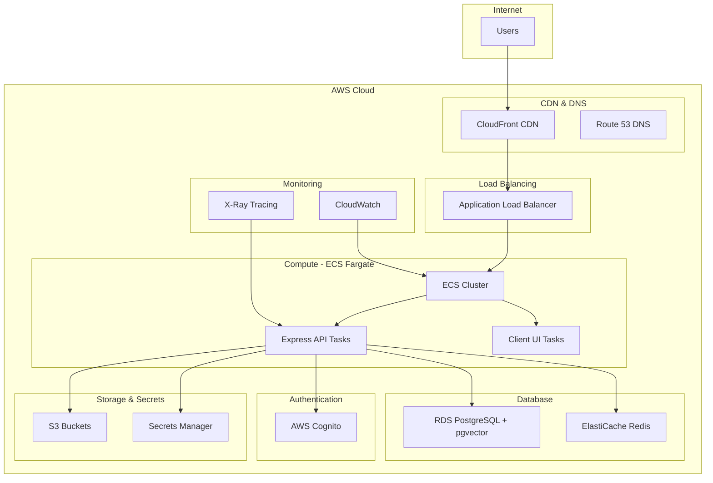

# AWS Deployment Strategy

## Current Implementation Status 📋 PLANNED

This document outlines the comprehensive AWS deployment strategy for the Macro AI application, including Infrastructure
as Code (IaC) recommendations, AWS services architecture, and deployment automation strategies. The deployment
infrastructure is **planned and designed** for scalable, secure, and cost-effective cloud deployment.

## 🏗️ Architecture Overview

### High-Level AWS Architecture



### Core AWS Services

#### Compute Services ✅ RECOMMENDED

- **Amazon ECS with Fargate**: Serverless container orchestration
- **Application Load Balancer (ALB)**: Traffic distribution and SSL termination
- **Auto Scaling**: Automatic scaling based on demand

#### Database Services ✅ RECOMMENDED

- **Amazon RDS PostgreSQL**: Managed relational database with pgvector support
- **Amazon ElastiCache Redis**: In-memory caching and session storage
- **RDS Proxy**: Connection pooling and failover

#### Storage and Content Delivery ✅ RECOMMENDED

- **Amazon S3**: Static asset storage and backups
- **Amazon CloudFront**: Global content delivery network
- **AWS Certificate Manager**: SSL/TLS certificate management

#### Security and Identity ✅ IMPLEMENTED

- **AWS Cognito**: User authentication and authorization (already implemented)
- **AWS Secrets Manager**: Secure secret storage
- **AWS IAM**: Identity and access management
- **AWS WAF**: Web application firewall

#### Monitoring and Logging ✅ RECOMMENDED

- **Amazon CloudWatch**: Metrics, logs, and alarms
- **AWS X-Ray**: Distributed tracing
- **AWS CloudTrail**: API audit logging

## 🚀 Deployment Strategies

### 1. Blue-Green Deployment ✅ RECOMMENDED

**Benefits:**

- Zero-downtime deployments
- Instant rollback capability
- Production testing before traffic switch

**Implementation:**

```yaml
# ECS Service with Blue-Green deployment
Resources:
  ECSService:
    Type: AWS::ECS::Service
    Properties:
      DeploymentConfiguration:
        DeploymentCircuitBreaker:
          Enable: true
          Rollback: true
        MaximumPercent: 200
        MinimumHealthyPercent: 100
      EnableExecuteCommand: true
```

### 2. Rolling Deployment ✅ ALTERNATIVE

**Benefits:**

- Gradual traffic migration
- Resource efficient
- Built-in health checks

**Use Cases:**

- Development and staging environments
- Cost-sensitive deployments

### 3. Canary Deployment 📋 ADVANCED

**Benefits:**

- Risk mitigation through gradual rollout
- Real-world testing with limited exposure
- Automated rollback on metrics threshold

**Implementation:**

- AWS CodeDeploy with Lambda traffic shifting
- CloudWatch metrics-based rollback triggers

## 🏗️ Infrastructure as Code (IaC)

### AWS CDK (Recommended) ✅ PREFERRED

**Benefits:**

- Type-safe infrastructure definitions
- Familiar programming languages (TypeScript)
- Built-in best practices and constructs
- Excellent IDE support

**Project Structure:**

```text
infrastructure/
├── bin/
│   └── macro-ai-stack.ts          # CDK app entry point
├── lib/
│   ├── compute/
│   │   ├── ecs-cluster.ts         # ECS cluster and services
│   │   └── load-balancer.ts       # ALB configuration
│   ├── database/
│   │   ├── rds-postgres.ts        # PostgreSQL database
│   │   └── elasticache.ts         # Redis cache
│   ├── networking/
│   │   ├── vpc.ts                 # VPC and networking
│   │   └── security-groups.ts     # Security group rules
│   ├── storage/
│   │   └── s3-buckets.ts          # S3 bucket configuration
│   ├── monitoring/
│   │   └── cloudwatch.ts          # Monitoring and alarms
│   └── macro-ai-stack.ts          # Main stack definition
├── config/
│   ├── dev.ts                     # Development configuration
│   ├── staging.ts                 # Staging configuration
│   └── prod.ts                    # Production configuration
└── package.json
```

**Sample CDK Stack:**

```typescript
import * as cdk from 'aws-cdk-lib'
import * as ecs from 'aws-cdk-lib/aws-ecs'
import * as ec2 from 'aws-cdk-lib/aws-ec2'
import * as rds from 'aws-cdk-lib/aws-rds'
import { Construct } from 'constructs'

export class MacroAiStack extends cdk.Stack {
	constructor(scope: Construct, id: string, props?: cdk.StackProps) {
		super(scope, id, props)

		// VPC with public and private subnets
		const vpc = new ec2.Vpc(this, 'MacroAiVpc', {
			maxAzs: 2,
			natGateways: 1,
		})

		// ECS Cluster
		const cluster = new ecs.Cluster(this, 'MacroAiCluster', {
			vpc,
			containerInsights: true,
		})

		// RDS PostgreSQL with pgvector
		const database = new rds.DatabaseInstance(this, 'MacroAiDatabase', {
			engine: rds.DatabaseInstanceEngine.postgres({
				version: rds.PostgresEngineVersion.VER_15,
			}),
			instanceType: ec2.InstanceType.of(
				ec2.InstanceClass.T3,
				ec2.InstanceSize.MICRO,
			),
			vpc,
			credentials: rds.Credentials.fromGeneratedSecret('postgres'),
			multiAz: false, // Enable for production
			deletionProtection: false, // Enable for production
		})

		// ECS Service for Express API
		const apiService = new ecs.FargateService(this, 'ApiService', {
			cluster,
			taskDefinition: this.createApiTaskDefinition(cluster),
			desiredCount: 2,
		})

		// ECS Service for Client UI
		const uiService = new ecs.FargateService(this, 'UiService', {
			cluster,
			taskDefinition: this.createUiTaskDefinition(cluster),
			desiredCount: 2,
		})
	}

	private createApiTaskDefinition(
		cluster: ecs.Cluster,
	): ecs.FargateTaskDefinition {
		const taskDef = new ecs.FargateTaskDefinition(this, 'ApiTaskDef', {
			memoryLimitMiB: 512,
			cpu: 256,
		})

		taskDef.addContainer('api', {
			image: ecs.ContainerImage.fromRegistry('macro-ai/express-api:latest'),
			portMappings: [{ containerPort: 3040 }],
			logging: ecs.LogDrivers.awsLogs({
				streamPrefix: 'api',
			}),
			environment: {
				NODE_ENV: 'production',
			},
			secrets: {
				API_KEY: ecs.Secret.fromSecretsManager(
					secretsManager.Secret.fromSecretNameV2(
						this,
						'ApiKey',
						'macro-ai/api-key',
					),
				),
			},
		})

		return taskDef
	}
}
```

### Terraform Alternative 📋 ALTERNATIVE

**Benefits:**

- Mature ecosystem and community
- Multi-cloud support
- Extensive provider ecosystem

**Use Cases:**

- Multi-cloud deployments
- Existing Terraform expertise
- Complex hybrid architectures

## 🔧 Environment Configuration

### Development Environment

**Characteristics:**

- Single AZ deployment
- Minimal resource allocation
- Development-friendly configurations
- Cost optimization

**Configuration:**

```typescript
export const devConfig = {
	environment: 'development',
	vpc: {
		maxAzs: 1,
		natGateways: 0, // Use public subnets only
	},
	database: {
		instanceType: ec2.InstanceType.of(
			ec2.InstanceClass.T3,
			ec2.InstanceSize.MICRO,
		),
		multiAz: false,
		deletionProtection: false,
		backupRetention: cdk.Duration.days(1),
	},
	ecs: {
		desiredCount: 1,
		cpu: 256,
		memoryLimitMiB: 512,
	},
	monitoring: {
		detailedMonitoring: false,
		logRetention: logs.RetentionDays.ONE_WEEK,
	},
}
```

### Staging Environment

**Characteristics:**

- Production-like configuration
- Reduced scale and redundancy
- Full feature testing
- Cost-performance balance

**Configuration:**

```typescript
export const stagingConfig = {
	environment: 'staging',
	vpc: {
		maxAzs: 2,
		natGateways: 1,
	},
	database: {
		instanceType: ec2.InstanceType.of(
			ec2.InstanceClass.T3,
			ec2.InstanceSize.SMALL,
		),
		multiAz: false,
		deletionProtection: true,
		backupRetention: cdk.Duration.days(7),
	},
	ecs: {
		desiredCount: 2,
		cpu: 512,
		memoryLimitMiB: 1024,
	},
	monitoring: {
		detailedMonitoring: true,
		logRetention: logs.RetentionDays.ONE_MONTH,
	},
}
```

### Production Environment

**Characteristics:**

- High availability and redundancy
- Auto-scaling capabilities
- Comprehensive monitoring
- Security hardening

**Configuration:**

```typescript
export const prodConfig = {
	environment: 'production',
	vpc: {
		maxAzs: 3,
		natGateways: 3, // One per AZ for HA
	},
	database: {
		instanceType: ec2.InstanceType.of(
			ec2.InstanceClass.R6G,
			ec2.InstanceSize.LARGE,
		),
		multiAz: true,
		deletionProtection: true,
		backupRetention: cdk.Duration.days(30),
		performanceInsights: true,
	},
	ecs: {
		desiredCount: 3,
		cpu: 1024,
		memoryLimitMiB: 2048,
		autoScaling: {
			minCapacity: 2,
			maxCapacity: 10,
			targetCpuUtilization: 70,
		},
	},
	monitoring: {
		detailedMonitoring: true,
		logRetention: logs.RetentionDays.SIX_MONTHS,
		alarms: true,
	},
}
```

## 🔐 Security Configuration

### Network Security

#### VPC Configuration

```typescript
const vpc = new ec2.Vpc(this, 'MacroAiVpc', {
	maxAzs: 3,
	subnetConfiguration: [
		{
			cidrMask: 24,
			name: 'Public',
			subnetType: ec2.SubnetType.PUBLIC,
		},
		{
			cidrMask: 24,
			name: 'Private',
			subnetType: ec2.SubnetType.PRIVATE_WITH_EGRESS,
		},
		{
			cidrMask: 28,
			name: 'Database',
			subnetType: ec2.SubnetType.PRIVATE_ISOLATED,
		},
	],
})
```

#### Security Groups

```typescript
// API Security Group
const apiSecurityGroup = new ec2.SecurityGroup(this, 'ApiSecurityGroup', {
	vpc,
	description: 'Security group for Express API',
	allowAllOutbound: true,
})

apiSecurityGroup.addIngressRule(
	ec2.Peer.securityGroupId(albSecurityGroup.securityGroupId),
	ec2.Port.tcp(3030),
	'Allow ALB to API',
)

// Database Security Group
const dbSecurityGroup = new ec2.SecurityGroup(this, 'DatabaseSecurityGroup', {
	vpc,
	description: 'Security group for RDS PostgreSQL',
	allowAllOutbound: false,
})

dbSecurityGroup.addIngressRule(
	ec2.Peer.securityGroupId(apiSecurityGroup.securityGroupId),
	ec2.Port.tcp(5432),
	'Allow API to Database',
)
```

### Secrets Management

#### AWS Secrets Manager Integration

```typescript
// Database credentials
const dbSecret = new secretsManager.Secret(this, 'DatabaseSecret', {
	description: 'RDS PostgreSQL credentials',
	generateSecretString: {
		secretStringTemplate: JSON.stringify({ username: 'postgres' }),
		generateStringKey: 'password',
		excludeCharacters: '"@/\\',
	},
})

// API keys and configuration
const apiSecret = new secretsManager.Secret(this, 'ApiSecret', {
	description: 'API configuration secrets',
	secretObjectValue: {
		API_KEY: cdk.SecretValue.unsafePlainText(generateApiKey()),
		COOKIE_ENCRYPTION_KEY: cdk.SecretValue.unsafePlainText(
			generateEncryptionKey(),
		),
		OPENAI_API_KEY: cdk.SecretValue.unsafePlainText('REPLACE_WITH_ACTUAL_KEY'),
	},
})
```

### IAM Roles and Policies

#### ECS Task Role

```typescript
const taskRole = new iam.Role(this, 'EcsTaskRole', {
	assumedBy: new iam.ServicePrincipal('ecs-tasks.amazonaws.com'),
	inlinePolicies: {
		SecretsManagerPolicy: new iam.PolicyDocument({
			statements: [
				new iam.PolicyStatement({
					effect: iam.Effect.ALLOW,
					actions: ['secretsmanager:GetSecretValue'],
					resources: [apiSecret.secretArn, dbSecret.secretArn],
				}),
			],
		}),
		CognitoPolicy: new iam.PolicyDocument({
			statements: [
				new iam.PolicyStatement({
					effect: iam.Effect.ALLOW,
					actions: [
						'cognito-idp:AdminCreateUser',
						'cognito-idp:AdminGetUser',
						'cognito-idp:ListUsers',
						'cognito-idp:SignUp',
						'cognito-idp:ConfirmSignUp',
						'cognito-idp:InitiateAuth',
						'cognito-idp:ForgotPassword',
						'cognito-idp:ConfirmForgotPassword',
						'cognito-idp:GlobalSignOut',
					],
					resources: ['*'],
				}),
			],
		}),
	},
})
```

## 📊 Monitoring and Observability

### CloudWatch Configuration

#### Metrics and Alarms

```typescript
// ECS Service Alarms
const cpuAlarm = new cloudwatch.Alarm(this, 'HighCpuAlarm', {
	metric: apiService.metricCpuUtilization(),
	threshold: 80,
	evaluationPeriods: 2,
	treatMissingData: cloudwatch.TreatMissingData.NOT_BREACHING,
})

const memoryAlarm = new cloudwatch.Alarm(this, 'HighMemoryAlarm', {
	metric: apiService.metricMemoryUtilization(),
	threshold: 85,
	evaluationPeriods: 2,
})

// Database Alarms
const dbConnectionsAlarm = new cloudwatch.Alarm(
	this,
	'DatabaseConnectionsAlarm',
	{
		metric: database.metricDatabaseConnections(),
		threshold: 80,
		evaluationPeriods: 2,
	},
)
```

#### Log Groups and Retention

```typescript
const apiLogGroup = new logs.LogGroup(this, 'ApiLogGroup', {
	logGroupName: '/ecs/macro-ai-api',
	retention: logs.RetentionDays.ONE_MONTH,
	removalPolicy: cdk.RemovalPolicy.DESTROY,
})

const uiLogGroup = new logs.LogGroup(this, 'UiLogGroup', {
	logGroupName: '/ecs/macro-ai-ui',
	retention: logs.RetentionDays.ONE_MONTH,
	removalPolicy: cdk.RemovalPolicy.DESTROY,
})
```

### X-Ray Tracing

```typescript
// Enable X-Ray tracing for ECS tasks
taskDefinition.addContainer('api', {
	// ... other configuration
	environment: {
		// X-Ray configuration - _X_AMZN_TRACE_ID is automatically injected by X-Ray
		AWS_XRAY_TRACING_NAME: 'macro-ai-api',
		AWS_XRAY_DEBUG_MODE: 'TRUE',
	},
	// Enable X-Ray tracing at the container level
	logging: ecs.LogDrivers.awsLogs({
		streamPrefix: 'macro-ai-api',
		logGroup: logGroup,
	}),
})

// Add X-Ray daemon as a sidecar container
taskDefinition.addContainer('xray-daemon', {
	image: ecs.ContainerImage.fromRegistry('amazon/aws-xray-daemon:latest'),
	memoryLimitMiB: 32,
	cpu: 32,
	essential: false,
	portMappings: [
		{
			containerPort: 2000,
			protocol: ecs.Protocol.UDP,
		},
	],
	environment: {
		AWS_REGION: 'us-east-1', // Replace with your region
	},
})
```

#### X-Ray Configuration Notes ⚠️ IMPORTANT

**Automatic Trace ID Injection**:
The `_X_AMZN_TRACE_ID` environment variable should **never** be manually set in container configurations.
X-Ray automatically injects this trace header at runtime when:

- The X-Ray daemon is running as a sidecar container
- The ECS task has the necessary IAM permissions
- The application uses the AWS X-Ray SDK

**Required IAM Permissions**:

```typescript
// Add X-Ray permissions to the task role
taskRole.addToPolicy(
	new iam.PolicyStatement({
		effect: iam.Effect.ALLOW,
		actions: [
			'xray:PutTraceSegments',
			'xray:PutTelemetryRecords',
			'xray:GetSamplingRules',
			'xray:GetSamplingTargets',
		],
		resources: ['*'],
	}),
)
```

**Application Integration**: To enable X-Ray tracing in the Express application, add the AWS X-Ray SDK:

```typescript
// Add to your Express app setup
import AWSXRay from 'aws-xray-sdk-express'

const app = express()

// Enable X-Ray tracing (only in production)
if (process.env.NODE_ENV === 'production') {
	app.use(AWSXRay.express.openSegment('macro-ai-api'))
	// ... other middleware
	app.use(AWSXRay.express.closeSegment())
}
```

## 💰 Cost Optimization

### Resource Right-Sizing

#### ECS Fargate Optimization

```typescript
// Use Fargate Spot for non-critical workloads
const spotTaskDefinition = new ecs.FargateTaskDefinition(this, 'SpotTaskDef', {
	memoryLimitMiB: 512,
	cpu: 256,
	runtimePlatform: {
		operatingSystemFamily: ecs.OperatingSystemFamily.LINUX,
		cpuArchitecture: ecs.CpuArchitecture.ARM64, // Graviton2 for cost savings
	},
})
```

#### RDS Cost Optimization

```typescript
// Use Reserved Instances for predictable workloads
const database = new rds.DatabaseInstance(this, 'Database', {
	// ... other configuration
	instanceType: ec2.InstanceType.of(
		ec2.InstanceClass.T4G,
		ec2.InstanceSize.MICRO,
	), // Graviton2
	storageType: rds.StorageType.GP3, // More cost-effective than GP2
	allocatedStorage: 20,
	maxAllocatedStorage: 100, // Enable storage autoscaling
})
```

### Auto Scaling Configuration

```typescript
const scaling = apiService.autoScaleTaskCount({
	minCapacity: 1,
	maxCapacity: 10,
})

scaling.scaleOnCpuUtilization('CpuScaling', {
	targetUtilizationPercent: 70,
	scaleInCooldown: cdk.Duration.minutes(5),
	scaleOutCooldown: cdk.Duration.minutes(2),
})

scaling.scaleOnMemoryUtilization('MemoryScaling', {
	targetUtilizationPercent: 80,
})
```

## 🚀 Deployment Automation

### CI/CD Pipeline Integration

#### GitHub Actions with AWS CDK

```yaml
name: Deploy to AWS
on:
  push:
    branches: [main]

jobs:
  deploy:
    runs-on: ubuntu-latest
    steps:
      - uses: actions/checkout@v4

      - name: Configure AWS credentials
        uses: aws-actions/configure-aws-credentials@v4
        with:
          aws-access-key-id: ${{ secrets.AWS_ACCESS_KEY_ID }}
          aws-secret-access-key: ${{ secrets.AWS_SECRET_ACCESS_KEY }}
          aws-region: us-east-1

      - name: Setup Node.js
        uses: actions/setup-node@v4
        with:
          node-version: '20'

      - name: Install dependencies
        run: |
          npm install -g aws-cdk
          cd infrastructure && npm install

      - name: Deploy infrastructure
        run: |
          cd infrastructure
          cdk deploy --require-approval never

      - name: Build and push Docker images
        run: |
          # Build and push API image
          docker build -t macro-ai/express-api:${{ github.sha }} apps/express-api
          docker push macro-ai/express-api:${{ github.sha }}

          # Build and push UI image
          docker build -t macro-ai/client-ui:${{ github.sha }} apps/client-ui
          docker push macro-ai/client-ui:${{ github.sha }}

      - name: Update ECS services
        run: |
          aws ecs update-service --cluster macro-ai-cluster --service api-service --force-new-deployment
          aws ecs update-service --cluster macro-ai-cluster --service ui-service --force-new-deployment
```

### Rollback Strategy

#### Automated Rollback

```typescript
// CloudWatch alarm-based rollback
const deploymentAlarm = new cloudwatch.Alarm(this, 'DeploymentAlarm', {
	metric: new cloudwatch.Metric({
		namespace: 'AWS/ApplicationELB',
		metricName: 'HTTPCode_Target_5XX_Count',
		dimensionsMap: {
			LoadBalancer: loadBalancer.loadBalancerFullName,
		},
		statistic: 'Sum',
	}),
	threshold: 10,
	evaluationPeriods: 2,
})

// Trigger rollback on alarm
deploymentAlarm.addAlarmAction(
	new cloudwatchActions.SnsAction(
		sns.Topic.fromTopicArn(
			this,
			'AlertTopic',
			'arn:aws:sns:us-east-1:123456789012:alerts',
		),
	),
)
```

## 📚 Related Documentation

- **[Environment Setup](./environment-setup.md)** - Production environment configuration
- **[CI/CD Pipeline](./ci-cd-pipeline.md)** - Continuous integration and deployment
- **[Monitoring and Logging](./monitoring-logging.md)** - Observability and alerting
- **[Database Design](../architecture/database-design.md)** - Database architecture and scaling
- **[Security Architecture](../architecture/security-architecture.md)** - Security best practices
