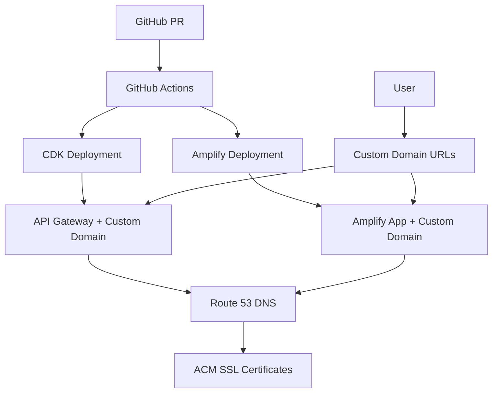

# Custom Domain Deployment Guide

This guide provides step-by-step instructions for deploying and managing custom domains for preview environments.

## Overview

The custom domain feature enables preview environments to use branded subdomains instead of default Amplify URLs:

- **Frontend**: `https://pr-{number}.macro-ai.russoakham.dev`
- **Backend**: `https://pr-{number}-api.macro-ai.russoakham.dev`

## Architecture



## Prerequisites

### 1. Domain Setup

#### Purchase Domain (One-time setup)

1. Purchase domain from GoDaddy or preferred registrar
2. Note the domain name (e.g., `macro-ai.russoakham.dev`)

#### Create Route 53 Hosted Zone (One-time setup)

```bash
# Create hosted zone
aws route53 create-hosted-zone \
  --name macro-ai.russoakham.dev \
  --caller-reference $(date +%s)

# Note the hosted zone ID from the output
```

#### Update Nameservers (One-time setup)

1. Get nameservers from Route 53 hosted zone
2. Update nameservers in domain registrar (GoDaddy)
3. Wait for DNS propagation (up to 48 hours)

### 2. GitHub Repository Configuration

#### Set Repository Variables

Navigate to GitHub repository → Settings → Secrets and variables → Actions → Variables

Add these variables:

```bash
CUSTOM_DOMAIN_NAME=macro-ai.russoakham.dev
HOSTED_ZONE_ID=Z10081873B648ARROPNER
```

#### Verify AWS Permissions

Ensure GitHub Actions has permissions for:

- Route 53 (DNS management)
- ACM (SSL certificates)
- Amplify (domain associations)

## Deployment Process

### Automatic Deployment (Recommended)

1. **Create Pull Request**

   ```bash
   git checkout -b feature/my-feature
   git commit -am "feat: add new feature"
   git push origin feature/my-feature
   # Create PR via GitHub UI
   ```

2. **Monitor Deployment**
   - GitHub Actions workflow starts automatically
   - Backend deploys with custom domain support
   - Frontend deploys to Amplify
   - Custom domain configuration runs automatically

3. **Verify Deployment**
   - Check PR comment for deployment URLs
   - Test custom domain accessibility
   - Verify SSL certificates

### Manual Deployment

#### Deploy Backend with Custom Domain

```bash
cd infrastructure

# Set environment variables
export CUSTOM_DOMAIN_NAME="macro-ai.russoakham.dev"
export HOSTED_ZONE_ID="Z10081873B648ARROPNER"
export ENVIRONMENT="pr-123"

# Deploy CDK stack
npx cdk deploy MacroAiPr-123Stack
```

#### Deploy Frontend with Custom Domain

```bash
cd apps/client-ui

# Build frontend
npm run build

# Deploy to Amplify (manual)
aws amplify create-app --name "macro-ai-frontend-pr-123"

# Configure custom domain
./scripts/configure-amplify-custom-domain.sh \
  --app-id "d1234567890" \
  --domain "pr-123.macro-ai.russoakham.dev" \
  --hosted-zone-id "Z10081873B648ARROPNER" \
  --environment "preview" \
  --branch "feature/my-feature"
```

## Configuration Details

### Environment Variables

| Variable             | Description                    | Example                   |
| -------------------- | ------------------------------ | ------------------------- |
| `CUSTOM_DOMAIN_NAME` | Base domain name               | `macro-ai.russoakham.dev` |
| `HOSTED_ZONE_ID`     | Route 53 hosted zone ID        | `Z10081873B648ARROPNER`   |
| `PR_NUMBER`          | Pull request number (auto-set) | `123`                     |

### URL Patterns

| Environment | Frontend Pattern         | Backend Pattern              |
| ----------- | ------------------------ | ---------------------------- |
| Preview     | `pr-{number}.domain.com` | `pr-{number}-api.domain.com` |
| Staging     | `staging.domain.com`     | `staging-api.domain.com`     |
| Production  | `domain.com`             | `api.domain.com`             |

### SSL Certificate Management

- **Automatic Creation**: SSL certificates are created automatically via ACM
- **Validation**: DNS validation is used (automatic with Route 53)
- **Renewal**: Certificates auto-renew before expiration
- **Cleanup**: Certificates are cleaned up when environments are destroyed

## Monitoring and Troubleshooting

### Health Checks

#### DNS Resolution

```bash
# Test DNS resolution
dig pr-123.macro-ai.russoakham.dev
dig pr-123-api.macro-ai.russoakham.dev

# Expected output: IP addresses of AWS resources
```

#### SSL Certificate Status

```bash
# Check certificate in ACM
aws acm list-certificates --region us-east-1 \
  --query 'CertificateSummaryList[?DomainName==`pr-123.macro-ai.russoakham.dev`]'

# Test SSL connectivity
curl -I https://pr-123.macro-ai.russoakham.dev
```

#### Application Health

```bash
# Test frontend
curl -f https://pr-123.macro-ai.russoakham.dev/health

# Test backend API
curl -f https://pr-123-api.macro-ai.russoakham.dev/api/health
```

### Common Issues and Solutions

#### Issue: DNS Resolution Fails

**Symptoms**: `dig` returns NXDOMAIN or no results

**Solutions**:

1. Verify Route 53 hosted zone configuration
2. Check nameserver propagation
3. Wait for DNS propagation (up to 48 hours)
4. Verify domain spelling and hosted zone ID

#### Issue: SSL Certificate Not Created

**Symptoms**: HTTPS connections fail with certificate errors

**Solutions**:

1. Check Amplify domain association status in AWS console
2. Verify DNS validation records in Route 53
3. Wait for certificate validation (5-10 minutes)
4. Check ACM certificate status

#### Issue: Custom Domain Configuration Fails

**Symptoms**: Deployment falls back to default Amplify URLs

**Solutions**:

1. Check GitHub repository variables are set
2. Verify AWS permissions for Amplify and Route 53
3. Review GitHub Actions logs for error messages
4. Check domain association limits in Amplify

#### Issue: CORS Errors

**Symptoms**: Frontend cannot connect to backend API

**Solutions**:

1. Verify backend CORS configuration includes custom domains
2. Check environment variables are passed to backend
3. Restart backend service to pick up new configuration
4. Test API endpoints directly

### Monitoring Commands

```bash
# Monitor deployment progress
gh run watch

# Check Amplify app status
aws amplify get-app --app-id "d1234567890"

# Monitor domain association
aws amplify get-domain-association \
  --app-id "d1234567890" \
  --domain-name "pr-123.macro-ai.russoakham.dev"

# Check CloudFormation stack status
aws cloudformation describe-stacks \
  --stack-name "MacroAiPr-123Stack"
```

## Cleanup Process

### Automatic Cleanup (Recommended)

When PR is closed/merged:

1. GitHub Actions cleanup workflow runs automatically
2. Amplify domain associations are removed
3. CloudFormation stack is deleted
4. DNS records are cleaned up
5. SSL certificates are removed (if not shared)

### Manual Cleanup

```bash
# Remove Amplify domain association
aws amplify delete-domain-association \
  --app-id "d1234567890" \
  --domain-name "pr-123.macro-ai.russoakham.dev"

# Delete CloudFormation stack
aws cloudformation delete-stack \
  --stack-name "MacroAiPr-123Stack"

# Clean up DNS records (if needed)
aws route53 change-resource-record-sets \
  --hosted-zone-id "Z10081873B648ARROPNER" \
  --change-batch file://delete-records.json
```

## Security Considerations

### SSL/TLS Configuration

- TLS 1.2+ enforced
- Strong cipher suites only
- HSTS headers enabled
- Certificate transparency logging

### Domain Security

- Subdomain isolation
- CORS properly configured
- CSP headers include custom domains
- No wildcard certificates

### Access Control

- Route 53 permissions limited to specific hosted zones
- Amplify permissions scoped to specific apps
- ACM permissions for certificate management only

## Performance Optimization

### DNS Performance

- Use Route 53 for optimal AWS integration
- Configure appropriate TTL values
- Monitor DNS query metrics

### SSL Performance

- Use ACM for automatic certificate management
- Enable OCSP stapling
- Monitor certificate validation times

### CDN Integration

- Amplify includes built-in CDN
- API Gateway has built-in caching
- Monitor CloudFront metrics

## Cost Management

### Resource Costs

- Route 53 hosted zone: $0.50/month
- DNS queries: $0.40 per million queries
- ACM certificates: Free
- Amplify hosting: Based on usage

### Cost Optimization

- Use single hosted zone for all environments
- Share SSL certificates where possible
- Monitor usage with AWS Cost Explorer
- Set up billing alerts

## Best Practices

### Development Workflow

1. Always test custom domain configuration in preview environments
2. Monitor deployment logs for custom domain setup
3. Verify SSL certificates before marking PR as ready
4. Test complete application functionality on custom domains

### Operations

1. Monitor DNS resolution and SSL certificate status
2. Set up alerts for domain association failures
3. Regularly review and clean up unused domain associations
4. Keep documentation updated with current domain patterns

### Security

1. Regularly audit Route 53 permissions
2. Monitor certificate transparency logs
3. Review CORS configuration periodically
4. Test for subdomain takeover vulnerabilities

## Support and Maintenance

### Regular Maintenance Tasks

- [ ] Monthly review of domain associations
- [ ] Quarterly SSL certificate audit
- [ ] Annual DNS configuration review
- [ ] Cost optimization review

### Emergency Procedures

1. **Domain Resolution Issues**: Switch to default Amplify URLs
2. **SSL Certificate Problems**: Use CloudFront distribution
3. **Route 53 Outages**: Implement DNS failover
4. **Complete Custom Domain Failure**: Disable custom domain variables

### Getting Help

- Check GitHub Actions logs for deployment issues
- Review AWS CloudWatch logs for runtime issues
- Use AWS Support for infrastructure problems
- Consult this documentation for configuration questions

This guide provides comprehensive coverage of custom domain deployment and management. Follow these procedures to
ensure reliable and secure custom domain functionality for your preview environments.
