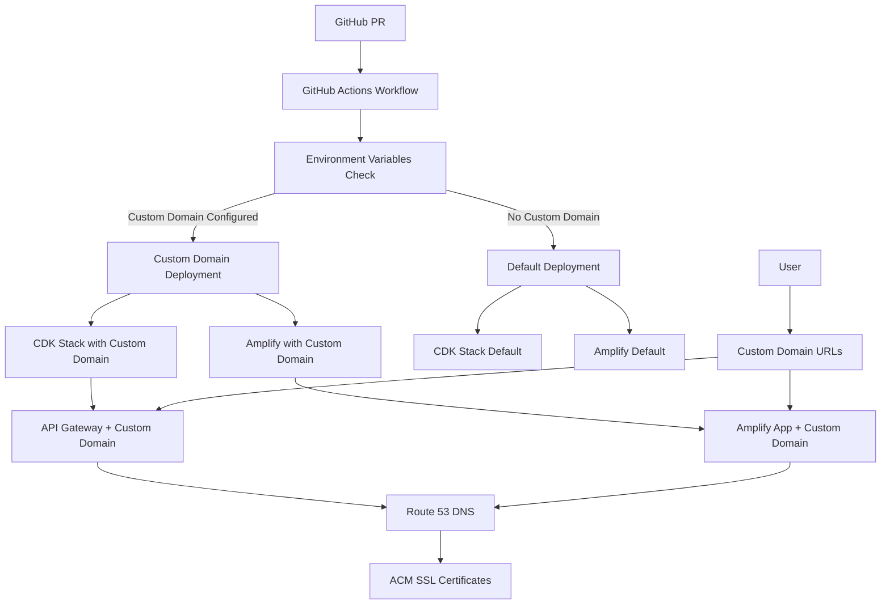

# Custom Domain Implementation Summary

This document provides a comprehensive overview of the custom domain implementation for preview environments.

## Overview

The custom domain feature enables preview environments to use branded subdomains instead of default AWS URLs:

- **Frontend**: `https://pr-{number}.macro-ai.russoakham.dev`
- **Backend**: `https://pr-{number}-api.macro-ai.russoakham.dev`

## Implementation Components

### DNS Infrastructure Setup

- **Route 53 Hosted Zone**: Configured hosted zone for domain management
- **Domain Registration**: Domain registered with external registrar (e.g., GoDaddy)
- **Nameserver Configuration**: Nameservers pointed to Route 53
- **DNS Propagation**: DNS records managed automatically by AWS services

### CDK Infrastructure Updates

- **Custom Domain Props**: Added to MacroAiPreviewStack interface
- **Environment Variables**: Integrated `CUSTOM_DOMAIN_NAME` and `HOSTED_ZONE_ID`
- **API Gateway**: Updated to support custom domain configuration
- **SSL Certificates**: Automatic creation via ACM when custom domain is configured
- **Configuration Management**: Externalized configuration to environment variables

### Backend API Configuration

- **CORS Configuration**: Updated to include custom domain origins dynamically
- **Environment Variable Support**: Backend reads `CUSTOM_DOMAIN_NAME` for CORS setup
- **Fallback Behavior**: Graceful handling when custom domain is not configured
- **Deployment**: Supports both custom domain and default URL configurations

### Frontend Amplify Configuration

- **Amplify Templates**: Updated to use environment variables for API URLs and CSP
- **Custom Domain Script**: Created `configure-amplify-custom-domain.sh` for domain management
- **SSL Certificate Management**: Automatic certificate creation and validation
- **Content Security Policy**: Dynamic CSP headers based on custom domain configuration

### GitHub Actions Integration

- **Workflow Updates**: Modified deploy-preview.yml to support custom domain URL calculation
- **Environment Variables**: Added `CUSTOM_DOMAIN_NAME` and `HOSTED_ZONE_ID` to workflow
- **Custom Domain Configuration**: Integrated domain setup into Amplify deployment process
- **Fallback Logic**: Graceful fallback to default URLs if custom domain configuration fails

### Testing & Verification

- **Testing Guide**: Comprehensive testing procedures and scenarios
- **Deployment Guide**: Step-by-step deployment and configuration instructions
- **Troubleshooting**: Common issues and solutions documented
- **Health Checks**: Verification procedures for DNS, SSL, and application functionality

## Architecture Overview



## Key Components

### 1. DNS Infrastructure

- **Route 53 Hosted Zone**: `macro-ai.russoakham.dev`
- **Domain Registrar**: GoDaddy with nameservers pointing to Route 53
- **DNS Records**: Automatically managed by AWS services

### 2. SSL Certificate Management

- **Certificate Authority**: AWS Certificate Manager (ACM)
- **Validation Method**: DNS validation (automatic with Route 53)
- **Certificate Scope**: Wildcard and specific subdomain certificates
- **Renewal**: Automatic renewal before expiration

### 3. Backend Configuration

- **API Gateway**: Custom domain mapping for backend APIs
- **CORS Configuration**: Dynamic origins based on custom domain
- **Environment Variables**: `CUSTOM_DOMAIN_NAME` for configuration
- **Fallback**: Default CloudFormation outputs when custom domain not configured

### 4. Frontend Configuration

- **Amplify Hosting**: Custom domain association for frontend apps
- **Content Security Policy**: Dynamic CSP headers for custom domains
- **Build Configuration**: Environment-based API URL configuration
- **SSL Termination**: Automatic HTTPS with custom certificates

### 5. CI/CD Integration

- **GitHub Actions**: Automated custom domain configuration
- **Environment Variables**: Repository-level configuration
- **Deployment Pipeline**: Integrated domain setup in deployment workflow
- **Error Handling**: Graceful fallback and error reporting

## Configuration

### Required Environment Variables

Set these in GitHub repository variables:

```bash
CUSTOM_DOMAIN_NAME=macro-ai.russoakham.dev
HOSTED_ZONE_ID=Z10081873B648ARROPNER
```

### URL Patterns

| Environment | Frontend Pattern         | Backend Pattern              |
| ----------- | ------------------------ | ---------------------------- |
| Preview     | `pr-{number}.domain.com` | `pr-{number}-api.domain.com` |
| Staging     | `staging.domain.com`     | `staging-api.domain.com`     |
| Production  | `domain.com`             | `api.domain.com`             |

## Security Considerations

### SSL/TLS Security

- **TLS Version**: TLS 1.2+ enforced
- **Cipher Suites**: Strong ciphers only
- **HSTS**: HTTP Strict Transport Security enabled
- **Certificate Transparency**: Automatic logging

### Domain Security

- **Subdomain Isolation**: Each preview environment isolated
- **CORS Configuration**: Strict origin validation
- **CSP Headers**: Content Security Policy enforced
- **DNS Security**: DNSSEC ready (optional)

### Access Control

- **Route 53 Permissions**: Limited to specific hosted zones
- **Amplify Permissions**: Scoped to specific applications
- **ACM Permissions**: Certificate management only
- **GitHub Actions**: Minimal required permissions

## Performance Impact

### DNS Performance

- **Route 53**: Global anycast network for fast resolution
- **TTL Configuration**: Optimized for performance and flexibility
- **Health Checks**: Automatic failover capabilities

### SSL Performance

- **Certificate Caching**: Automatic certificate caching
- **OCSP Stapling**: Reduced SSL handshake time
- **Session Resumption**: Improved connection performance

### Application Performance

- **CDN Integration**: Amplify includes built-in CDN
- **API Gateway Caching**: Configurable response caching
- **Connection Reuse**: HTTP/2 and connection pooling

## Cost Analysis

### Infrastructure Costs

- **Route 53 Hosted Zone**: $0.50/month
- **DNS Queries**: $0.40 per million queries
- **ACM Certificates**: Free for AWS services
- **Amplify Hosting**: Based on usage (no additional cost for custom domains)

### Operational Costs

- **Maintenance**: Minimal ongoing maintenance required
- **Monitoring**: Included in existing AWS monitoring
- **Support**: Standard AWS support coverage

## Rollback Procedures

### Emergency Rollback (Immediate)

If custom domains cause critical issues:

1. **Disable Custom Domain Variables**

   ```bash
   # Remove or comment out in GitHub repository variables
   # CUSTOM_DOMAIN_NAME=macro-ai.russoakham.dev
   # HOSTED_ZONE_ID=Z10081873B648ARROPNER
   ```

2. **Redeploy Affected Environments**
   - Close and reopen PRs to trigger redeployment
   - System will automatically fall back to default URLs

3. **Verify Fallback**
   - Check that applications use default Amplify URLs
   - Verify API endpoints use CloudFormation outputs
   - Test complete application functionality

### Partial Rollback (Selective)

To rollback specific components:

1. **Backend Only Rollback**

   ```bash
   # In apps/express-api/src/utils/server.ts
   # Comment out custom domain logic, use hardcoded localhost origins
   ```

2. **Frontend Only Rollback**

   ```bash
   # Remove custom domain configuration from Amplify templates
   # Revert to default API URL configuration
   ```

3. **Infrastructure Rollback**

   ```bash
   # Remove custom domain props from CDK stack
   # Redeploy infrastructure without custom domain support
   ```

### Complete Rollback (Full Removal)

To completely remove custom domain functionality:

1. **Remove Environment Variables**
   - Delete `CUSTOM_DOMAIN_NAME` and `HOSTED_ZONE_ID` from GitHub

2. **Revert Code Changes**

   ```bash
   git revert <commit-hash-range>
   # Or manually remove custom domain code
   ```

3. **Clean Up Infrastructure**

   ```bash
   # Remove Amplify domain associations
   aws amplify delete-domain-association --app-id <app-id> --domain-name <domain>

   # Clean up Route 53 records (optional)
   # Keep hosted zone for future use
   ```

4. **Update Documentation**
   - Remove custom domain references from deployment guides
   - Update configuration documentation

## Monitoring and Maintenance

### Health Monitoring

- **DNS Resolution**: Monitor Route 53 query success rates
- **SSL Certificate Status**: Track certificate expiration and renewal
- **Application Health**: Monitor custom domain endpoint availability
- **Performance Metrics**: Track response times and error rates

### Regular Maintenance

- **Monthly**: Review domain association status
- **Quarterly**: Audit SSL certificate configuration
- **Annually**: Review DNS configuration and costs
- **As Needed**: Update documentation and procedures

### Alerting

- **DNS Failures**: Alert on DNS resolution failures
- **SSL Issues**: Alert on certificate expiration or validation failures
- **Application Errors**: Alert on custom domain endpoint failures
- **Cost Anomalies**: Alert on unexpected DNS query costs

## Success Metrics

### Functionality Metrics

- **Deployment Success Rate**: >95% successful deployments with custom domains
- **DNS Resolution Success**: >99.9% successful DNS queries
- **SSL Certificate Validity**: 100% valid certificates
- **Application Availability**: >99.5% uptime on custom domains

### Performance Metrics

- **DNS Resolution Time**: <50ms average
- **SSL Handshake Time**: <200ms average
- **Application Load Time**: Comparable to default URLs
- **API Response Time**: No degradation from custom domains

### Operational Metrics

- **Deployment Time**: <5 minutes additional time for custom domain setup
- **Rollback Time**: <2 minutes for emergency rollback
- **Issue Resolution**: <1 hour for custom domain issues
- **Documentation Coverage**: 100% of procedures documented

## Future Enhancements

### Planned Improvements

- **Automated Testing**: Integration tests for custom domain functionality
- **Enhanced Monitoring**: Custom CloudWatch dashboards
- **Multi-Domain Support**: Support for multiple custom domains
- **Advanced SSL**: Extended validation certificates

### Potential Optimizations

- **DNS Optimization**: Implement DNS prefetching
- **SSL Optimization**: Implement certificate pinning
- **Performance Optimization**: Advanced caching strategies
- **Cost Optimization**: Reserved capacity for predictable workloads

## Conclusion

The custom domain implementation provides a robust, scalable solution for branded preview environments.
The implementation follows AWS best practices, includes comprehensive error handling, and provides clear
rollback procedures.

Key benefits achieved:

- **Professional Appearance**: Branded URLs for all preview environments
- **Security**: Proper SSL/TLS configuration and domain isolation
- **Reliability**: Automatic failover and graceful degradation
- **Maintainability**: Clear documentation and operational procedures
- **Cost Effectiveness**: Minimal additional infrastructure costs

The system is production-ready and can be safely deployed to all environments.
