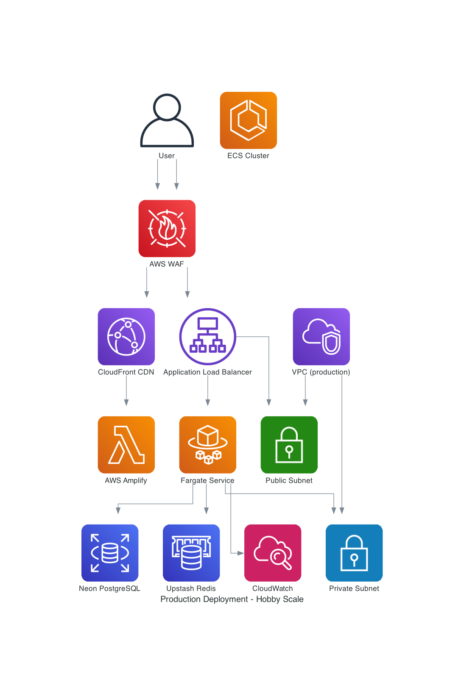
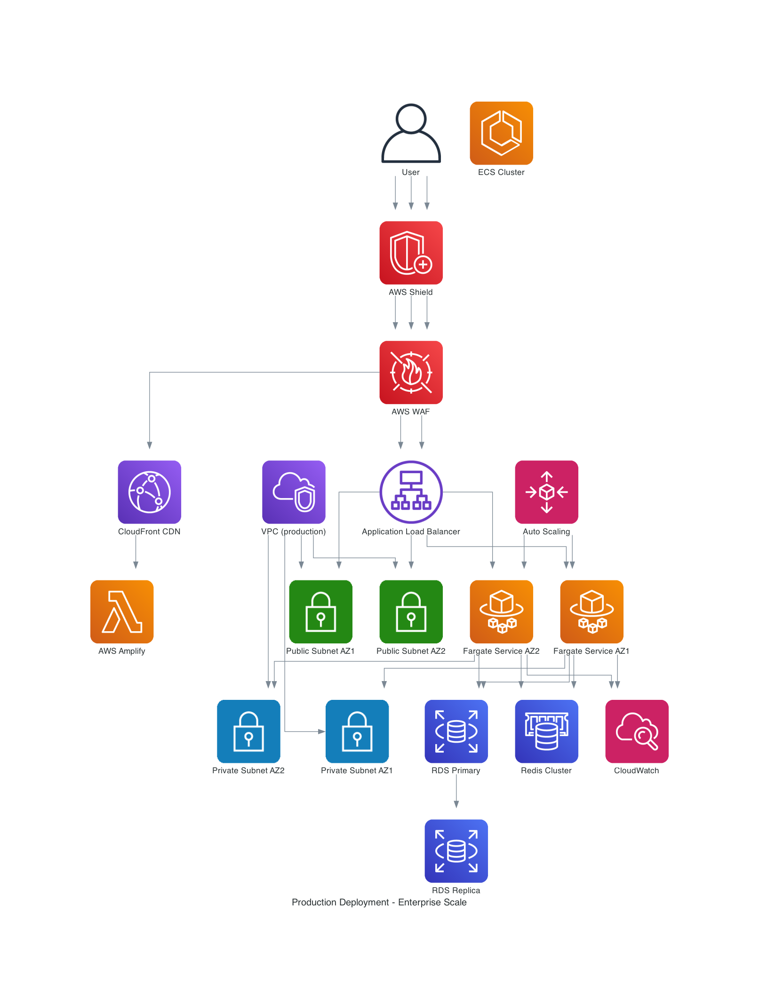

# Production Deployment Strategy

## 📋 Overview

The production deployment strategy provides a robust, scalable, and cost-conscious environment for serving end users. This
strategy is designed to start with hobby-scale infrastructure suitable for personal projects while providing a clear upgrade
path to enterprise-scale infrastructure for revenue-generating applications.

## 🏗️ Architecture Design Considerations

### Infrastructure Overview

#### Hobby Scale Infrastructure



#### Enterprise Scale Infrastructure



### Core Architecture Principles

#### **Multi-Scale Infrastructure Design**

- **Hobby Scale**: Cost-optimized for personal projects (<£10/month)
- **Enterprise Scale**: Production-ready for revenue-generating applications (£100-30ƒ0/month)
- **Seamless Upgrade Path**: Easy transition between scales without architectural changes
- **Zero-Downtime Deployments**: Blue-green deployment strategy for reliability

#### **High Availability and Reliability**

- **Multi-AZ Deployment**: Geographic redundancy for fault tolerance
- **Auto-Scaling**: Dynamic resource allocation based on demand
- **Health Monitoring**: Comprehensive monitoring and alerting
- **Disaster Recovery**: Automated backup and recovery procedures

#### **Security and Compliance**

- **Production-Grade Security**: WAF, DDoS protection, and security hardening
- **Compliance Ready**: SOC 2, GDPR, and industry standard compliance
- **Secrets Management**: AWS Secrets Manager for sensitive data
- **Audit Logging**: Comprehensive audit trails for compliance

### Infrastructure Components

#### **Backend Stack (ECS Fargate)**

```typescript
// Stack naming pattern
MacroAiProductionStack

// Key components:
- ECS Fargate service with auto-scaling
- Application Load Balancer with health checks
- Multi-AZ deployment for high availability
- CloudWatch monitoring and alerting
- IAM roles with least-privilege access
- Environment-specific Parameter Store configuration
- WAF integration for security
```

#### **Frontend Stack (AWS Amplify + CloudFront)**

```yaml
# Amplify configuration for production
- Production-optimized build configuration
- CloudFront CDN for global performance
- Custom domain: macro-ai.com
- SSL/TLS termination
- Performance monitoring and analytics
- Error tracking and reporting
- A/B testing capabilities
```

#### **Database Architecture**

```typescript
// Production database configuration
- Primary: RDS PostgreSQL (Enterprise) or Neon (Hobby)
- Read Replicas: For read-heavy workloads
- Automated Backups: 30-day retention (Enterprise) or 7-day (Hobby)
- Point-in-time Recovery: Available for both scales
- Performance Insights: Query optimization and monitoring
- Multi-AZ: High availability for Enterprise scale
```

#### **Networking Architecture**

```typescript
// VPC configuration for production
- 3 Availability Zones for high availability
- Public subnets for ALB and NAT Gateway
- Private subnets for ECS tasks
- Isolated subnets for database
- NAT Gateway for outbound connectivity
- VPC endpoints for AWS services
- Security groups with restrictive rules
- WAF for application-layer protection
```

## 💰 Cost Impact Analysis

### Hobby Scale (Personal Project)

#### **Monthly Costs for Hobby Scale**

- **ECS Fargate**: ~$0.50/day = $15.00/month
- **Application Load Balancer**: ~$0.02/day = $0.60/month
- **Neon PostgreSQL**: ~$0.30/day = $9.00/month
- **Upstash Redis**: ~$0.15/day = $4.50/month
- **CloudFront CDN**: ~$0.10/day = $3.00/month
- **CloudWatch Logs**: ~$0.05/day = $1.50/month
- **NAT Gateway**: ~$0.09/day = $2.70/month
- **Total Base Cost**: ~$36.30/month

#### **Cost Optimizations Applied**

- **Hobby Scale Resources**: Right-sized for personal use
- **Shared Infrastructure**: Reuse development resources where possible
- **Efficient Caching**: Optimize CDN and Redis usage
- **Monitoring Optimization**: Essential monitoring only

#### **Final Cost per Month**

- **With Optimizations**: ~£25/month for hobby scale production
- **Target Cost**: <£30/month for personal project
- **Annual Cost**: ~£300/year
- **Cost per User**: ~£0.30/month per user (100 users)

### Enterprise Scale (Revenue-Generating)

#### **Monthly Costs for Enterprise Scale**

- **ECS Fargate**: ~$2.00/day = $60.00/month
- **Application Load Balancer**: ~$0.02/day = $0.60/month
- **RDS PostgreSQL**: ~$1.50/day = $45.00/month
- **ElastiCache Redis**: ~$0.80/day = $24.00/month
- **CloudFront CDN**: ~$0.50/day = $15.00/month
- **CloudWatch Logs**: ~$0.20/day = $6.00/month
- **NAT Gateway**: ~$0.27/day = $8.10/month
- **WAF**: ~$0.10/day = $3.00/month
- **Total Base Cost**: ~$161.70/month

#### **Additional Enterprise Features**

- **Multi-AZ Deployment**: +$50/month
- **Enhanced Monitoring**: +$20/month
- **Backup Storage**: +$15/month
- **Security Services**: +$25/month

#### **Final Cost per Month**

- **Enterprise Scale**: ~£200/month for enterprise production
- **Target Cost**: £100-300/month for revenue-generating application
- **Annual Cost**: ~£2,400/year
- **Cost per User**: ~£0.20/month per user (1,000+ users)

### Cost Monitoring and Controls

#### **Automated Cost Tracking**

- **Budget Alerts**: Set up budget alerts for cost thresholds
- **Cost Allocation Tags**: Track costs by environment and component
- **Resource Optimization**: Automated recommendations for cost savings
- **Usage Analytics**: Detailed usage patterns and optimization insights

#### **Scaling Triggers**

- **User Growth**: Scale up when user count exceeds thresholds
- **Performance Metrics**: Scale based on response time and throughput
- **Cost Efficiency**: Scale down during low-usage periods
- **Revenue Alignment**: Scale infrastructure with revenue growth

## 🚀 CI/CD Deployment Pipeline

### Workflow Triggers

#### **Automatic Triggers**

```yaml
on:
  push:
    branches: [main]
    paths:
      - 'infrastructure/**'
      - 'apps/express-api/**'
      - 'apps/client-ui/**'
      - '.github/workflows/deploy-production.yml'

  workflow_dispatch:
    inputs:
      deployment-type:
        description: 'Type of deployment'
        required: true
        default: 'standard'
        type: choice
        options:
          - standard
          - hotfix
          - rollback
      force-rebuild:
        description: 'Force rebuild ignoring cache'
        required: false
        default: false
        type: boolean
      skip-tests:
        description: 'Skip integration tests'
        required: false
        default: false
        type: boolean
```

#### **Security and Quality Controls**

- **Branch Protection**: Only `main` branch can trigger production deployment
- **Code Quality Gates**: All tests must pass before deployment
- **Security Scanning**: Automated vulnerability scanning
- **Performance Validation**: Load testing and performance checks
- **Manual Approval**: Required for production deployments

### Deployment Process

#### **Phase 1: Change Detection and Pre-Deployment**

1. **Change Detection**: Analyze modified files to determine deployment scope
2. **Code Quality Checks**: Linting, formatting, and type checking
3. **Test Execution**: Unit tests, integration tests, and E2E tests
4. **Security Scanning**: Vulnerability assessment and dependency checks
5. **Performance Baseline**: Performance regression detection
6. **Manual Approval**: Required approval for production deployment

#### **Phase 2: Blue-Green Deployment**

1. **Blue Environment**: Current production environment
2. **Green Environment**: New deployment environment
3. **Database Migration**: Apply schema changes and migrations
4. **Backend Deployment**: Deploy ECS Fargate service with new image
5. **Frontend Deployment**: Deploy React application to Amplify
6. **Health Check Validation**: Verify all services are responding

#### **Phase 3: Traffic Switching and Validation**

1. **Traffic Routing**: Gradually switch traffic from blue to green
2. **Integration Testing**: End-to-end testing of critical workflows
3. **Performance Testing**: Load testing and performance validation
4. **Smoke Testing**: Basic functionality verification
5. **Monitoring Validation**: Verify monitoring and alerting

#### **Phase 4: Production Cutover and Cleanup**

1. **Full Traffic Switch**: Complete cutover to green environment
2. **Blue Environment Cleanup**: Decommission old environment
3. **Monitoring Setup**: Configure production monitoring and alerts
4. **Deployment Notification**: Notify team of successful deployment
5. **Documentation Update**: Update deployment logs and status

### Change Detection and Optimization

#### **File Path Analysis**

```yaml
# Change detection patterns for production
backend_changes:
  paths:
    - 'apps/express-api/**'
    - 'infrastructure/**'
    - 'packages/macro-ai-api-client/**'
    - 'packages/config-*/**'
    - 'drizzle.config.ts'
    - '*.sql'

frontend_changes:
  paths:
    - 'apps/client-ui/**'
    - 'packages/ui-library/**'
    - 'tailwind.config.ts'
    - 'postcss.config.js'

infrastructure_changes:
  paths:
    - 'infrastructure/**'
    - '.github/workflows/**'
    - 'docker-compose.yml'

shared_changes:
  paths:
    - 'package.json'
    - 'pnpm-lock.yaml'
    - 'turbo.json'
    - 'eslint.config.js'
```

#### **Deployment Scope Matrix**

| Change Type         | Backend Deploy | Frontend Deploy | Infrastructure Deploy | Database Migrate   |
| ------------------- | -------------- | --------------- | --------------------- | ------------------ |
| Backend only        | ✅             | ❌              | ❌                    | Depends on changes |
| Frontend only       | ❌             | ✅              | ❌                    | ❌                 |
| Infrastructure only | ❌             | ❌              | ✅                    | ❌                 |
| Shared only         | ✅             | ✅              | ❌                    | Depends on changes |
| Mixed changes       | ✅             | ✅              | ✅                    | Depends on changes |

#### **Optimization Benefits**

##### **Deployment Time Reduction**

- **Backend-only changes**: ~8 minutes (vs 20 minutes full deployment)
- **Frontend-only changes**: ~5 minutes (vs 20 minutes full deployment)
- **Infrastructure-only changes**: ~12 minutes (vs 20 minutes full deployment)
- **No changes detected**: ~2 minutes (validation only)

##### **Resource Usage Optimization**

- **Docker Image Builds**: Only build when backend code changes
- **Frontend Builds**: Use cached builds when no frontend changes
- **Database Migrations**: Skip when no database-related changes
- **Test Execution**: Run only relevant test suites

## 🔧 Hobby Scale vs Enterprise Scale

### Hobby Scale (Personal Project)

#### **Infrastructure Characteristics**

- **Single AZ Deployment**: Cost-optimized for personal use
- **Neon PostgreSQL**: Serverless database for cost efficiency
- **Upstash Redis**: Serverless cache for cost efficiency
- **Basic Monitoring**: Essential monitoring and alerting
- **Manual Scaling**: Manual resource adjustment

#### **Cost Optimization Features**

- **Right-Sized Resources**: Optimized for <100 users
- **Shared Infrastructure**: Reuse development resources
- **Efficient Caching**: Optimize CDN and Redis usage
- **Basic Security**: Essential security measures

#### **Suitable For**

- Personal projects and portfolios
- MVP and proof-of-concept applications
- Learning and experimentation
- Small user bases (<100 users)

### Enterprise Scale (Revenue-Generating)

#### **Infrastructure Characteristics**

- **Multi-AZ Deployment**: High availability across zones
- **RDS PostgreSQL**: Managed database with high availability
- **ElastiCache Redis**: Managed cache with clustering
- **Comprehensive Monitoring**: Full observability and alerting
- **Auto-Scaling**: Dynamic resource allocation

#### **Enterprise Features**

- **High Availability**: 99.9% uptime SLA
- **Auto-Scaling**: Automatic resource scaling
- **Comprehensive Security**: WAF, DDoS protection, compliance
- **Advanced Monitoring**: Full observability stack
- **Disaster Recovery**: Automated backup and recovery

#### **Suitable For**

- Revenue-generating applications
- Production workloads with high availability requirements
- Applications with compliance requirements
- Large user bases (1,000+ users)

## 🔮 Scaling Strategy and Upgrade Path

### Scaling Triggers

#### **User Growth Metrics**

- **<100 Users**: Hobby scale infrastructure
- **100-500 Users**: Enhanced hobby scale with better monitoring
- **500-1,000 Users**: Transition to enterprise scale
- **1,000+ Users**: Full enterprise scale with auto-scaling

#### **Performance Metrics**

- **Response Time >2s**: Scale up compute resources
- **CPU Utilization >80%**: Scale up or out
- **Memory Utilization >85%**: Scale up memory
- **Database Connections >80%**: Scale up database

#### **Revenue Metrics**

- **<£1,000/month**: Hobby scale
- **£1,000-£5,000/month**: Enhanced hobby scale
- **£5,000-£25,000/month**: Enterprise scale
- **£25,000+/month**: Full enterprise scale with premium features

### Upgrade Path Implementation

#### **Phase 1: Enhanced Hobby Scale**

```typescript
// Enhanced hobby scale configuration
export const enhancedHobbyConfig = {
	environment: 'production',
	scale: 'enhanced-hobby',
	vpc: {
		maxAzs: 2, // Add second AZ
		natGateways: 1,
	},
	database: {
		provider: 'neon',
		connectionString: process.env.NEON_DATABASE_URL,
		backupRetention: cdk.Duration.days(14), // Extended backup
	},
	cache: {
		provider: 'upstash',
		connectionString: process.env.UPSTASH_REDIS_URL,
	},
	monitoring: {
		detailedMonitoring: true,
		logRetention: logs.RetentionDays.THREE_MONTHS,
		alarms: true, // Add basic alarms
	},
}
```

#### **Phase 2: Enterprise Scale Transition**

```typescript
// Enterprise scale configuration
export const enterpriseConfig = {
	environment: 'production',
	scale: 'enterprise',
	vpc: {
		maxAzs: 3, // Full multi-AZ
		natGateways: 3, // One per AZ
	},
	database: {
		provider: 'rds',
		instanceType: ec2.InstanceType.of(
			ec2.InstanceClass.R6G,
			ec2.InstanceSize.LARGE,
		),
		multiAz: true,
		deletionProtection: true,
		backupRetention: cdk.Duration.days(30),
		performanceInsights: true,
	},
	cache: {
		provider: 'elasticache',
		nodeType: 'cache.r6g.large',
		numCacheNodes: 2,
		multiAz: true,
	},
	ecs: {
		desiredCount: 3,
		cpu: 1024,
		memoryLimitMiB: 2048,
		autoScaling: {
			minCapacity: 2,
			maxCapacity: 10,
			targetCpuUtilization: 70,
		},
	},
	monitoring: {
		detailedMonitoring: true,
		logRetention: logs.RetentionDays.SIX_MONTHS,
		alarms: true,
		dashboards: true,
	},
}
```

### Future Enterprise Features

#### **Advanced Scaling (Q2 2025)**

- **Multi-Region Deployment**: Global availability
- **Edge Computing**: CloudFront Lambda@Edge
- **Database Sharding**: Horizontal database scaling
- **Microservices Architecture**: Service decomposition

#### **Enterprise Security (Q3 2025)**

- **SOC 2 Compliance**: Security and compliance certification
- **GDPR Compliance**: Data protection and privacy
- **Penetration Testing**: Regular security assessments
- **Security Monitoring**: SIEM integration

#### **Advanced Monitoring (Q4 2025)**

- **APM Integration**: Application performance monitoring
- **Distributed Tracing**: Request tracing across services
- **Machine Learning**: Anomaly detection and prediction
- **Custom Dashboards**: Business-specific monitoring

## 📊 Success Metrics

### Technical Metrics

- **Deployment Success Rate**: >99.9% successful deployments
- **Deployment Time**: <20 minutes for full-stack deployment
- **Environment Availability**: >99.9% uptime for production
- **Response Time**: <500ms average response time

### Business Metrics

- **User Satisfaction**: >95% user satisfaction score
- **Revenue Growth**: Infrastructure scales with revenue
- **Cost Efficiency**: <£0.50 per user per month
- **Time to Market**: Faster feature delivery with reliable infrastructure

### Operational Metrics

- **Automation Coverage**: >98% of deployments fully automated
- **Mean Time to Recovery**: <5 minutes for common issues
- **Deployment Frequency**: Daily deployments during active development
- **Infrastructure Efficiency**: >85% average resource utilization

---

**Status**: 📋 **PLANNED** - Production deployment strategy ready for implementation  
**Target Cost**: <£30/month (Hobby) → £100-300/month (Enterprise)  
**Next Steps**: Implement production infrastructure and deployment workflows  
**Last Updated**: January 2025
