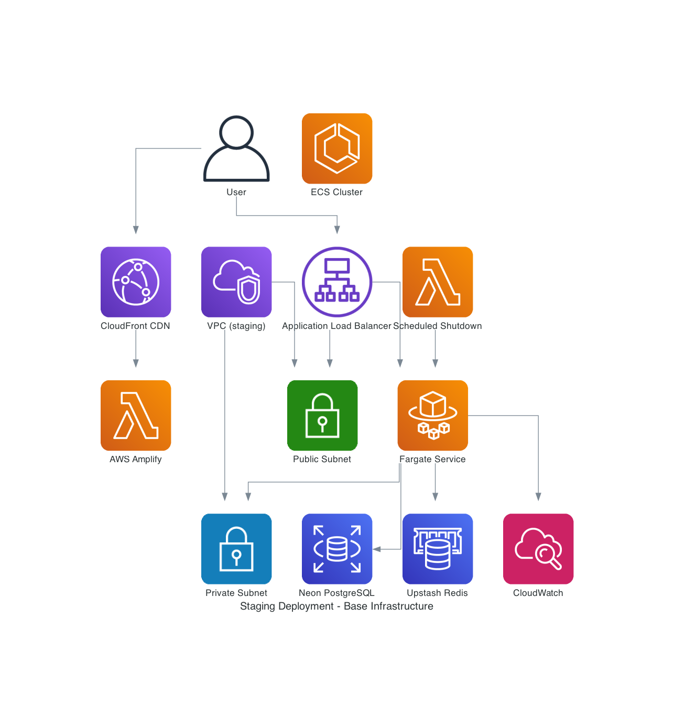

# Staging Deployment Strategy

## 📋 Overview

The staging deployment strategy provides a persistent, production-like environment for integration testing and validation
before production releases. This environment serves as the final validation gate for features merged from the `develop`
branch, offering improved reliability and performance compared to ephemeral preview environments while maintaining cost
consciousness for personal projects.

## 🏗️ Architecture Design Considerations

### Infrastructure Overview



### Core Architecture Principles

#### **Persistent Environment with Scheduled Lifecycle**

- Single persistent staging environment: `staging`
- Automatic deployment on merge to `develop` branch
- Scheduled teardown at 6 PM daily for cost optimization
- On-demand deployment workflow for immediate access
- Production-like configuration at hobby scale

#### **Enhanced Infrastructure Over Preview**

- **Dedicated Database**: Separate staging database (not shared with development)
- **Enhanced Monitoring**: Production-level monitoring and alerting
- **Performance Testing**: Load testing capabilities and performance validation
- **Security Hardening**: Production-like security configurations
- **Data Persistence**: Retained data between deployments for testing continuity

#### **Cost-Conscious Design for Personal Projects**

- **Hobby Scale Infrastructure**: Optimized for <£5/month target cost
- **Scheduled Shutdown**: 6 PM daily teardown (~75% cost reduction)
- **Shared Resources**: Reuse development Parameter Store where appropriate
- **Efficient Resource Allocation**: Right-sized instances for staging workloads
- **Automated Cleanup**: Automatic resource cleanup and optimization

### Infrastructure Components

#### **Backend Stack (ECS Fargate)**

```typescript
// Stack naming pattern
MacroAiStagingStack

// Key components:
- ECS Fargate service with auto-scaling
- Application Load Balancer with health checks
- Dedicated staging database (Neon PostgreSQL)
- Redis cache for session management
- CloudWatch monitoring and alerting
- IAM roles with staging-specific permissions
- Environment-specific Parameter Store configuration
```

#### **Frontend Stack (AWS Amplify)**

```yaml
# Amplify configuration for staging
- Production-like build configuration
- Staging-specific environment variables
- Backend API integration with staging endpoints
- Custom domain: staging.macro-ai.com
- Performance monitoring and analytics
- Error tracking and reporting
```

#### **Database Architecture**

```typescript
// Staging database configuration
- Dedicated Neon PostgreSQL instance
- Staging-specific schema and data
- Automated backups (7-day retention)
- Connection pooling for performance
- Read replicas for testing (optional)
- Data seeding for consistent testing
```

#### **Networking Architecture**

```typescript
// VPC configuration for staging
- 2 Availability Zones for high availability
- Public subnets for ALB
- Private subnets for ECS tasks
- NAT Gateway for outbound connectivity
- VPC endpoints for AWS services (cost optimization)
- Security groups with staging-specific rules
```

## 💰 Cost Impact Analysis

### Current Cost Structure

#### **Monthly Costs for Staging Environment**

- **ECS Fargate**: ~$0.30/day = $9.00/month
- **Application Load Balancer**: ~$0.02/day = $0.60/month
- **Neon PostgreSQL**: ~$0.20/day = $6.00/month
- **Redis Cache**: ~$0.10/day = $3.00/month
- **CloudWatch Logs**: ~$0.05/day = $1.50/month
- **NAT Gateway**: ~$0.09/day = $2.70/month
- **Total Base Cost**: ~$22.80/month

#### **Cost Optimizations Applied**

- **Scheduled Shutdown (75% reduction)**: $17.10/month savings
- **Hobby Scale Resources**: $5.00/month savings
- **Shared Parameter Store**: $0.50/month savings
- **VPC Endpoints Optimization**: $1.00/month savings

#### **Final Cost per Month**

- **With Optimizations**: ~$5.70/month for staging environment
- **Daily Operating Cost**: ~$0.19/day (6 PM shutdown)
- **Annual Cost**: ~$68.40/year
- **Cost per Deployment**: ~$0.10 per deployment

### Cost Monitoring and Controls

#### **Automated Cost Tracking**

- Daily cost reports via CloudWatch
- Budget alerts for unexpected usage spikes
- Resource utilization monitoring
- Cost per deployment tracking

#### **Scheduled Lifecycle Management**

- **Daily Shutdown**: 6:00 PM UTC (2:00 PM EST, 11:00 AM PST)
- **On-Demand Startup**: Manual trigger via GitHub Actions
- **Weekend Shutdown**: Extended shutdown for weekends
- **Holiday Shutdown**: Automatic shutdown during holidays

## 🚀 CI/CD Deployment Pipeline

### Workflow Triggers

#### **Automatic Triggers**

```yaml
on:
  push:
    branches: [develop]
    paths:
      - 'infrastructure/**'
      - 'apps/express-api/**'
      - 'apps/client-ui/**'
      - '.github/workflows/deploy-staging.yml'

  workflow_dispatch:
    inputs:
      force-rebuild:
        description: 'Force rebuild ignoring cache'
        required: false
        default: false
        type: boolean
      skip-tests:
        description: 'Skip integration tests'
        required: false
        default: false
        type: boolean
```

#### **Security and Quality Controls**

- **Branch Protection**: Only `develop` branch can trigger staging deployment
- **Code Quality Gates**: All tests must pass before deployment
- **Security Scanning**: Automated vulnerability scanning
- **Performance Validation**: Load testing and performance checks

### Deployment Process

#### **Phase 1: Change Detection and Validation**

1. **Change Detection**: Analyze modified files to determine deployment scope
   - **Backend Changes**: `apps/express-api/**`, `infrastructure/**`, `packages/**`
   - **Frontend Changes**: `apps/client-ui/**`, `packages/ui-library/**`
   - **Infrastructure Changes**: `infrastructure/**`, `.github/workflows/**`
   - **Shared Changes**: `packages/config-*/**`, `turbo.json`, `package.json`
2. **Deployment Scope Decision**: Determine which components need deployment
3. **Code Quality Checks**: Linting, formatting, and type checking (only for changed components)
4. **Test Execution**: Run relevant tests based on changes detected
5. **Security Scanning**: Vulnerability assessment for changed dependencies

#### **Phase 2: Optimized Infrastructure Deployment**

1. **Database Migration**: Apply schema changes only if database-related changes detected
2. **Backend Deployment**: Deploy ECS Fargate service only if backend changes detected
   - **Image Build**: Build new Docker image only if backend code changed
   - **Service Update**: Update ECS service only if image or configuration changed
3. **Frontend Deployment**: Deploy React application only if frontend changes detected
   - **Build Optimization**: Use cached builds when possible
   - **Asset Optimization**: Only rebuild changed assets
4. **Configuration Update**: Apply environment variables only if configuration changed

#### **Phase 3: Conditional Integration and Validation**

1. **Health Check Validation**: Verify all services are responding
2. **Targeted Testing**: Run tests based on deployment scope
   - **Backend-only changes**: API tests and backend integration tests
   - **Frontend-only changes**: UI tests and frontend integration tests
   - **Full deployment**: Complete end-to-end testing
3. **Performance Testing**: Load testing only for performance-critical changes
4. **Smoke Testing**: Basic functionality verification for all deployments

#### **Phase 4: Monitoring and Reporting**

1. **Monitoring Setup**: Configure alerts and dashboards
2. **Deployment Notification**: Notify team of deployment scope and results
3. **Documentation Update**: Update deployment logs and status
4. **Cleanup Scheduling**: Set up next day's shutdown schedule

### On-Demand Deployment Workflow

#### **Manual Deployment Trigger**

```yaml
# GitHub Actions workflow dispatch
workflow_dispatch:
  inputs:
    environment:
      description: 'Environment to deploy'
      required: true
      default: 'staging'
      type: choice
      options:
        - staging
    deployment-type:
      description: 'Type of deployment'
      required: true
      default: 'full'
      type: choice
      options:
        - full
        - backend-only
        - frontend-only
    skip-tests:
      description: 'Skip integration tests'
      required: false
      default: false
      type: boolean
```

#### **Emergency Deployment Process**

1. **Immediate Startup**: Bypass scheduled shutdown for urgent deployments
2. **Fast-Track Validation**: Reduced test suite for critical fixes
3. **Rollback Capability**: Quick rollback to previous version if needed
4. **Notification System**: Alert team of emergency deployment

## ⚡ Change Detection and Optimization

### Change Detection Strategy

#### **File Path Analysis**

```yaml
# Change detection patterns
backend_changes:
  paths:
    - 'apps/express-api/**'
    - 'infrastructure/**'
    - 'packages/macro-ai-api-client/**'
    - 'packages/config-*/**'
    - 'drizzle.config.ts'
    - '*.sql'

frontend_changes:
  paths:
    - 'apps/client-ui/**'
    - 'packages/ui-library/**'
    - 'tailwind.config.ts'
    - 'postcss.config.js'

infrastructure_changes:
  paths:
    - 'infrastructure/**'
    - '.github/workflows/**'
    - 'docker-compose.yml'

shared_changes:
  paths:
    - 'package.json'
    - 'pnpm-lock.yaml'
    - 'turbo.json'
    - 'eslint.config.js'
```

#### **Deployment Scope Matrix**

| Change Type         | Backend Deploy | Frontend Deploy | Infrastructure Deploy | Database Migrate   |
| ------------------- | -------------- | --------------- | --------------------- | ------------------ |
| Backend only        | ✅             | ❌              | ❌                    | Depends on changes |
| Frontend only       | ❌             | ✅              | ❌                    | ❌                 |
| Infrastructure only | ❌             | ❌              | ✅                    | ❌                 |
| Shared only         | ✅             | ✅              | ❌                    | ❌                 |
| Mixed changes       | ✅             | ✅              | ✅                    | Depends on changes |

#### **Optimization Benefits**

##### **Deployment Time Reduction**

- **Backend-only changes**: ~5 minutes (vs 15 minutes full deployment)
- **Frontend-only changes**: ~3 minutes (vs 15 minutes full deployment)
- **Infrastructure-only changes**: ~8 minutes (vs 15 minutes full deployment)
- **No changes detected**: ~1 minute (validation only)

##### **Resource Usage Optimization**

- **Docker Image Builds**: Only build when backend code changes
- **Frontend Builds**: Use cached builds when no frontend changes
- **Database Migrations**: Skip when no database-related changes
- **Test Execution**: Run only relevant test suites

##### **Cost Optimization**

- **Reduced Compute Time**: 60-80% reduction in deployment compute costs
- **Faster Feedback**: Quicker deployment feedback for developers
- **Resource Efficiency**: Better utilization of CI/CD resources
- **Cache Utilization**: Improved build cache hit rates

### Implementation Details

#### **GitHub Actions Change Detection**

```yaml
- name: Detect changes
  id: changes
  uses: dorny/paths-filter@v2
  with:
    filters: |
      backend:
        - 'apps/express-api/**'
        - 'infrastructure/**'
        - 'packages/macro-ai-api-client/**'
      frontend:
        - 'apps/client-ui/**'
        - 'packages/ui-library/**'
      infrastructure:
        - 'infrastructure/**'
        - '.github/workflows/**'
      shared:
        - 'package.json'
        - 'pnpm-lock.yaml'
        - 'turbo.json'
```

#### **Conditional Job Execution**

```yaml
deploy-backend:
  if: steps.changes.outputs.backend == 'true' || steps.changes.outputs.shared == 'true'
  needs: [detect-changes]
  steps:
    - name: Deploy backend only
      # Backend deployment steps

deploy-frontend:
  if: steps.changes.outputs.frontend == 'true' || steps.changes.outputs.shared == 'true'
  needs: [detect-changes]
  steps:
    - name: Deploy frontend only
      # Frontend deployment steps
```

#### **Build Cache Optimization**

```yaml
- name: Cache Docker layers
  uses: actions/cache@v3
  with:
    path: /tmp/.buildx-cache
    key: ${{ runner.os }}-buildx-${{ github.sha }}
    restore-keys: |
      ${{ runner.os }}-buildx-

- name: Cache pnpm dependencies
  uses: actions/cache@v3
  with:
    path: |
      ~/.pnpm-store
      node_modules
    key: ${{ runner.os }}-pnpm-${{ hashFiles('**/pnpm-lock.yaml') }}
    restore-keys: |
      ${{ runner.os }}-pnpm-
```

## 🔧 Improvements Over Preview Environment

### Enhanced Reliability

#### **Persistent Data and State**

- **Database Persistence**: Retained data between deployments for testing continuity
- **Session Management**: Persistent user sessions and authentication state
- **File Storage**: Persistent file uploads and generated content
- **Cache Persistence**: Redis cache maintains data across deployments

#### **Production-Like Configuration**

- **Environment Variables**: Production-identical configuration
- **Security Settings**: Production-level security hardening
- **Performance Tuning**: Optimized for production workloads
- **Monitoring**: Comprehensive monitoring and alerting

### Advanced Testing Capabilities

#### **Integration Testing**

- **End-to-End Testing**: Full workflow testing with real data
- **API Testing**: Comprehensive API endpoint validation
- **Database Testing**: Schema and data integrity validation
- **Performance Testing**: Load testing and performance benchmarking

#### **User Acceptance Testing**

- **Manual Testing**: Human validation of new features
- **User Workflow Testing**: Complete user journey validation
- **Accessibility Testing**: WCAG compliance validation
- **Cross-Browser Testing**: Multi-browser compatibility testing

### Enhanced Monitoring and Observability

#### **Production-Level Monitoring**

- **Application Metrics**: Custom application performance metrics
- **Infrastructure Metrics**: Resource utilization and health monitoring
- **Error Tracking**: Comprehensive error logging and alerting
- **Performance Monitoring**: Response time and throughput tracking

#### **Alerting and Notifications**

- **Health Check Alerts**: Immediate notification of service failures
- **Performance Alerts**: Notification of performance degradation
- **Cost Alerts**: Budget and cost threshold notifications
- **Security Alerts**: Security incident and vulnerability notifications

## 🔮 Future Improvements as Business Needs Grow

### Short-term Enhancements (Q1 2025)

#### **Advanced Testing Infrastructure**

- **Automated Testing**: Comprehensive test automation suite
- **Performance Benchmarking**: Automated performance regression testing
- **Security Testing**: Automated security vulnerability scanning
- **Compliance Testing**: Automated compliance validation

#### **Enhanced Monitoring**

- **Real-time Dashboards**: Live monitoring dashboards
- **Predictive Alerting**: ML-based anomaly detection
- **Cost Optimization**: Automated resource optimization
- **Performance Analytics**: Detailed performance analysis

### Medium-term Scaling (Q2-Q3 2025)

#### **Multi-Environment Support**

- **Feature Branch Staging**: Staging environments for feature branches
- **Environment Templates**: Reusable environment configurations
- **Environment Promotion**: Automated promotion between environments
- **Environment Cloning**: Quick environment duplication for testing

#### **Advanced Deployment Strategies**

- **Blue-Green Deployment**: Zero-downtime deployment strategy
- **Canary Deployment**: Gradual rollout with monitoring
- **Rollback Automation**: Automated rollback on failure detection
- **Deployment Validation**: Automated deployment success validation

### Long-term Evolution (Q4 2025+)

#### **Enterprise Features**

- **Multi-Tenant Support**: Support for multiple staging environments
- **Team-based Access**: Role-based access control for staging
- **Environment Quotas**: Resource limits per team or project
- **Audit Logging**: Comprehensive audit trails for compliance

#### **Advanced Automation**

- **Self-Healing Infrastructure**: Automatic recovery from failures
- **Intelligent Scaling**: AI-driven resource scaling
- **Predictive Maintenance**: Proactive infrastructure maintenance
- **Automated Optimization**: Continuous cost and performance optimization

## 📊 Success Metrics

### Technical Metrics

- **Deployment Success Rate**: >99.5% successful deployments
- **Deployment Time**: <15 minutes for full-stack deployment
- **Environment Availability**: >99.9% uptime during business hours
- **Test Coverage**: >95% code coverage in staging tests

### Business Metrics

- **Feature Validation**: 100% of features tested in staging before production
- **Bug Detection**: >90% of production bugs caught in staging
- **Deployment Confidence**: Reduced production deployment anxiety
- **Development Velocity**: Faster feature delivery with reliable staging

### Cost Metrics

- **Monthly Cost**: <£5/month for staging environment
- **Cost per Deployment**: <£0.10 per deployment
- **Resource Efficiency**: >80% average resource utilization
- **Cost Optimization**: 75% cost reduction through scheduled shutdown

### Operational Metrics

- **Automation Coverage**: >95% of deployments fully automated
- **Mean Time to Recovery**: <10 minutes for common issues
- **Deployment Frequency**: Daily deployments during active development
- **Environment Lifecycle**: 100% automated lifecycle management

---

**Status**: 📋 **PLANNED** - Staging deployment strategy ready for implementation  
**Target Cost**: <£5/month with scheduled shutdown  
**Next Steps**: Implement staging infrastructure and deployment workflows  
**Last Updated**: January 2025
