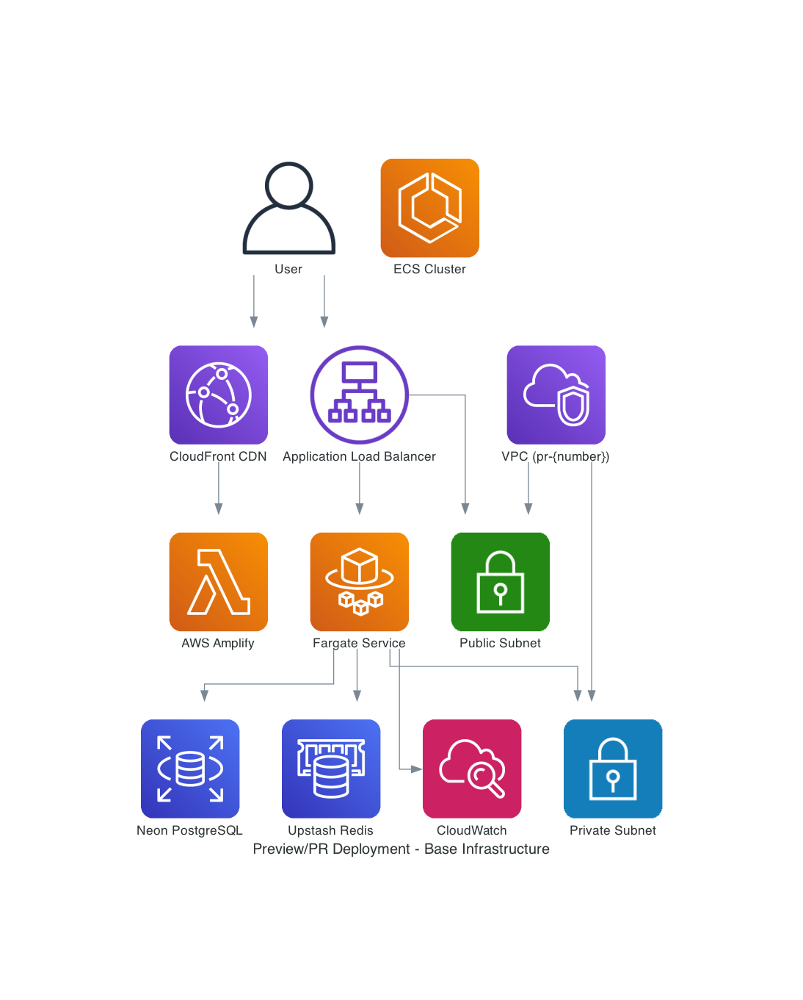

# Preview/PR Deployment Strategy

## 📋 Overview

The preview/PR deployment strategy provides ephemeral, isolated environments for every pull request, enabling safe testing
and collaboration without impacting shared environments. This system automatically creates full-stack preview environments
that include both backend API and frontend UI components.

## 🏗️ Architecture Design Considerations

### Infrastructure Overview



### Core Architecture Principles

#### **Ephemeral Environment Isolation**

- Each PR gets a unique environment namespace: `pr-{number}`
- Complete infrastructure isolation using Pulumi stacks
- Automatic cleanup when PRs are closed or merged
- No shared resources between preview environments

#### **Full-Stack Deployment**

- **Backend**: ECS Fargate-based API deployment with auto-scaling
- **Frontend**: AWS Amplify-hosted React application
- **Database**: Shared development database with read-only access for cost optimization
- **Networking**: Isolated VPC with Application Load Balancer

#### **Cost-Optimized Infrastructure**

- **NAT Gateway Elimination**: Saves ~$2.76/month per environment
- **VPC Endpoints Removal**: Additional cost savings for preview environments
- **Auto-Shutdown Scheduling**: 10 PM UTC daily shutdown (~68% cost reduction)
- **Shared Parameter Store**: Reuses development parameters instead of creating new ones
- **Target Cost**: <$0.50/month per preview environment

### Infrastructure Components

#### **Backend Stack (ECS Fargate)**

```typescript
// Stack naming pattern
MacroAiPr{number}Stack

// Key components:
- ECS Fargate service with auto-scaling
- Application Load Balancer with health checks
- CloudWatch logging and monitoring
- IAM roles and policies for secure access
- Environment-specific configuration via Parameter Store
```

#### **Frontend Stack (AWS Amplify)**

```yaml
# Amplify configuration
- Automatic build and deployment
- Environment variable injection
- Backend API discovery and connection
- Custom domain support (optional)
- Build optimization and caching
```

#### **Networking Architecture**

```typescript
// VPC configuration for preview environments
- 2 Availability Zones (minimum for ALB)
- Public subnets for ALB
- Private subnets for ECS tasks
- No NAT Gateway (cost optimization)
- No VPC endpoints (cost optimization)
- Flow logs disabled (cost optimization)
```

## 💰 Cost Impact Analysis

### Current Cost Structure

#### **Monthly Costs per Preview Environment**

- **ECS Fargate**: ~$0.20/day = $6.00/month
- **Application Load Balancer**: ~$0.02/day = $0.60/month
- **CloudWatch Logs**: ~$0.01/day = $0.30/month
- **Total Base Cost**: ~$6.90/month

#### **Cost Optimizations Applied**

- **Auto-Shutdown (68% reduction)**: $4.69/month savings
- **NAT Gateway Elimination**: $2.76/month savings
- **VPC Endpoints Removal**: $0.50/month savings
- **Shared Parameter Store**: $0.20/month savings

#### **Final Cost per Environment**

- **With Optimizations**: ~$0.50/month per preview environment
- **Annual Savings**: ~$77 per environment
- **Break-even Point**: 2+ active PRs per month

### Cost Monitoring and Controls

#### **Automated Cost Tracking**

- CloudWatch cost anomaly detection
- Daily cost reports via Lambda functions
- Budget alerts for unexpected usage spikes
- Resource tagging for cost allocation

#### **Resource Lifecycle Management**

- Automatic cleanup on PR closure
- 7-day retention policy for closed environments
- Manual cleanup triggers for abandoned PRs
- Cost impact reporting in PR comments

## 🚀 CI/CD Deployment Pipeline

### Workflow Triggers

#### **Automatic Triggers**

```yaml
on:
  pull_request:
    types: [opened, reopened, synchronize]
    branches: [develop, main]
    paths:
      - 'infrastructure/**'
      - 'apps/express-api/**'
      - 'apps/client-ui/**'
      - '.github/workflows/deploy-preview.yml'
```

#### **Security Controls**

- **Code Owner Validation**: Only code owners can trigger deployments
- **Repository Validation**: Only same-repo PRs are allowed
- **Path-based Filtering**: Only relevant changes trigger deployments
- **Manual Override**: Workflow dispatch for emergency deployments

### Deployment Process

#### **Phase 1: Change Detection and Validation**

1. **Repository Ownership Check**: Verify PR is from same repository
2. **Code Owner Verification**: Ensure PR author has deployment permissions
3. **Change Detection**: Analyze modified files to determine deployment scope
   - **Backend Changes**: `apps/express-api/**`, `infrastructure/**`, `packages/**`
   - **Frontend Changes**: `apps/client-ui/**`, `packages/ui-library/**`
   - **Infrastructure Changes**: `infrastructure/**`, `.github/workflows/**`
4. **Environment Name Generation**: Create unique `pr-{number}` namespace
5. **URL Pre-calculation**: Generate expected endpoint URLs for parallel deployment

#### **Phase 2: Optimized Backend Deployment**

1. **Conditional Docker Build**: Build and push ECS-optimized container image only if backend changes detected
2. **Infrastructure Deployment**: Deploy ECS Fargate stack via Pulumi (always required for new PRs)
3. **Health Check Validation**: Verify API endpoints are responding
4. **Configuration Injection**: Apply environment-specific settings

#### **Phase 3: Optimized Frontend Deployment**

1. **Backend Discovery**: Automatically discover deployed API endpoints
2. **Environment Configuration**: Generate VITE\_\* variables for frontend
3. **Conditional Amplify Deployment**: Deploy React application only if frontend changes detected
   - **Build Optimization**: Use cached builds when no frontend changes
   - **Asset Optimization**: Only rebuild changed assets
4. **Health Check Validation**: Verify frontend can connect to backend

#### **Phase 4: Conditional Integration and Reporting**

1. **Targeted Testing**: Run tests based on deployment scope
   - **Backend-only changes**: API tests and backend integration tests
   - **Frontend-only changes**: UI tests and frontend integration tests
   - **Full deployment**: Complete end-to-end testing
2. **PR Comment Update**: Post deployment URLs and status with change summary
3. **Monitoring Setup**: Configure CloudWatch alarms and dashboards
4. **Cleanup Scheduling**: Set up automatic cleanup triggers

### Parallel Deployment Strategy

#### **Concurrent Job Execution**

- Backend and frontend deployments run in parallel
- Shared job outputs for cross-dependencies
- Optimized for speed while maintaining reliability
- Fallback mechanisms for failed dependencies

#### **Dependency Management**

```yaml
# Job dependency graph
validate-access → [build-express-api, deploy-backend-preview]
build-express-api → deploy-backend-preview
deploy-backend-preview → [deploy-frontend, handle-existing-frontend]
```

## ⚡ Change Detection and Optimization

### Change Detection Strategy

#### **File Path Analysis**

```yaml
# Change detection patterns for preview environments
backend_changes:
  paths:
    - 'apps/express-api/**'
    - 'infrastructure/**'
    - 'packages/macro-ai-api-client/**'
    - 'packages/config-*/**'
    - 'drizzle.config.ts'
    - '*.sql'

frontend_changes:
  paths:
    - 'apps/client-ui/**'
    - 'packages/ui-library/**'
    - 'tailwind.config.ts'
    - 'postcss.config.js'

infrastructure_changes:
  paths:
    - 'infrastructure/**'
    - '.github/workflows/**'
    - 'docker-compose.yml'

shared_changes:
  paths:
    - 'package.json'
    - 'pnpm-lock.yaml'
    - 'turbo.json'
    - 'eslint.config.js'
```

#### **Preview-Specific Optimization**

##### **New PR Deployments**

- **Full Infrastructure**: Always deploy complete infrastructure for new PRs
- **Conditional Application**: Only deploy backend/frontend if respective changes detected
- **Fresh Environment**: Clean slate for each new PR

##### **PR Updates (Synchronize)**

- **Change-Based Deployment**: Only deploy components with detected changes
- **Incremental Updates**: Update existing infrastructure with minimal changes
- **Preserved State**: Maintain existing environment state where possible

#### **Deployment Scope Matrix**

| Change Type         | Backend Deploy | Frontend Deploy | Infrastructure Deploy | New PR |
| ------------------- | -------------- | --------------- | --------------------- | ------ |
| Backend only        | ✅             | ❌              | ❌                    | ✅     |
| Frontend only       | ❌             | ✅              | ❌                    | ✅     |
| Infrastructure only | ❌             | ❌              | ✅                    | ✅     |
| Shared only         | ✅             | ✅              | ❌                    | ✅     |
| Mixed changes       | ✅             | ✅              | ✅                    | ✅     |
| No changes          | ❌             | ❌              | ❌                    | ❌     |

#### **Optimization Benefits**

##### **Deployment Time Reduction**

- **Backend-only changes**: ~3 minutes (vs 8 minutes full deployment)
- **Frontend-only changes**: ~2 minutes (vs 8 minutes full deployment)
- **Infrastructure-only changes**: ~5 minutes (vs 8 minutes full deployment)
- **No changes detected**: ~30 seconds (validation only)

##### **Resource Usage Optimization**

- **Docker Image Builds**: Skip when no backend changes
- **Frontend Builds**: Use cached builds when no frontend changes
- **Infrastructure Updates**: Minimal Pulumi diff when no infrastructure changes
- **Test Execution**: Run only relevant test suites

##### **Cost Optimization**

- **Reduced Compute Time**: 70-85% reduction in deployment compute costs
- **Faster Feedback**: Quicker deployment feedback for developers
- **Resource Efficiency**: Better utilization of CI/CD resources
- **Cache Utilization**: Improved build cache hit rates

### Implementation Details

#### **GitHub Actions Change Detection**

```yaml
- name: Detect changes
  id: changes
  uses: dorny/paths-filter@v2
  with:
    filters: |
      backend:
        - 'apps/express-api/**'
        - 'infrastructure/**'
        - 'packages/macro-ai-api-client/**'
      frontend:
        - 'apps/client-ui/**'
        - 'packages/ui-library/**'
      infrastructure:
        - 'infrastructure/**'
        - '.github/workflows/**'
      shared:
        - 'package.json'
        - 'pnpm-lock.yaml'
        - 'turbo.json'
```

#### **Conditional Job Execution**

```yaml
deploy-backend-preview:
  if: steps.changes.outputs.backend == 'true' || steps.changes.outputs.shared == 'true' || github.event.action == 'opened'
  needs: [validate-access, detect-changes]
  steps:
    - name: Deploy backend only
      # Backend deployment steps

deploy-frontend:
  if: steps.changes.outputs.frontend == 'true' || steps.changes.outputs.shared == 'true' || github.event.action == 'opened'
  needs: [validate-access, detect-changes]
  steps:
    - name: Deploy frontend only
      # Frontend deployment steps
```

#### **Build Cache Optimization**

```yaml
- name: Cache Docker layers
  uses: actions/cache@v3
  with:
    path: /tmp/.buildx-cache
    key: ${{ runner.os }}-buildx-preview-${{ github.event.pull_request.number }}-${{ github.sha }}
    restore-keys: |
      ${{ runner.os }}-buildx-preview-${{ github.event.pull_request.number }}-
      ${{ runner.os }}-buildx-preview-

- name: Cache pnpm dependencies
  uses: actions/cache@v3
  with:
    path: |
      ~/.pnpm-store
      node_modules
    key: ${{ runner.os }}-pnpm-preview-${{ hashFiles('**/pnpm-lock.yaml') }}
    restore-keys: |
      ${{ runner.os }}-pnpm-preview-
```

## 🔮 Future Improvements as Business Needs Grow

### Short-term Enhancements (Q1 2025)

#### **Performance Optimization**

- **Container Image Optimization**: Multi-stage builds and layer caching
- **CDN Integration**: CloudFront distribution for global performance
- **Database Connection Pooling**: Optimize database connections for preview environments
- **Build Caching**: Implement aggressive build caching strategies

#### **Developer Experience**

- **One-Click Deployment**: Simplified manual deployment triggers
- **Environment Templates**: Pre-configured environment templates for common use cases
- **Debug Mode**: Enhanced debugging capabilities for preview environments
- **Integration Testing**: Automated integration test execution in preview environments

### Medium-term Scaling (Q2-Q3 2025)

#### **Enterprise Features**

- **Multi-Environment Support**: Support for staging and production preview environments
- **Team-based Access Control**: Role-based access to preview environments
- **Resource Quotas**: Per-team resource limits and cost controls
- **Audit Logging**: Comprehensive audit trails for compliance

#### **Advanced Monitoring**

- **Real-time Metrics**: Live performance and cost monitoring dashboards
- **Predictive Scaling**: ML-based auto-scaling based on usage patterns
- **Anomaly Detection**: Automatic detection of performance or cost anomalies
- **Custom Alerts**: Configurable alerting based on business metrics

### Long-term Evolution (Q4 2025+)

#### **Multi-Cloud Support**

- **AWS Alternatives**: Support for Azure and GCP deployments
- **Hybrid Cloud**: On-premises and cloud hybrid deployments
- **Cost Optimization**: Cross-cloud cost comparison and optimization
- **Disaster Recovery**: Multi-region deployment capabilities

#### **Advanced Automation**

- **Self-Healing Infrastructure**: Automatic recovery from common failures
- **Intelligent Resource Management**: AI-driven resource optimization
- **Predictive Maintenance**: Proactive infrastructure maintenance
- **Zero-Downtime Deployments**: Blue-green deployment strategies

#### **Business Intelligence**

- **Usage Analytics**: Detailed usage patterns and optimization recommendations
- **Cost Forecasting**: Predictive cost modeling and budgeting
- **Performance Benchmarking**: Cross-environment performance comparison
- **ROI Analysis**: Business value analysis of preview environment usage

### Scalability Considerations

#### **Horizontal Scaling**

- **Multi-Region Deployment**: Deploy preview environments across multiple AWS regions
- **Load Distribution**: Intelligent load balancing across regions
- **Data Replication**: Cross-region data synchronization for global teams
- **Compliance**: Region-specific compliance and data residency requirements

#### **Resource Management**

- **Dynamic Resource Allocation**: Automatic resource scaling based on demand
- **Resource Sharing**: Shared resources for similar preview environments
- **Priority-based Scheduling**: High-priority PRs get faster deployment
- **Resource Pooling**: Shared resource pools for cost optimization

#### **Operational Excellence**

- **Infrastructure as Code**: Complete infrastructure automation
- **GitOps Integration**: Git-based infrastructure management
- **Continuous Compliance**: Automated compliance checking and reporting
- **Disaster Recovery**: Comprehensive backup and recovery strategies

## 📊 Success Metrics

### Technical Metrics

- **Deployment Success Rate**: >99% successful deployments
- **Deployment Time**: <10 minutes for full-stack deployment
- **Environment Availability**: >99.9% uptime for active environments
- **Cost per Environment**: <$0.50/month per preview environment

### Business Metrics

- **Developer Productivity**: Reduced time to test and validate changes
- **Quality Improvement**: Fewer production issues due to better testing
- **Team Collaboration**: Enhanced collaboration through shared preview environments
- **Cost Efficiency**: Significant cost savings compared to traditional staging environments

### Operational Metrics

- **Automation Coverage**: >95% of deployments fully automated
- **Mean Time to Recovery**: <5 minutes for common issues
- **Resource Utilization**: >80% average resource utilization
- **Cleanup Efficiency**: 100% automatic cleanup of closed environments

---

**Status**: ✅ **ACTIVE** - Production-ready preview deployment system  
**Last Updated**: January 2025  
**Next Review**: Q2 2025
