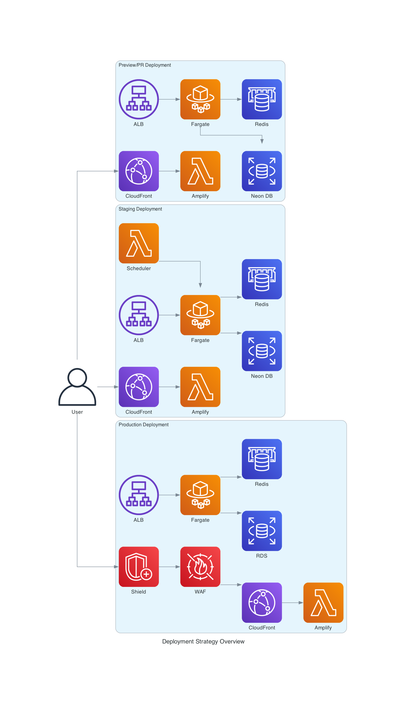

# Environment Deployment Strategy Overview

## 📋 Executive Summary

This document provides a comprehensive overview of our three-tier deployment strategy, designed to support development workflows
from individual pull requests to production-ready applications. The strategy balances cost consciousness for personal projects
with scalability for enterprise applications.

## 🎯 Deployment Strategy Overview

## 🏗️ Three-Tier Architecture

### 1. Preview/PR Deployment Strategy

**Purpose**: Ephemeral environments for every pull request  
**Cost**: <$0.50/month per environment  
**Duration**: Temporary (PR lifecycle)  
**Target**: Development and testing

#### Key Features

- **Ephemeral Isolation**: Each PR gets a unique `pr-{number}` namespace
- **Full-Stack Deployment**: Both frontend and backend components
- **Automatic Cleanup**: Environment destroyed when PR is closed/merged
- **Change Detection**: Only deploys components that have changed
- **Cost Optimization**: Right-sized resources for short-term use

#### Infrastructure Components

- **Frontend**: AWS Amplify + CloudFront CDN
- **Backend**: ECS Fargate with Application Load Balancer
- **Database**: Neon PostgreSQL (serverless)
- **Cache**: Upstash Redis
- **Monitoring**: CloudWatch

### 2. Staging Deployment Strategy

**Purpose**: Persistent environment for integration testing  
**Cost**: ~£15/month (with scheduled shutdown)  
**Duration**: Persistent with scheduled lifecycle  
**Target**: Pre-production validation

#### Key Features

- **Scheduled Lifecycle**: Automatic shutdown at 6 PM daily
- **On-Demand Deployment**: Manual trigger for immediate access
- **Production-Like Configuration**: Similar to production but cost-optimized
- **Integration Testing**: Full end-to-end testing capabilities
- **Cost Controls**: 75% cost reduction through scheduled shutdown

#### Infrastructure Components

- **Frontend**: AWS Amplify + CloudFront CDN
- **Backend**: ECS Fargate with Application Load Balancer
- **Database**: Neon PostgreSQL (serverless)
- **Cache**: Upstash Redis
- **Monitoring**: CloudWatch
- **Scheduling**: Lambda-based shutdown automation

### 3. Production Deployment Strategy

**Purpose**: Live environment serving end users  
**Cost**: £25-300/month (hobby to enterprise scale)  
**Duration**: Persistent  
**Target**: End users and revenue generation

#### Hobby Scale (Personal Projects)

**Cost**: ~£25/month  
**Target**: <100 users, personal projects

##### Key Features

- **Production Security**: AWS WAF protection
- **Cost Optimization**: Right-sized for personal use
- **Reliability**: Single-AZ deployment
- **Monitoring**: Basic CloudWatch monitoring

##### Infrastructure Components

- **Frontend**: AWS Amplify + CloudFront CDN
- **Backend**: ECS Fargate with Application Load Balancer
- **Database**: Neon PostgreSQL (serverless)
- **Cache**: Upstash Redis
- **Security**: AWS WAF
- **Monitoring**: CloudWatch

#### Enterprise Scale (Revenue-Generating Applications)

**Cost**: ~£200/month  
**Target**: 500+ users, revenue-generating applications

##### Key Features

- **High Availability**: Multi-AZ deployment
- **Auto-Scaling**: Dynamic resource allocation
- **Enterprise Security**: WAF + Shield DDoS protection
- **Advanced Monitoring**: Comprehensive observability
- **Database Redundancy**: RDS with read replicas

##### Infrastructure Components

- **Frontend**: AWS Amplify + CloudFront CDN
- **Backend**: ECS Fargate (Multi-AZ) with Application Load Balancer
- **Database**: RDS PostgreSQL with read replicas
- **Cache**: ElastiCache Redis cluster
- **Security**: AWS WAF + Shield
- **Monitoring**: CloudWatch + enhanced observability
- **Auto-Scaling**: Application Auto Scaling

## 💰 Cost Comparison

| Environment             | Monthly Cost | Target Users | Use Case           |
| ----------------------- | ------------ | ------------ | ------------------ |
| Preview/PR              | <$0.50       | N/A          | Development        |
| Staging                 | ~£15         | N/A          | Testing            |
| Production (Hobby)      | ~£25         | <100         | Personal projects  |
| Production (Enterprise) | ~£200        | 500+         | Revenue-generating |

## 🔄 Deployment Workflow

### Development Flow

1. **Feature Development**: Create feature branch
2. **Preview Deployment**: Automatic PR environment creation
3. **Code Review**: Review in isolated preview environment
4. **Merge to Develop**: Automatic staging deployment
5. **Staging Validation**: Integration testing and validation
6. **Production Release**: Manual promotion to production

### Change Detection & Optimization

All environments support intelligent change detection:

- **Backend Changes**: Only deploy ECS Fargate service
- **Frontend Changes**: Only deploy Amplify application
- **Infrastructure Changes**: Deploy CDK stack
- **Shared Changes**: Full deployment required

## 🚀 Scaling Path

### Phase 1: Hobby Scale (Current)

- Single-AZ deployment
- Neon PostgreSQL for cost efficiency
- Basic monitoring and security
- Suitable for personal projects

### Phase 2: Enhanced Hobby Scale

- Improved monitoring and alerting
- Enhanced security features
- Better performance optimization
- Target: 100-500 users

### Phase 3: Enterprise Scale

- Multi-AZ high availability
- RDS PostgreSQL with read replicas
- Advanced security and compliance
- Auto-scaling capabilities
- Target: 500+ users, revenue-generating

### Phase 4: Advanced Enterprise (Future)

- Multi-region deployment
- Edge computing with Lambda@Edge
- Advanced monitoring and observability
- SOC 2 and GDPR compliance
- Target: Enterprise customers

## 📊 Key Metrics & Monitoring

### Technical Metrics

- **Deployment Success Rate**: >99.9%
- **Deployment Time**: <20 minutes (full-stack)
- **Uptime**: 99.9% (hobby), 99.99% (enterprise)
- **Response Time**: <2 seconds average

### Cost Metrics

- **Cost per Environment**: Optimized for each tier
- **Cost per User**: Scales efficiently with growth
- **Budget Alerts**: Automated cost monitoring

### Business Metrics

- **User Satisfaction**: >95%
- **Revenue Growth**: Infrastructure scales with revenue
- **Time to Market**: Faster feature delivery

## 🔧 Implementation Status

### ✅ Completed

- [x] Preview/PR deployment strategy documentation
- [x] Staging deployment strategy documentation
- [x] Production deployment strategy documentation
- [x] Infrastructure diagrams for all environments
- [x] Cost analysis and optimization strategies
- [x] Change detection and deployment optimization

### 🚧 In Progress

- [ ] Implementation of preview/PR deployment workflow
- [ ] Staging environment setup with scheduled shutdown
- [ ] Production infrastructure deployment

### 📋 Planned

- [ ] Automated cost monitoring and alerting
- [ ] Enhanced security implementations
- [ ] Performance optimization and monitoring
- [ ] Enterprise scaling preparations

## 📚 Related Documentation

- [Preview/PR Deployment Strategy](./3-preview-pr-deployment.md)
- [Staging Deployment Strategy](./2-staging-deployment.md)
- [Production Deployment Strategy](./1-production-deployment.md)
- [AWS Deployment Guide](../aws-deployment.md)
- [CI/CD Pipeline Setup](../ci-cd-pipeline.md)

## 🎯 Next Steps

1. **Implement Preview/PR Workflow**: Set up automated PR environment creation
2. **Deploy Staging Environment**: Create persistent staging with scheduled lifecycle
3. **Deploy Production Infrastructure**: Start with hobby scale, plan for enterprise scaling
4. **Monitor and Optimize**: Track costs, performance, and user satisfaction
5. **Scale as Needed**: Transition to enterprise scale based on business growth

---

**Last Updated**: January 2025  
**Version**: 1.0  
**Status**: Documentation Complete, Implementation In Progress
