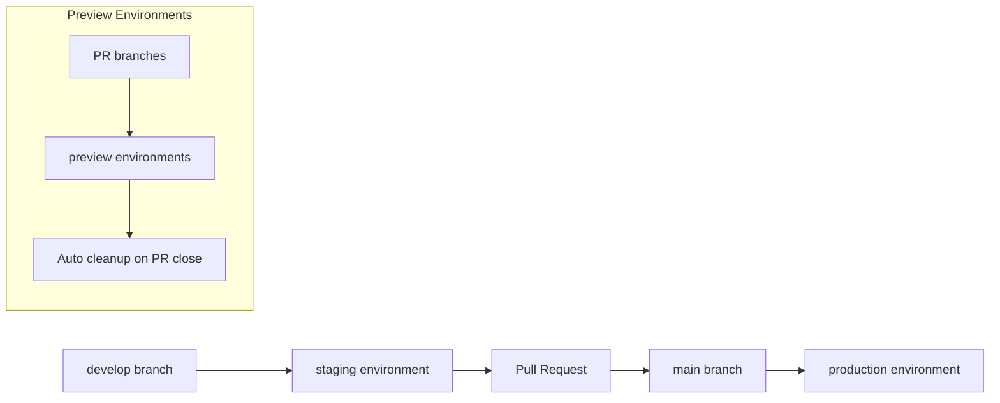

# Environment Optimization Migration Plan

## Status: 📋 PLANNED

This document outlines the migration plan for optimizing our GitHub workflow deployment strategy, transitioning from a
3-environment setup to a streamlined 2-environment approach with infrastructure scaling support.

## 🎯 Migration Objectives

### Current State Issues

- **Environment Mismatch**: Workflows define 3 environments but only `hobby` infrastructure exists
- **Hardcoded Stack Names**: Prevents multi-environment deployments
- **Branch-Environment Misalignment**: `develop` branch deploys to non-existent `staging`
- **Operational Complexity**: 3 environments with unclear purposes

### Target State Benefits

- **Simplified CI/CD**: 2 clear environments (`staging`, `production`)
- **Infrastructure Scaling**: `hobby` → `enterprise` as deployment scales, not environments
- **Clear Promotion Path**: develop → staging → main → production
- **Cost Optimization**: Maintain <£10/month target with clear upgrade path

## 🔄 Recommended Environment Strategy

### Environment Structure (2 Environments)

| Environment    | Purpose              | Branch    | Infrastructure Scale | Cost Target             |
| -------------- | -------------------- | --------- | -------------------- | ----------------------- |
| **staging**    | Testing & validation | `develop` | hobby (default)      | <£5/month               |
| **production** | Live application     | `main`    | hobby → enterprise   | <£10/month → £100/month |

### Infrastructure Scaling Within Environments

```yaml
# Environment variables control both environment and scale
CDK_DEPLOY_ENV: staging|production
CDK_DEPLOY_SCALE: hobby|enterprise

# Stack naming pattern
Stack Name: MacroAi{Environment}Stack
# Examples: MacroAiStagingStack, MacroAiProductionStack
```

### Branch-Aligned Deployment Strategy



## 📋 Migration Steps

### Phase 1: Infrastructure Updates (Week 1)

#### 1.1 Update CDK App Configuration

- ✅ **COMPLETED**: Modified `infrastructure/src/app.ts` to support dynamic environments
- ✅ **COMPLETED**: Added `CDK_DEPLOY_ENV` and `CDK_DEPLOY_SCALE` support
- ✅ **COMPLETED**: Dynamic stack naming: `MacroAi{Environment}Stack`

#### 1.2 Update Deployment Scripts

- ✅ **COMPLETED**: Modified `infrastructure/scripts/deploy.sh` for dynamic stack names
- ✅ **COMPLETED**: Added scale parameter support
- ✅ **COMPLETED**: Updated stack name references

#### 1.3 Create Optimized Workflow

- ✅ **COMPLETED**: Created `.github/workflows/deploy-optimized.yml`
- **Features**:
  - 2-environment strategy (staging/production)
  - Preview environments for PRs
  - Infrastructure scaling support
  - Automatic cleanup

### Phase 2: Environment Setup (Week 2)

#### 2.1 Create Staging Environment

```bash
# Deploy staging infrastructure
cd infrastructure
export CDK_DEPLOY_ENV=staging
export CDK_DEPLOY_SCALE=hobby
./scripts/deploy.sh
```

#### 2.2 Update Parameter Store Hierarchy

```bash
# Create staging parameter hierarchy
/macro-ai/staging/
├── critical/
│   ├── openai-api-key
│   └── neon-database-url
└── standard/
    ├── upstash-redis-url
    ├── cognito-user-pool-id
    └── cognito-user-pool-client-id
```

#### 2.3 Configure GitHub Environments

- Create `staging` environment in GitHub
- Create `production` environment in GitHub
- Configure environment protection rules
- Set up environment-specific secrets

### Phase 3: Workflow Migration (Week 3)

#### 3.1 Test New Workflow

```bash
# Test staging deployment
git checkout develop
git push origin develop
# Should trigger staging deployment

# Test production deployment
git checkout main
git merge develop
git push origin main
# Should trigger production deployment
```

#### 3.2 Validate Preview Environments

- Create test PR
- Verify preview environment creation
- Verify automatic cleanup on PR close

#### 3.3 Update Documentation

- Update workflow documentation
- Update deployment guides
- Update environment setup instructions

### Phase 4: Cleanup and Optimization (Week 4)

#### 4.1 Remove Old Workflows

- Archive `deploy-infrastructure.yml`
- Archive `deploy-staging.yml`
- Archive `deploy-full-stack.yml`
- Rename `deploy-optimized.yml` to `deploy.yml`

#### 4.2 Update References

- Update documentation links
- Update README instructions
- Update deployment guides

#### 4.3 Performance Validation

- Verify deployment times
- Validate cost targets
- Test rollback procedures

## 🏗️ Infrastructure Scaling Strategy

### Hobby → Enterprise Migration

#### When to Scale Up

- **User Growth**: >100 active users
- **Traffic**: >1000 requests/day
- **Performance**: Response times >500ms
- **Budget**: Can accommodate £100/month

#### Migration Process

```bash
# Scale up production to enterprise
export CDK_DEPLOY_ENV=production
export CDK_DEPLOY_SCALE=enterprise
./scripts/deploy.sh

# This will:
# 1. Upgrade Lambda to higher memory/CPU
# 2. Add RDS PostgreSQL (replace Neon)
# 3. Add ElastiCache Redis (replace Upstash)
# 4. Add CloudFront distribution
# 5. Enable auto-scaling
```

#### Cost Impact

- **Hobby Scale**: <£10/month (free tier services)
- **Enterprise Scale**: £100-300/month (managed AWS services)

## 🔐 Security and Compliance

### Environment Isolation

- Separate AWS accounts (recommended for production)
- Environment-specific IAM roles
- Isolated parameter stores
- Network segmentation

### Secret Management

- GitHub environment secrets
- AWS Parameter Store for configuration
- AWS Secrets Manager for enterprise scale
- Automatic secret rotation (enterprise)

## 📊 Success Metrics

### Performance Targets

| Metric            | Staging     | Production (Hobby) | Production (Enterprise) |
| ----------------- | ----------- | ------------------ | ----------------------- |
| Deployment Time   | <10 minutes | <15 minutes        | <20 minutes             |
| API Response Time | <1000ms     | <500ms             | <200ms                  |
| Monthly Cost      | <£5         | <£10               | <£300                   |
| Uptime            | >95%        | >99%               | >99.9%                  |

### Operational Metrics

- Deployment success rate: >95%
- Rollback time: <5 minutes
- Environment provisioning: <30 minutes
- Preview environment cleanup: 100% automated

## 🚨 Rollback Plan

### If Migration Fails

1. **Immediate**: Revert to original workflows
2. **Infrastructure**: Keep existing `MacroAiHobbyStack`
3. **Workflows**: Re-enable old workflow files
4. **Secrets**: Maintain existing configuration

### Rollback Commands

```bash
# Revert infrastructure changes
git checkout HEAD~1 infrastructure/src/app.ts
git checkout HEAD~1 infrastructure/scripts/deploy.sh

# Disable new workflow
mv .github/workflows/deploy-optimized.yml .github/workflows/deploy-optimized.yml.disabled

# Re-enable old workflows
git checkout HEAD~1 .github/workflows/deploy-infrastructure.yml
git checkout HEAD~1 .github/workflows/deploy-staging.yml
```

## 📅 Timeline Summary

| Week | Phase              | Key Activities                       | Success Criteria            |
| ---- | ------------------ | ------------------------------------ | --------------------------- |
| 1    | Infrastructure     | Update CDK, scripts, create workflow | ✅ All files updated        |
| 2    | Environment Setup  | Deploy staging, configure GitHub     | Staging environment working |
| 3    | Workflow Migration | Test deployments, validate flows     | All deployments successful  |
| 4    | Cleanup            | Remove old workflows, documentation  | Migration complete          |

## 🔗 Related Documentation

- **[GitHub Workflows Overview](../ci-cd/github-workflows-overview.md)** - Complete workflow documentation
- **[AWS Deployment](./aws-deployment.md)** - Infrastructure deployment strategies
- **[Environment Setup](./environment-setup.md)** - Environment configuration details
- **[Hobby Deployment Plan](./hobby-deployment/v1-0-0-hobby-deployment-plan.md)** - Cost optimization strategy

---

**Next Steps**: Begin Phase 1 infrastructure updates and test staging environment deployment.
