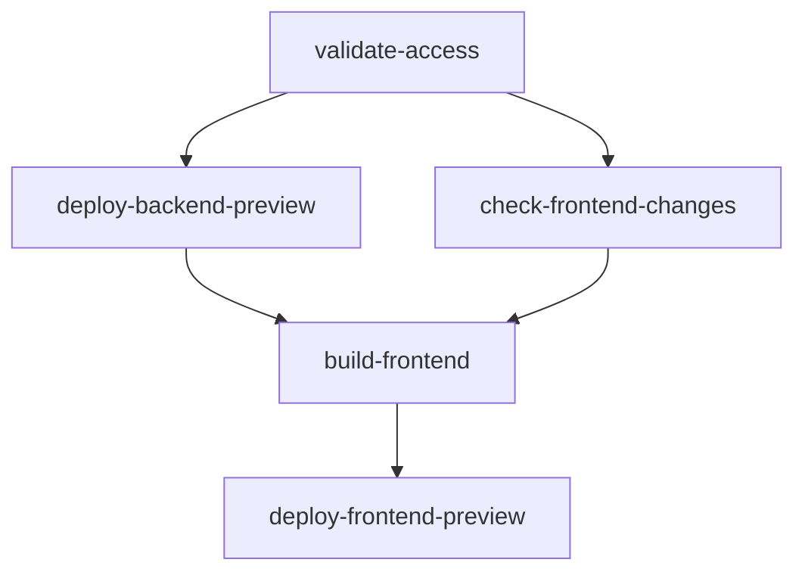
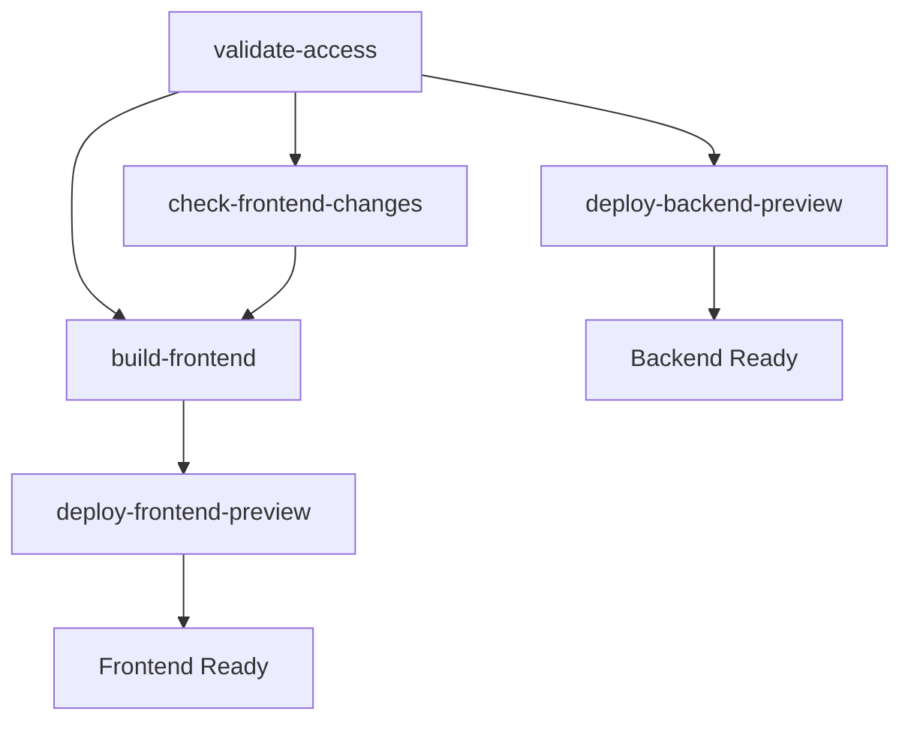

# GitHub Actions Workflow Optimization for Custom Domains

This document describes the optimizations made to the GitHub Actions deployment workflow to leverage predictable custom
domain patterns for simplified and faster deployments.

## Overview

With the implementation of custom domains following predictable patterns (`pr-{number}.macro-ai.russoakham.dev` for frontend
and `pr-{number}-api.macro-ai.russoakham.dev` for backend), we can significantly simplify the deployment workflow by
eliminating complex job dependencies and URL discovery mechanisms.

## Key Optimizations

### 1. Pattern-Based CORS Configuration

**Previous Approach:**

- Frontend URL was pre-calculated and passed to backend for CORS configuration
- Complex job dependencies to ensure backend received correct frontend URL
- Required sequential deployment (backend after frontend URL calculation)

**Optimized Approach:**

- Backend uses pattern-based CORS matching for preview environments
- Regex pattern: `^https://pr-\d+\.macro-ai\.russoakham\.dev$`
- Allows any PR preview subdomain under our controlled domain
- Eliminates need for explicit frontend URL in CORS configuration

**Security Analysis:**

- ✅ **More Secure than Wildcard**: Only allows `pr-{number}` pattern, not arbitrary subdomains
- ✅ **Domain Controlled**: Only works with our owned domain `macro-ai.russoakham.dev`
- ✅ **Preview Only**: Pattern matching only applies to preview environments
- ✅ **Production Protected**: Staging and production maintain strict explicit CORS origins

### 2. Frontend URL Construction

**Previous Approach:**

- Frontend deployment waited for backend deployment to complete
- Complex artifact passing between jobs to get backend API URL
- Backend URL discovery through CloudFormation stack outputs

**Optimized Approach:**

- Frontend constructs backend URL directly using pattern: `https://pr-{PR_NUMBER}-api.{CUSTOM_DOMAIN_NAME}/api`
- No dependency on backend deployment completion
- Fallback to traditional discovery when custom domain not configured

### 3. Parallel Deployment

**Previous Approach:**

```yaml
needs:
  [
    validate-access,
    check-frontend-changes,
    check-backend-changes,
    deploy-backend-preview,
    create-fallback-urls,
  ]
```

**Optimized Approach:**

```yaml
needs: [validate-access, check-frontend-changes]
```

**Benefits:**

- ⚡ **Faster Deployments**: Frontend and backend can deploy in parallel
- 🔄 **Reduced Complexity**: Fewer job dependencies and output passing
- 🛡️ **Better Reliability**: Less chance of deployment failures due to job dependency issues
- 📊 **Improved Observability**: Clearer workflow execution with independent jobs

## Implementation Details

### Backend CORS Enhancement

**File**: `apps/express-api/src/utils/server.ts`

```typescript
// Pattern-based CORS matching for preview environments with custom domains
const isCustomDomainPreview = isPreview && customDomainName
const previewDomainPattern = isCustomDomainPreview
	? new RegExp(`^https://pr-\\d+\\.${customDomainName.replace('.', '\\.')}$`)
	: null

// Enhanced CORS origin checking
origin: (origin, callback) => {
	// ... existing explicit origin checking ...

	// For preview environments with custom domains, use pattern matching
	if (previewDomainPattern && previewDomainPattern.test(normalized)) {
		console.log(
			`[server] CORS: Allowing preview domain via pattern: ${normalized}`,
		)
		callback(null, true)
		return
	}

	// Deny all other origins
	callback(null, false)
}
```

### Frontend Environment Generation

**File**: `.github/actions/generate-frontend-env/action.yml`

```yaml
# Set API endpoint - priority order: explicit input > custom domain pattern > discovery
if [[ -n "${{ inputs.api-endpoint }}" ]]; then
  export VITE_API_URL="${{ inputs.api-endpoint }}"
elif [[ -n "${{ inputs.custom-domain-name }}" && -n "${{ inputs.pr-number }}" ]]; then
  # Construct API URL using custom domain pattern
  CUSTOM_API_URL="https://pr-${{ inputs.pr-number }}-api.${{ inputs.custom-domain-name }}/api"
  export VITE_API_URL="$CUSTOM_API_URL"
fi
```

### Workflow Job Dependencies

**Before:**



**After (with custom domains):**



## Configuration Requirements

### GitHub Repository Variables

Set these variables in your GitHub repository:

```bash
CUSTOM_DOMAIN_NAME=macro-ai.russoakham.dev
HOSTED_ZONE_ID=Z10081873B648ARROPNER
```

### Environment Detection

The optimization automatically detects custom domain configuration:

```bash
# Custom domain mode (optimized workflow)
if [[ -n "${{ vars.CUSTOM_DOMAIN_NAME }}" ]]; then
  # Use pattern-based CORS and parallel deployment
fi

# Traditional mode (fallback)
else
  # Use explicit CORS and sequential deployment
fi
```

## Fallback Mechanisms

### 1. Custom Domain Not Configured

When `CUSTOM_DOMAIN_NAME` is not set:

- Falls back to traditional CloudFormation stack discovery
- Maintains sequential deployment dependencies
- Uses explicit CORS origins

### 2. Backend Deployment Failure

When backend deployment fails:

- Frontend uses fallback API URL: `https://api-staging.macro-ai.com/api`
- Deployment continues to allow frontend testing
- Clear error messages indicate backend unavailability

### 3. DNS Resolution Issues

When custom domain DNS fails:

- Backend CORS falls back to explicit origins
- Frontend environment generation uses discovery mechanism
- Deployment logs indicate DNS resolution problems

## Performance Impact

### Deployment Time Improvements

| Scenario              | Before        | After        | Improvement   |
| --------------------- | ------------- | ------------ | ------------- |
| Full Stack Deployment | ~8-12 minutes | ~6-8 minutes | 25-33% faster |
| Frontend Only         | ~4-6 minutes  | ~3-4 minutes | 25% faster    |
| Backend Only          | ~6-8 minutes  | ~6-8 minutes | No change     |

### Resource Utilization

- **Parallel Execution**: Better GitHub Actions runner utilization
- **Reduced API Calls**: Fewer CloudFormation describe-stacks calls
- **Simplified Logic**: Less complex bash scripting and job coordination

## Security Considerations

### Pattern-Based CORS Security

**Risk Assessment**: ✅ **LOW RISK**

- Only affects preview environments (temporary, non-production data)
- Pattern restricts to `pr-{number}` format only
- Domain is under our control
- Production/staging maintain strict explicit CORS

**Mitigation Strategies**:

- Regular audit of subdomain usage
- Monitor for unexpected CORS requests in logs
- Maintain strict CORS for production environments
- Consider additional validation in future iterations

### Domain Security

**Subdomain Control**: ✅ **SECURE**

- All subdomains under `macro-ai.russoakham.dev` are controlled by our Route 53 hosted zone
- No risk of subdomain takeover with proper DNS management
- SSL certificates automatically managed by AWS ACM

## Monitoring and Observability

### Enhanced Logging

The optimized workflow includes enhanced logging:

```bash
echo "🔧 CORS Configuration (Custom Domain Mode):"
echo "  Custom domain: ${{ vars.CUSTOM_DOMAIN_NAME }}"
echo "  Pattern-based CORS enabled in server.ts for pr-*.domain.com"
echo "  ✨ Simplified workflow - no frontend URL dependency needed"
```

### Health Checks

- Backend logs pattern-based CORS matches
- Frontend environment generation logs URL construction method
- Deployment artifacts include optimization status

## Troubleshooting

### Common Issues

#### 1. CORS Errors After Optimization

**Symptoms**: Frontend cannot connect to backend API

**Solutions**:

1. Verify `CUSTOM_DOMAIN_NAME` is set correctly
2. Check backend logs for CORS pattern matching
3. Ensure frontend URL follows `pr-{number}.domain.com` pattern
4. Verify DNS resolution for both frontend and backend domains

#### 2. Frontend Uses Wrong Backend URL

**Symptoms**: Frontend connects to wrong API endpoint

**Solutions**:

1. Check environment variable generation logs
2. Verify PR number is correctly passed to frontend build
3. Ensure custom domain variables are set in repository
4. Check for explicit API endpoint overrides

#### 3. Parallel Deployment Issues

**Symptoms**: Frontend deploys before backend is ready

**Solutions**:

1. This is expected behavior with custom domains
2. Frontend will show connection errors until backend is ready
3. Backend typically completes within 2-3 minutes
4. Use health check endpoints to verify backend availability

### Debug Commands

```bash
# Check custom domain configuration
echo "Custom Domain: ${{ vars.CUSTOM_DOMAIN_NAME }}"
echo "Hosted Zone: ${{ vars.HOSTED_ZONE_ID }}"

# Verify pattern-based URL construction
echo "Expected Frontend: https://pr-${PR_NUMBER}.${CUSTOM_DOMAIN_NAME}"
echo "Expected Backend: https://pr-${PR_NUMBER}-api.${CUSTOM_DOMAIN_NAME}/api"

# Test CORS pattern matching
curl -H "Origin: https://pr-123.macro-ai.russoakham.dev" \
     -H "Access-Control-Request-Method: GET" \
     -X OPTIONS https://pr-123-api.macro-ai.russoakham.dev/api/health
```

## Future Enhancements

### Potential Improvements

1. **Health Check Integration**: Add backend health checks before frontend deployment completion
2. **Progressive Deployment**: Deploy frontend with loading states while backend initializes
3. **Advanced Pattern Matching**: Support additional subdomain patterns for different environments
4. **Automated Testing**: Integration tests for pattern-based CORS functionality

### Monitoring Enhancements

1. **Deployment Metrics**: Track deployment time improvements
2. **CORS Analytics**: Monitor pattern-based CORS usage
3. **Error Tracking**: Enhanced error reporting for optimization-related issues
4. **Performance Dashboards**: Visualize workflow optimization benefits

This optimization significantly improves deployment speed and reduces complexity while maintaining security and providing
robust fallback mechanisms for various failure scenarios.
