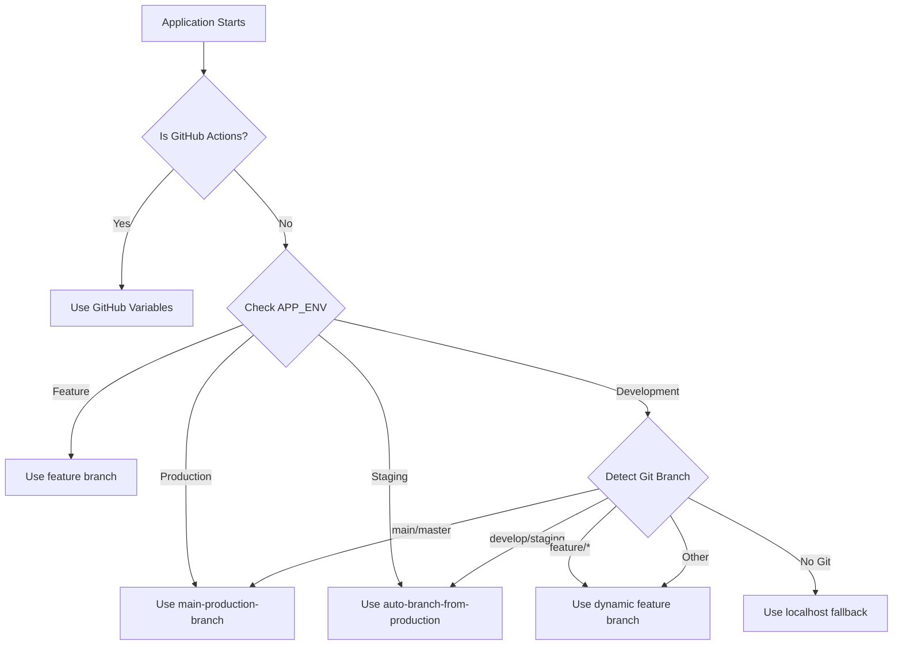

# Development Environment Setup

## Overview

The development environment now supports automatic database branch selection based on your current
git branch. This ensures proper isolation between different development workflows and prevents
accidental data conflicts.

## Git Branch-Based Database Selection

### Branch Mapping

The system automatically maps your current git branch to the appropriate database environment:

| Git Branch Pattern    | Mapped Environment | Neon Database Branch          | Description                               |
| --------------------- | ------------------ | ----------------------------- | ----------------------------------------- |
| `main` / `master`     | Production         | `main-production-branch`      | Production-like database with live data   |
| `develop` / `staging` | Staging            | `auto-branch-from-production` | Staging database branched from production |
| `feature/*`           | Feature            | `feature/{branch-name}`       | Isolated feature database                 |
| Other branches        | Feature            | `feature/{branch-name}`       | Isolated development database             |

### How It Works

1. **Branch Detection**: When the application starts, it detects your current git branch
2. **Environment Mapping**: Maps the branch to the appropriate environment type
3. **Database Selection**: Selects the corresponding Neon database branch
4. **Connection Setup**: Configures the database connection string with the branch parameter

### Example Workflow

```bash
# Working on a feature
git checkout -b feature/user-authentication

# Application automatically uses:
# - Environment: feature
# - Database Branch: feature/user-authentication
# - Isolation: Complete database isolation for this feature

# Switch to main branch
git checkout main

# Application automatically switches to:
# - Environment: production
# - Database Branch: main-production-branch
# - Database: Production database with live data
```

## Environment Information Logging

When the application starts, it logs comprehensive environment information:

```text
🌍 Development Environment Information:
=====================================
Environment Type: feature
APP_ENV: development
NODE_ENV: development

🗄️  Database Configuration:
Branch: feature/user-authentication
Description: Local feature branch 'feature/user-authentication' database
URL: postgresql://***@ep-xxx-xxx.us-east-1.neon.tech/dbname?branch=feature/user-authentication

📋 Git Status:
Is Git Repository: true
Current Branch: feature/user-authentication
Has Uncommitted Changes: false
Is Detached HEAD: false
Mapped Environment: feature

🤖 CI/CD Status:
GitHub Actions: false
=====================================
```

## Testing Branch Detection

Run the branch detection test to verify functionality:

```bash
# Test the git branch detection system
pnpm tsx scripts/test-git-branching.ts
```

This will show:

- Current git branch detection
- Branch-to-environment mapping
- Database configuration
- Environment information

## Development Best Practices

### Branch Naming Conventions

Use descriptive branch names that follow patterns:

```bash
# Good branch names
git checkout -b feature/user-authentication
git checkout -b feature/payment-processing
git checkout -b feature/dashboard-redesign

# Avoid generic names
git checkout -b my-feature  # ❌ Too generic
git checkout -b fix         # ❌ Too vague
```

### Database Isolation

Each feature branch gets its own isolated database:

- **Data Safety**: Changes in one branch don't affect others
- **Testing Freedom**: Test with realistic data without affecting production
- **Merge Safety**: Database migrations are isolated until merged

### Switching Between Branches

The system handles branch switches automatically:

```bash
# Switch from feature to main
git checkout main
# Application restarts and uses production database

# Switch back to feature
git checkout feature/user-authentication
# Application restarts and uses feature database
```

## Troubleshooting

### Branch Not Detected

If the branch isn't detected properly:

1. **Check git status**: Ensure you're in a git repository
2. **Verify branch name**: Use `git branch` to confirm current branch
3. **Check permissions**: Ensure git commands can be executed
4. **Detached HEAD**: If in detached HEAD state, the system falls back to localhost

### Database Connection Issues

If database connections fail:

1. **Verify Neon branch exists**: Check Neon dashboard for the expected branch
2. **Check permissions**: Ensure Neon API key has branch access
3. **Branch name sanitization**: Special characters in branch names are sanitized
4. **Fallback behavior**: System falls back gracefully if branches don't exist

### Environment Override

You can override automatic detection using environment variables:

```bash
# Force production environment
APP_ENV=production pnpm dev

# Force localhost database
APP_ENV=development pnpm dev  # (when not in git repo)
```

## Integration with CI/CD

The same logic works in CI/CD pipelines:

- **GitHub Actions**: Uses GitHub environment variables for branch detection
- **PR Environments**: Automatically creates `preview/pr-{number}` branches
- **Push to Feature**: Creates `feature/{branch-name}` branches
- **Consistency**: Same branch mapping logic across local and CI environments

## Verification Scripts

Use the provided verification scripts to ensure everything is working:

```bash
# Test git branch detection specifically
pnpm tsx scripts/test-git-branching.ts

# Verify complete environment connection setup
pnpm tsx scripts/verify-environment-connections.ts
```

## Environment-Specific Connection Logic

The system implements comprehensive environment-specific database connection logic:

### Connection Priority Order

1. **GitHub Actions Variables**: Highest priority for CI/CD environments
2. **Explicit APP_ENV**: Manual environment configuration
3. **Git Branch Detection**: Automatic mapping for local development
4. **Fallback Logic**: Graceful degradation when detection fails

### Connection Features

- **Automatic Branch Selection**: No manual configuration required
- **Dynamic URL Generation**: Branch parameters added automatically
- **Connection Pooling**: Efficient database connection management
- **Error Handling**: Comprehensive fallback mechanisms
- **Logging**: Detailed environment and connection information

### Database Connection Flow



## Best Practices

### Development Workflow

1. **Branch Creation**: Use descriptive feature branch names
2. **Environment Isolation**: Each branch gets isolated database access
3. **Testing**: Test with realistic data in isolated environments
4. **Merge Safety**: Database changes are isolated until merged

### Troubleshooting

Run the verification scripts when encountering issues:

```bash
# Check git branch detection
pnpm tsx scripts/test-git-branching.ts

# Verify complete setup
pnpm tsx scripts/verify-environment-connections.ts
```

### Performance Notes

- **Minimal Overhead**: Branch detection adds ~2-5ms to startup
- **Connection Efficiency**: Uses existing connection pooling
- **Caching**: Branch information cached during runtime
- **Fallback Safety**: Graceful degradation when git commands fail

## Security Notes

- **Database Isolation**: Each branch gets isolated database access
- **Credential Management**: Uses existing Neon credential management
- **Access Control**: Respects Neon's built-in access controls
- **Audit Trail**: All database operations are logged with branch context
