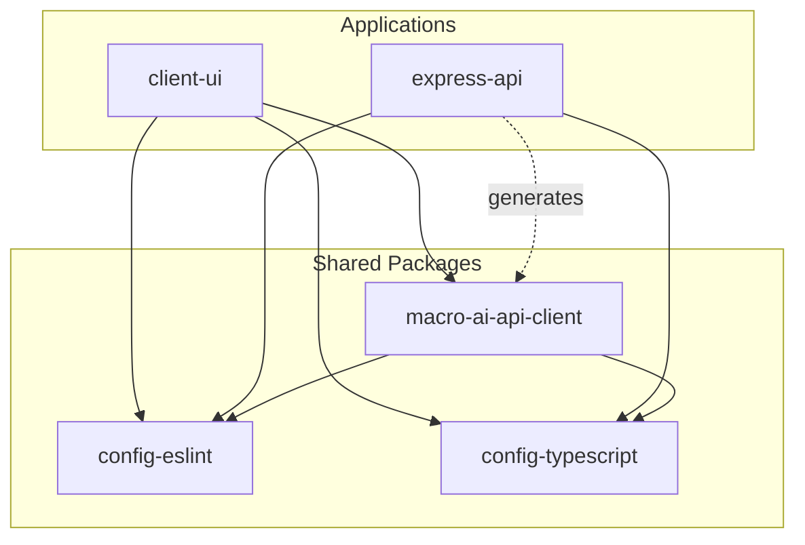
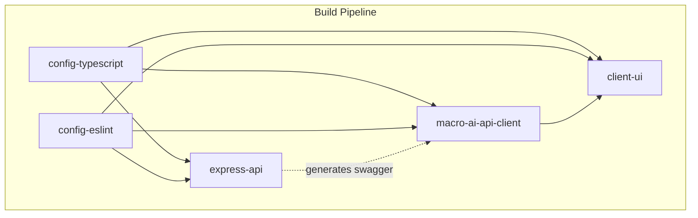
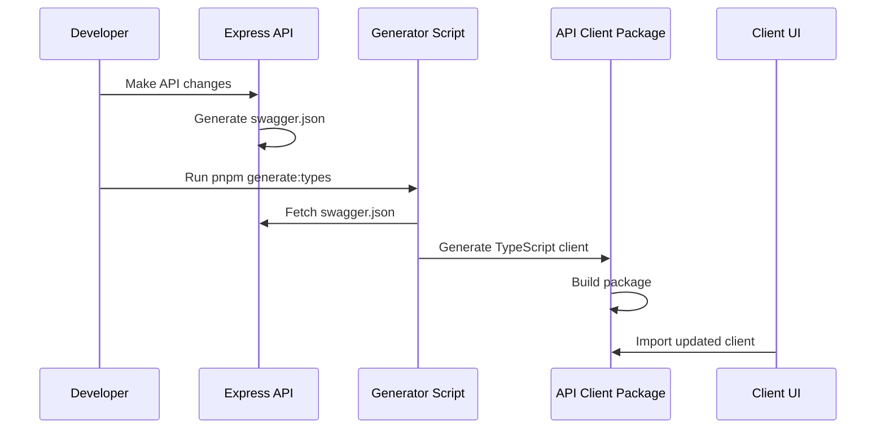
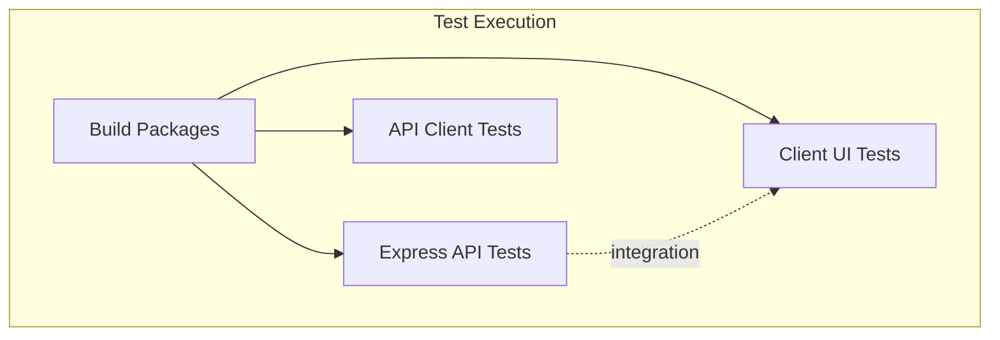

# Monorepo Management

## Current Implementation Status ✅ PRODUCTION-READY

This document provides comprehensive guidance for managing the Macro AI monorepo, including workspace configuration,
dependency management, build optimization, and development workflows. The monorepo structure is **fully implemented
and production-ready** with pnpm workspaces, TurboRepo optimization, and automated tooling.

## 🏗️ Repository Structure

### Workspace Organization ✅ IMPLEMENTED

```text
macro-ai/
├── apps/                           # Applications
│   ├── client-ui/                  # React frontend application
│   └── express-api/                # Express backend API
├── packages/                       # Shared packages
│   ├── config-eslint/              # Shared ESLint configuration
│   ├── config-typescript/          # Shared TypeScript configuration
│   └── macro-ai-api-client/        # Auto-generated API client
├── docs/                           # Documentation
├── .github/                        # GitHub Actions workflows
├── package.json                    # Root package configuration
├── pnpm-workspace.yaml             # Workspace definition
├── turbo.json                      # TurboRepo configuration
└── README.md                       # Project overview
```

### Package Relationships



## 📦 pnpm Workspace Configuration

### Workspace Definition ✅ IMPLEMENTED

**File**: `pnpm-workspace.yaml`

```yaml
packages:
  - apps/*
  - packages/*

catalog:
  # Core dependencies with version management
  '@types/node': ^20
  typescript: ^5.6.3
  eslint: ^9.25.1
  prettier: ^3.3.3
  vitest: 3.1.2

  # Testing & Coverage
  '@vitest/coverage-v8': 3.1.2
  '@vitest/ui': 3.1.2

  # Build & Development Tools
  tsx: ^4.19.4
  globals: ^15.15.0
  markdownlint-cli2: ^0.18.1

  # Core Dependencies
  zod: ^3.24.1
  pino: ^9.5.0
  'pino-pretty': ^11.3.0

  # UI Libraries
  lucide-react: ^0.474.0
  tailwindcss: ^3.4.13
```

### Catalog Benefits ✅ IMPLEMENTED

1. **Version Consistency**: Single source of truth for dependency versions
2. **Easy Updates**: Update versions in one place across all packages
3. **Reduced Duplication**: Avoid version conflicts between packages
4. **Dependency Management**: Centralized control over shared dependencies

### Workspace Commands ✅ AVAILABLE

```bash
# Install dependencies for all workspaces
pnpm install

# Install dependency in specific workspace
pnpm --filter @repo/express-api add express

# Install dev dependency in specific workspace
pnpm --filter @repo/client-ui add -D @types/react

# Run command in specific workspace
pnpm --filter @repo/express-api dev

# Run command in multiple workspaces
pnpm --filter "@repo/*" build

# Install dependency from catalog
pnpm --filter @repo/express-api add typescript@catalog:
```

## 🚀 TurboRepo Build Optimization

### Pipeline Configuration ✅ IMPLEMENTED

**File**: `turbo.json`

```json
{
	"$schema": "https://turbo.build/schema.json",
	"globalDependencies": [".env"],
	"tasks": {
		"build": {
			"dependsOn": ["^build"],
			"inputs": ["$TURBO_DEFAULT$", ".env*"],
			"outputs": ["dist/**"],
			"env": [
				"API_KEY",
				"NODE_ENV",
				"SERVER_PORT",
				"AWS_COGNITO_USER_POOL_ID",
				"AWS_COGNITO_USER_POOL_CLIENT_ID",
				"VITE_API_URL",
				"VITE_API_KEY"
			]
		},
		"dev": {
			"cache": false,
			"persistent": true
		},
		"test": {
			"cache": false,
			"dependsOn": ["^build"]
		},
		"lint": {},
		"type-check": {}
	},
	"envMode": "loose"
}
```

### Build Dependencies ✅ OPTIMIZED



### TurboRepo Benefits ✅ ACHIEVED

1. **Incremental Builds**: Only rebuild changed packages
2. **Parallel Execution**: Run tasks across packages simultaneously
3. **Intelligent Caching**: Cache build outputs and skip unchanged work
4. **Dependency Awareness**: Respect package dependencies in build order
5. **Environment Handling**: Proper environment variable management

## 🔧 Package Management

### Shared Configuration Packages ✅ IMPLEMENTED

#### TypeScript Configuration (`@repo/config-typescript`)

```json
// packages/config-typescript/tsconfig-base.json
{
	"$schema": "https://json.schemastore.org/tsconfig",
	"compilerOptions": {
		"strict": true,
		"target": "ES2022",
		"module": "ESNext",
		"moduleResolution": "Bundler",
		"allowImportingTsExtensions": true,
		"noEmit": true,
		"skipLibCheck": true,
		"resolveJsonModule": true,
		"isolatedModules": true,
		"noUncheckedIndexedAccess": true,
		"noImplicitOverride": true,
		"strictNullChecks": true
	},
	"exclude": ["node_modules"]
}
```

**Usage in Applications**:

```json
// apps/express-api/tsconfig.json
{
	"extends": "@repo/config-typescript/tsconfig-base.json",
	"compilerOptions": {
		"outDir": "./dist",
		"noEmit": false
	},
	"include": ["src/**/*"],
	"exclude": ["node_modules", "dist"]
}
```

#### ESLint Configuration (`@repo/config-eslint`)

```javascript
// packages/config-eslint/eslint.js
import js from '@eslint/js'
import typescript from 'typescript-eslint'
import prettier from 'eslint-config-prettier'

export default [
	js.configs.recommended,
	...typescript.configs.recommended,
	prettier,
	{
		rules: {
			'@typescript-eslint/no-unused-vars': 'error',
			'@typescript-eslint/explicit-function-return-type': 'warn',
			'@typescript-eslint/no-explicit-any': 'error',
			'prefer-const': 'error',
			'no-var': 'error',
		},
	},
]
```

### API Client Package ✅ AUTOMATED

#### Auto-Generation Pipeline



#### Generation Script ✅ IMPLEMENTED

```typescript
// packages/macro-ai-api-client/scripts/generate-modular.ts
import { generateZodClientFromOpenAPI } from 'openapi-zod-client'
import fs from 'fs/promises'

async function generateClient() {
	const swaggerUrl = 'http://localhost:3040/swagger.json'

	try {
		const response = await fetch(swaggerUrl)
		const openApiDoc = await response.json()

		const { sourceCode } = await generateZodClientFromOpenAPI({
			openApiDoc,
			options: {
				shouldExportAllTypes: true,
				withAlias: true,
				baseUrl: process.env.VITE_API_URL || 'http://localhost:3040/api',
			},
		})

		await fs.writeFile('src/generated-client.ts', sourceCode)
		console.log('✅ API client generated successfully')
	} catch (error) {
		console.error('❌ Failed to generate API client:', error)
		process.exit(1)
	}
}

generateClient()
```

## 🛠️ Development Workflows

### Root-Level Scripts ✅ IMPLEMENTED

**File**: `package.json`

```json
{
	"scripts": {
		"build": "turbo run build",
		"build:types": "turbo run build --filter=@repo/macro-ai-api-client",
		"dev": "turbo run dev --env-mode=loose",
		"dev:types": "turbo run dev --filter=@repo/macro-ai-api-client",
		"clean:types": "turbo run clean --filter=@repo/macro-ai-api-client",
		"generate:types": "turbo run generate --filter=@repo/macro-ai-api-client",
		"db:generate:express-api": "pnpm --filter @repo/express-api db:generate",
		"db:push:express-api": "pnpm --filter @repo/express-api db:push",
		"lint": "turbo run lint",
		"lint:md": "markdownlint-cli2 \"docs/**/*.md\" \"*.md\"",
		"lint:md:fix": "markdownlint-cli2 --fix \"docs/**/*.md\" \"*.md\"",
		"format": "prettier --check .",
		"format:fix": "prettier --write .",
		"test": "turbo run test",
		"test:coverage": "turbo run test:coverage",
		"type-check": "turbo run type-check"
	}
}
```

### Common Development Tasks ✅ STREAMLINED

#### Starting Development

```bash
# Start all development servers
pnpm dev

# Start specific application
pnpm --filter @repo/client-ui dev
pnpm --filter @repo/express-api dev

# Start with API client generation
pnpm dev:types && pnpm dev
```

#### Building Applications

```bash
# Build all packages and applications
pnpm build

# Build specific package
pnpm --filter @repo/macro-ai-api-client build

# Build with dependencies
pnpm --filter @repo/client-ui... build
```

#### Testing

```bash
# Run all tests
pnpm test

# Run tests with coverage
pnpm test:coverage

# Run tests for specific package
pnpm --filter @repo/express-api test

# Run tests in watch mode
pnpm --filter @repo/express-api test:ui
```

#### Database Operations

```bash
# Generate database migrations
pnpm db:generate:express-api

# Push database changes
pnpm db:push:express-api

# Run database operations in specific workspace
pnpm --filter @repo/express-api db:reset
```

### Package-Specific Scripts ✅ ORGANIZED

#### Express API Scripts

```json
{
	"scripts": {
		"build": "tsc && tsx src/utils/swagger/generate-swagger.ts",
		"start": "node dist/index.js",
		"dev": "tsx src/utils/swagger/generate-swagger.ts && nodemon --config nodemon.json",
		"generate-swagger": "tsx src/utils/swagger/generate-swagger.ts",
		"db:generate": "drizzle-kit generate:pg --config=drizzle.config.ts",
		"db:push": "drizzle-kit push:pg --config=drizzle.config.ts",
		"lint": "eslint ./src",
		"type-check": "tsc --noEmit",
		"test": "vitest run",
		"test:ui": "vitest",
		"test:coverage": "vitest run --coverage"
	}
}
```

#### Client UI Scripts

```json
{
	"scripts": {
		"dev": "vite",
		"build": "vite build",
		"lint": "eslint .",
		"preview": "vite preview",
		"type-check": "tsc --noEmit --project tsconfig.app.json",
		"test": "vitest run",
		"test:ui": "vitest --ui",
		"test:coverage": "vitest run --coverage"
	}
}
```

#### API Client Scripts

```json
{
	"scripts": {
		"build": "pnpm generate && tsup",
		"dev": "pnpm generate && tsup --watch",
		"clean": "rm -rf dist && find src -type f \\( -name '*.ts' -o -name '*.js' \\) ! -name 'index.ts' -delete",
		"generate": "cd ../../apps/express-api && pnpm generate-swagger && cd ../../packages/macro-ai-api-client && tsx --tsconfig scripts/tsconfig.json scripts/generate-modular.ts",
		"test": "vitest run",
		"test:coverage": "vitest run --coverage",
		"lint": "eslint ."
	}
}
```

## 🔄 Dependency Management

### Workspace Dependencies ✅ IMPLEMENTED

#### Internal Package References

```json
// apps/client-ui/package.json
{
	"devDependencies": {
		"@repo/config-eslint": "workspace:*",
		"@repo/config-typescript": "workspace:*",
		"@repo/macro-ai-api-client": "workspace:*"
	}
}
```

#### Catalog Dependencies

```json
// Any package.json
{
	"dependencies": {
		"typescript": "catalog:",
		"zod": "catalog:",
		"vitest": "catalog:"
	}
}
```

### Dependency Update Strategy ✅ SYSTEMATIC

#### Update Process

```bash
# Check for outdated dependencies
pnpm outdated

# Update catalog dependencies
# Edit pnpm-workspace.yaml catalog section

# Update workspace dependencies
pnpm update

# Update specific dependency
pnpm --filter @repo/express-api update express

# Update all workspaces
pnpm -r update
```

#### Version Management

1. **Catalog Dependencies**: Managed centrally in `pnpm-workspace.yaml`
2. **Workspace Dependencies**: Use `workspace:*` for internal packages
3. **Application Dependencies**: Specific versions for application-specific needs
4. **Dev Dependencies**: Shared through catalog when possible

## 🧪 Testing Strategy

### Cross-Package Testing ✅ IMPLEMENTED

#### Test Dependencies



#### Test Configuration

```json
// turbo.json
{
	"tasks": {
		"test": {
			"cache": false,
			"dependsOn": ["^build"]
		},
		"test:coverage": {
			"dependsOn": ["^build"],
			"outputs": ["coverage/**"]
		}
	}
}
```

### Integration Testing ✅ IMPLEMENTED

```bash
# Run integration tests across packages
pnpm test

# Generate coverage reports
pnpm test:coverage

# Run specific test suites
pnpm --filter @repo/express-api test
pnpm --filter @repo/client-ui test
```

## 🚀 Performance Optimization

### Build Performance ✅ OPTIMIZED

#### TurboRepo Caching

```bash
# Check cache status
turbo run build --dry-run

# Clear cache
turbo run build --force

# Analyze build performance
turbo run build --profile
```

#### Parallel Execution

```json
// turbo.json - Optimized for parallel execution
{
	"tasks": {
		"build": {
			"dependsOn": ["^build"], // Wait for dependencies
			"outputs": ["dist/**"] // Cache outputs
		},
		"lint": {}, // No dependencies, runs in parallel
		"type-check": {} // No dependencies, runs in parallel
	}
}
```

### Development Performance ✅ OPTIMIZED

#### Hot Reload Optimization

```bash
# Start development with optimal performance
pnpm dev --env-mode=loose

# Start specific services only
pnpm --filter @repo/client-ui dev
pnpm --filter @repo/express-api dev
```

#### Resource Management

1. **Selective Builds**: Only build changed packages
2. **Parallel Development**: Run multiple dev servers simultaneously
3. **Incremental Type Checking**: TypeScript project references
4. **Optimized Watching**: Exclude unnecessary files from watchers

## 📚 Best Practices

### Workspace Organization ✅ RECOMMENDED

1. **Clear Separation**: Keep applications and packages separate
2. **Shared Configurations**: Use packages for shared tooling
3. **Consistent Naming**: Use `@repo/` prefix for internal packages
4. **Documentation**: Document package purposes and relationships

### Dependency Management ✅ RECOMMENDED

1. **Use Catalog**: Centralize common dependency versions
2. **Workspace References**: Use `workspace:*` for internal dependencies
3. **Regular Updates**: Keep dependencies up to date
4. **Security Audits**: Regular security audits across all packages

### Development Workflow ✅ RECOMMENDED

1. **Root Scripts**: Provide convenient root-level commands
2. **Filtered Commands**: Use filters for package-specific operations
3. **Build Dependencies**: Respect package build order
4. **Testing Strategy**: Test packages in isolation and integration

## 📚 Related Documentation

- **[Development Setup](../getting-started/development-setup.md)** - Initial monorepo setup
- **[Coding Standards](./coding-standards.md)** - Code quality and style guidelines
- **[Testing Strategy](./testing-strategy.md)** - Testing approaches across packages
- **[CI/CD Pipeline](../deployment/ci-cd-pipeline.md)** - Automated build and deployment
- **[API Development](./api-development.md)** - API client generation and integration
