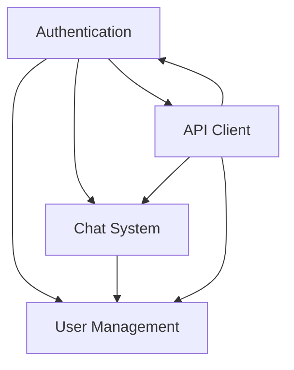

# Features Documentation

This section provides detailed documentation for all major features of the Macro AI application, including implementation details, usage examples, and integration patterns.

## 🎯 Feature Overview

Macro AI includes four core feature domains: **Authentication**, **Chat System**, **User Management**, and **API Client**. Each feature is designed with modularity, type safety, and comprehensive testing in mind.

## 📚 Feature Documentation

### 🔐 Authentication System

**[`./authentication/`](./authentication/README.md)**

Complete AWS Cognito-based authentication with secure token management and comprehensive auth flows.

- **[Authentication Overview](./authentication/README.md)** - Complete auth system documentation
- **[Cognito Integration](./authentication/cognito-integration.md)** - AWS Cognito setup and configuration
- **[Token Management](./authentication/token-management.md)** - JWT and refresh token handling
- **[Security Considerations](./authentication/security-considerations.md)** - Auth security measures and best practices

**Key Features:**

- AWS Cognito user pool integration
- HTTP-only cookie-based token storage
- Automatic token refresh with request queuing
- Comprehensive auth flows (register, login, logout, password reset)
- Protected route middleware

### 💬 Chat System

**[`./chat-system/`](./chat-system/README.md)**

AI-powered chat system with OpenAI integration, streaming responses, and persistent chat history.

- **[Chat System Overview](./chat-system/README.md)** - Complete chat feature documentation
- **[AI Integration](./chat-system/ai-integration.md)** - OpenAI and Vercel AI SDK integration
- **[Streaming Responses](./chat-system/streaming-responses.md)** - Real-time chat implementation
- **[Data Persistence](./chat-system/data-persistence.md)** - Chat storage and retrieval patterns

**Key Features:**

- OpenAI GPT integration with Vercel AI SDK
- Real-time streaming responses
- PostgreSQL chat history with user ownership
- pgvector integration for semantic search
- Comprehensive error handling and retry logic

### 👤 User Management

**[`./user-management/`](./user-management/README.md)**

User profile management with repository pattern data access and comprehensive user operations.

- **[User Management Overview](./user-management/README.md)** - Complete user system documentation
- **[Profile Management](./user-management/profile-management.md)** - User profiles and preferences
- **[Data Access Patterns](./user-management/data-access-patterns.md)** - Repository pattern implementation

**Key Features:**

- User profile creation and management
- Repository pattern for data access
- Drizzle ORM integration
- User ownership verification
- Comprehensive validation with Zod schemas

### 🔌 API Client

**[`./api-client/`](./api-client/README.md)**

Auto-generated TypeScript client with full type safety and modular architecture.

- **[API Client Overview](./api-client/README.md)** - Complete API client documentation
- **[Auto-Generation](./api-client/auto-generation.md)** - OpenAPI client generation process
- **[Usage Examples](./api-client/usage-examples.md)** - Client integration and usage patterns

**Key Features:**

- Auto-generated from OpenAPI specification
- Modular domain-specific clients (Auth, Chat, User)
- Full TypeScript type safety with Zod validation
- Automatic token refresh integration
- Tree-shaking support for optimal bundle size

## 🔄 Feature Integration

### Cross-Feature Interactions

### Shared Patterns

- **Go-Style Error Handling**: Consistent error patterns across all features
- **Repository Pattern**: Clean data access layer separation
- **Type Safety**: End-to-end TypeScript with runtime validation
- **Comprehensive Testing**: Unit and integration tests for all features
- **OpenAPI Integration**: Auto-generated documentation and clients

## 🛠️ Development Patterns

### Feature Development Guidelines

1. **Domain-Driven Design**: Features organized by business domain
2. **Repository Pattern**: Data access abstraction for testability
3. **Service Layer**: Business logic separation from controllers
4. **Comprehensive Validation**: Zod schemas for all data boundaries
5. **Error Handling**: Go-style error tuples throughout

### Testing Strategy

- **Unit Tests**: Individual component and service testing
- **Integration Tests**: Feature interaction testing
- **Mock Strategies**: Comprehensive mocking for external dependencies
- **Type Safety**: Proper TypeScript types in all tests
- **Coverage Goals**: 90%+ test coverage for all features

## 🔗 Related Documentation

- **[Architecture](../architecture/README.md)** - System architecture and design patterns
- **[Development](../development/README.md)** - Development guidelines and standards
- **[Getting Started](../getting-started/README.md)** - Setup and configuration
- **[Reference](../reference/README.md)** - API and configuration reference

## 🎯 Feature Goals

- **User Experience**: Intuitive and responsive user interactions
- **Type Safety**: Comprehensive TypeScript coverage with runtime validation
- **Performance**: Optimized data flows and efficient operations
- **Security**: Robust security model with proper authorization
- **Maintainability**: Clean, well-tested, and documented code
- **Scalability**: Architecture that grows with feature complexity

---

**Explore Features**: [Authentication](./authentication/README.md) | [Chat System](./chat-system/README.md) | [User Management](./user-management/README.md) | [API Client](./api-client/README.md)
