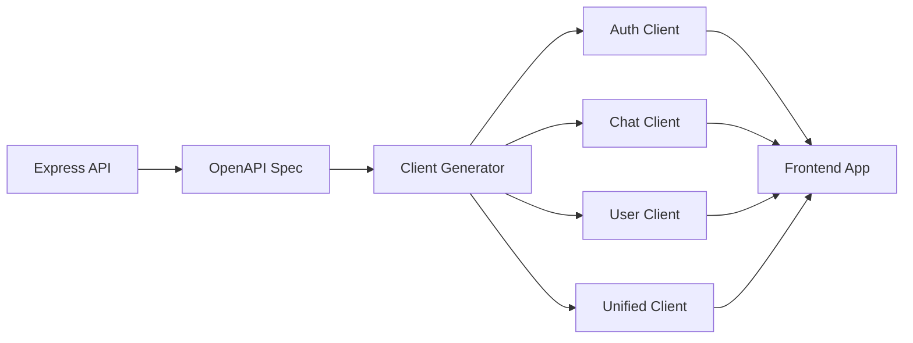

# API Client System

The Macro AI API client provides auto-generated TypeScript clients with full type safety, modular
architecture, and seamless integration with the Express API through OpenAPI specification.

> 📚 **📖 [Unified API Client Guide](./UNIFIED_API_CLIENT_GUIDE.md) - Complete, consolidated documentation**

## 🔌 API Client Overview

Our API client system automatically generates type-safe TypeScript clients from OpenAPI specifications,
providing modular domain-specific clients with comprehensive error handling and token management.

## ✅ Current Implementation Status: COMPLETE

The API client system is fully implemented with auto-generation, modular architecture, and production-ready integration patterns.

## 📚 API Client Documentation

### Core Implementation

- **[Auto-Generation](./auto-generation.md)** - OpenAPI client generation process
  - OpenAPI specification generation from Express routes
  - Automated TypeScript client generation with Zodios
  - Build integration and development workflow
  - Schema validation and type safety
  - Continuous integration with API changes

- **[Usage Examples](./usage-examples.md)** - Client integration and usage patterns
  - Domain-specific client usage (Auth, Chat, User)
  - Error handling patterns and best practices
  - Token refresh integration and interceptors
  - Frontend integration with React and TanStack Query
  - Testing strategies for API client usage

## 🏗️ Architecture Overview

### Auto-Generation Workflow



### Modular Client Architecture

```bash
@repo/macro-ai-api-client/
├── src/
│   ├── clients/
│   │   ├── auth.client.ts      # Authentication operations
│   │   ├── chat.client.ts      # Chat and messaging operations
│   │   ├── user.client.ts      # User management operations
│   │   └── unified.client.ts   # Combined client
│   ├── schemas/
│   │   ├── auth.schemas.ts     # Auth validation schemas
│   │   ├── chat.schemas.ts     # Chat validation schemas
│   │   ├── user.schemas.ts     # User validation schemas
│   │   └── shared.schemas.ts   # Common schemas
│   └── types/
│       └── index.ts            # TypeScript type exports
```

## 🔑 Key Features

### Auto-Generation ✅ COMPLETE

- **OpenAPI Integration**: Automatic spec generation from Express routes
- **Type-Safe Clients**: Full TypeScript support with runtime validation
- **Modular Architecture**: Domain-specific clients for tree-shaking
- **Build Integration**: Automatic generation during development and build
- **Schema Validation**: Zod schemas for request/response validation

### Client Features ✅ COMPLETE

- **Domain Separation**: Auth, Chat, and User clients
- **Token Management**: Automatic token refresh integration
- **Error Handling**: Comprehensive error handling and retry logic
- **Type Safety**: End-to-end type safety from API to client
- **Tree Shaking**: Import only the clients you need

### Development Integration ✅ COMPLETE

- **Hot Reloading**: Automatic client regeneration during development
- **CI/CD Integration**: Automated client updates in build pipeline
- **Version Synchronization**: Clients always match API specification
- **Testing Support**: Mock-friendly client architecture

## 🛠️ Implementation Details

### Client Generation Process

```typescript
// Automatic generation script
export const generateModularClients = async () => {
	// 1. Generate OpenAPI spec from Express routes
	await generateOpenAPISpec()

	// 2. Parse specification and extract domains
	const spec = await parseOpenAPISpec()
	const domains = extractDomains(spec)

	// 3. Generate domain-specific clients
	for (const domain of domains) {
		await generateDomainClient(domain)
	}

	// 4. Generate unified client
	await generateUnifiedClient(domains)

	// 5. Generate TypeScript types
	await generateTypes(spec)
}
```

### Domain-Specific Client Usage

```typescript
// Auth client usage
import { createAuthClient } from '@repo/macro-ai-api-client'

const authClient = createAuthClient({
	baseURL: 'http://localhost:3030',
	headers: {
		'X-API-KEY': process.env.API_KEY,
	},
})

// Type-safe authentication
const [loginResult, loginError] = await tryCatch(
	authClient.login({
		email: 'user@example.com',
		password: 'password123',
	}),
	'AuthClient - login',
)

// Chat client usage
import { createChatClient } from '@repo/macro-ai-api-client'

const chatClient = createChatClient({
	baseURL: 'http://localhost:3030',
	// Automatic token refresh integration
	interceptors: {
		request: [tokenRefreshInterceptor],
	},
})

// Type-safe chat operations
const [chats, chatsError] = await tryCatch(
	chatClient.getChats(),
	'ChatClient - getChats',
)
```

### Unified Client Usage

```typescript
// Combined client for all operations
import { createUnifiedClient } from '@repo/macro-ai-api-client'

const apiClient = createUnifiedClient({
	baseURL: 'http://localhost:3030',
	headers: {
		'X-API-KEY': process.env.API_KEY,
	},
})

// Access all domain operations
const authOps = apiClient.auth
const chatOps = apiClient.chat
const userOps = apiClient.user
```

## 📦 Package Configuration

### Build Configuration

```json
{
	"name": "@repo/macro-ai-api-client",
	"main": "./dist/index.cjs",
	"module": "./dist/index.js",
	"types": "./dist/index.d.ts",
	"scripts": {
		"build": "pnpm generate && tsup",
		"dev": "pnpm generate && tsup --watch",
		"generate": "tsx scripts/generate-modular.ts"
	}
}
```

### Export Strategy

```typescript
// Modular exports for tree-shaking
export {
	createAuthClient,
	createChatClient,
	createUserClient,
	createUnifiedClient,
} from './clients'

// Schema exports for validation
export * from './schemas'

// Type exports for TypeScript
export * from './types'
```

## 🧪 Testing Strategy

### Client Testing ✅ COMPLETE

- **Unit Tests**: Individual client method testing
- **Integration Tests**: End-to-end API integration testing
- **Mock Testing**: Client behavior with mocked responses
- **Type Testing**: TypeScript compilation and type safety testing

### Generation Testing ✅ COMPLETE

- **Spec Generation**: OpenAPI specification accuracy testing
- **Client Generation**: Generated client correctness testing
- **Build Integration**: Automated generation pipeline testing
- **Version Sync**: API-client version synchronization testing

## 🔒 Security Integration

### Token Management ✅ IMPLEMENTED

- **Automatic Refresh**: Seamless token refresh integration
- **Request Interceptors**: Automatic token attachment
- **Error Handling**: Token expiration and refresh error handling
- **Secure Storage**: Integration with secure cookie storage

### API Security ✅ IMPLEMENTED

- **API Key Integration**: Automatic API key header attachment
- **Rate Limiting**: Client-side rate limiting awareness
- **Error Handling**: Comprehensive HTTP error handling
- **Request Validation**: Zod schema validation for all requests

## 📊 Performance Optimization

### Bundle Optimization ✅ IMPLEMENTED

- **Tree Shaking**: Import only needed client modules
- **Code Splitting**: Separate clients for different domains
- **Type Stripping**: Efficient TypeScript compilation
- **Minimal Dependencies**: Lightweight client implementation

### Runtime Optimization ✅ IMPLEMENTED

- **Request Caching**: Intelligent request caching strategies
- **Connection Pooling**: Efficient HTTP connection management
- **Error Recovery**: Automatic retry logic for failed requests
- **Performance Monitoring**: Request timing and performance tracking

## 🔗 Related Documentation

- **[API Development](../../development/api-development.md)** - API development patterns
- **[Authentication](../authentication/README.md)** - Token management integration
- **[Architecture](../../architecture/README.md)** - System architecture overview
- **[Testing Strategy](../../development/testing-strategy.md)** - Testing approaches

## 🎯 API Client Goals

- **Type Safety**: End-to-end type safety from API to client
- **Developer Experience**: Intuitive and efficient client usage
- **Maintainability**: Automatic synchronization with API changes
- **Performance**: Optimized bundle size and runtime performance
- **Reliability**: Robust error handling and recovery mechanisms
- **Modularity**: Clean separation of concerns and tree-shaking support

---

**Implementation Details**: [📖 Unified API Client Guide](./UNIFIED_API_CLIENT_GUIDE.md) - Complete, consolidated documentation
