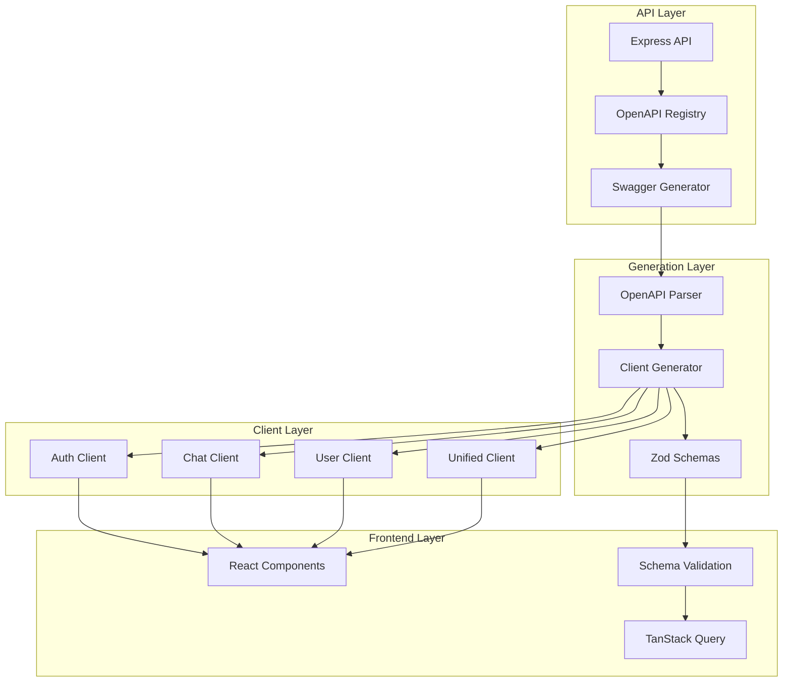
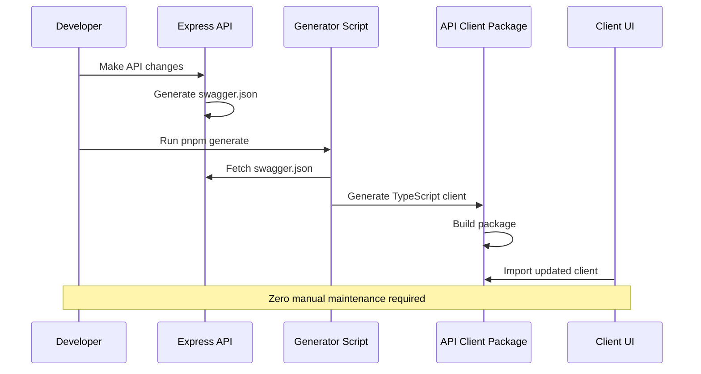
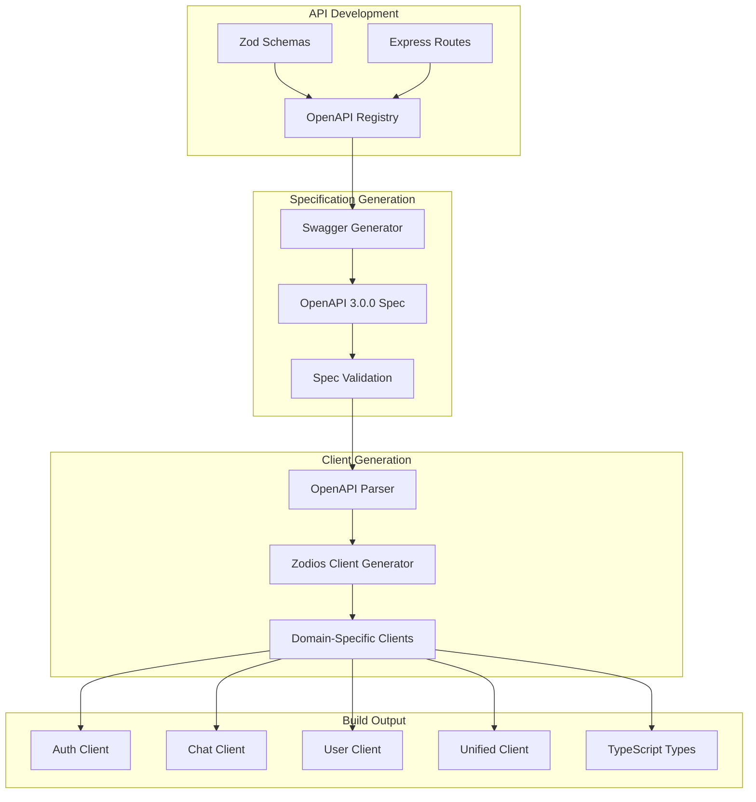

# Unified API Client Guide

## 🎯 **Complete Guide to the Macro AI API Client System**

This is the **definitive guide** for the Macro AI API client system, consolidating all documentation into a single,
comprehensive resource.

---

## 🚀 **Quick Start**

### **Installation**

```bash
# This is a workspace package, installed automatically
pnpm install
```

### **Basic Usage**

```typescript
import {
	createAuthClient,
	createChatClient,
	createUserClient,
} from '@repo/macro-ai-api-client'

// Create domain-specific clients
const authClient = createAuthClient('http://localhost:3030/api')
const chatClient = createChatClient('http://localhost:3030/api')
const userClient = createUserClient('http://localhost:3030/api')

// Make API calls
const loginResponse = await authClient.post('/auth/login', {
	email: 'user@example.com',
	password: 'password123',
})

const chats = await chatClient.get('/chats')
const profile = await userClient.get('/users/me')
```

### **With Custom Configuration**

```typescript
import { createAuthClient } from '@repo/macro-ai-api-client'

const authClient = createAuthClient('http://localhost:3030/api', {
	axiosConfig: {
		headers: {
			'X-API-KEY': 'your-api-key',
		},
		withCredentials: true,
	},
})
```

---

## 🏗️ **Architecture Overview**

### **System Architecture**



### **Package Structure**

```bash
@repo/macro-ai-api-client/
├── src/
│   ├── clients/           # Auto-generated clients
│   │   ├── auth.client.ts      # Authentication operations
│   │   ├── chat.client.ts      # Chat and messaging operations
│   │   ├── user.client.ts      # User management operations
│   │   ├── unified.client.ts   # Combined client
│   │   └── index.ts            # Client exports
│   ├── schemas/           # Auto-generated Zod schemas
│   │   ├── auth.schemas.ts     # Auth validation schemas
│   │   ├── chat.schemas.ts     # Chat validation schemas
│   │   ├── user.schemas.ts     # User validation schemas
│   │   ├── shared.schemas.ts   # Common schemas
│   │   └── index.ts            # Schema exports
│   └── types/             # TypeScript type definitions
│       └── index.ts            # Type exports
├── scripts/               # Generation scripts
│   ├── generate-modular.ts     # Main generation script
│   └── utils/                  # Generation utilities
└── dist/                  # Built distribution
```

### **API Domains**

| Domain     | Endpoints   | Description                                        |
| ---------- | ----------- | -------------------------------------------------- |
| **Auth**   | 9 endpoints | Registration, login, password reset, token refresh |
| **Chat**   | 6 endpoints | Chat CRUD operations, streaming responses          |
| **User**   | 2 endpoints | User profile management                            |
| **System** | 2 endpoints | Health checks, system information                  |

---

## 🔌 **Client Usage**

### **Domain-Specific Clients**

#### **Authentication Client**

```typescript
import { createAuthClient } from '@repo/macro-ai-api-client'

const authClient = createAuthClient('http://localhost:3030/api')

// User registration
const registerResponse = await authClient.post('/auth/register', {
	email: 'user@example.com',
	password: 'securePassword123',
	username: 'newuser',
})

// User login
const loginResponse = await authClient.post('/auth/login', {
	email: 'user@example.com',
	password: 'securePassword123',
})

// Password reset
await authClient.post('/auth/forgotPassword', {
	email: 'user@example.com',
})

// Confirm password reset
await authClient.post('/auth/confirmForgotPassword', {
	email: 'user@example.com',
	code: '123456',
	newPassword: 'newSecurePassword123',
})
```

#### **Chat Client**

```typescript
import { createChatClient } from '@repo/macro-ai-api-client'

const chatClient = createChatClient('http://localhost:3030/api')

// Get all chats
const chats = await chatClient.get('/chats')

// Create new chat
const newChat = await chatClient.post('/chats', {
	title: 'New Conversation',
	message: 'Hello, how can you help me today?',
})

// Update chat
await chatClient.put('/chats/123', {
	title: 'Updated Title',
})

// Delete chat
await chatClient.delete('/chats/123')

// Stream chat response
const streamResponse = await chatClient.post('/chats/123/stream', {
	message: 'What is the capital of France?',
})
```

#### **User Client**

```typescript
import { createUserClient } from '@repo/macro-ai-api-client'

const userClient = createUserClient('http://localhost:3030/api')

// Get user profile
const profile = await userClient.get('/users/me')

// Update user profile
await userClient.put('/users/me', {
	username: 'updatedUsername',
	email: 'newemail@example.com',
})
```

### **Unified Client**

```typescript
import { createUnifiedClient } from '@repo/macro-ai-api-client'

const api = createUnifiedClient('http://localhost:3030/api')

// Use all domains through single client
const loginResponse = await api.post('/auth/login', loginData)
const chats = await api.get('/chats')
const profile = await api.get('/users/me')
```

---

## ⚙️ **Auto Generation System**

### **How It Works**

The API client system uses **automatic code generation** to ensure perfect synchronization with the backend API:

1. **Express API** generates OpenAPI 3.0.0 specification
2. **Generation Script** parses the specification and creates domain-specific clients
3. **Zod Schemas** are automatically generated for request/response validation
4. **TypeScript Types** are extracted for full type safety
5. **Build Integration** ensures generation runs automatically during development

### **Generation Workflow**



### **Available Scripts**

```bash
# Development with auto-generation
pnpm dev

# Build with auto-generation
pnpm build

# Manual regeneration
pnpm generate

# Type checking
pnpm type-check

# Run tests
pnpm test
```

### **Generation Process**

```typescript
// scripts/generate-modular.ts
import { generateModularClients } from './utils/file-generator'

async function main() {
	// 1. Parse OpenAPI specification
	const spec = await parseOpenAPISpec()

	// 2. Generate domain-specific clients
	await generateModularClients(spec)

	// 3. Generate Zod schemas
	await generateSchemas(spec)

	// 4. Update type exports
	await updateTypeExports(spec)
}
```

### **Detailed Generation Architecture**

The auto-generation system uses a sophisticated pipeline to ensure perfect synchronization:



### **OpenAPI Specification Generation**

The Express API automatically generates OpenAPI 3.0.0 specifications:

```typescript
// apps/express-api/src/utils/swagger/generate-swagger.ts
import { OpenAPIGenerator } from '@asteasolutions/zod-to-openapi'
import fs from 'fs/promises'
import path from 'path'

import { registry } from './openapi-registry.ts'

/**
 * Generate OpenAPI 3.0.0 specification from registered schemas and routes
 */
export async function generateSwaggerSpec(): Promise<void> {
	const generator = new OpenAPIGenerator(registry.definitions, '3.0.0')

	const document = generator.generateDocument({
		openapi: '3.0.0',
		info: {
			title: 'Macro AI API',
			version: '1.0.0',
			description: 'Complete API specification for Macro AI application',
		},
		servers: [
			{ url: 'http://localhost:3030/api', description: 'Development' },
			{ url: 'https://api.macroai.com/api', description: 'Production' },
		],
		components: {
			securitySchemes: {
				cookieAuth: { type: 'apiKey', in: 'cookie', name: 'auth-token' },
				apiKey: { type: 'apiKey', in: 'header', name: 'X-API-KEY' },
			},
		},
	})

	// Write specification to public directory
	await fs.writeFile(
		path.join(process.cwd(), 'public', 'swagger.json'),
		JSON.stringify(document, null, 2),
	)
}
```

---

## 📊 **Implementation Status**

### **Current Implementation Status ✅ PRODUCTION-READY**

The API client system is **fully implemented and production-ready** with zero-maintenance client generation and complete
type safety.

#### **Express API Swagger Documentation ✅ COMPLETE**

- ✅ Authentication schemes configured (cookieAuth, apiKey)
- ✅ Comprehensive OpenAPI 3.0.0 specification generation
- ✅ All request/response schemas with detailed descriptions
- ✅ Complete error response documentation with HTTP status codes
- ✅ Rate limiting documentation included in API description
- ✅ Swagger UI served at `/api-docs` with explorer enabled

#### **API Client Package ✅ COMPLETE**

- ✅ Directory: `packages/macro-ai-api-client` with proper workspace setup
- ✅ Package.json with correct dependencies and scripts
- ✅ TypeScript configuration using base config from `packages/config-typescript`
- ✅ Build process with `tsup.config.ts` for CJS/ESM dual output
- ✅ ESLint configuration with proper ignores for generated files

#### **OpenAPI Client Generation ✅ COMPLETE**

- ✅ Automated generation script using `openapi-zod-client`
- ✅ Fetches OpenAPI spec from Express API (`public/swagger.json`)
- ✅ Generates TypeScript client with Zod validation
- ✅ Custom wrappers for authentication and error handling
- ✅ Integrated build process: `pnpm generate && tsup`

#### **Client UI Integration ✅ COMPLETE**

- ✅ Updated `package.json` with `@repo/macro-ai-api-client` dependency
- ✅ TanStack Router with proper route configuration
- ✅ TanStack Query for API state management
- ✅ Proper TypeScript configuration with path aliases
- ✅ Generated API client integration in `src/lib/api/index.ts`
- ✅ Axios interceptors for automatic token refresh
- ✅ Request queuing during token refresh operations
- ✅ Cookie-based authentication with proper credential handling
- ✅ Standardized error handling with `standardizeError`

---

## 🔗 **Integration Patterns**

### **React + TanStack Query Integration**

```typescript
import { useQuery, useMutation, useQueryClient } from '@tanstack/react-query'
import { createChatClient } from '@repo/macro-ai-api-client'

const chatClient = createChatClient('http://localhost:3030/api')

// Query hook for chats
export function useChats() {
	return useQuery({
		queryKey: ['chats'],
		queryFn: () => chatClient.get('/chats'),
	})
}

// Mutation hook for creating chat
export function useCreateChat() {
	const queryClient = useQueryClient()

	return useMutation({
		mutationFn: (data: CreateChatData) =>
			chatClient.post('/chats', data),
		onSuccess: () => {
			queryClient.invalidateQueries({ queryKey: ['chats'] })
		},
	})
}

// Usage in component
function ChatList() {
	const { data: chats, isLoading } = useChats()
	const createChat = useCreateChat()

	if (isLoading) return <div>Loading...</div>

	return (
		<div>
			{chats?.map(chat => (
				<div key={chat.id}>{chat.title}</div>
			))}
			<button onClick={() => createChat.mutate({ title: 'New Chat' })}>
				Create Chat
			</button>
		</div>
	)
}
```

### **Error Handling Integration**

```typescript
import { createAuthClient } from '@repo/macro-ai-api-client'
import { standardizeError } from '@repo/macro-ai-api-client'

const authClient = createAuthClient('http://localhost:3030/api')

async function handleLogin(credentials: LoginCredentials) {
	try {
		const response = await authClient.post('/auth/login', credentials)
		return response.data
	} catch (error) {
		// Standardize error format
		const standardizedError = standardizeError(error)

		// Handle specific error types
		if (standardizedError.code === 'INVALID_CREDENTIALS') {
			throw new Error('Invalid email or password')
		}

		if (standardizedError.code === 'ACCOUNT_LOCKED') {
			throw new Error('Account temporarily locked')
		}

		throw standardizedError
	}
}
```

### **Token Management Integration**

```typescript
import { createAuthClient } from '@repo/macro-ai-api-client'

const authClient = createAuthClient('http://localhost:3030/api', {
	axiosConfig: {
		withCredentials: true, // Enable cookie-based auth
	},
})

// Token refresh interceptor
authClient.interceptors.response.use(
	(response) => response,
	async (error) => {
		if (error.response?.status === 401) {
			// Attempt token refresh
			try {
				await authClient.post('/auth/refresh')
				// Retry original request
				return authClient.request(error.config)
			} catch (refreshError) {
				// Redirect to login
				window.location.href = '/login'
			}
		}
		return Promise.reject(error)
	},
)
```

### **Advanced Service Pattern**

```typescript
// apps/client-ui/src/services/auth/auth.service.ts
import { createAuthClient, tryCatch } from '@repo/macro-ai-api-client'
import type { AuthPostRegisterRequest, AuthPostRegisterResponse } from '@repo/macro-ai-api-client'

export class AuthService {
  private authClient = createAuthClient(import.meta.env.VITE_API_URL)

  /**
   * Register a new user account
   */
  async register(
    userData: AuthPostRegisterRequest
  ): Promise<Result<AuthPostRegisterResponse>> {
    const [response, error] = await tryCatch(
      this.authClient.post('/auth/register', userData),
      'AuthService.register'
    )

    if (error) {
      return [null, error]
    }

    // Response is fully typed
    console.log('Registration successful:', response.message)
    console.log('User ID:', response.user.id)

    return [response, null]
  }

  /**
   * Login user with credentials
   */
  async login(credentials: AuthPostLoginRequest): Promise<Result<AuthPostLoginResponse>> {
    const [response, error] = await tryCatch(
      this.authClient.post('/auth/login', credentials),
      'AuthService.login'
    )

    if (error) {
      return [null, error]
    }

    return [response, null]
  }
}

// Usage in React component
export function RegisterForm() {
  const authService = new AuthService()

  const handleRegister = async (formData: AuthPostRegisterRequest) => {
    const [result, error] = await authService.register(formData)

    if (error) {
      console.error('Registration failed:', error.message)
      return
    }

    console.log('Registration successful:', result)
  }

  return (
    <form onSubmit={handleSubmit(handleRegister)}>
      {/* Form fields */}
    </form>
  )
}
```

---

## ❌ **Error Handling**

### **Error Types**

The API client provides comprehensive error handling with standardized error formats:

```typescript
interface ApiError {
	code: string
	message: string
	details?: Record<string, any>
	statusCode: number
	timestamp: string
}
```

### **Common Error Codes**

| Error Code         | Description               | HTTP Status |
| ------------------ | ------------------------- | ----------- |
| `VALIDATION_ERROR` | Request validation failed | 400         |
| `UNAUTHORIZED`     | Authentication required   | 401         |
| `FORBIDDEN`        | Insufficient permissions  | 403         |
| `NOT_FOUND`        | Resource not found        | 404         |
| `RATE_LIMITED`     | Too many requests         | 429         |
| `INTERNAL_ERROR`   | Server error              | 500         |

### **Error Handling Patterns**

```typescript
import { createChatClient } from '@repo/macro-ai-api-client'

const chatClient = createChatClient('http://localhost:3030/api')

async function createChatSafely(chatData: CreateChatData) {
	try {
		const response = await chatClient.post('/chats', chatData)
		return { success: true, data: response.data }
	} catch (error) {
		if (error.response?.status === 400) {
			return {
				success: false,
				error: 'Invalid chat data provided',
			}
		}

		if (error.response?.status === 429) {
			return {
				success: false,
				error: 'Too many requests. Please try again later.',
			}
		}

		return {
			success: false,
			error: 'An unexpected error occurred',
		}
	}
}
```

---

## 🧪 **Testing & Development**

### **Testing Strategy**

#### **Unit Testing**

```typescript
// __tests__/api-client.test.ts
import { createAuthClient } from '@repo/macro-ai-api-client'

describe('Auth Client', () => {
	let authClient: ReturnType<typeof createAuthClient>

	beforeEach(() => {
		authClient = createAuthClient('http://localhost:3030/api')
	})

	it('should create client with correct base URL', () => {
		expect(authClient.defaults.baseURL).toBe('http://localhost:3030/api')
	})

	it('should handle login request', async () => {
		const mockResponse = { data: { token: 'mock-token' } }
		jest.spyOn(authClient, 'post').mockResolvedValue(mockResponse)

		const result = await authClient.post('/auth/login', {
			email: 'test@example.com',
			password: 'password123',
		})

		expect(result.data.token).toBe('mock-token')
	})
})
```

#### **Integration Testing**

```typescript
// __tests__/integration.test.ts
import { createChatClient } from '@repo/macro-ai-api-client'

describe('Chat Client Integration', () => {
	let chatClient: ReturnType<typeof createChatClient>

	beforeAll(async () => {
		// Setup test database
		await setupTestDatabase()

		chatClient = createChatClient('http://localhost:3030/api')
	})

	it('should create and retrieve chat', async () => {
		// Create chat
		const createResponse = await chatClient.post('/chats', {
			title: 'Test Chat',
			message: 'Hello, world!',
		})

		expect(createResponse.status).toBe(201)
		expect(createResponse.data.title).toBe('Test Chat')

		// Retrieve chat
		const chatId = createResponse.data.id
		const getResponse = await chatClient.get(`/chats/${chatId}`)

		expect(getResponse.status).toBe(200)
		expect(getResponse.data.id).toBe(chatId)
	})
})
```

### **Development Workflow**

1. **Make API Changes**: Modify Express routes or schemas
2. **Generate Specification**: Express API generates updated OpenAPI spec
3. **Regenerate Client**: Run `pnpm generate` to update clients
4. **Test Changes**: Run `pnpm test` to ensure compatibility
5. **Update Frontend**: Import updated clients in frontend code
6. **Verify Integration**: Test end-to-end functionality

### **Debugging Tips**

- **Check Generation Logs**: Look for errors in `pnpm generate` output
- **Verify OpenAPI Spec**: Ensure `swagger.json` is valid and up-to-date
- **Type Checking**: Run `pnpm type-check` to catch type mismatches
- **Schema Validation**: Verify Zod schemas match API responses
- **Network Inspection**: Use browser dev tools to inspect API requests

---

## ⚡ **Performance & Optimization**

### **Bundle Optimization**

#### **Tree Shaking**

```typescript
// ✅ Good: Import only what you need
import { createAuthClient } from '@repo/macro-ai-api-client'

// ❌ Avoid: Import entire package
import * as ApiClient from '@repo/macro-ai-api-client'
```

#### **Code Splitting**

```typescript
// Lazy load clients for different routes
const AuthClient = lazy(() =>
	import('@repo/macro-ai-api-client').then((m) => ({
		default: m.createAuthClient,
	})),
)
const ChatClient = lazy(() =>
	import('@repo/macro-ai-api-client').then((m) => ({
		default: m.createChatClient,
	})),
)
```

### **Runtime Optimization**

#### **Request Caching**

```typescript
import { useQuery } from '@tanstack/react-query'

// Enable caching for frequently accessed data
const { data: userProfile } = useQuery({
	queryKey: ['user', 'profile'],
	queryFn: () => userClient.get('/users/me'),
	staleTime: 5 * 60 * 1000, // 5 minutes
	cacheTime: 10 * 60 * 1000, // 10 minutes
})
```

#### **Connection Pooling**

```typescript
import { createAuthClient } from '@repo/macro-ai-api-client'

// Reuse client instances
const authClient = createAuthClient('http://localhost:3030/api', {
	axiosConfig: {
		// Enable connection pooling
		httpAgent: new http.Agent({ keepAlive: true }),
		httpsAgent: new https.Agent({ keepAlive: true }),
	},
})
```

### **Performance Monitoring**

```typescript
import { createChatClient } from '@repo/macro-ai-api-client'

const chatClient = createChatClient('http://localhost:3030/api')

// Add performance monitoring
chatClient.interceptors.request.use((config) => {
	config.metadata = { startTime: Date.now() }
	return config
})

chatClient.interceptors.response.use(
	(response) => {
		const duration = Date.now() - response.config.metadata.startTime
		console.log(`Request to ${response.config.url} took ${duration}ms`)
		return response
	},
	(error) => {
		const duration = Date.now() - error.config.metadata.startTime
		console.error(`Request to ${error.config.url} failed after ${duration}ms`)
		return Promise.reject(error)
	},
)
```

---

## 🔒 **Security & Authentication**

### **Token Management**

#### **Automatic Token Refresh**

```typescript
import { createAuthClient } from '@repo/macro-ai-api-client'

const authClient = createAuthClient('http://localhost:3030/api', {
	axiosConfig: {
		withCredentials: true,
	},
})

// Token refresh interceptor
authClient.interceptors.response.use(
	(response) => response,
	async (error) => {
		if (error.response?.status === 401) {
			try {
				// Attempt token refresh
				await authClient.post('/auth/refresh')

				// Retry original request
				const originalRequest = error.config
				return authClient.request(originalRequest)
			} catch (refreshError) {
				// Redirect to login on refresh failure
				window.location.href = '/login'
				return Promise.reject(refreshError)
			}
		}
		return Promise.reject(error)
	},
)
```

#### **Secure Token Storage**

```typescript
// Use secure, httpOnly cookies for token storage
// Configured in Express API with secure cookie options

const authClient = createAuthClient('http://localhost:3030/api', {
	axiosConfig: {
		withCredentials: true, // Include cookies in requests
	},
})
```

### **API Security**

#### **API Key Integration**

```typescript
import { createChatClient } from '@repo/macro-ai-api-client'

const chatClient = createChatClient('http://localhost:3030/api', {
	axiosConfig: {
		headers: {
			'X-API-KEY': process.env.REACT_APP_API_KEY,
		},
	},
})
```

#### **Request Validation**

```typescript
import { createUserClient } from '@repo/macro-ai-api-client'
import { putUsersme_Body } from '@repo/macro-ai-api-client'

const userClient = createUserClient('http://localhost:3030/api')

async function updateProfile(profileData: any) {
	// Validate request data with Zod schema
	const validatedData = putUsersme_Body.parse(profileData)

	// Make validated request
	const response = await userClient.put('/users/me', validatedData)
	return response.data
}
```

### **Security Best Practices**

1. **Never expose API keys in client-side code**
2. **Use HTTPS for all API communications**
3. **Implement proper CORS policies**
4. **Validate all request data with Zod schemas**
5. **Use secure cookie storage for authentication tokens**
6. **Implement rate limiting and request throttling**
7. **Monitor and log security-related events**

---

## 🔧 **Troubleshooting**

### **Common Issues**

#### **Generation Errors**

```bash
# Error: OpenAPI specification not found
# Solution: Ensure Express API is running and generating swagger.json

# Error: Schema validation failed
# Solution: Check Zod schema definitions in Express API

# Error: Type generation failed
# Solution: Verify TypeScript configuration and dependencies
```

#### **Runtime Errors**

```typescript
// Error: Client not found
// Solution: Ensure proper import path and package installation

// Error: Schema validation failed
// Solution: Check request data matches expected schema

// Error: Network request failed
// Solution: Verify API endpoint availability and CORS configuration
```

#### **Type Errors**

```typescript
// Error: Type 'X' is not assignable to type 'Y'
// Solution: Regenerate client with `pnpm generate`

// Error: Property 'X' does not exist on type 'Y'
// Solution: Check API specification for correct property names

// Error: Missing required property 'X'
// Solution: Ensure all required properties are provided in requests
```

### **Debugging Steps**

1. **Check Generation Logs**: Run `pnpm generate` and review output
2. **Verify OpenAPI Spec**: Check `swagger.json` for accuracy
3. **Test API Endpoints**: Use tools like Postman to test API directly
4. **Check Type Definitions**: Run `pnpm type-check` for type errors
5. **Review Network Requests**: Use browser dev tools to inspect API calls
6. **Validate Schemas**: Test Zod schema validation with sample data

### **Getting Help**

- **Check Documentation**: Review this guide and related documentation
- **Review Issues**: Check GitHub issues for similar problems
- **Test Reproducibly**: Create minimal test case to reproduce issue
- **Provide Context**: Include error messages, code examples, and environment details
- **Community Support**: Reach out through GitHub discussions or issues

---

## 📚 **Additional Resources**

### **Related Documentation**

- **[API Development Guide](../../development/api-development.md)** - API development patterns
- **[Authentication System](../authentication/README.md)** - Token management and security
- **[Testing Strategy](../../development/testing-strategy.md)** - Testing approaches and best practices
- **[Architecture Overview](../../architecture/README.md)** - System architecture and design decisions

### **External Resources**

- **[Zod Documentation](https://zod.dev/)** - Schema validation library
- **[Zodios Documentation](https://github.com/astahmer/zodios)** - HTTP client library
- **[OpenAPI Specification](https://swagger.io/specification/)** - API specification standard
- **[TanStack Query](https://tanstack.com/query/latest)** - Data fetching and caching

### **Examples & Templates**

- **[Usage Examples](./usage-examples.md)** - Practical code examples
- **[Auto-Generation Details](./auto-generation.md)** - Generation process documentation
- **[Implementation Status](./implementation-status.md)** - Current implementation details

---

## 🎉 **Conclusion**

The Macro AI API client system provides a **production-ready, fully automated** solution for type-safe API communication.
With automatic code generation, comprehensive error handling, and seamless integration patterns, it eliminates the maintenance
overhead typically associated with API clients while ensuring perfect synchronization with the backend API.

**Key Benefits:**

- ✅ **Zero Manual Maintenance** - Always in sync with API changes
- ✅ **Full Type Safety** - End-to-end TypeScript support
- ✅ **Modular Architecture** - Tree-shaking and code splitting support
- ✅ **Comprehensive Error Handling** - Standardized error formats and recovery
- ✅ **Production Ready** - Tested, optimized, and battle-tested
- ✅ **Developer Friendly** - Intuitive API and comprehensive documentation

**Next Steps:**

1. **Explore Usage Examples** - Review practical integration patterns
2. **Understand Auto-Generation** - Learn how the system stays in sync
3. **Implement Integration** - Start using the clients in your application
4. **Customize & Extend** - Adapt the system to your specific needs

---

**Last Updated**: August 31, 2025  
**Version**: 2.0.0  
**Status**: Production Ready ✅

> 💡 **This guide is the single source of truth for all API client documentation. For questions or issues, refer to this
> guide first.**
