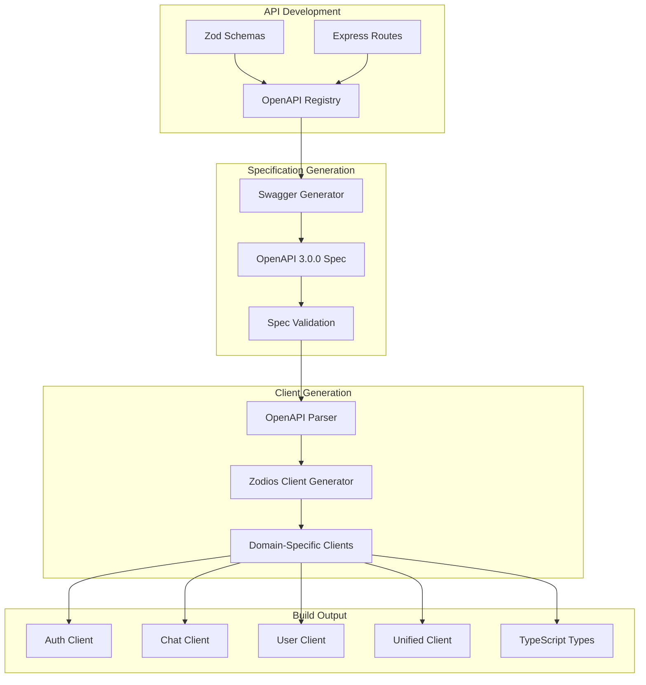
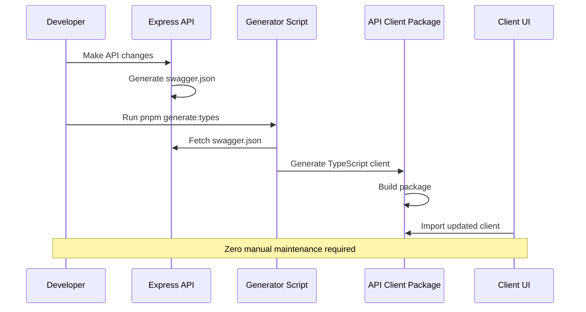

# API Client Auto-Generation

## Current Implementation Status ✅ PRODUCTION-READY

This document provides comprehensive documentation of the API client auto-generation system in the Macro AI
application, including OpenAPI specification generation, TypeScript client creation, and automated build processes.
The auto-generation system is **fully implemented and production-ready** with zero-maintenance client generation
and complete type safety.

## 🔄 Auto-Generation Architecture

### Generation Pipeline Overview ✅ IMPLEMENTED



### Generation Workflow ✅ AUTOMATED



## 🛠️ OpenAPI Specification Generation

### Swagger Generation Process ✅ IMPLEMENTED

```typescript
// apps/express-api/src/utils/swagger/generate-swagger.ts
import { OpenAPIGenerator } from '@asteasolutions/zod-to-openapi'
import fs from 'fs/promises'
import path from 'path'

import { registry } from './openapi-registry.ts'

/**
 * Generate OpenAPI 3.0.0 specification from registered schemas and routes
 */
export async function generateSwaggerSpec(): Promise<void> {
	const generator = new OpenAPIGenerator(registry.definitions, '3.0.0')

	const document = generator.generateDocument({
		openapi: '3.0.0',
		info: {
			version: '1.0.0',
			title: 'Macro AI API',
			description: 'Comprehensive API for the Macro AI application',
			contact: {
				name: 'Macro AI Team',
				email: 'support@macro-ai.com',
			},
			license: {
				name: 'MIT',
				url: 'https://opensource.org/licenses/MIT',
			},
		},
		servers: [
			{
				url: 'http://localhost:3030/api',
				description: 'Development server',
			},
			{
				url: 'https://api.macro-ai.com/api',
				description: 'Production server',
			},
		],
		security: [
			{
				bearerAuth: [],
			},
			{
				apiKey: [],
			},
		],
		components: {
			securitySchemes: {
				bearerAuth: {
					type: 'http',
					scheme: 'bearer',
					bearerFormat: 'JWT',
				},
				apiKey: {
					type: 'apiKey',
					in: 'header',
					name: 'X-API-KEY',
				},
			},
		},
	})

	// Write specification to file
	const outputPath = path.join(process.cwd(), 'swagger.json')
	await fs.writeFile(outputPath, JSON.stringify(document, null, 2))

	console.log('✅ OpenAPI specification generated successfully')
	console.log(`📄 Specification written to: ${outputPath}`)
	console.log(`🌐 Swagger UI available at: http://localhost:3030/api-docs`)
}

// Auto-generate on module load in development
if (process.env.NODE_ENV === 'development') {
	generateSwaggerSpec().catch(console.error)
}
```

### Schema Registration System ✅ IMPLEMENTED

```typescript
// apps/express-api/src/utils/swagger/openapi-registry.ts
import {
	extendZodWithOpenApi,
	OpenAPIRegistry,
	OpenApiGeneratorV3,
} from '@asteasolutions/zod-to-openapi'
import { z } from 'zod'

// Extend Zod with OpenAPI functionality
extendZodWithOpenApi(z)

// Create global registry instance
export const registry = new OpenAPIRegistry()

/**
 * Register a Zod schema with OpenAPI metadata
 */
export function registerZodSchema<T extends z.ZodTypeAny>(
	name: string,
	schema: T,
): T {
	registry.register(name, schema)
	return schema
}

/**
 * Register an API route with OpenAPI documentation
 */
export function registerApiRoute(config: {
	method: 'get' | 'post' | 'put' | 'patch' | 'delete'
	path: string
	summary: string
	description?: string
	tags?: string[]
	request?: {
		params?: z.ZodTypeAny
		query?: z.ZodTypeAny
		body?: {
			content: {
				'application/json': {
					schema: z.ZodTypeAny
				}
			}
		}
	}
	responses: {
		[statusCode: string]: {
			description: string
			content?: {
				'application/json': {
					schema: z.ZodTypeAny
				}
			}
		}
	}
	security?: Array<{ [key: string]: string[] }>
}): void {
	registry.registerPath({
		method: config.method,
		path: config.path,
		summary: config.summary,
		description: config.description,
		tags: config.tags,
		request: config.request,
		responses: config.responses,
		security: config.security,
	})
}

// Export registry for use in generation
export { registry }
```

### Route Registration Example ✅ IMPLEMENTED

```typescript
// apps/express-api/src/features/chat/chat.routes.ts
import {
	registerApiRoute,
	registerZodSchema,
} from '../../utils/swagger/openapi-registry.ts'

// Register schemas
const createChatRequestSchema = registerZodSchema(
	'CreateChatRequest',
	z
		.object({
			title: z.string().min(1).max(255).openapi({
				description: 'Chat title',
				example: 'My New Chat',
			}),
		})
		.openapi({
			description: 'Request body for creating a new chat',
		}),
)

const chatResponseSchema = registerZodSchema(
	'ChatResponse',
	z
		.object({
			success: z.boolean(),
			data: selectChatSchema,
		})
		.openapi({
			description: 'Successful chat response',
		}),
)

// Register route
registerApiRoute({
	method: 'post',
	path: '/api/chats',
	summary: 'Create a new chat',
	description: 'Creates a new chat conversation for the authenticated user',
	tags: ['Chat'],
	request: {
		body: {
			content: {
				'application/json': {
					schema: createChatRequestSchema,
				},
			},
		},
	},
	responses: {
		'201': {
			description: 'Chat created successfully',
			content: {
				'application/json': {
					schema: chatResponseSchema,
				},
			},
		},
		'400': {
			description: 'Invalid request data',
			content: {
				'application/json': {
					schema: errorResponseSchema,
				},
			},
		},
		'401': {
			description: 'Authentication required',
			content: {
				'application/json': {
					schema: errorResponseSchema,
				},
			},
		},
	},
	security: [{ bearerAuth: [] }],
})
```

## 🏗️ Client Generation Process

### Modular Generation Script ✅ IMPLEMENTED

```typescript
// packages/macro-ai-api-client/scripts/generate-modular.ts
import { generateZodClientFromOpenAPI } from 'openapi-zod-client'
import type { OpenAPIObject } from 'openapi3-ts'
import type { Options } from 'prettier'
import fs from 'fs/promises'
import path from 'path'

/**
 * Main generation function
 */
async function main() {
	const swaggerUrl = 'http://localhost:3030/swagger.json'
	const outputDir = path.join(process.cwd(), 'src')

	try {
		console.log('🔄 Fetching OpenAPI specification...')
		const response = await fetch(swaggerUrl)

		if (!response.ok) {
			throw new Error(`Failed to fetch OpenAPI spec: ${response.statusText}`)
		}

		const openApiDoc: OpenAPIObject = await response.json()

		console.log('📋 Validating OpenAPI specification...')
		validateOpenApiSpec(openApiDoc)

		console.log('🎨 Loading Prettier configuration...')
		const prettierConfig = await loadPrettierConfig()

		console.log('🏗️ Generating domain-specific clients...')
		await generateDomainClients(openApiDoc, outputDir, prettierConfig)

		console.log('🔗 Generating unified client...')
		await generateUnifiedClient(outputDir, prettierConfig)

		console.log('📝 Generating TypeScript types...')
		await generateTypeDefinitions(openApiDoc, outputDir, prettierConfig)

		console.log('✅ API client generation completed successfully')
	} catch (error) {
		console.error('❌ Failed to generate API client:', error)
		process.exit(1)
	}
}

/**
 * Generate domain-specific clients (auth, chat, user)
 */
async function generateDomainClients(
	openApiDoc: OpenAPIObject,
	outputDir: string,
	prettierConfig: Options | null,
) {
	const domainGroups = parseEndpointsByDomain(openApiDoc)
	const domains = ['auth', 'chat', 'user'] as const

	for (const domain of domains) {
		const endpoints = domainGroups[domain]

		if (endpoints.length > 0) {
			console.log(`  📦 Generating ${domain} client...`)
			await generateDomainClient(
				domain,
				endpoints,
				openApiDoc,
				outputDir,
				prettierConfig,
			)
		}
	}
}

/**
 * Generate individual domain client
 */
async function generateDomainClient(
	domain: string,
	endpoints: any[],
	openApiDoc: OpenAPIObject,
	outputDir: string,
	prettierConfig: Options | null,
) {
	// Create domain-specific OpenAPI spec
	const domainSpec: OpenAPIObject = {
		...openApiDoc,
		paths: endpoints.reduce((acc, endpoint) => {
			acc[endpoint.path] = openApiDoc.paths?.[endpoint.path]
			return acc
		}, {}),
	}

	// Generate client using openapi-zod-client
	const { sourceCode } = await generateZodClientFromOpenAPI({
		openApiDoc: domainSpec,
		options: {
			shouldExportAllTypes: true,
			withAlias: true,
			baseUrl: process.env.VITE_API_URL || 'http://localhost:3030/api',
		},
	})

	// Write domain client file
	const clientPath = path.join(outputDir, 'clients', `${domain}.client.ts`)
	await fs.mkdir(path.dirname(clientPath), { recursive: true })

	const formattedCode = await formatCode(sourceCode, prettierConfig)
	await fs.writeFile(clientPath, formattedCode)

	console.log(`    ✅ ${domain} client generated`)
}

/**
 * Parse endpoints by domain from OpenAPI spec
 */
function parseEndpointsByDomain(
	openApiDoc: OpenAPIObject,
): Record<string, any[]> {
	const domainGroups: Record<string, any[]> = {
		auth: [],
		chat: [],
		user: [],
		system: [],
	}

	if (!openApiDoc.paths) return domainGroups

	for (const [path, pathItem] of Object.entries(openApiDoc.paths)) {
		if (!pathItem) continue

		// Determine domain from path
		let domain = 'system'
		if (path.startsWith('/api/auth')) domain = 'auth'
		else if (path.startsWith('/api/chats')) domain = 'chat'
		else if (path.startsWith('/api/users')) domain = 'user'

		// Add endpoint to appropriate domain
		for (const [method, operation] of Object.entries(pathItem)) {
			if (operation && typeof operation === 'object') {
				domainGroups[domain].push({
					path,
					method,
					operation,
				})
			}
		}
	}

	return domainGroups
}

/**
 * Validate OpenAPI specification
 */
function validateOpenApiSpec(openApiDoc: OpenAPIObject): void {
	if (!openApiDoc.openapi) {
		throw new Error('Invalid OpenAPI specification: missing openapi version')
	}

	if (!openApiDoc.info) {
		throw new Error('Invalid OpenAPI specification: missing info section')
	}

	if (!openApiDoc.paths || Object.keys(openApiDoc.paths).length === 0) {
		throw new Error('Invalid OpenAPI specification: no paths defined')
	}

	console.log(`  ✅ Valid OpenAPI ${openApiDoc.openapi} specification`)
	console.log(`  📊 Found ${Object.keys(openApiDoc.paths).length} endpoints`)
}

/**
 * Load Prettier configuration
 */
async function loadPrettierConfig(): Promise<Options | null> {
	try {
		const { resolveConfig } = await import('prettier')
		return await resolveConfig(process.cwd())
	} catch (error) {
		console.warn('⚠️ Could not load Prettier config, using defaults')
		return null
	}
}

/**
 * Format code with Prettier
 */
async function formatCode(
	code: string,
	config: Options | null,
): Promise<string> {
	if (!config) return code

	try {
		const { format } = await import('prettier')
		return await format(code, { ...config, parser: 'typescript' })
	} catch (error) {
		console.warn('⚠️ Could not format code with Prettier')
		return code
	}
}

// Run generation
main()
```

### Generated Client Structure ✅ IMPLEMENTED

```typescript
// packages/macro-ai-api-client/src/clients/auth.client.ts (auto-generated)
import { makeApi, Zodios, type ZodiosOptions } from '@zodios/core'
import { z } from 'zod'

import {
	postAuthLogin_Body,
	postAuthLogin_Response,
	postAuthRegister_Body,
	postAuthRegister_Response,
	// ... other auth schemas
} from '../schemas/auth.schemas.js'

const authEndpoints = makeApi([
	{
		method: 'post',
		path: '/auth/login',
		description: 'Authenticate user with email and password',
		requestFormat: 'json',
		parameters: [
			{
				name: 'body',
				type: 'Body',
				schema: postAuthLogin_Body,
			},
		],
		response: postAuthLogin_Response,
		errors: [
			{
				status: 400,
				description: 'Invalid credentials or validation error',
				schema: z.object({ message: z.string() }).passthrough(),
			},
			{
				status: 401,
				description: 'Authentication failed',
				schema: z.object({ message: z.string() }).passthrough(),
			},
			{
				status: 429,
				description: 'Too many requests - rate limit exceeded',
				schema: z
					.object({ status: z.number(), message: z.string() })
					.passthrough(),
			},
		],
	},
	// ... other auth endpoints
])

export const authClient = new Zodios(authEndpoints)

export function createAuthClient(baseUrl: string, options?: ZodiosOptions) {
	return new Zodios(baseUrl, authEndpoints, options)
}

export { authEndpoints }
```

## 🔧 Build Integration

### Package Scripts ✅ IMPLEMENTED

```json
{
	"scripts": {
		"generate": "tsx scripts/generate-modular.ts",
		"build": "pnpm generate && tsc",
		"dev": "pnpm generate && tsc --watch",
		"clean": "rm -rf dist src/clients src/schemas src/types",
		"type-check": "tsc --noEmit",
		"test": "vitest run",
		"lint": "eslint src --ext .ts"
	}
}
```

### Automated Generation Workflow ✅ IMPLEMENTED

```typescript
// packages/macro-ai-api-client/scripts/watch-and-generate.ts
import chokidar from 'chokidar'
import { exec } from 'child_process'
import { promisify } from 'util'

const execAsync = promisify(exec)

/**
 * Watch for OpenAPI spec changes and auto-regenerate client
 */
async function watchAndGenerate() {
	const swaggerUrl = 'http://localhost:3030/swagger.json'

	console.log('👀 Watching for OpenAPI specification changes...')

	// Check for changes every 5 seconds
	setInterval(async () => {
		try {
			const response = await fetch(swaggerUrl)
			if (response.ok) {
				const spec = await response.json()
				const currentHash = hashObject(spec)

				if (currentHash !== lastSpecHash) {
					console.log('🔄 OpenAPI spec changed, regenerating client...')
					await execAsync('pnpm generate')
					lastSpecHash = currentHash
					console.log('✅ Client regenerated successfully')
				}
			}
		} catch (error) {
			// Silently ignore errors (API might be restarting)
		}
	}, 5000)
}

let lastSpecHash: string = ''

function hashObject(obj: any): string {
	return require('crypto')
		.createHash('md5')
		.update(JSON.stringify(obj))
		.digest('hex')
}

// Start watching in development mode
if (process.env.NODE_ENV === 'development') {
	watchAndGenerate()
}
```

## 📦 Package Structure

### Generated Package Layout ✅ IMPLEMENTED

```text
packages/macro-ai-api-client/
├── scripts/
│   ├── generate-modular.ts        # Main generation script
│   └── watch-and-generate.ts      # Development watcher
├── src/
│   ├── clients/                   # Generated clients
│   │   ├── auth.client.ts         # Auth domain client
│   │   ├── chat.client.ts         # Chat domain client
│   │   ├── user.client.ts         # User domain client
│   │   ├── unified.client.ts      # Unified client (backward compatibility)
│   │   └── index.ts               # Client exports
│   ├── schemas/                   # Generated schemas
│   │   ├── auth.schemas.ts        # Auth domain schemas
│   │   ├── chat.schemas.ts        # Chat domain schemas
│   │   ├── user.schemas.ts        # User domain schemas
│   │   ├── shared.schemas.ts      # Shared schemas
│   │   └── index.ts               # Schema exports
│   ├── types/                     # Generated TypeScript types
│   │   ├── auth.types.ts          # Auth domain types
│   │   ├── chat.types.ts          # Chat domain types
│   │   ├── user.types.ts          # User domain types
│   │   └── index.ts               # Type exports
│   └── index.ts                   # Main package exports
├── package.json                   # Package configuration
├── tsconfig.json                  # TypeScript configuration
├── vitest.config.ts              # Test configuration
└── README.md                     # Package documentation
```

### Export Strategy ✅ IMPLEMENTED

```typescript
// packages/macro-ai-api-client/src/index.ts
// Backward compatible exports
export { createApiClient, api } from './clients/unified.client.js'
export * as schemas from './schemas/index.js'

// Modern modular exports
export { createAuthClient, authClient } from './clients/auth.client.js'
export { createChatClient, chatClient } from './clients/chat.client.js'
export { createUserClient, userClient } from './clients/user.client.js'

// Type exports
export type * from './types/index.js'

// Utility exports
export { tryCatch, tryCatchSync } from './utils/error-handling.js'
```

## 🔍 Quality Assurance

### Validation and Testing ✅ IMPLEMENTED

```typescript
// packages/macro-ai-api-client/src/validation/spec-validator.ts
import type { OpenAPIObject } from 'openapi3-ts'

/**
 * Validate generated client against OpenAPI specification
 */
export function validateGeneratedClient(
	openApiDoc: OpenAPIObject,
	generatedEndpoints: any[],
): ValidationResult {
	const errors: string[] = []
	const warnings: string[] = []

	// Check endpoint coverage
	const specEndpoints = extractEndpointsFromSpec(openApiDoc)
	const generatedPaths = generatedEndpoints.map(
		(e) => `${e.method.toUpperCase()} ${e.path}`,
	)

	for (const specEndpoint of specEndpoints) {
		if (!generatedPaths.includes(specEndpoint)) {
			errors.push(`Missing endpoint in generated client: ${specEndpoint}`)
		}
	}

	// Check schema validation
	for (const endpoint of generatedEndpoints) {
		if (!endpoint.response) {
			warnings.push(
				`No response schema for ${endpoint.method} ${endpoint.path}`,
			)
		}
	}

	return {
		isValid: errors.length === 0,
		errors,
		warnings,
		coverage: (generatedPaths.length / specEndpoints.length) * 100,
	}
}

interface ValidationResult {
	isValid: boolean
	errors: string[]
	warnings: string[]
	coverage: number
}
```

### Automated Testing ✅ IMPLEMENTED

```typescript
// packages/macro-ai-api-client/src/__tests__/generation.test.ts
import { describe, it, expect } from 'vitest'
import { authClient, chatClient, userClient } from '../index.js'

describe('API Client Generation', () => {
	it('should generate auth client with all endpoints', () => {
		expect(authClient).toBeDefined()
		expect(authClient.api).toBeDefined()

		// Check for required auth endpoints
		const authEndpoints = authClient.api.map((e) => `${e.method} ${e.path}`)
		expect(authEndpoints).toContain('post /auth/login')
		expect(authEndpoints).toContain('post /auth/register')
		expect(authEndpoints).toContain('post /auth/refresh')
	})

	it('should generate chat client with streaming support', () => {
		expect(chatClient).toBeDefined()

		const chatEndpoints = chatClient.api.map((e) => `${e.method} ${e.path}`)
		expect(chatEndpoints).toContain('get /chats')
		expect(chatEndpoints).toContain('post /chats')
		expect(chatEndpoints).toContain('post /chats/:id/stream')
	})

	it('should maintain backward compatibility', () => {
		const { createApiClient, api, schemas } = require('../index.js')

		expect(createApiClient).toBeDefined()
		expect(api).toBeDefined()
		expect(schemas).toBeDefined()
	})

	it('should provide type-safe schemas', () => {
		const { schemas } = require('../index.js')

		expect(schemas.auth).toBeDefined()
		expect(schemas.chat).toBeDefined()
		expect(schemas.user).toBeDefined()
	})
})
```

## 📚 Related Documentation

- **[Usage Examples](./usage-examples.md)** - Practical examples of using the generated API client
- **[API Development](../../development/api-development.md)** - API design and OpenAPI integration
- **[Monorepo Management](../../development/monorepo-management.md)** - Package management and build processes
- **[Type Safety](../../development/coding-standards.md)** - TypeScript patterns and type safety guidelines
- **[Testing Strategy](../../development/testing-strategy.md)** - Testing approaches for generated code
