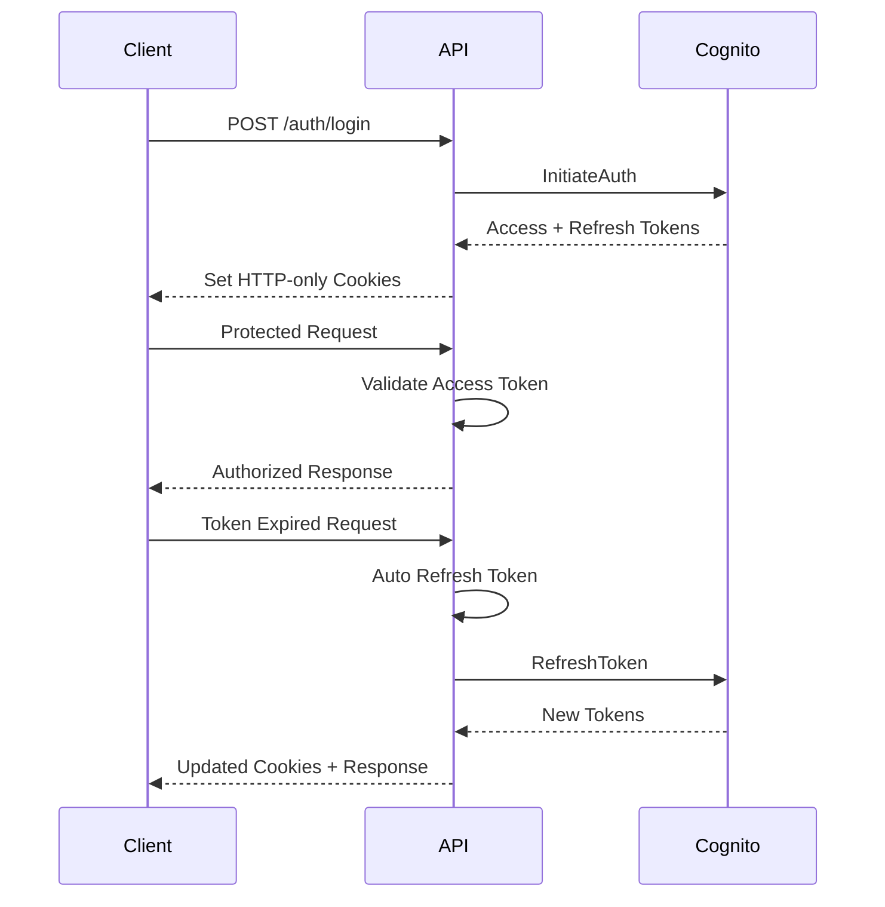

# Authentication System

The Macro AI authentication system provides secure user authentication and authorization using AWS Cognito with comprehensive token management and security features.

## 🔐 Authentication Overview

Our authentication system is **fully implemented and production-ready** with AWS Cognito integration, cookie-based authentication, and comprehensive client-side token management.

## ✅ Current Implementation Status: COMPLETE

The authentication system includes all core features and security measures required for production deployment.

## 📚 Authentication Documentation

### Core Implementation

- **[Cognito Integration](./cognito-integration.md)** - AWS Cognito setup and configuration

  - User pool configuration and management
  - Cognito client setup and secret hash generation
  - User registration and email verification flows
  - Password policies and security settings
  - Integration with Express.js backend

- **[Token Management](./token-management.md)** - JWT and refresh token handling

  - Access token and refresh token lifecycle
  - HTTP-only cookie storage for security
  - Automatic token refresh with request queuing
  - Token validation and expiration handling
  - Client-side token synchronization

- **[Security Considerations](./security-considerations.md)** - Auth security measures and best practices
  - Security headers and CORS configuration
  - Rate limiting for authentication endpoints
  - CSRF protection with SameSite cookies
  - Encrypted synchronization tokens
  - Secure logout and session management

## 🏗️ Architecture Overview

### Authentication Flow



### Core Components

- **Authentication Service** (`auth.services.ts`): AWS Cognito integration
- **Authentication Controller** (`auth.controller.ts`): HTTP request handling
- **Authentication Middleware** (`auth.middleware.ts`): Route protection
- **Client Auth Store** (Zustand): Client-side state management
- **API Client Integration**: Automatic token refresh interceptors

## 🔑 Key Features

### Server-Side Features ✅ COMPLETE

- **User Registration**: Complete signup flow with email verification
- **User Login**: Secure authentication with Cognito
- **Token Refresh**: Automatic refresh token handling
- **Password Reset**: Secure password reset workflow
- **User Logout**: Comprehensive session cleanup
- **Protected Routes**: Middleware-based route protection

### Client-Side Features ✅ COMPLETE

- **Authentication State**: TanStack Query integration
- **Automatic Token Refresh**: Seamless token renewal
- **Request Queuing**: Queue requests during token refresh
- **Protected Routes**: Route-level authentication guards
- **Loading States**: Comprehensive loading and error states

### Security Features ✅ COMPLETE

- **HTTP-Only Cookies**: Secure token storage
- **Encrypted Sync Tokens**: Additional security layer
- **Rate Limiting**: Brute force protection
- **CSRF Protection**: SameSite cookie configuration
- **Automatic Logout**: On token refresh failure

## 🛠️ Implementation Details

### Authentication Endpoints

```typescript
// Authentication API endpoints
POST / auth / register // User registration
POST / auth / login // User authentication
POST / auth / logout // User logout
POST / auth / refresh // Token refresh
POST / auth / confirm // Email confirmation
POST / auth / resend // Resend confirmation
POST / auth / reset - password // Password reset request
POST / auth / confirm - reset // Confirm password reset
```

### Token Storage Strategy

- **Access Tokens**: Short-lived (1 hour), stored in HTTP-only cookies
- **Refresh Tokens**: Long-lived (30 days), stored in HTTP-only cookies
- **Sync Tokens**: Encrypted user identifier for client-side synchronization
- **Cookie Security**: Secure, SameSite=Strict, HttpOnly flags

### Error Handling

All authentication operations use Go-style error handling patterns:

```typescript
const [user, error] = await authService.signInUser(email, password)

if (error) {
	// Handle authentication error
	return handleAuthError(error)
}

// Proceed with successful authentication
return handleAuthSuccess(user)
```

## 🧪 Testing Coverage

### Unit Tests ✅ COMPLETE

- **Authentication Service**: Comprehensive Cognito integration testing
- **Authentication Controller**: HTTP request/response testing
- **Authentication Middleware**: Route protection testing
- **Error Scenarios**: Complete error handling validation

### Integration Tests ✅ COMPLETE

- **End-to-End Auth Flows**: Complete user journey testing
- **Token Refresh Integration**: Automatic refresh testing
- **Client-Server Integration**: Full-stack authentication testing

## 🔗 Related Documentation

- **[Security Architecture](../../architecture/security-architecture.md)** - Overall security model
- **[API Development](../../development/api-development.md)** - API development patterns
- **[User Management](../user-management/README.md)** - User profile management
- **[Database Design](../../architecture/database-design.md)** - User data storage

## 🎯 Authentication Goals

- **Security First**: Comprehensive security measures and best practices
- **User Experience**: Seamless authentication with minimal friction
- **Type Safety**: Full TypeScript coverage with runtime validation
- **Reliability**: Robust error handling and recovery mechanisms
- **Scalability**: Architecture that supports growing user base
- **Maintainability**: Clean, well-tested, and documented code

---

**Deep Dive**: [Cognito Integration](./cognito-integration.md) | [Token Management](./token-management.md) | [Security Considerations](./security-considerations.md)
