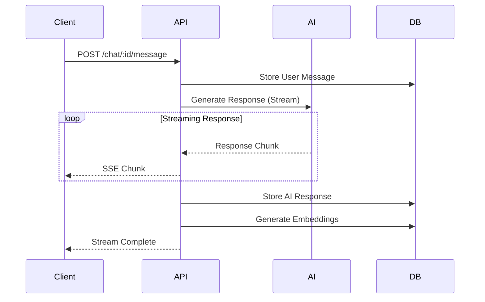

# Chat System

The Macro AI chat system provides AI-powered conversational capabilities with OpenAI integration, real-time
streaming responses, and persistent chat history with semantic search.

## 💬 Chat System Overview

Our chat system integrates OpenAI's GPT models with Vercel's AI SDK to provide streaming responses,
comprehensive chat management, and vector-based semantic search capabilities.

## 🚧 Current Implementation Status: IN DEVELOPMENT

The chat system is actively being developed with core infrastructure in place and feature implementation in progress.

## 📚 Chat System Documentation

### Core Implementation

- **[AI Integration](./ai-integration.md)** - OpenAI and Vercel AI SDK integration

  - OpenAI API configuration and authentication
  - Vercel AI SDK setup for streaming responses
  - Model selection and parameter configuration
  - Error handling and retry logic
  - Rate limiting and usage monitoring

- **[Streaming Responses](./streaming-responses.md)** - Real-time chat implementation

  - Server-sent events (SSE) for real-time streaming
  - Client-side streaming response handling
  - Message chunking and reconstruction
  - Connection management and error recovery
  - Performance optimization for streaming

- **[Data Persistence](./data-persistence.md)** - Chat storage and retrieval patterns
  - PostgreSQL chat and message storage
  - pgvector integration for embeddings
  - Semantic search capabilities
  - User ownership and access control
  - Chat history management and pagination

## 🏗️ Architecture Overview

### Chat Flow Architecture



### Core Components

- **Chat Service** (`chat.services.ts`): Business logic and AI integration
- **Chat Controller** (`chat.controller.ts`): HTTP request handling
- **AI Service** (`ai.services.ts`): OpenAI integration and streaming
- **Chat Repository** (`chat.data-access.ts`): Database operations
- **Vector Service** (`vector.services.ts`): Embedding generation and search

## 🔑 Key Features

### Chat Management ⚠️ IN DEVELOPMENT

- **Chat Creation**: Create new chat conversations
- **Chat Listing**: Retrieve user's chat history
- **Chat Retrieval**: Get specific chat with message history
- **Chat Deletion**: Remove chats and associated messages
- **User Ownership**: Ensure users can only access their own chats

### AI Integration ⚠️ IN DEVELOPMENT

- **OpenAI GPT Integration**: GPT-4 and GPT-3.5-turbo support
- **Streaming Responses**: Real-time message streaming
- **Context Management**: Maintain conversation context
- **Error Handling**: Robust error handling and retry logic
- **Usage Monitoring**: Track API usage and costs

### Vector Search 📋 PLANNED

- **Message Embeddings**: Generate embeddings for semantic search
- **Similarity Search**: Find related messages and conversations
- **Context Retrieval**: Enhance responses with relevant context
- **Search Optimization**: Efficient vector similarity queries

## 🛠️ Implementation Details

### Chat API Endpoints

```typescript
// Chat management endpoints
GET    /chat              // List user chats
POST   /chat              // Create new chat
GET    /chat/:id          // Get chat details
DELETE /chat/:id          // Delete chat

// Message endpoints
POST   /chat/:id/message  // Send message (streaming response)
GET    /chat/:id/messages // Get chat message history
```

### Streaming Implementation

```typescript
// Server-side streaming setup
export const streamChatResponse = async (
	chatId: string,
	message: string,
	res: Response,
) => {
	// Set headers for text streaming (Vercel AI SDK compatible)
	res.writeHead(200, {
		'Content-Type': 'text/plain; charset=utf-8',
		'Cache-Control': 'no-cache',
		Connection: 'keep-alive',
		'Transfer-Encoding': 'chunked',
		'X-Accel-Buffering': 'no', // Disable nginx buffering
	})

	const stream = await openai.chat.completions.create({
		model: 'gpt-4',
		messages: [...chatHistory, { role: 'user', content: message }],
		stream: true,
	})

	// Helper function to send text chunks with immediate flushing
	const sendTextChunk = (text: string) => {
		res.write(text)
		// Force immediate sending of the chunk to prevent buffering
		if (res.flush) {
			res.flush()
		}
	}

	for await (const chunk of stream) {
		const content = chunk.choices[0]?.delta?.content
		if (content) {
			sendTextChunk(content) // Send raw text content for AI SDK compatibility
		}
	}

	res.end()
}
```

### Database Schema

```sql
-- Chat conversations
CREATE TABLE chats (
  id UUID PRIMARY KEY,
  user_id UUID NOT NULL REFERENCES users(id),
  title VARCHAR(255),
  created_at TIMESTAMP DEFAULT NOW(),
  updated_at TIMESTAMP DEFAULT NOW()
);

-- Chat messages with vector embeddings
CREATE TABLE chat_messages (
  id UUID PRIMARY KEY DEFAULT gen_random_uuid(),
  chat_id UUID NOT NULL REFERENCES chats(id) ON DELETE CASCADE,
  role VARCHAR(20) NOT NULL, -- 'user', 'assistant', or 'system'
  content TEXT NOT NULL,
  metadata JSONB DEFAULT '{}',
  embedding VECTOR(1536), -- OpenAI embedding dimension
  created_at TIMESTAMP DEFAULT NOW()
);

-- Performance indexes for message queries
CREATE INDEX idx_chat_messages_chat_id ON chat_messages(chat_id);
CREATE INDEX idx_chat_messages_created_at ON chat_messages(created_at);
CREATE INDEX idx_chat_messages_chat_created ON chat_messages(chat_id, created_at);

-- Vector similarity index using HNSW for better performance
CREATE INDEX idx_chat_messages_embedding ON chat_messages
  USING hnsw (embedding vector_cosine_ops);
```

## 🧪 Testing Strategy

### Unit Tests 📋 PLANNED

- **Chat Service**: Business logic and AI integration testing
- **AI Service**: OpenAI integration and streaming testing
- **Chat Repository**: Database operations testing
- **Vector Service**: Embedding generation and search testing

### Integration Tests 📋 PLANNED

- **End-to-End Chat Flow**: Complete chat conversation testing
- **Streaming Integration**: Real-time streaming response testing
- **Database Integration**: Chat persistence and retrieval testing
- **Authentication Integration**: User ownership and access control

## 🔒 Security Considerations

### Access Control ✅ IMPLEMENTED

- **User Authentication**: Cognito-based authentication required
- **Chat Ownership**: Users can only access their own chats
- **Message Validation**: Input validation and sanitization
- **Rate Limiting**: Prevent abuse of AI endpoints

### Data Protection 📋 PLANNED

- **Message Encryption**: Encrypt sensitive chat content
- **Data Retention**: Configurable message retention policies
- **Privacy Controls**: User data deletion and export capabilities
- **Audit Logging**: Track chat access and modifications

## 🔗 Related Documentation

- **[Authentication](../authentication/README.md)** - User authentication and authorization
- **[User Management](../user-management/README.md)** - User profile integration
- **[Database Design](../../architecture/database-design.md)** - Chat data storage
- **[API Development](../../development/api-development.md)** - API development patterns

## 🎯 Chat System Goals

- **Real-Time Experience**: Seamless streaming chat interactions
- **AI Integration**: Robust OpenAI integration with error handling
- **Semantic Search**: Advanced search capabilities with vector embeddings
- **Scalability**: Architecture that supports growing chat volume
- **User Experience**: Intuitive and responsive chat interface
- **Data Persistence**: Reliable chat history storage and retrieval

---

**Implementation Details**: [AI Integration](./ai-integration.md) | [Streaming Responses](./streaming-responses.md) |
[Data Persistence](./data-persistence.md)
