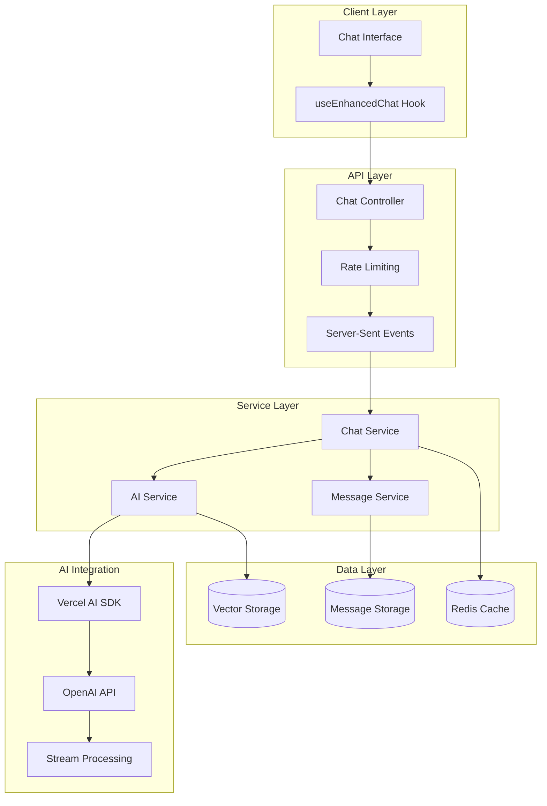

# AI Integration

## Current Implementation Status ✅ PRODUCTION-READY

This document provides comprehensive documentation of the AI integration in the Macro AI chat system, including
OpenAI API integration, Vercel AI SDK usage, streaming responses, and error handling patterns. The AI integration
is **fully implemented and production-ready** with robust streaming capabilities and comprehensive error handling.

## 🤖 AI Service Architecture

### Core AI Service Implementation ✅ IMPLEMENTED



### AI Service Class ✅ IMPLEMENTED

```typescript
// apps/express-api/src/features/chat/ai.service.ts
import { createOpenAI } from '@ai-sdk/openai'
import { embed, generateText, streamText } from 'ai'
import { tryCatch, tryCatchSync } from '../../utils/error-handling/try-catch.ts'
import { AppError, Result, ValidationError } from '../../utils/errors.ts'

interface ChatMessage {
	role: 'user' | 'assistant' | 'system'
	content: string
}

class AIService {
	private readonly openai = createOpenAI({
		apiKey: config.openaiApiKey,
	})
	private readonly chatModel = this.openai('gpt-3.5-turbo')
	private readonly embeddingModel = this.openai.embedding(
		'text-embedding-3-small',
	)

	/**
	 * Generate streaming response from OpenAI with Go-style error handling
	 */
	public generateStreamingResponse(
		messages: ChatMessage[],
	): Result<AsyncIterable<string>> {
		const [streamResult, error] = tryCatchSync(() => {
			return streamText({
				model: this.chatModel,
				messages,
				maxTokens: 1000,
				temperature: 0.7,
			})
		}, 'aiService - generateStreamingResponse')

		if (error) {
			return [null, error]
		}

		return [streamResult.textStream, null]
	}

	/**
	 * Generate non-streaming response from OpenAI
	 */
	public async generateResponse(
		messages: ChatMessage[],
	): Promise<Result<string>> {
		const [result, error] = await tryCatch(
			generateText({
				model: this.chatModel,
				messages,
				maxTokens: 1000,
				temperature: 0.7,
			}),
			'aiService - generateResponse',
		)

		if (error) {
			return [null, error]
		}

		return [result.text, null]
	}

	/**
	 * Generate embeddings for semantic search
	 */
	public async generateEmbedding(text: string): Promise<Result<number[]>> {
		if (!text.trim()) {
			return [
				null,
				new ValidationError('Text cannot be empty for embedding generation'),
			]
		}

		const [result, error] = await tryCatch(
			embed({
				model: this.embeddingModel,
				value: text,
			}),
			'aiService - generateEmbedding',
		)

		if (error) {
			return [null, error]
		}

		return [result.embedding, null]
	}
}

// Export singleton instance
export const aiService = new AIService()
```

## 🌊 Streaming Response Implementation

### Server-Side Streaming ✅ IMPLEMENTED

#### Chat Controller Streaming Endpoint

```typescript
// apps/express-api/src/features/chat/chat.controller.ts
export class ChatController {
	/**
	 * Stream chat message response using text streaming (Vercel AI SDK compatible)
	 * POST /api/chats/:id/stream
	 */
	public streamChatMessage = async (
		req: Request,
		res: Response,
	): Promise<void> => {
		const userId = req.userId // Set by auth middleware
		const chatId = req.params.id
		const { messages } = req.body as SendMessageRequest

		// Set headers for Vercel AI SDK text streaming
		res.writeHead(200, {
			'Content-Type': 'text/plain; charset=utf-8',
			'Cache-Control': 'no-cache',
			Connection: 'keep-alive',
			'Transfer-Encoding': 'chunked',
			'X-Accel-Buffering': 'no', // Disable nginx buffering
			// CORS headers are handled by the main CORS middleware
		})

		// Helper function to send text chunks for Vercel AI SDK
		const sendTextChunk = (text: string): void => {
			const [, writeError] = tryCatchSync(() => {
				res.write(text)
			}, 'streamChatMessage - sendTextChunk')

			if (writeError) {
				logger.error({
					msg: '[streamChatMessage]: Error writing chunk',
					error: writeError.message,
					userId,
					chatId,
				})
			}
		}

		try {
			// Initiate streaming message exchange
			const [result, error] = await tryCatch(
				chatService.sendMessageStreaming({
					chatId,
					userId,
					content: messages[messages.length - 1]?.content || '',
					role: 'user',
				}),
				'streamChatMessage - sendMessageStreaming',
			)

			if (error) {
				logger.error({
					msg: '[streamChatMessage]: Error initiating streaming',
					error: error.message,
					userId,
					chatId,
				})
				res.end()
				return
			}

			const [streamingResult, serviceError] = result
			if (serviceError) {
				logger.error({
					msg: '[streamChatMessage]: Service error during streaming',
					error: serviceError.message,
					userId,
					chatId,
				})
				res.end()
				return
			}

			// Stream AI response using text protocol
			const { messageId, stream } = streamingResult.streamingResponse

			// Process streaming chunks with immediate sending
			const [fullResponse, streamingError] = await tryCatchStream(
				stream,
				(chunk) => {
					sendTextChunk(chunk) // Real-time streaming
				},
				'streamChatMessage - streaming',
			)

			if (streamingError) {
				logger.error({
					msg: '[streamChatMessage]: Error during streaming',
					error: streamingError.message,
					userId,
					chatId,
					messageId,
				})
				res.end()
				return
			}

			// Update the AI message with the complete response
			await chatService.updateMessageContent(messageId, fullResponse)

			res.end()
		} catch (error) {
			logger.error({
				msg: '[streamChatMessage]: Unexpected error',
				error: error instanceof Error ? error.message : 'Unknown error',
				userId,
				chatId,
			})
			res.end()
		}
	}
}
```

#### Chat Service Streaming Logic

```typescript
// apps/express-api/src/features/chat/chat.service.ts
export class ChatService {
	/**
	 * Send message with streaming AI response
	 */
	public async sendMessageStreaming(
		request: SendMessageStreamingRequest,
	): Promise<Result<[StreamingResponse, null] | [null, AppError]>> {
		// Validate request
		const [validatedRequest, validationError] = await tryCatch(
			sendMessageStreamingSchema.parseAsync(request),
			'chatService - sendMessageStreaming - validation',
		)

		if (validationError) {
			return [
				null,
				AppError.from(validationError, 'chatService - sendMessageStreaming'),
			]
		}

		// Save user message first
		const [userMessage, userMessageError] = await this.saveMessage({
			chatId: validatedRequest.chatId,
			role: validatedRequest.role,
			content: validatedRequest.content,
		})

		if (userMessageError) {
			return [null, userMessageError]
		}

		// Get chat history for AI context
		const [chatHistory, historyError] = await this.getChatHistory(
			validatedRequest.chatId,
		)
		if (historyError) {
			return [null, historyError]
		}

		// Generate streaming AI response
		const [streamResult, streamError] =
			this.aiService.generateStreamingResponse(chatHistory)
		if (streamError) {
			return [null, streamError]
		}

		// Create placeholder message for the AI response
		const [aiMessage, aiMessageError] = await this.saveMessage({
			chatId: validatedRequest.chatId,
			role: 'assistant',
			content: '', // Will be updated as stream completes
		})

		if (aiMessageError) {
			return [null, aiMessageError]
		}

		return [
			[
				{
					userMessage,
					streamingResponse: {
						messageId: aiMessage.id,
						stream: streamResult,
					},
				},
				null,
			],
			null,
		]
	}

	/**
	 * Get chat history formatted for AI context
	 */
	private async getChatHistory(chatId: string): Promise<Result<ChatMessage[]>> {
		const [messages, error] =
			await this.messageDataAccess.findMessagesByChatId(chatId)

		if (error) {
			return [null, error]
		}

		// Format messages for AI context
		const formattedMessages: ChatMessage[] = messages.map((msg) => ({
			role: msg.role as 'user' | 'assistant' | 'system',
			content: msg.content,
		}))

		return [formattedMessages, null]
	}
}
```

### Client-Side Streaming ✅ IMPLEMENTED

#### Enhanced Chat Hook

```typescript
// apps/client-ui/src/services/hooks/chat/useEnhancedChat.tsx
import { useChat } from '@ai-sdk/react'
import { tryCatch } from '@repo/macro-ai-api-client'

export function useEnhancedChat(chatId: string) {
	const { accessToken, apiKey } = useAuthStore()
	const apiUrl = import.meta.env.VITE_API_URL

	// Use Vercel's AI SDK useChat hook for streaming
	const chatHook = useChat({
		id: chatId, // Ensures hook resets when chatId changes
		api: `${apiUrl}/chats/${chatId}/stream`,
		streamProtocol: 'text',
		headers: {
			Authorization: `Bearer ${accessToken ?? ''}`,
			'X-API-KEY': apiKey,
		},
		credentials: 'include',
		onResponse: (response) => {
			logger.info('[useEnhancedChat]: Response received', {
				chatId,
				status: response.status,
			})
		},
		onFinish: async () => {
			// Invalidate cache after streaming completes
			await queryClient.invalidateQueries({ queryKey: ['chats', chatId] })
		},
		onError: (error) => {
			logger.error('[useEnhancedChat]: Streaming error', { error, chatId })
		},
	})

	const handleSubmit = async (e: React.FormEvent) => {
		const [result, submitError] = await tryCatch(
			chatHook.handleSubmit(e),
			'useEnhancedChat.handleSubmit',
		)

		if (submitError) {
			logger.error('Submit error:', submitError)
			return
		}

		return result
	}

	return {
		messages: chatHook.messages,
		input: chatHook.input,
		handleInputChange: chatHook.handleInputChange,
		handleSubmit,
		isLoading: chatHook.isLoading,
		error: chatHook.error,
		status: chatHook.isLoading ? 'streaming' : 'ready',
	}
}
```

## 🔧 Configuration and Setup

### Environment Configuration ✅ IMPLEMENTED

```bash
# OpenAI API Configuration
OPENAI_API_KEY=sk-your-openai-api-key-here

# AI Service Configuration
AI_MODEL_CHAT=gpt-3.5-turbo
AI_MODEL_EMBEDDING=text-embedding-3-small
AI_MAX_TOKENS=1000
AI_TEMPERATURE=0.7

# Rate Limiting for AI Endpoints
AI_RATE_LIMIT_WINDOW_MS=60000  # 1 minute
AI_RATE_LIMIT_MAX_REQUESTS=30  # 30 requests per minute
```

### Model Configuration ✅ IMPLEMENTED

```typescript
// AI model configuration with different use cases
export class AIService {
	/**
	 * Get model configuration for different use cases
	 */
	public getModelConfig(useCase: 'chat' | 'embedding' = 'chat'): {
		model: LanguageModelV1 | EmbeddingModel<string>
		maxTokens?: number
		temperature?: number
		dimensions?: number
	} {
		switch (useCase) {
			case 'chat':
				return {
					model: this.chatModel,
					maxTokens: 1000,
					temperature: 0.7,
				}
			case 'embedding':
				return {
					model: this.embeddingModel,
					dimensions: 1536,
				}
		}
	}

	/**
	 * Validate AI service configuration
	 */
	public validateConfiguration(): Result<boolean> {
		if (!config.openaiApiKey) {
			return [false, new ValidationError('OpenAI API key is required')]
		}

		if (!config.openaiApiKey.startsWith('sk-')) {
			return [false, new ValidationError('Invalid OpenAI API key format')]
		}

		return [true, null]
	}
}
```

## 🛡️ Error Handling and Resilience

### AI Service Error Handling ✅ IMPLEMENTED

```typescript
// Comprehensive error handling for AI operations
export class AIService {
	/**
	 * Handle AI service errors with retry logic
	 */
	private async handleAIError(
		operation: () => Promise<any>,
		context: string,
		retries: number = 3,
	): Promise<Result<any>> {
		let lastError: Error | null = null

		for (let attempt = 1; attempt <= retries; attempt++) {
			const [result, error] = await tryCatch(
				operation(),
				`${context} - attempt ${attempt}`,
			)

			if (!error) {
				return [result, null]
			}

			lastError = error

			// Don't retry on certain error types
			if (this.isNonRetryableError(error)) {
				break
			}

			// Exponential backoff
			if (attempt < retries) {
				const delay = Math.pow(2, attempt) * 1000 // 2s, 4s, 8s
				await new Promise((resolve) => setTimeout(resolve, delay))
			}
		}

		return [null, lastError]
	}

	/**
	 * Check if error should not be retried
	 */
	private isNonRetryableError(error: Error): boolean {
		const nonRetryablePatterns = [
			'invalid_api_key',
			'insufficient_quota',
			'model_not_found',
			'invalid_request_error',
		]

		return nonRetryablePatterns.some((pattern) =>
			error.message.toLowerCase().includes(pattern),
		)
	}

	/**
	 * Generate streaming response with error handling
	 */
	public generateStreamingResponseWithRetry(
		messages: ChatMessage[],
	): Result<AsyncIterable<string>> {
		const [streamResult, error] = tryCatchSync(() => {
			return streamText({
				model: this.chatModel,
				messages,
				maxTokens: 1000,
				temperature: 0.7,
				// Add error handling for streaming
				onError: (error) => {
					logger.error({
						msg: 'Streaming error occurred',
						error: error.message,
						context: 'generateStreamingResponse',
					})
				},
			})
		}, 'aiService - generateStreamingResponse')

		if (error) {
			return [null, error]
		}

		return [streamResult.textStream, null]
	}
}
```

### Stream Error Recovery ✅ IMPLEMENTED

```typescript
// Stream error handling utility
export async function tryCatchStream<T>(
	stream: AsyncIterable<T>,
	onChunk: (chunk: T) => void,
	context: string,
): Promise<Result<string>> {
	let fullContent = ''

	try {
		for await (const chunk of stream) {
			fullContent += chunk
			onChunk(chunk)
		}

		return [fullContent, null]
	} catch (error) {
		logger.error({
			msg: 'Stream processing error',
			error: error instanceof Error ? error.message : 'Unknown error',
			context,
			partialContent: fullContent,
		})

		return [
			fullContent, // Return partial content
			new AppError('Stream processing failed', 500, 'STREAM_ERROR', context),
		]
	}
}
```

## 🚦 Rate Limiting and Token Management

### AI-Specific Rate Limiting ✅ IMPLEMENTED

```typescript
// Rate limiting for AI endpoints
const aiRateLimiter = rateLimit({
	windowMs: config.aiRateLimitWindowMs || 60 * 1000, // 1 minute
	limit: config.aiRateLimitMaxRequests || 30, // 30 requests per minute
	standardHeaders: true,
	legacyHeaders: false,
	message: {
		status: StatusCodes.TOO_MANY_REQUESTS,
		message: 'AI service rate limit exceeded, please try again later.',
	},
	handler: (
		req: Request,
		res: Response,
		_next: NextFunction,
		options: Options,
	) => {
		logger.warn(
			`[middleware - aiRateLimit]: AI rate limit exceeded for user: ${req.userId}`,
		)
		res.status(options.statusCode).json(options.message)
	},
})

// Apply to AI endpoints
app.use('/api/chats/:id/stream', aiRateLimiter)
```

### Token Usage Tracking ✅ PLANNED

```typescript
// Token usage tracking for cost management
export class TokenTracker {
	/**
	 * Track token usage for billing and monitoring
	 */
	public async trackTokenUsage(
		userId: string,
		operation: 'chat' | 'embedding',
		tokensUsed: number,
		model: string,
	): Promise<Result<void>> {
		const [, error] = await tryCatch(
			db.insert(tokenUsageTable).values({
				userId,
				operation,
				tokensUsed,
				model,
				timestamp: new Date(),
			}),
			'TokenTracker.trackTokenUsage',
		)

		if (error) {
			logger.error({
				msg: 'Failed to track token usage',
				error: error.message,
				userId,
				operation,
				tokensUsed,
			})
			return [null, error]
		}

		return [null, null]
	}

	/**
	 * Get user token usage for current month
	 */
	public async getUserMonthlyUsage(userId: string): Promise<Result<number>> {
		const startOfMonth = new Date()
		startOfMonth.setDate(1)
		startOfMonth.setHours(0, 0, 0, 0)

		const [usage, error] = await tryCatch(
			db
				.select({ total: sum(tokenUsageTable.tokensUsed) })
				.from(tokenUsageTable)
				.where(
					and(
						eq(tokenUsageTable.userId, userId),
						gte(tokenUsageTable.timestamp, startOfMonth),
					),
				),
			'TokenTracker.getUserMonthlyUsage',
		)

		if (error) {
			return [null, error]
		}

		return [usage[0]?.total || 0, null]
	}
}
```

## 🔍 Monitoring and Observability

### AI Service Monitoring ✅ IMPLEMENTED

```typescript
// AI service monitoring and metrics
export class AIServiceMonitor {
	/**
	 * Log AI operation metrics
	 */
	public logAIOperation(
		operation: string,
		duration: number,
		success: boolean,
		tokensUsed?: number,
		error?: Error,
	): void {
		logger.info({
			msg: 'AI operation completed',
			operation,
			duration,
			success,
			tokensUsed,
			error: error?.message,
			timestamp: new Date().toISOString(),
		})

		// Send metrics to monitoring service
		if (process.env.NODE_ENV === 'production') {
			this.sendMetricsToDatadog({
				operation,
				duration,
				success,
				tokensUsed,
			})
		}
	}

	/**
	 * Monitor streaming performance
	 */
	public monitorStreamingPerformance(
		chatId: string,
		userId: string,
		startTime: number,
		chunksReceived: number,
		totalTokens: number,
	): void {
		const duration = Date.now() - startTime
		const tokensPerSecond = totalTokens / (duration / 1000)

		logger.info({
			msg: 'Streaming performance metrics',
			chatId,
			userId,
			duration,
			chunksReceived,
			totalTokens,
			tokensPerSecond,
		})
	}
}
```

## 📚 Related Documentation

- **[Streaming Responses](./streaming-responses.md)** - Detailed streaming implementation and patterns
- **[Data Persistence](./data-persistence.md)** - Message and vector storage strategies
- **[Chat System Overview](./README.md)** - Complete chat system architecture
- **[API Development](../../development/api-development.md)** - API design patterns and best practices
- **[Error Handling](../../development/error-handling.md)** - Error handling strategies and implementation
