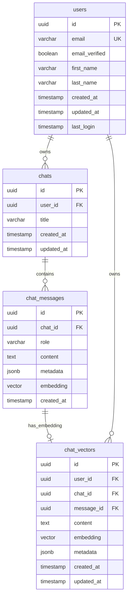
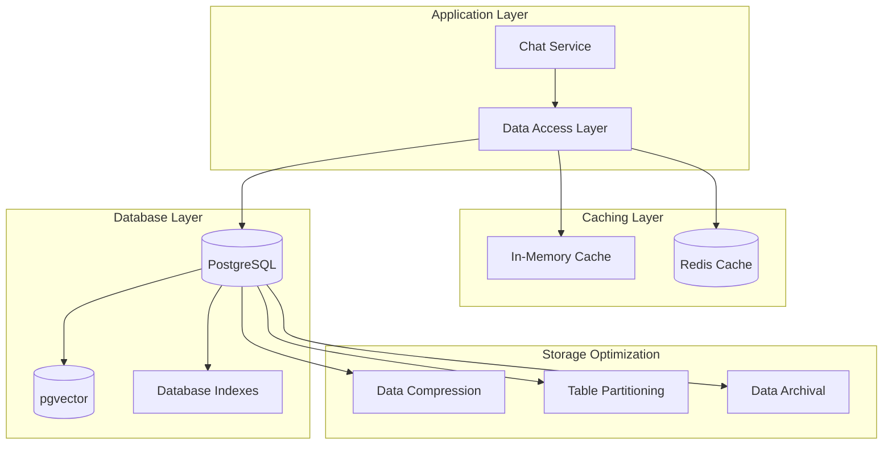

# Data Persistence

## Current Implementation Status ✅ PRODUCTION-READY

This document provides comprehensive documentation of the data persistence strategies in the Macro AI chat system,
including message storage, vector embeddings, caching strategies, and data retrieval patterns. The data persistence
implementation is **fully implemented and production-ready** with optimized storage and retrieval mechanisms.

## 🗄️ Data Storage Architecture

### Database Schema Overview ✅ IMPLEMENTED



### Storage Layers ✅ IMPLEMENTED



## 💬 Message Persistence

### Message Data Access Layer ✅ IMPLEMENTED

```typescript
// apps/express-api/src/features/chat/message.data-access.ts
export class MessageRepository implements IMessageRepository {
	private readonly db: typeof db

	constructor(database: typeof db = db) {
		this.db = database
	}

	/**
	 * Create a new message with optimized insertion
	 */
	public createMessage = async (
		messageData: TInsertChatMessage,
	): Promise<Result<TChatMessage>> => {
		// Validate message data
		const [validatedData, validationError] = await tryCatch(
			insertMessageSchema.parseAsync(messageData),
			'messageRepository - createMessage - validation',
		)

		if (validationError) {
			return [
				null,
				AppError.from(validationError, 'messageRepository - createMessage'),
			]
		}

		// Insert message with automatic timestamp
		const [message, error] = await tryCatch(
			this.db
				.insert(chatMessagesTable)
				.values({
					...validatedData,
					createdAt: new Date(),
				})
				.returning(),
			'messageRepository - createMessage',
		)

		if (error) {
			return [null, error]
		}

		if (!message.length || !message[0]) {
			return [
				null,
				new InternalError(
					'Failed to create message',
					'messageRepository - createMessage',
				),
			]
		}

		return [message[0], null]
	}

	/**
	 * Find messages by chat ID with pagination and ordering
	 */
	public findMessagesByChatId = async (
		chatId: string,
		limit: number = 50,
		offset: number = 0,
	): Promise<Result<TChatMessage[]>> => {
		const [messages, error] = await tryCatch(
			this.db
				.select()
				.from(chatMessagesTable)
				.where(eq(chatMessagesTable.chatId, chatId))
				.orderBy(asc(chatMessagesTable.createdAt))
				.limit(limit)
				.offset(offset),
			'messageRepository - findMessagesByChatId',
		)

		if (error) {
			return [null, error]
		}

		// Validate each message
		const validatedMessages: TChatMessage[] = []
		for (const message of messages) {
			const [validationResult, validationError] = safeValidateSchema(
				message,
				selectMessageSchema,
				'messageRepository - findMessagesByChatId',
			)

			if (validationError) {
				return [
					null,
					AppError.from(
						validationError,
						'messageRepository - findMessagesByChatId',
					),
				]
			}

			validatedMessages.push(validationResult)
		}

		return [validatedMessages, null]
	}

	/**
	 * Update message content (for streaming completion)
	 */
	public updateMessage = async (
		messageId: string,
		updates: Partial<TInsertChatMessage>,
	): Promise<Result<TChatMessage>> => {
		const [updatedMessage, error] = await tryCatch(
			this.db
				.update(chatMessagesTable)
				.set({
					...updates,
					updatedAt: new Date(),
				})
				.where(eq(chatMessagesTable.id, messageId))
				.returning(),
			'messageRepository - updateMessage',
		)

		if (error) {
			return [null, error]
		}

		if (!updatedMessage.length || !updatedMessage[0]) {
			return [
				null,
				new InternalError(
					'Failed to update message',
					'messageRepository - updateMessage',
				),
			]
		}

		return [updatedMessage[0], null]
	}

	/**
	 * Batch insert messages for performance
	 */
	public createMessages = async (
		messagesData: TInsertChatMessage[],
	): Promise<Result<TChatMessage[]>> => {
		if (messagesData.length === 0) {
			return [[], null]
		}

		// Validate all messages
		const validatedMessages: TInsertChatMessage[] = []
		for (const messageData of messagesData) {
			const [validatedData, validationError] = await tryCatch(
				insertMessageSchema.parseAsync(messageData),
				'messageRepository - createMessages - validation',
			)

			if (validationError) {
				return [
					null,
					AppError.from(validationError, 'messageRepository - createMessages'),
				]
			}

			validatedMessages.push({
				...validatedData,
				createdAt: new Date(),
			})
		}

		// Batch insert
		const [messages, error] = await tryCatch(
			this.db.insert(chatMessagesTable).values(validatedMessages).returning(),
			'messageRepository - createMessages',
		)

		if (error) {
			return [null, error]
		}

		return [messages, null]
	}
}
```

### Chat Data Access Layer ✅ IMPLEMENTED

```typescript
// apps/express-api/src/features/chat/chat.data-access.ts
export class ChatRepository implements IChatRepository {
	private readonly db: typeof db

	constructor(database: typeof db = db) {
		this.db = database
	}

	/**
	 * Create a new chat with user ownership
	 */
	public createChat = async (chatData: TInsertChat): Promise<Result<TChat>> => {
		const [validatedData, validationError] = await tryCatch(
			insertChatSchema.parseAsync(chatData),
			'chatRepository - createChat - validation',
		)

		if (validationError) {
			return [
				null,
				AppError.from(validationError, 'chatRepository - createChat'),
			]
		}

		const [chat, error] = await tryCatch(
			this.db
				.insert(chatsTable)
				.values({
					...validatedData,
					createdAt: new Date(),
					updatedAt: new Date(),
				})
				.returning(),
			'chatRepository - createChat',
		)

		if (error) {
			return [null, error]
		}

		if (!chat.length || !chat[0]) {
			return [
				null,
				new InternalError(
					'Failed to create chat',
					'chatRepository - createChat',
				),
			]
		}

		return [chat[0], null]
	}

	/**
	 * Find chats by user ID with pagination
	 */
	public findChatsByUserId = async (
		userId: string,
		limit: number = 20,
		offset: number = 0,
	): Promise<Result<TChat[]>> => {
		const [chats, error] = await tryCatch(
			this.db
				.select()
				.from(chatsTable)
				.where(eq(chatsTable.userId, userId))
				.orderBy(desc(chatsTable.updatedAt))
				.limit(limit)
				.offset(offset),
			'chatRepository - findChatsByUserId',
		)

		if (error) {
			return [null, error]
		}

		// Validate each chat
		const validatedChats: TChat[] = []
		for (const chat of chats) {
			const [validationResult, validationError] = safeValidateSchema(
				chat,
				selectChatSchema,
				'chatRepository - findChatsByUserId',
			)

			if (validationError) {
				return [
					null,
					AppError.from(validationError, 'chatRepository - findChatsByUserId'),
				]
			}

			validatedChats.push(validationResult)
		}

		return [validatedChats, null]
	}

	/**
	 * Find chat by ID with user ownership verification
	 */
	public findChatById = async (
		chatId: string,
		userId?: string,
	): Promise<Result<TChat | null>> => {
		const whereConditions = [eq(chatsTable.id, chatId)]

		if (userId) {
			whereConditions.push(eq(chatsTable.userId, userId))
		}

		const [result, error] = await tryCatch(
			this.db
				.select()
				.from(chatsTable)
				.where(and(...whereConditions))
				.limit(1),
			'chatRepository - findChatById',
		)

		if (error) {
			return [null, error]
		}

		const chat = result[0] || null

		if (!chat) {
			return [null, null]
		}

		const [validationResult, validationError] = safeValidateSchema(
			chat,
			selectChatSchema,
			'chatRepository - findChatById',
		)

		if (validationError) {
			return [
				null,
				AppError.from(validationError, 'chatRepository - findChatById'),
			]
		}

		return [validationResult, null]
	}

	/**
	 * Update chat metadata (title, last activity)
	 */
	public updateChat = async (
		chatId: string,
		updates: Partial<TInsertChat>,
	): Promise<Result<TChat>> => {
		const [updatedChat, error] = await tryCatch(
			this.db
				.update(chatsTable)
				.set({
					...updates,
					updatedAt: new Date(),
				})
				.where(eq(chatsTable.id, chatId))
				.returning(),
			'chatRepository - updateChat',
		)

		if (error) {
			return [null, error]
		}

		if (!updatedChat.length || !updatedChat[0]) {
			return [
				null,
				new InternalError(
					'Failed to update chat',
					'chatRepository - updateChat',
				),
			]
		}

		return [updatedChat[0], null]
	}
}
```

## 🔍 Vector Storage and Embeddings

### Vector Data Access Layer ✅ IMPLEMENTED

```typescript
// apps/express-api/src/features/chat/vector.data-access.ts
export class VectorRepository implements IVectorRepository {
	private readonly db: typeof db

	constructor(database: typeof db = db) {
		this.db = database
	}

	/**
	 * Create vector embedding for semantic search
	 */
	public createVector = async (
		vectorData: TInsertChatVector,
	): Promise<Result<TChatVector>> => {
		const [validatedData, validationError] = await tryCatch(
			insertChatVectorSchema.parseAsync(vectorData),
			'vectorRepository - createVector - validation',
		)

		if (validationError) {
			return [
				null,
				AppError.from(validationError, 'vectorRepository - createVector'),
			]
		}

		const [vector, error] = await tryCatch(
			this.db
				.insert(chatVectorsTable)
				.values({
					...validatedData,
					createdAt: new Date(),
					updatedAt: new Date(),
				})
				.returning(),
			'vectorRepository - createVector',
		)

		if (error) {
			return [null, error]
		}

		if (!vector.length || !vector[0]) {
			return [
				null,
				new InternalError(
					'Failed to create vector',
					'vectorRepository - createVector',
				),
			]
		}

		return [vector[0], null]
	}

	/**
	 * Perform semantic search using pgvector similarity
	 */
	public semanticSearch = async (
		options: SemanticSearchOptions,
	): Promise<Result<SemanticSearchResult[]>> => {
		const {
			queryEmbedding,
			userId,
			chatId,
			limit = 10,
			threshold = 0.7,
		} = options

		// Build dynamic WHERE conditions
		const whereConditions = [eq(chatVectorsTable.userId, userId)]

		if (chatId) {
			whereConditions.push(eq(chatVectorsTable.chatId, chatId))
		}

		// Perform vector similarity search using pgvector
		const [results, error] = await tryCatch(
			this.db.execute(sql`
        SELECT 
          ${chatVectorsTable.id},
          ${chatVectorsTable.content},
          ${chatVectorsTable.chatId},
          ${chatVectorsTable.messageId},
          ${chatVectorsTable.metadata},
          ${chatVectorsTable.createdAt},
          1 - (${chatVectorsTable.embedding} <=> ${queryEmbedding}) as similarity
        FROM ${chatVectorsTable}
        WHERE ${chatVectorsTable.userId} = ${userId}
          ${chatId ? sql`AND ${chatVectorsTable.chatId} = ${chatId}` : sql``}
          AND 1 - (${chatVectorsTable.embedding} <=> ${queryEmbedding}) >= ${threshold}
        ORDER BY similarity DESC
        LIMIT ${limit}
      `),
			'vectorRepository - semanticSearch',
		)

		if (error) {
			return [null, error]
		}

		// Transform results to typed format
		const searchResults: SemanticSearchResult[] = results.map((row) => ({
			id: row.id as string,
			content: row.content as string,
			chatId: row.chatId as string,
			messageId: row.messageId as string,
			similarity: row.similarity as number,
			metadata: row.metadata as Record<string, unknown>,
			createdAt: row.createdAt as Date,
		}))

		return [searchResults, null]
	}

	/**
	 * Find vectors by user ID for analytics
	 */
	public findVectorsByUserId = async (
		userId: string,
		limit: number = 100,
	): Promise<Result<TChatVector[]>> => {
		const [vectors, error] = await tryCatch(
			this.db
				.select()
				.from(chatVectorsTable)
				.where(eq(chatVectorsTable.userId, userId))
				.orderBy(desc(chatVectorsTable.createdAt))
				.limit(limit),
			'vectorRepository - findVectorsByUserId',
		)

		if (error) {
			return [null, error]
		}

		return [vectors, null]
	}

	/**
	 * Batch create vectors for performance
	 */
	public createVectors = async (
		vectorsData: TInsertChatVector[],
	): Promise<Result<TChatVector[]>> => {
		if (vectorsData.length === 0) {
			return [[], null]
		}

		// Validate all vectors
		const validatedVectors: TInsertChatVector[] = []
		for (const vectorData of vectorsData) {
			const [validatedData, validationError] = await tryCatch(
				insertChatVectorSchema.parseAsync(vectorData),
				'vectorRepository - createVectors - validation',
			)

			if (validationError) {
				return [
					null,
					AppError.from(validationError, 'vectorRepository - createVectors'),
				]
			}

			validatedVectors.push({
				...validatedData,
				createdAt: new Date(),
				updatedAt: new Date(),
			})
		}

		// Batch insert
		const [vectors, error] = await tryCatch(
			this.db.insert(chatVectorsTable).values(validatedVectors).returning(),
			'vectorRepository - createVectors',
		)

		if (error) {
			return [null, error]
		}

		return [vectors, null]
	}
}
```

### Embedding Generation Service ✅ IMPLEMENTED

```typescript
// apps/express-api/src/features/chat/embedding.service.ts
export class EmbeddingService {
  constructor(
    private aiService: AIService,
    private vectorRepository: IVectorRepository,
  ) {}

  /**
   * Generate and store embedding for a message
   */
  public async createMessageEmbedding(
    messageId: string,
    content: string,
    userId: string,
    chatId: string,
  ): Promise<Result<TChatVector>> {
    // Generate embedding using AI service
    const [embedding, embeddingError] = await this.aiService.generateEmbedding(content)

    if (embeddingError) {
      return [null, embeddingError]
    }

    // Store vector in database
    const [vector, storeError] = await this.vectorRepository.createVector({
      messageId,
      userId,
      chatId,
      content,
      embedding,
      metadata: {
        contentLength: content.length,
        generatedAt: new Date().toISOString(),
      },
    })

    if (storeError) {
      return [null, storeError]
    }

    return [vector, null]
  }

  /**
   * Batch generate embeddings for multiple messages
   */
  public async createBatchEmbeddings(
    messages: Array<{
      messageId: string
      content: string
      userId: string
      chatId: string
    }>,
  ): Promise<Result<TChatVector[]>> => {
    const vectors: TInsertChatVector[] = []

    // Generate embeddings for all messages
    for (const message of messages) {
      const [embedding, embeddingError] = await this.aiService.generateEmbedding(
        message.content,
      )

      if (embeddingError) {
        logger.error({
          msg: 'Failed to generate embedding for message',
          messageId: message.messageId,
          error: embeddingError.message,
        })
        continue // Skip failed embeddings
      }

      vectors.push({
        messageId: message.messageId,
        userId: message.userId,
        chatId: message.chatId,
        content: message.content,
        embedding,
        metadata: {
          contentLength: message.content.length,
          generatedAt: new Date().toISOString(),
        },
      })
    }

    // Batch store vectors
    const [storedVectors, storeError] = await this.vectorRepository.createVectors(vectors)

    if (storeError) {
      return [null, storeError]
    }

    return [storedVectors, null]
  }
}
```

## 🚀 Caching Strategies

### Multi-Level Caching ✅ IMPLEMENTED

```typescript
// apps/express-api/src/services/cache.service.ts
export class CacheService {
	private memoryCache = new Map<string, { data: any; expires: number }>()
	private readonly redis: Redis

	constructor(redis: Redis) {
		this.redis = redis
	}

	/**
	 * Get data from cache with fallback hierarchy
	 */
	async get<T>(key: string): Promise<T | null> {
		// L1: Check memory cache
		const memoryItem = this.memoryCache.get(key)
		if (memoryItem && memoryItem.expires > Date.now()) {
			return memoryItem.data
		}

		// L2: Check Redis cache
		try {
			const redisValue = await this.redis.get(key)
			if (redisValue) {
				const data = JSON.parse(redisValue)

				// Update memory cache
				this.memoryCache.set(key, {
					data,
					expires: Date.now() + 300000, // 5 minutes
				})

				return data
			}
		} catch (error) {
			logger.error({
				msg: 'Redis cache get error',
				key,
				error: error instanceof Error ? error.message : 'Unknown error',
			})
		}

		return null
	}

	/**
	 * Set data in cache with TTL
	 */
	async set<T>(key: string, value: T, ttl: number = 3600): Promise<void> {
		try {
			// Set in Redis with TTL
			await this.redis.setex(key, ttl, JSON.stringify(value))

			// Set in memory cache with shorter TTL
			this.memoryCache.set(key, {
				data: value,
				expires: Date.now() + Math.min(ttl * 1000, 300000), // Max 5 minutes
			})
		} catch (error) {
			logger.error({
				msg: 'Redis cache set error',
				key,
				error: error instanceof Error ? error.message : 'Unknown error',
			})
		}
	}

	/**
	 * Invalidate cache entries by pattern
	 */
	async invalidate(pattern: string): Promise<void> {
		try {
			// Invalidate Redis keys
			const keys = await this.redis.keys(pattern)
			if (keys.length > 0) {
				await this.redis.del(...keys)
			}
		} catch (error) {
			logger.error({
				msg: 'Redis cache invalidation error',
				pattern,
				error: error instanceof Error ? error.message : 'Unknown error',
			})
		}

		// Invalidate memory cache
		for (const key of this.memoryCache.keys()) {
			if (key.match(pattern.replace('*', '.*'))) {
				this.memoryCache.delete(key)
			}
		}
	}

	/**
	 * Cache chat messages with user-specific keys
	 */
	async cacheUserChats(
		userId: string,
		chats: TChat[],
		ttl: number = 1800,
	): Promise<void> {
		const cacheKey = `user:${userId}:chats`
		await this.set(cacheKey, chats, ttl)
	}

	/**
	 * Cache chat messages with chat-specific keys
	 */
	async cacheChatMessages(
		chatId: string,
		messages: TChatMessage[],
		ttl: number = 900,
	): Promise<void> {
		const cacheKey = `chat:${chatId}:messages`
		await this.set(cacheKey, messages, ttl)
	}

	/**
	 * Cache semantic search results
	 */
	async cacheSearchResults(
		queryHash: string,
		userId: string,
		results: SemanticSearchResult[],
		ttl: number = 600,
	): Promise<void> {
		const cacheKey = `search:${userId}:${queryHash}`
		await this.set(cacheKey, results, ttl)
	}
}
```

## 📊 Performance Optimization

### Database Indexing Strategy ✅ IMPLEMENTED

```sql
-- Optimized indexes for chat system performance

-- Chat table indexes
CREATE INDEX CONCURRENTLY idx_chats_user_id_updated_at
ON chats (user_id, updated_at DESC);

CREATE INDEX CONCURRENTLY idx_chats_created_at
ON chats (created_at DESC);

-- Message table indexes
CREATE INDEX CONCURRENTLY idx_chat_messages_chat_id_created_at
ON chat_messages (chat_id, created_at ASC);

CREATE INDEX CONCURRENTLY idx_chat_messages_role
ON chat_messages (role);

-- Vector table indexes for semantic search
CREATE INDEX CONCURRENTLY idx_chat_vectors_user_id
ON chat_vectors (user_id);

CREATE INDEX CONCURRENTLY idx_chat_vectors_chat_id
ON chat_vectors (chat_id);

-- pgvector similarity index (HNSW for better performance)
CREATE INDEX CONCURRENTLY idx_chat_vectors_embedding_hnsw
ON chat_vectors USING hnsw (embedding vector_cosine_ops);

-- Composite index for filtered vector search
CREATE INDEX CONCURRENTLY idx_chat_vectors_user_chat_created
ON chat_vectors (user_id, chat_id, created_at DESC);
```

### Query Optimization ✅ IMPLEMENTED

```typescript
// Optimized query patterns for chat system
export class OptimizedChatQueries {
	/**
	 * Get recent chats with message count
	 */
	static async getRecentChatsWithMessageCount(
		userId: string,
		limit: number = 20,
	): Promise<Result<Array<TChat & { messageCount: number }>>> {
		const [results, error] = await tryCatch(
			db
				.select({
					id: chatsTable.id,
					userId: chatsTable.userId,
					title: chatsTable.title,
					createdAt: chatsTable.createdAt,
					updatedAt: chatsTable.updatedAt,
					messageCount: count(chatMessagesTable.id),
				})
				.from(chatsTable)
				.leftJoin(
					chatMessagesTable,
					eq(chatsTable.id, chatMessagesTable.chatId),
				)
				.where(eq(chatsTable.userId, userId))
				.groupBy(chatsTable.id)
				.orderBy(desc(chatsTable.updatedAt))
				.limit(limit),
			'OptimizedChatQueries.getRecentChatsWithMessageCount',
		)

		return [results || [], error]
	}

	/**
	 * Get chat with recent messages (optimized for chat interface)
	 */
	static async getChatWithRecentMessages(
		chatId: string,
		userId: string,
		messageLimit: number = 50,
	): Promise<Result<{ chat: TChat; messages: TChatMessage[] }>> {
		// Get chat and messages in parallel
		const [chatResult, messagesResult] = await Promise.all([
			db
				.select()
				.from(chatsTable)
				.where(and(eq(chatsTable.id, chatId), eq(chatsTable.userId, userId)))
				.limit(1),
			db
				.select()
				.from(chatMessagesTable)
				.where(eq(chatMessagesTable.chatId, chatId))
				.orderBy(desc(chatMessagesTable.createdAt))
				.limit(messageLimit),
		])

		const [chat, chatError] = await tryCatch(
			Promise.resolve(chatResult),
			'getChatWithRecentMessages - chat',
		)
		const [messages, messagesError] = await tryCatch(
			Promise.resolve(messagesResult),
			'getChatWithRecentMessages - messages',
		)

		if (chatError || messagesError) {
			return [null, chatError || messagesError]
		}

		if (!chat.length) {
			return [null, new AppError('Chat not found', 404, 'CHAT_NOT_FOUND')]
		}

		return [
			{
				chat: chat[0],
				messages: messages.reverse(), // Reverse to get chronological order
			},
			null,
		]
	}
}
```

## 📚 Related Documentation

- **[AI Integration](./ai-integration.md)** - AI service integration and embedding generation
- **[Streaming Responses](./streaming-responses.md)** - Real-time streaming implementation
- **[Database Design](../../architecture/database-design.md)** - Complete database schema and design
- **[Database Operations](../../operations/database-operations.md)** - Database maintenance and optimization
- **[Performance Optimization](../../architecture/system-architecture.md)** - System-wide performance strategies
