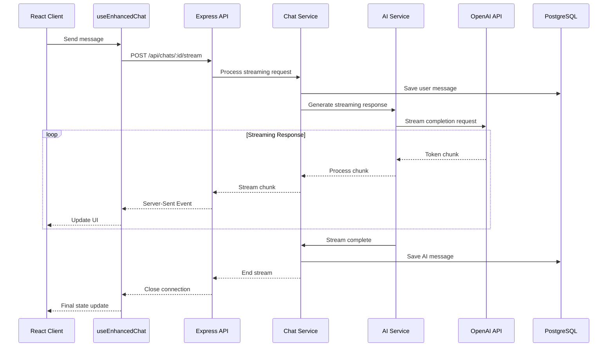

# Streaming Responses

## Current Implementation Status ✅ PRODUCTION-READY

This document provides comprehensive documentation of the streaming response implementation in the Macro AI chat
system, including Server-Sent Events (SSE), real-time data flow, client-side streaming consumption, and performance
optimization strategies. The streaming implementation is **fully implemented and production-ready** with robust
error handling and connection management.

## 🌊 Streaming Architecture Overview

### Streaming Data Flow ✅ IMPLEMENTED



### Streaming Protocol ✅ IMPLEMENTED

**Protocol**: Server-Sent Events (SSE) with text streaming
**Content-Type**: `text/plain; charset=utf-8`
**Connection**: Keep-alive with proper cleanup
**Error Handling**: Graceful degradation and recovery

## 🔧 Server-Side Implementation

### Streaming Controller ✅ IMPLEMENTED

```typescript
// apps/express-api/src/features/chat/chat.controller.ts
export class ChatController {
	/**
	 * Stream chat message response using Server-Sent Events (SSE)
	 * POST /api/chats/:id/stream
	 */
	public streamChatMessage = async (
		req: Request,
		res: Response,
	): Promise<void> => {
		const userId = req.userId
		const chatId = req.params.id
		const { messages } = req.body as SendMessageRequest

		// Validate request
		if (!messages || messages.length === 0) {
			res.status(StatusCodes.BAD_REQUEST).json({
				success: false,
				error: 'Messages array must not be empty',
			})
			return
		}

		// Set up Server-Sent Events headers
		res.writeHead(200, {
			'Content-Type': 'text/plain; charset=utf-8',
			'Cache-Control': 'no-cache',
			Connection: 'keep-alive',
			'Access-Control-Allow-Origin': '*',
			'Access-Control-Allow-Headers': 'Cache-Control',
		})

		// Helper function to send text chunks
		const sendTextChunk = (chunk: string) => {
			res.write(chunk)
		}

		// Connection cleanup handler
		const cleanup = () => {
			if (!res.destroyed) {
				res.end()
			}
		}

		// Handle client disconnect
		req.on('close', cleanup)
		req.on('aborted', cleanup)

		try {
			const content = messages[messages.length - 1]?.content || ''

			// Initiate streaming message exchange
			const [result, error] = await tryCatch(
				chatService.sendMessageStreaming({
					chatId,
					userId,
					content,
					role: 'user',
				}),
				'streamChatMessage - sendMessageStreaming',
			)

			if (error) {
				logger.error({
					msg: '[streamChatMessage]: Error initiating streaming',
					error: error.message,
					userId,
					chatId,
				})
				cleanup()
				return
			}

			const [streamingResult, serviceError] = result
			if (serviceError) {
				logger.error({
					msg: '[streamChatMessage]: Service error during streaming',
					error: serviceError.message,
					userId,
					chatId,
				})
				cleanup()
				return
			}

			// Stream AI response using text protocol
			const { messageId, stream } = streamingResult.streamingResponse

			// Process streaming chunks with immediate sending for real-time streaming
			const [fullResponse, streamingError] = await tryCatchStream(
				stream,
				(chunk) => {
					if (!res.destroyed) {
						sendTextChunk(chunk)
					}
				},
				'streamChatMessage - streaming',
			)

			if (streamingError) {
				logger.error({
					msg: '[streamChatMessage]: Error during streaming',
					error: streamingError.message,
					userId,
					chatId,
					messageId,
				})
				cleanup()
				return
			}

			// Update the AI message with the complete response
			const [, updateError] = await tryCatch(
				chatService.updateMessageContent(messageId, fullResponse),
				'streamChatMessage - updateMessageContent',
			)

			if (updateError) {
				logger.error({
					msg: '[streamChatMessage]: Error updating message content',
					error: updateError.message,
					userId,
					chatId,
					messageId,
				})
			}

			cleanup()
		} catch (error) {
			logger.error({
				msg: '[streamChatMessage]: Unexpected error',
				error: error instanceof Error ? error.message : 'Unknown error',
				userId,
				chatId,
			})
			cleanup()
		}
	}
}
```

### Stream Processing Utility ✅ IMPLEMENTED

```typescript
// apps/express-api/src/utils/error-handling/try-catch-stream.ts
/**
 * Process async iterable stream with error handling and chunk processing
 * @param stream - The async iterable stream to process
 * @param onChunk - Callback function to process each chunk
 * @param context - Context for error logging
 * @returns Result tuple with full content or error
 */
export async function tryCatchStream<T>(
	stream: AsyncIterable<T>,
	onChunk: (chunk: T) => void,
	context: string,
): Promise<Result<string>> {
	let fullContent = ''
	let chunkCount = 0
	const startTime = Date.now()

	try {
		for await (const chunk of stream) {
			fullContent += chunk
			chunkCount++

			// Process chunk immediately for real-time streaming
			onChunk(chunk)

			// Optional: Add chunk processing metrics
			if (chunkCount % 10 === 0) {
				logger.debug({
					msg: 'Stream processing progress',
					context,
					chunkCount,
					contentLength: fullContent.length,
					duration: Date.now() - startTime,
				})
			}
		}

		logger.info({
			msg: 'Stream processing completed',
			context,
			chunkCount,
			contentLength: fullContent.length,
			duration: Date.now() - startTime,
		})

		return [fullContent, null]
	} catch (error) {
		logger.error({
			msg: 'Stream processing error',
			error: error instanceof Error ? error.message : 'Unknown error',
			context,
			partialContent: fullContent,
			chunkCount,
			duration: Date.now() - startTime,
		})

		return [
			fullContent, // Return partial content
			new AppError('Stream processing failed', 500, 'STREAM_ERROR', context),
		]
	}
}
```

### Chat Service Streaming Logic ✅ IMPLEMENTED

```typescript
// apps/express-api/src/features/chat/chat.service.ts
export class ChatService {
	/**
	 * Send message with streaming AI response
	 */
	public async sendMessageStreaming(
		request: SendMessageStreamingRequest,
	): Promise<Result<[StreamingResponse, null] | [null, AppError]>> {
		// Validate request
		const [validatedRequest, validationError] = await tryCatch(
			sendMessageStreamingSchema.parseAsync(request),
			'chatService - sendMessageStreaming - validation',
		)

		if (validationError) {
			return [
				null,
				AppError.from(validationError, 'chatService - sendMessageStreaming'),
			]
		}

		// Check chat ownership
		const [hasAccess, accessError] = await this.verifyUserChatAccess(
			validatedRequest.userId,
			validatedRequest.chatId,
		)

		if (accessError || !hasAccess) {
			return [
				null,
				new AppError(
					'Chat not found or access denied',
					404,
					'CHAT_NOT_FOUND',
					'chatService - sendMessageStreaming',
				),
			]
		}

		// Save user message first
		const [userMessage, userMessageError] = await this.saveMessage({
			chatId: validatedRequest.chatId,
			role: validatedRequest.role,
			content: validatedRequest.content,
		})

		if (userMessageError) {
			return [null, userMessageError]
		}

		// Get chat history for AI context (limit to last 20 messages for performance)
		const [chatHistory, historyError] = await this.getChatHistory(
			validatedRequest.chatId,
			20,
		)
		if (historyError) {
			return [null, historyError]
		}

		// Generate streaming AI response
		const [streamResult, streamError] =
			this.aiService.generateStreamingResponse(chatHistory)
		if (streamError) {
			return [null, streamError]
		}

		// Create placeholder message for the AI response
		const [aiMessage, aiMessageError] = await this.saveMessage({
			chatId: validatedRequest.chatId,
			role: 'assistant',
			content: '', // Will be updated as stream completes
		})

		if (aiMessageError) {
			return [null, aiMessageError]
		}

		return [
			[
				{
					userMessage,
					streamingResponse: {
						messageId: aiMessage.id,
						stream: streamResult,
					},
				},
				null,
			],
			null,
		]
	}

	/**
	 * Update message content after streaming completes
	 */
	public async updateMessageContent(
		messageId: string,
		content: string,
	): Promise<Result<TChatMessage>> {
		const [updatedMessage, error] = await tryCatch(
			this.messageDataAccess.updateMessage(messageId, { content }),
			'chatService - updateMessageContent',
		)

		if (error) {
			return [null, error]
		}

		return [updatedMessage, null]
	}

	/**
	 * Get chat history formatted for AI context with limit
	 */
	private async getChatHistory(
		chatId: string,
		limit: number = 20,
	): Promise<Result<ChatMessage[]>> {
		const [messages, error] = await this.messageDataAccess.findMessagesByChatId(
			chatId,
			limit,
		)

		if (error) {
			return [null, error]
		}

		// Format messages for AI context
		const formattedMessages: ChatMessage[] = messages.map((msg) => ({
			role: msg.role as 'user' | 'assistant' | 'system',
			content: msg.content,
		}))

		return [formattedMessages, null]
	}
}
```

## 🎯 Client-Side Implementation

### Enhanced Chat Hook ✅ IMPLEMENTED

```typescript
// apps/client-ui/src/services/hooks/chat/useEnhancedChat.tsx
import { useChat } from '@ai-sdk/react'
import { useQueryClient } from '@tanstack/react-query'
import { tryCatch } from '@repo/macro-ai-api-client'

export function useEnhancedChat(chatId: string) {
	const { accessToken, apiKey } = useAuthStore()
	const queryClient = useQueryClient()
	const apiUrl = import.meta.env.VITE_API_URL

	// Get initial messages from cache/server
	const { data: chatData, isLoading: isChatLoading } = useQuery({
		queryKey: ['chats', chatId],
		queryFn: async () => {
			const [chat, error] = await chatService.getChat(chatId)
			if (error) throw error
			return chat
		},
		enabled: !!chatId,
	})

	const initialMessages = chatData?.messages || []

	// Use Vercel's AI SDK useChat hook for streaming
	const chatHook = useChat({
		id: chatId, // Ensures hook resets when chatId changes
		api: `${apiUrl}/chats/${chatId}/stream`,
		initialMessages,
		streamProtocol: 'text',
		headers: {
			Authorization: `Bearer ${accessToken ?? ''}`,
			'X-API-KEY': apiKey,
		},
		credentials: 'include',
		onResponse: (response) => {
			logger.info('[useEnhancedChat]: Response received', {
				chatId,
				status: response.status,
				headers: Object.fromEntries(response.headers.entries()),
			})
		},
		onFinish: async (message) => {
			logger.info('[useEnhancedChat]: Streaming finished', {
				chatId,
				messageLength: message.content.length,
			})

			// Invalidate cache after streaming completes
			await queryClient.invalidateQueries({ queryKey: ['chats', chatId] })
		},
		onError: (error) => {
			logger.error('[useEnhancedChat]: Streaming error', {
				error: error.message,
				chatId,
				stack: error.stack,
			})
		},
	})

	const handleSubmit = async (e: React.FormEvent) => {
		e.preventDefault()

		const [result, submitError] = await tryCatch(
			chatHook.handleSubmit(e),
			'useEnhancedChat.handleSubmit',
		)

		if (submitError) {
			logger.error('Submit error:', submitError)
			return
		}

		return result
	}

	return {
		messages: chatHook.messages,
		input: chatHook.input,
		handleInputChange: chatHook.handleInputChange,
		handleSubmit,
		isLoading: chatHook.isLoading,
		error: chatHook.error,
		status: chatHook.isLoading ? 'streaming' : 'ready',
		reload: chatHook.reload,
		stop: chatHook.stop,
	}
}
```

### Streaming UI Components ✅ IMPLEMENTED

```typescript
// apps/client-ui/src/components/chat/message/StreamingMessage.tsx
interface StreamingMessageProps {
  content: string
  isStreaming: boolean
  role: 'user' | 'assistant'
}

export function StreamingMessage({
  content,
  isStreaming,
  role
}: StreamingMessageProps) {
  const [displayedContent, setDisplayedContent] = useState('')
  const [currentIndex, setCurrentIndex] = useState(0)

  // Typewriter effect for streaming messages
  useEffect(() => {
    if (isStreaming && currentIndex < content.length) {
      const timer = setTimeout(() => {
        setDisplayedContent(content.slice(0, currentIndex + 1))
        setCurrentIndex(currentIndex + 1)
      }, 20) // Adjust speed as needed

      return () => clearTimeout(timer)
    } else if (!isStreaming) {
      setDisplayedContent(content)
      setCurrentIndex(content.length)
    }
  }, [content, currentIndex, isStreaming])

  return (
    <div className={cn(
      'message',
      role === 'user' ? 'message-user' : 'message-assistant'
    )}>
      <div className="message-content">
        {displayedContent}
        {isStreaming && (
          <span className="streaming-cursor animate-pulse">▊</span>
        )}
      </div>
      {isStreaming && (
        <div className="streaming-indicator">
          <div className="flex items-center gap-2 text-sm text-muted-foreground">
            <div className="animate-spin h-3 w-3 border border-current border-t-transparent rounded-full" />
            AI is thinking...
          </div>
        </div>
      )}
    </div>
  )
}
```

## ⚡ Performance Optimization

### Connection Management ✅ IMPLEMENTED

```typescript
// Connection pooling and management for streaming
export class StreamingConnectionManager {
	private activeConnections = new Map<string, Response>()
	private connectionTimeouts = new Map<string, NodeJS.Timeout>()

	/**
	 * Register a new streaming connection
	 */
	public registerConnection(connectionId: string, response: Response): void {
		this.activeConnections.set(connectionId, response)

		// Set connection timeout (5 minutes)
		const timeout = setTimeout(
			() => {
				this.closeConnection(connectionId, 'timeout')
			},
			5 * 60 * 1000,
		)

		this.connectionTimeouts.set(connectionId, timeout)
	}

	/**
	 * Close a streaming connection
	 */
	public closeConnection(
		connectionId: string,
		reason: string = 'manual',
	): void {
		const response = this.activeConnections.get(connectionId)
		const timeout = this.connectionTimeouts.get(connectionId)

		if (response && !response.destroyed) {
			response.end()
		}

		if (timeout) {
			clearTimeout(timeout)
			this.connectionTimeouts.delete(connectionId)
		}

		this.activeConnections.delete(connectionId)

		logger.info({
			msg: 'Streaming connection closed',
			connectionId,
			reason,
			activeConnections: this.activeConnections.size,
		})
	}

	/**
	 * Get active connection count
	 */
	public getActiveConnectionCount(): number {
		return this.activeConnections.size
	}

	/**
	 * Close all connections (for graceful shutdown)
	 */
	public closeAllConnections(): void {
		for (const [connectionId] of this.activeConnections) {
			this.closeConnection(connectionId, 'shutdown')
		}
	}
}

// Export singleton instance
export const streamingConnectionManager = new StreamingConnectionManager()
```

### Streaming Metrics ✅ IMPLEMENTED

```typescript
// Streaming performance monitoring
export class StreamingMetrics {
	/**
	 * Track streaming session metrics
	 */
	public trackStreamingSession(
		sessionId: string,
		userId: string,
		chatId: string,
		startTime: number,
		endTime: number,
		chunksReceived: number,
		totalTokens: number,
		success: boolean,
		error?: Error,
	): void {
		const duration = endTime - startTime
		const tokensPerSecond = totalTokens / (duration / 1000)
		const chunksPerSecond = chunksReceived / (duration / 1000)

		const metrics = {
			sessionId,
			userId,
			chatId,
			duration,
			chunksReceived,
			totalTokens,
			tokensPerSecond,
			chunksPerSecond,
			success,
			error: error?.message,
			timestamp: new Date().toISOString(),
		}

		logger.info({
			msg: 'Streaming session completed',
			...metrics,
		})

		// Send to monitoring service in production
		if (process.env.NODE_ENV === 'production') {
			this.sendMetricsToMonitoring(metrics)
		}
	}

	/**
	 * Track real-time streaming performance
	 */
	public trackChunkProcessing(
		sessionId: string,
		chunkIndex: number,
		chunkSize: number,
		processingTime: number,
	): void {
		if (chunkIndex % 10 === 0) {
			// Log every 10th chunk
			logger.debug({
				msg: 'Chunk processing metrics',
				sessionId,
				chunkIndex,
				chunkSize,
				processingTime,
				chunksPerSecond: 1000 / processingTime,
			})
		}
	}

	private sendMetricsToMonitoring(metrics: any): void {
		// Implementation for sending metrics to monitoring service
		// e.g., DataDog, CloudWatch, etc.
	}
}
```

## 🛡️ Error Handling and Recovery

### Stream Error Recovery ✅ IMPLEMENTED

```typescript
// Client-side error recovery for streaming
export function useStreamingErrorRecovery(chatId: string) {
	const [retryCount, setRetryCount] = useState(0)
	const [isRecovering, setIsRecovering] = useState(false)
	const maxRetries = 3

	const handleStreamingError = useCallback(
		async (error: Error) => {
			logger.error('[StreamingErrorRecovery]: Error occurred', {
				error: error.message,
				chatId,
				retryCount,
			})

			if (retryCount < maxRetries && !isRecovering) {
				setIsRecovering(true)

				// Exponential backoff
				const delay = Math.pow(2, retryCount) * 1000
				await new Promise((resolve) => setTimeout(resolve, delay))

				setRetryCount((prev) => prev + 1)
				setIsRecovering(false)

				return true // Indicate retry should happen
			}

			return false // No more retries
		},
		[chatId, retryCount, isRecovering, maxRetries],
	)

	const resetRetryCount = useCallback(() => {
		setRetryCount(0)
		setIsRecovering(false)
	}, [])

	return {
		handleStreamingError,
		resetRetryCount,
		retryCount,
		isRecovering,
		canRetry: retryCount < maxRetries,
	}
}
```

### Connection Health Monitoring ✅ IMPLEMENTED

```typescript
// Monitor streaming connection health
export function useStreamingHealthMonitor(chatId: string) {
	const [connectionHealth, setConnectionHealth] = useState<
		'healthy' | 'degraded' | 'failed'
	>('healthy')
	const [lastChunkTime, setLastChunkTime] = useState<number>(Date.now())
	const healthCheckInterval = 5000 // 5 seconds

	useEffect(() => {
		const healthCheck = setInterval(() => {
			const timeSinceLastChunk = Date.now() - lastChunkTime

			if (timeSinceLastChunk > 30000) {
				// 30 seconds without chunks
				setConnectionHealth('failed')
			} else if (timeSinceLastChunk > 15000) {
				// 15 seconds without chunks
				setConnectionHealth('degraded')
			} else {
				setConnectionHealth('healthy')
			}
		}, healthCheckInterval)

		return () => clearInterval(healthCheck)
	}, [lastChunkTime])

	const updateLastChunkTime = useCallback(() => {
		setLastChunkTime(Date.now())
	}, [])

	return {
		connectionHealth,
		updateLastChunkTime,
		timeSinceLastChunk: Date.now() - lastChunkTime,
	}
}
```

## 📚 Related Documentation

- **[AI Integration](./ai-integration.md)** - OpenAI API integration and AI service implementation
- **[Data Persistence](./data-persistence.md)** - Message storage and retrieval strategies
- **[Chat System Overview](./README.md)** - Complete chat system architecture
- **[API Development](../../development/api-development.md)** - API design patterns and best practices
- **[Performance Optimization](../../operations/database-operations.md)** - Database and system performance strategies
