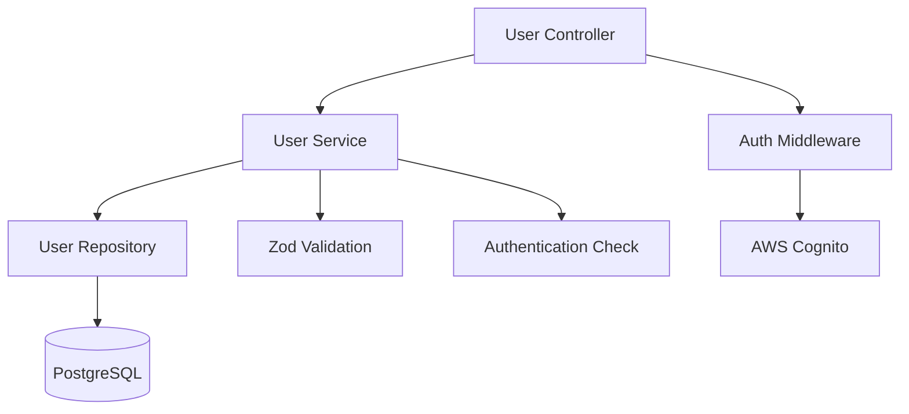

# User Management System

The Macro AI user management system provides comprehensive user profile management, data access patterns,
and user-related operations with repository pattern implementation.

## 👤 User Management Overview

Our user management system handles user profiles, preferences, and data access with clean separation of
concerns using the repository pattern and comprehensive validation.

## ✅ Current Implementation Status: COMPLETE

The user management system includes core user operations, profile management, and data access patterns
required for production deployment.

## 📚 User Management Documentation

### Core Implementation

- **[Profile Management](./profile-management.md)** - User profiles and preferences
  - User profile creation and updates
  - Profile validation with Zod schemas
  - User preferences and settings
  - Profile image and metadata handling
  - Privacy and visibility controls

- **[Data Access Patterns](./data-access-patterns.md)** - Repository pattern implementation
  - Repository pattern for clean data access
  - Drizzle ORM integration and queries
  - User ownership verification
  - Data validation and sanitization
  - Error handling in data operations

## 🏗️ Architecture Overview

### User Management Architecture



### Core Components

- **User Service** (`user.services.ts`): Business logic and validation
- **User Controller** (`user.controller.ts`): HTTP request handling
- **User Repository** (`user.data-access.ts`): Database operations
- **User Schemas** (`user.schemas.ts`): Validation and type definitions
- **User Middleware** (`auth.middleware.ts`): Authentication and authorization

## 🔑 Key Features

### Profile Management ✅ COMPLETE

- **Profile Creation**: Automatic profile creation during registration
- **Profile Updates**: Comprehensive profile update operations
- **Profile Retrieval**: Secure profile data retrieval
- **Data Validation**: Zod schema validation for all operations
- **User Ownership**: Ensure users can only access their own data

### Data Access Layer ✅ COMPLETE

- **Repository Pattern**: Clean separation of data access logic
- **Drizzle ORM Integration**: Type-safe database operations
- **Query Optimization**: Efficient database queries and indexing
- **Transaction Support**: Database transactions for data consistency
- **Error Handling**: Go-style error handling throughout

### User Operations ✅ COMPLETE

- **User Lookup**: Find users by ID, email, or other criteria
- **User Verification**: Email verification status management
- **User Preferences**: Store and retrieve user preferences
- **User Sessions**: Session management and tracking
- **User Deletion**: Comprehensive user data cleanup

## 🛠️ Implementation Details

### User API Endpoints

```typescript
// User management endpoints
GET / user / profile // Get current user profile
PUT / user / profile // Update user profile
DELETE / user / profile // Delete user account
GET / user / preferences // Get user preferences
PUT / user / preferences // Update user preferences
```

### Database Schema

```sql
-- Users table with comprehensive profile data
CREATE TABLE users (
  id UUID PRIMARY KEY,
  email VARCHAR(255) UNIQUE NOT NULL,
  email_verified BOOLEAN DEFAULT FALSE,
  first_name VARCHAR(100),
  last_name VARCHAR(100),
  profile_image_url TEXT,
  preferences JSONB DEFAULT '{}',
  created_at TIMESTAMP DEFAULT NOW(),
  updated_at TIMESTAMP DEFAULT NOW()
);

-- Indexes for efficient queries
CREATE INDEX idx_users_email ON users(email);
CREATE INDEX idx_users_created_at ON users(created_at);
```

### Repository Pattern Implementation

```typescript
// User repository with clean data access
export class UserRepository {
	constructor(private db: Database) {}

	async findById(id: string): Promise<Result<User | null>> {
		return tryCatch(
			this.db.select().from(users).where(eq(users.id, id)).limit(1),
			'UserRepository - findById',
		)
	}

	async updateProfile(
		id: string,
		updates: Partial<User>,
	): Promise<Result<User>> {
		return tryCatch(
			this.db
				.update(users)
				.set({ ...updates, updatedAt: new Date() })
				.where(eq(users.id, id))
				.returning(),
			'UserRepository - updateProfile',
		)
	}
}
```

### Service Layer Implementation

```typescript
// User service with business logic
export class UserService {
	constructor(private userRepository: UserRepository) {}

	async getUserProfile(userId: string): Promise<Result<UserProfile>> {
		const [user, error] = await this.userRepository.findById(userId)

		if (error) {
			return [null, error]
		}

		if (!user) {
			return [null, new AppError('User not found', 404)]
		}

		return [this.mapToUserProfile(user), null]
	}
}
```

## 🧪 Testing Coverage

### Unit Tests ✅ COMPLETE

- **User Service**: Business logic and validation testing
- **User Repository**: Database operations testing
- **User Controller**: HTTP request/response testing
- **Schema Validation**: Zod schema validation testing

### Integration Tests ✅ COMPLETE

- **End-to-End User Operations**: Complete user journey testing
- **Database Integration**: User data persistence testing
- **Authentication Integration**: User ownership verification testing

## 🔒 Security Considerations

### Data Protection ✅ IMPLEMENTED

- **User Authentication**: Cognito-based authentication required
- **Data Ownership**: Users can only access their own data
- **Input Validation**: Comprehensive validation with Zod schemas
- **SQL Injection Prevention**: Parameterized queries with Drizzle ORM

### Privacy Controls ✅ IMPLEMENTED

- **Profile Visibility**: Control over profile information visibility
- **Data Minimization**: Only collect necessary user data
- **Secure Updates**: Validate all profile update operations
- **Audit Logging**: Track user data access and modifications

## 📊 Data Validation

### Zod Schema Validation

```typescript
// User profile validation schema
export const userProfileSchema = z.object({
	firstName: z.string().min(1).max(100).optional(),
	lastName: z.string().min(1).max(100).optional(),
	email: z.email(),
	profileImageUrl: z.url().optional(),
	preferences: z.record(z.unknown()).default({}),
})

// Runtime validation in service layer
const [validatedData, validationError] = tryCatchSync(
	() => userProfileSchema.parse(updateData),
	'UserService - validateProfileUpdate',
)
```

### Error Handling Patterns

```typescript
// Go-style error handling in user operations
const [updatedUser, updateError] = await userService.updateProfile(
	userId,
	profileData,
)

if (updateError) {
	logger.error('Profile update failed', {
		userId,
		error: updateError.message,
	})
	return res.status(updateError.status).json({
		error: updateError.message,
	})
}

res.json({ user: updatedUser })
```

## 🔗 Related Documentation

- **[Authentication](../authentication/README.md)** - User authentication and authorization
- **[Chat System](../chat-system/README.md)** - User chat data integration
- **[Database Design](../../architecture/database-design.md)** - User data storage
- **[API Development](../../development/api-development.md)** - API development patterns

## 🎯 User Management Goals

- **Data Integrity**: Ensure accurate and consistent user data
- **Security First**: Comprehensive security measures for user data
- **Type Safety**: Full TypeScript coverage with runtime validation
- **Clean Architecture**: Repository pattern for maintainable code
- **User Experience**: Intuitive profile management interface
- **Scalability**: Architecture that supports growing user base

---

**Implementation Details**: [Profile Management](./profile-management.md) | [Data Access Patterns](./data-access-patterns.md)
