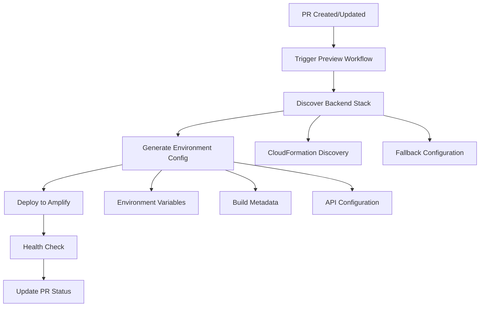

# Frontend Preview Deployment Guide

## 📋 Overview

This guide covers the complete process for deploying frontend preview environments using AWS Amplify, including
automated backend discovery, environment configuration, and deployment management.

## 🏗️ Architecture

### Preview Deployment Flow



### Components

- **Backend Discovery**: Automatic CloudFormation stack detection
- **Environment Generation**: Dynamic VITE\_\* variable creation
- **Amplify Integration**: Automated app and branch management
- **Health Validation**: API endpoint connectivity testing

## 🚀 Deployment Process

### 1. Automatic Trigger

Preview deployments are triggered by:

- Pull request creation
- Pull request updates
- Manual workflow dispatch

### 2. Backend Discovery

The system automatically discovers backend infrastructure:

```bash
# Stack naming patterns
MacroAiPr{number}Stack     # PR-specific stacks
MacroAiDevelopmentStack    # Development environment
MacroAiStagingStack        # Staging environment
```

### 3. Environment Configuration

Generated environment variables include:

```bash
# API Configuration
VITE_API_URL=https://api-pr123.example.com/api/
VITE_API_KEY=***
VITE_API_RESOLUTION_METHOD=direct_stack_discovery

# Environment Identification
VITE_APP_ENV=pr-123
VITE_APP_NAME=Macro AI (Preview)
VITE_PREVIEW_MODE=true

# Build Metadata
VITE_BUILD_TIMESTAMP=2025-08-09 10:30:00 UTC
VITE_BUILD_COMMIT=abc123def456
VITE_BUILD_BRANCH=feature/my-feature
VITE_PR_NUMBER=123
```

### 4. Amplify Deployment

The deployment process:

1. Creates or updates Amplify app
2. Configures environment variables
3. Triggers build and deployment
4. Validates deployment success

## 🔧 Configuration

### Required Secrets

Configure these GitHub repository secrets:

```bash
AWS_ACCESS_KEY_ID          # AWS credentials for deployment
AWS_SECRET_ACCESS_KEY      # AWS secret key
VITE_API_KEY              # API key for frontend (public-safe only)
```

### Environment Mapping

Configure backend discovery in `apps/client-ui/scripts/env-mapping.json`:

```json
{
	"environments": {
		"preview": {
			"stack_pattern": "MacroAiPr{pr_number}Stack",
			"api_endpoint_key": "ApiEndpoint",
			"fallback_url": "https://api-staging.macro-ai.com/api/"
		}
	}
}
```

## 🔍 Troubleshooting

### Common Issues

1. **Backend Stack Not Found**
   - Verify stack naming follows `MacroAiPr{number}Stack` pattern
   - Check AWS credentials have CloudFormation permissions
   - Ensure backend deployment completed successfully

2. **Environment Variable Failures**
   - Verify all required secrets are configured
   - Check API endpoint format and accessibility
   - Validate environment variable patterns

3. **Amplify Deployment Failures**
   - Check IAM permissions for Amplify operations
   - Verify app naming follows allowed patterns
   - Review build logs for configuration errors

### Debug Mode

Enable debug output for troubleshooting:

```bash
# In workflow inputs
debug: true

# Or manually in scripts
export DEBUG=true
./scripts/deploy-amplify-preview.sh
```

## 📚 Related Documentation

- [Amplify Configuration Templates](./amplify-configuration-templates.md)
- [Environment Variable Integration](./environment-variable-integration.md)
- [Preview Deployment User Manual](./preview-deployment-user-manual.md)
- [Troubleshooting Guide](./troubleshooting-preview-deployments.md)
