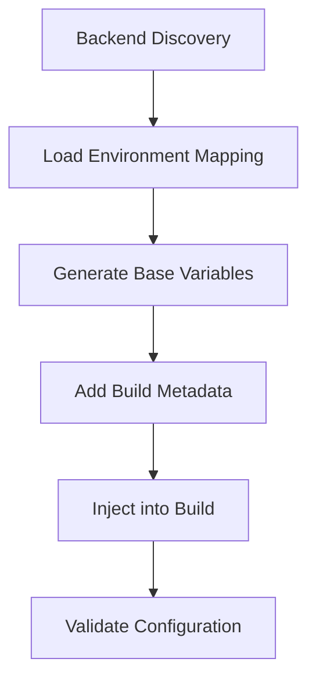

# Environment Variable Integration Guide

## 📋 Overview

This guide covers how environment variables are generated, injected, and managed across different deployment environments in the frontend preview system.

## 🔧 Environment Variable Generation

### Generation Process



### Variable Categories

#### 1. API Configuration Variables

```bash
VITE_API_URL                    # Backend API endpoint
VITE_API_KEY                    # API authentication key (public-safe only)
VITE_API_RESOLUTION_METHOD      # How API was discovered
VITE_API_FALLBACK_USED         # Whether fallback URL was used
```

#### 2. Environment Identification Variables

```bash
VITE_APP_ENV                   # Environment name (pr-123, staging, production)
VITE_APP_NAME                  # Display name for the application
VITE_PREVIEW_MODE              # Boolean flag for preview mode
VITE_BACKEND_STACK_NAME        # CloudFormation stack name
```

#### 3. Build Metadata Variables

```bash
VITE_BUILD_TIMESTAMP           # Build timestamp (UTC)
VITE_BUILD_COMMIT              # Git commit hash
VITE_BUILD_BRANCH              # Git branch name
VITE_PR_NUMBER                 # Pull request number (if applicable)
```

#### 4. Debug Configuration Variables

```bash
VITE_ENABLE_DEVTOOLS           # Enable development tools
VITE_ENABLE_DEBUG_LOGGING      # Enable debug logging
VITE_SHOW_BUILD_INFO           # Show build information in UI
```

## 🔒 Security Considerations

### Public Exposure Warning

**Critical**: All `VITE_*` variables are **publicly accessible** in the frontend bundle:

- Variables are embedded in the compiled JavaScript
- Anyone can inspect the source code and see these values
- Never include sensitive credentials or secrets

### Secure Variable Handling

**✅ Safe for VITE\_\* Variables**:

- Non-sensitive API keys designed for client-side use
- Public API endpoints
- Environment identifiers
- Build metadata (with caution)

**❌ Never Use in VITE\_\* Variables**:

- Database credentials
- Private API keys
- Internal service URLs
- Sensitive configuration values

### API Key Security

For `VITE_API_KEY`:

- Use least-privilege keys with minimal permissions
- Implement rate limiting and IP restrictions
- Rotate keys regularly (especially for preview environments)
- Consider token-based authentication flows instead

## 🛠️ Configuration Management

### Environment Mapping File

Configure variable generation in `apps/client-ui/scripts/env-mapping.json`:

```json
{
	"environments": {
		"preview": {
			"stack_pattern": "MacroAiPr{pr_number}Stack",
			"api_endpoint_key": "ApiEndpoint",
			"fallback_url": "https://api-staging.macro-ai.com/api/",
			"app_name": "Macro AI (Preview)",
			"enable_debug": true
		},
		"staging": {
			"stack_pattern": "MacroAiStagingStack",
			"api_endpoint_key": "ApiEndpoint",
			"fallback_url": "https://api-staging.macro-ai.com/api/",
			"app_name": "Macro AI (Staging)",
			"enable_debug": false
		}
	},
	"backend_resolution": {
		"endpoint_key": "ApiEndpoint",
		"timeout_seconds": 30,
		"retry_attempts": 3
	}
}
```

### Variable Injection Process

1. **Discovery Phase**: Backend stack detection
2. **Generation Phase**: Variable creation from templates
3. **Validation Phase**: Format and accessibility checks
4. **Injection Phase**: Writing to `.env` files
5. **Build Phase**: Vite processes variables into bundle

### Override Mechanisms

Variables can be overridden at multiple levels:

```bash
# 1. Workflow inputs (highest priority)
api-endpoint: "https://custom-api.example.com/api/"

# 2. Environment mapping configuration
# 3. Backend discovery results
# 4. Default fallback values (lowest priority)
```

## 🧪 Testing and Validation

### Variable Validation

The system validates:

- Required variables are present
- URL formats are correct
- API endpoints are accessible
- Build metadata is properly formatted

### Testing Scripts

```bash
# Test environment variable generation
./scripts/test-env-integration.sh

# Validate specific environment
./scripts/configure-preview-env.sh --environment pr-123 --validate-only

# Test backend discovery
./scripts/api-resolution-service.sh --environment preview --pr-number 123
```

## 🔍 Troubleshooting

### Common Issues

1. **Missing Variables**
   - Check backend stack exists and is accessible
   - Verify environment mapping configuration
   - Ensure required secrets are configured

2. **Invalid API URLs**
   - Validate CloudFormation output format
   - Check fallback URL configuration
   - Verify URL normalization logic

3. **Build Failures**
   - Check for undefined VITE\_\* variables in code
   - Validate variable formats and types
   - Review build logs for specific errors

### Debug Mode

Enable detailed logging:

```bash
export DEBUG=true
export VITE_ENABLE_DEBUG_LOGGING=true
```

## 📚 Related Documentation

- [Amplify Configuration Templates](./amplify-configuration-templates.md)
- [Frontend Preview Deployment Guide](./amplify-preview-deployment.md)
- [Preview Deployment User Manual](./preview-deployment-user-manual.md)
- [CI/CD Workflow Integration](../ci-cd/frontend-preview-workflow-integration.md)
