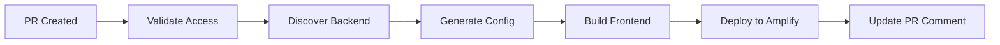

# Getting Started with Frontend Preview Deployments

This guide will help you set up and start using the frontend preview deployment system for the Macro AI project.

## 📋 Overview

The frontend preview deployment system automatically creates isolated preview environments for every pull
request, allowing you to:

- **Test Changes Safely**: Preview your changes before merging
- **Share Work Easily**: Share preview URLs with team members and stakeholders
- **Validate Integration**: Test frontend changes with corresponding backend environments
- **Accelerate Reviews**: Enable faster code reviews with live previews

## 🚀 Quick Start

### Prerequisites

Before you begin, ensure you have:

- ✅ **GitHub Access**: Write access to the Macro AI repository
- ✅ **AWS Permissions**: Your GitHub Actions have AWS IAM permissions configured
- ✅ **API Keys**: Frontend API keys are configured in repository secrets
- ✅ **Node.js**: Node.js 18+ and pnpm installed locally (for local development)

### Your First Preview Deployment

1. **Create a Feature Branch**

   ```bash
   git checkout -b feature/my-awesome-feature
   ```

2. **Make Your Changes**

   ```bash
   # Edit frontend code in apps/client-ui/
   cd apps/client-ui
   npm run dev  # Test locally first
   ```

3. **Push and Create Pull Request**

   ```bash
   git add .
   git commit -m "Add awesome new feature"
   git push origin feature/my-awesome-feature
   ```

4. **Open Pull Request**
   - Go to GitHub and create a pull request
   - The preview deployment will start automatically
   - Watch the "Deploy Frontend Preview" workflow in the Actions tab

5. **Access Your Preview**
   - Once deployment completes, find the preview URL in the PR comment
   - The URL will look like: `https://pr123.d1234567890.amplifyapp.com`

## 🔧 How It Works

### Automatic Deployment Trigger

Preview deployments are triggered automatically when:

- ✅ **Pull Request Created**: New PR against `main` or `develop` branch
- ✅ **Pull Request Updated**: New commits pushed to existing PR
- ✅ **Manual Trigger**: Using the "Deploy Frontend Preview" workflow dispatch

### Backend Integration

The system automatically discovers and connects to backend environments:

1. **Backend Discovery**: Searches for CloudFormation stacks matching your PR
2. **API Resolution**: Extracts API endpoints from discovered backend stacks
3. **Fallback Handling**: Uses development API if no PR-specific backend exists
4. **Environment Variables**: Generates appropriate environment configuration

### Deployment Process



## 📱 Using Preview Deployments

### Accessing Your Preview

1. **Find the Preview URL**
   - Check the automated comment on your PR
   - Look for the "🚀 Frontend Preview Deployed" message
   - Click the preview URL to access your deployment

2. **Preview Environment Details**
   - **Environment Name**: `pr-{number}` (e.g., `pr-123`)
   - **API Endpoint**: Automatically resolved backend API
   - **Build Metadata**: Includes commit hash, branch, and timestamp
   - **Debug Features**: Enhanced logging and development tools enabled

### Testing Your Changes

1. **Functional Testing**
   - Test all new features and changes
   - Verify existing functionality still works
   - Check responsive design on different devices

2. **Integration Testing**
   - Test API calls and data flow
   - Verify authentication and authorization
   - Check error handling and edge cases

3. **Performance Testing**
   - Check page load times
   - Test with different network conditions
   - Verify bundle size and optimization

### Sharing with Team Members

1. **Share the Preview URL**
   - Copy the URL from the PR comment
   - Share with reviewers, designers, or stakeholders
   - No authentication required for preview access

2. **Provide Context**
   - Include what to test and look for
   - Mention any known limitations or work-in-progress areas
   - Provide test data or scenarios if needed

## 🔄 Managing Preview Deployments

### Updating Your Preview

Your preview automatically updates when you push new commits:

```bash
# Make additional changes
git add .
git commit -m "Address review feedback"
git push origin feature/my-awesome-feature
```

The system will:

- Detect the new commit
- Rebuild and redeploy automatically
- Update the preview URL (same URL, new content)
- Add a comment with the update status

### Manual Deployment

You can manually trigger a deployment if needed:

1. Go to the **Actions** tab in GitHub
2. Select **"Deploy Frontend Preview"** workflow
3. Click **"Run workflow"**
4. Select your branch and click **"Run workflow"**

### Checking Deployment Status

Monitor your deployment progress:

1. **GitHub Actions Tab**
   - View real-time deployment logs
   - Check for any errors or warnings
   - See deployment duration and status

2. **PR Comments**
   - Automated status updates
   - Links to deployment logs
   - Preview URL when ready

3. **AWS Amplify Console** (if you have access)
   - Detailed build logs
   - Performance metrics
   - Deployment history

## 🧹 Cleanup

### Automatic Cleanup

Preview deployments are automatically cleaned up when:

- ✅ **PR Merged**: Preview deleted after successful merge
- ✅ **PR Closed**: Preview deleted when PR is closed without merging
- ✅ **Manual Cleanup**: Using the manual cleanup workflow

### Manual Cleanup

If you need to manually clean up a preview:

1. **Using GitHub Actions**
   - Go to Actions → "Manual Destroy Frontend Preview"
   - Select the PR number to clean up
   - Run the workflow

2. **Using Scripts** (for maintainers)

   ```bash
   cd apps/client-ui
   ./scripts/destroy-preview-environment.sh --pr-number 123
   ```

## 🚨 Troubleshooting Quick Fixes

### Common Issues

#### 1. Deployment Failed

**Symptoms**: Red X on the deployment check, error in Actions log

**Quick Fixes**:

- Check the Actions log for specific error messages
- Ensure your code builds locally: `cd apps/client-ui && pnpm build`
- Verify environment variables are properly configured
- Try pushing a new commit to trigger a fresh deployment

#### 2. Preview URL Not Working

**Symptoms**: 404 error or blank page when accessing preview URL

**Quick Fixes**:

- Wait a few minutes for DNS propagation
- Check if the deployment actually completed successfully
- Verify the URL in the PR comment is correct
- Try a hard refresh (Ctrl+F5 or Cmd+Shift+R)

#### 3. API Calls Failing

**Symptoms**: Frontend loads but API calls return errors

**Quick Fixes**:

- Check if a backend preview exists for your PR
- Verify the API endpoint in the deployment logs
- Test the API endpoint directly in a browser
- Check for CORS or authentication issues

#### 4. Old Content Showing

**Symptoms**: Preview shows old version despite new deployment

**Quick Fixes**:

- Hard refresh the browser (Ctrl+F5)
- Clear browser cache
- Try accessing in an incognito/private window
- Check the deployment timestamp in the PR comment

### Getting Help

If you're still having issues:

1. **Check Documentation**
   - [Troubleshooting Guide](./troubleshooting-preview-deployments.md)
   - [Configuration Reference](./preview-deployment-configuration.md)

2. **Ask for Help**
   - Comment on your PR with the issue description
   - Include relevant error messages and logs
   - Tag a team member familiar with the deployment system

3. **Report Issues**
   - Create an issue in the repository
   - Include steps to reproduce the problem
   - Attach relevant logs and screenshots

## 📚 Next Steps

Now that you have your first preview deployment running:

1. **Learn Advanced Features**
   - [User Manual](./preview-deployment-user-manual.md)
   - [Configuration Options](./preview-deployment-configuration.md)

2. **Optimize Your Workflow**
   - [Best Practices](./preview-deployment-best-practices.md)
   - [Performance Tips](./preview-deployment-performance.md)

3. **Understand the System**
   - [Architecture Overview](./frontend-backend-integration.md)
   - [Workflow Integration](../ci-cd/frontend-preview-workflow-integration.md)

## 🎯 Summary

You now know how to:

- ✅ Create preview deployments automatically with pull requests
- ✅ Access and test your preview environments
- ✅ Share previews with team members
- ✅ Update and manage your deployments
- ✅ Clean up when done
- ✅ Troubleshoot common issues

The preview deployment system is designed to be automatic and hassle-free. In most cases, you just need to
create a PR and the system handles the rest!

**Happy coding! 🚀**
