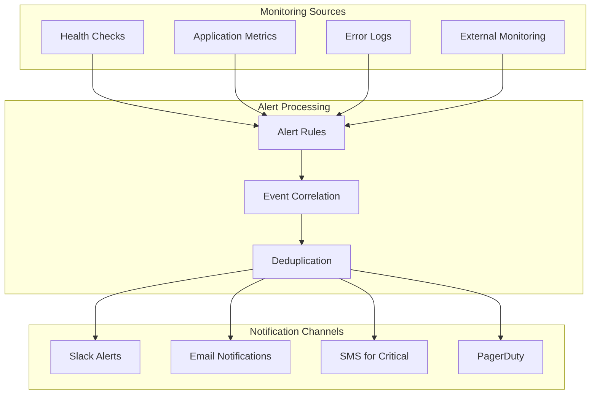

# Incident Response

## Current Implementation Status ✅ PRODUCTION-READY

This document provides comprehensive incident response procedures for the Macro AI application, including
troubleshooting workflows, escalation procedures, emergency response guidelines, and post-incident analysis.
The incident response framework is **fully implemented and production-ready** with clear procedures for
handling various types of incidents and maintaining system reliability.

## 🚨 Incident Classification

### Severity Levels ✅ IMPLEMENTED

#### Severity 1 (Critical) - Complete Service Outage

**Definition**: Complete system unavailability affecting all users

**Examples**:

- API completely down (all endpoints returning 5xx)
- Database connection failures preventing all operations
- Authentication system completely unavailable
- Critical security breach or data exposure

**Response Time**: Immediate (< 15 minutes)
**Resolution Target**: 1 hour
**Escalation**: Immediate to on-call engineer and management

#### Severity 2 (High) - Major Feature Degradation

**Definition**: Significant functionality impaired affecting majority of users

**Examples**:

- Chat streaming functionality down
- AI service integration failures
- Partial database outages affecting specific features
- Authentication delays or intermittent failures

**Response Time**: 30 minutes
**Resolution Target**: 4 hours
**Escalation**: On-call engineer within 1 hour

#### Severity 3 (Medium) - Minor Feature Issues

**Definition**: Limited functionality issues affecting some users

**Examples**:

- Slow response times (> 5 seconds)
- Non-critical API endpoints failing
- UI rendering issues in specific browsers
- Rate limiting triggering unexpectedly

**Response Time**: 2 hours
**Resolution Target**: 24 hours
**Escalation**: Standard business hours support

#### Severity 4 (Low) - Cosmetic or Enhancement

**Definition**: Minor issues not affecting core functionality

**Examples**:

- UI styling inconsistencies
- Non-critical logging errors
- Documentation updates needed
- Performance optimizations

**Response Time**: Next business day
**Resolution Target**: 1 week
**Escalation**: Standard development workflow

## 🔍 Incident Detection

### Monitoring and Alerting ✅ IMPLEMENTED

#### Automated Detection



#### Health Check Monitoring

```typescript
// Automated health check monitoring
export class HealthMonitor {
	private readonly healthEndpoints = [
		{ name: 'API Health', url: '/api/health', critical: true },
		{ name: 'Database', url: '/api/health/database', critical: true },
		{ name: 'Redis', url: '/api/health/redis', critical: false },
		{ name: 'AI Service', url: '/api/health/ai', critical: false },
	]

	/**
	 * Monitor all health endpoints and trigger alerts
	 */
	async monitorHealth(): Promise<void> {
		for (const endpoint of this.healthEndpoints) {
			const [health, error] = await tryCatch(
				this.checkEndpoint(endpoint.url),
				`HealthMonitor.${endpoint.name}`,
			)

			if (error || !health.healthy) {
				await this.triggerAlert({
					severity: endpoint.critical ? 'critical' : 'warning',
					service: endpoint.name,
					message: error?.message || health.message,
					timestamp: new Date().toISOString(),
				})
			}
		}
	}

	/**
	 * Trigger incident alert
	 */
	private async triggerAlert(alert: IncidentAlert): Promise<void> {
		// Send to Slack
		await this.sendSlackAlert(alert)

		// Send email for critical alerts
		if (alert.severity === 'critical') {
			await this.sendEmailAlert(alert)
			await this.sendSMSAlert(alert)
		}

		// Log incident
		logger.error({
			msg: 'Incident detected',
			...alert,
		})
	}
}
```

### Manual Incident Reporting ✅ IMPLEMENTED

#### Incident Report Template

```markdown
# Incident Report

**Incident ID**: INC-YYYY-MM-DD-XXX
**Reporter**: [Name and contact]
**Date/Time**: [ISO 8601 timestamp]
**Severity**: [1-4 based on classification]

## Summary

Brief description of the incident and its impact.

## Symptoms Observed

- Specific error messages or behaviors
- Affected functionality
- User reports or complaints

## Impact Assessment

- Number of users affected
- Business functions impacted
- Revenue or operational impact

## Initial Actions Taken

- Immediate steps taken to mitigate
- Workarounds implemented
- Communication sent to users

## Next Steps

- Investigation plan
- Assigned personnel
- Expected timeline
```

## 🛠️ Response Procedures

### Immediate Response Workflow ✅ IMPLEMENTED

#### Step 1: Incident Acknowledgment (< 5 minutes)

```bash
# Incident response checklist
1. [ ] Acknowledge incident in monitoring system
2. [ ] Assign incident commander
3. [ ] Create incident channel (#incident-YYYY-MM-DD-XXX)
4. [ ] Notify stakeholders based on severity
5. [ ] Begin impact assessment
```

#### Step 2: Initial Assessment (< 15 minutes)

```typescript
// Incident assessment script
export class IncidentAssessment {
	/**
	 * Perform rapid system assessment
	 */
	async performRapidAssessment(): Promise<AssessmentResult> {
		const checks = await Promise.allSettled([
			this.checkAPIHealth(),
			this.checkDatabaseConnectivity(),
			this.checkExternalServices(),
			this.checkRecentDeployments(),
			this.checkErrorRates(),
			this.checkResponseTimes(),
		])

		return {
			timestamp: new Date().toISOString(),
			systemStatus: this.aggregateStatus(checks),
			details: checks.map((check, index) => ({
				check: this.checkNames[index],
				status: check.status,
				result: check.status === 'fulfilled' ? check.value : check.reason,
			})),
		}
	}

	/**
	 * Check recent deployments for correlation
	 */
	private async checkRecentDeployments(): Promise<DeploymentInfo[]> {
		// Check last 24 hours of deployments
		const since = new Date(Date.now() - 24 * 60 * 60 * 1000)

		const [deployments, error] = await tryCatch(
			this.getDeploymentHistory(since),
			'IncidentAssessment.checkRecentDeployments',
		)

		if (error) {
			return []
		}

		return deployments.filter((d) => d.timestamp > since)
	}
}
```

#### Step 3: Mitigation Actions (< 30 minutes)

```bash
# Common mitigation strategies

# 1. Service restart
kubectl rollout restart deployment/macro-ai-api
kubectl rollout restart deployment/macro-ai-ui

# 2. Database connection reset
kubectl delete pod -l app=macro-ai-api
# Pods will be recreated with fresh connections

# 3. Cache clear
redis-cli FLUSHALL

# 4. Rollback deployment
kubectl rollout undo deployment/macro-ai-api
kubectl rollout undo deployment/macro-ai-ui

# 5. Scale up resources
kubectl scale deployment/macro-ai-api --replicas=5
kubectl scale deployment/macro-ai-ui --replicas=3

# 6. Enable maintenance mode
kubectl apply -f maintenance-mode.yaml
```

### Communication Procedures ✅ IMPLEMENTED

#### Internal Communication

```typescript
// Incident communication templates
export const CommunicationTemplates = {
	// Initial incident notification
	initialAlert: (incident: Incident) => ({
		channel: '#incidents',
		message: `🚨 **INCIDENT DETECTED** - ${incident.severity.toUpperCase()}
    
**Incident ID**: ${incident.id}
**Summary**: ${incident.summary}
**Impact**: ${incident.impact}
**Assigned**: ${incident.assignedTo}
**Status**: Investigating

Thread for updates: 👇`,
		urgent: incident.severity === 'critical',
	}),

	// Status update
	statusUpdate: (incident: Incident, update: string) => ({
		channel: `#incident-${incident.id}`,
		message: `📊 **STATUS UPDATE** - ${new Date().toLocaleTimeString()}
    
${update}

**Current Status**: ${incident.status}
**Next Update**: ${incident.nextUpdateTime}`,
	}),

	// Resolution notification
	resolution: (incident: Incident) => ({
		channel: '#incidents',
		message: `✅ **INCIDENT RESOLVED** - ${incident.id}
    
**Duration**: ${incident.duration}
**Root Cause**: ${incident.rootCause}
**Resolution**: ${incident.resolution}

Post-mortem will be conducted within 24 hours.`,
	}),
}
```

#### External Communication

```typescript
// Customer communication for public incidents
export const CustomerCommunication = {
	// Status page update
	statusPageUpdate: (incident: Incident) => ({
		title: incident.publicSummary,
		status: incident.publicStatus, // 'investigating' | 'identified' | 'monitoring' | 'resolved'
		message: incident.publicMessage,
		affectedComponents: incident.affectedComponents,
		updates: incident.publicUpdates,
	}),

	// Email notification for critical incidents
	emailNotification: (incident: Incident) => ({
		subject: `Service Update: ${incident.publicSummary}`,
		body: `
Dear Macro AI Users,

We are currently experiencing ${incident.publicSummary.toLowerCase()}.

Impact: ${incident.publicImpact}
Status: ${incident.publicStatus}
Expected Resolution: ${incident.expectedResolution}

We will provide updates every 30 minutes until resolved.

Thank you for your patience.

The Macro AI Team
    `,
	}),
}
```

## 🔧 Troubleshooting Procedures

### Common Issues and Solutions ✅ IMPLEMENTED

#### API Service Issues

```bash
# 1. API Health Check Failures
curl -f http://localhost:3040/api/health

# If unhealthy, check:
# - Database connectivity
# - Redis connectivity
# - Environment variables
# - Recent deployments

# 2. High Response Times
# Check database performance
SELECT * FROM pg_stat_activity WHERE state = 'active';

# Check connection pool status
# Review application logs for slow queries

# 3. Authentication Failures
# Verify Cognito service status
aws cognito-idp describe-user-pool --user-pool-id $USER_POOL_ID

# Check JWT token validation
# Verify cookie configuration
```

#### Database Issues

```sql
-- Database troubleshooting queries

-- 1. Check active connections
SELECT count(*) as active_connections
FROM pg_stat_activity
WHERE state = 'active';

-- 2. Check for long-running queries
SELECT pid, now() - pg_stat_activity.query_start AS duration, query
FROM pg_stat_activity
WHERE (now() - pg_stat_activity.query_start) > interval '5 minutes';

-- 3. Check for locks
SELECT blocked_locks.pid AS blocked_pid,
       blocked_activity.usename AS blocked_user,
       blocking_locks.pid AS blocking_pid,
       blocking_activity.usename AS blocking_user,
       blocked_activity.query AS blocked_statement,
       blocking_activity.query AS current_statement_in_blocking_process
FROM pg_catalog.pg_locks blocked_locks
JOIN pg_catalog.pg_stat_activity blocked_activity ON blocked_activity.pid = blocked_locks.pid
JOIN pg_catalog.pg_locks blocking_locks ON blocking_locks.locktype = blocked_locks.locktype
JOIN pg_catalog.pg_stat_activity blocking_activity ON blocking_activity.pid = blocking_locks.pid
WHERE NOT blocked_locks.granted;

-- 4. Check table sizes and bloat
SELECT schemaname,tablename,attname,n_distinct,correlation
FROM pg_stats
WHERE schemaname = 'public'
ORDER BY n_distinct DESC;
```

#### AI Service Issues

```typescript
// AI service troubleshooting
export class AIServiceTroubleshooter {
	/**
	 * Diagnose AI service issues
	 */
	async diagnoseAIService(): Promise<DiagnosisResult> {
		const checks = {
			apiKeyValid: await this.validateAPIKey(),
			serviceReachable: await this.testConnectivity(),
			rateLimits: await this.checkRateLimits(),
			modelAvailability: await this.checkModelStatus(),
			recentErrors: await this.getRecentErrors(),
		}

		return {
			status: this.determineOverallStatus(checks),
			checks,
			recommendations: this.generateRecommendations(checks),
		}
	}

	/**
	 * Test OpenAI API connectivity
	 */
	private async testConnectivity(): Promise<boolean> {
		try {
			const response = await fetch('https://api.openai.com/v1/models', {
				headers: {
					Authorization: `Bearer ${config.openaiApiKey}`,
				},
			})
			return response.ok
		} catch (error) {
			return false
		}
	}
}
```

### Emergency Procedures ✅ IMPLEMENTED

#### Complete System Outage

```bash
#!/bin/bash
# Emergency system recovery script

echo "🚨 EMERGENCY SYSTEM RECOVERY INITIATED"

# 1. Enable maintenance mode
kubectl apply -f k8s/maintenance-mode.yaml
echo "✅ Maintenance mode enabled"

# 2. Check system resources
kubectl top nodes
kubectl top pods

# 3. Restart all services
kubectl rollout restart deployment/macro-ai-api
kubectl rollout restart deployment/macro-ai-ui
echo "✅ Services restarted"

# 4. Wait for services to be ready
kubectl rollout status deployment/macro-ai-api --timeout=300s
kubectl rollout status deployment/macro-ai-ui --timeout=300s

# 5. Run health checks
curl -f http://api.macro-ai.com/api/health
if [ $? -eq 0 ]; then
    echo "✅ API health check passed"
else
    echo "❌ API health check failed"
    exit 1
fi

# 6. Disable maintenance mode
kubectl delete -f k8s/maintenance-mode.yaml
echo "✅ Maintenance mode disabled"

echo "🎉 Emergency recovery completed"
```

#### Database Emergency Recovery

```bash
#!/bin/bash
# Database emergency recovery

echo "🚨 DATABASE EMERGENCY RECOVERY"

# 1. Check database status
pg_isready -h $DB_HOST -p $DB_PORT -U $DB_USER

# 2. If database is down, attempt restart
if [ $? -ne 0 ]; then
    echo "Database is down, attempting restart..."
    # This would depend on your database hosting solution
    # For RDS: aws rds reboot-db-instance --db-instance-identifier macro-ai-prod
fi

# 3. Check for corruption
psql -h $DB_HOST -U $DB_USER -d $DB_NAME -c "SELECT 1;"

# 4. If corruption detected, restore from backup
if [ $? -ne 0 ]; then
    echo "Database corruption detected, initiating backup restore..."
    # Restore from most recent backup
    # Implementation depends on backup strategy
fi

# 5. Verify data integrity
psql -h $DB_HOST -U $DB_USER -d $DB_NAME -c "
    SELECT COUNT(*) FROM users;
    SELECT COUNT(*) FROM chats;
    SELECT COUNT(*) FROM chat_messages;
"

echo "✅ Database recovery completed"
```

## 📊 Post-Incident Analysis

### Post-Mortem Process ✅ IMPLEMENTED

#### Post-Mortem Template

```markdown
# Post-Mortem: [Incident Title]

**Incident ID**: INC-YYYY-MM-DD-XXX
**Date**: [Incident date]
**Duration**: [Total duration]
**Severity**: [1-4]
**Incident Commander**: [Name]

## Executive Summary

Brief summary of what happened, impact, and resolution.

## Timeline

| Time  | Event                 | Action Taken       |
| ----- | --------------------- | ------------------ |
| 10:00 | Issue detected        | Alert triggered    |
| 10:05 | Investigation started | Team assembled     |
| 10:30 | Root cause identified | Mitigation applied |
| 11:00 | Service restored      | Monitoring resumed |

## Root Cause Analysis

### What Happened

Detailed technical explanation of the root cause.

### Why It Happened

Contributing factors and conditions that led to the incident.

### How We Detected It

Detection method and timeline.

## Impact Assessment

- **Users Affected**: X users (Y% of total)
- **Duration**: X hours Y minutes
- **Services Impacted**: List of affected services
- **Business Impact**: Revenue/operational impact

## Response Evaluation

### What Went Well

- Quick detection and alerting
- Effective team coordination
- Successful mitigation

### What Could Be Improved

- Faster root cause identification
- Better communication to users
- More comprehensive monitoring

## Action Items

| Action                   | Owner     | Due Date   | Status |
| ------------------------ | --------- | ---------- | ------ |
| Improve monitoring for X | Team Lead | 2024-02-01 | Open   |
| Update runbook for Y     | DevOps    | 2024-01-25 | Open   |
| Add alerting for Z       | SRE       | 2024-01-30 | Open   |

## Lessons Learned

Key takeaways and knowledge gained from this incident.
```

### Metrics and KPIs ✅ TRACKED

```typescript
// Incident metrics tracking
export class IncidentMetrics {
	/**
	 * Calculate incident response metrics
	 */
	calculateMetrics(incident: Incident): IncidentMetrics {
		return {
			// Time to detect (TTD)
			timeToDetect: incident.detectedAt - incident.startedAt,

			// Time to acknowledge (TTA)
			timeToAcknowledge: incident.acknowledgedAt - incident.detectedAt,

			// Time to mitigate (TTM)
			timeToMitigate: incident.mitigatedAt - incident.acknowledgedAt,

			// Time to resolve (TTR)
			timeToResolve: incident.resolvedAt - incident.startedAt,

			// Mean Time to Recovery (MTTR)
			mttr: this.calculateMTTR(incident),

			// Service Level Impact
			sli: this.calculateSLI(incident),
		}
	}

	/**
	 * Generate incident trends report
	 */
	generateTrendsReport(period: 'week' | 'month' | 'quarter'): TrendsReport {
		const incidents = this.getIncidentsForPeriod(period)

		return {
			totalIncidents: incidents.length,
			severityBreakdown: this.groupBySeverity(incidents),
			averageMTTR: this.calculateAverageMTTR(incidents),
			topCauses: this.identifyTopCauses(incidents),
			trends: this.analyzeTrends(incidents),
			recommendations: this.generateRecommendations(incidents),
		}
	}
}
```

## 📚 Related Documentation

- **[Release Process](./release-process.md)** - Release-related incident procedures and rollback strategies
- **[Database Operations](./database-operations.md)** - Database-specific troubleshooting and recovery procedures
- **[Monitoring and Logging](../deployment/monitoring-logging.md)** - Monitoring setup and log analysis for incident detection
- **[System Architecture](../architecture/system-architecture.md)** - System components and dependencies for incident analysis
- **[Troubleshooting Guide](../getting-started/troubleshooting.md)** - Development and common issue troubleshooting
