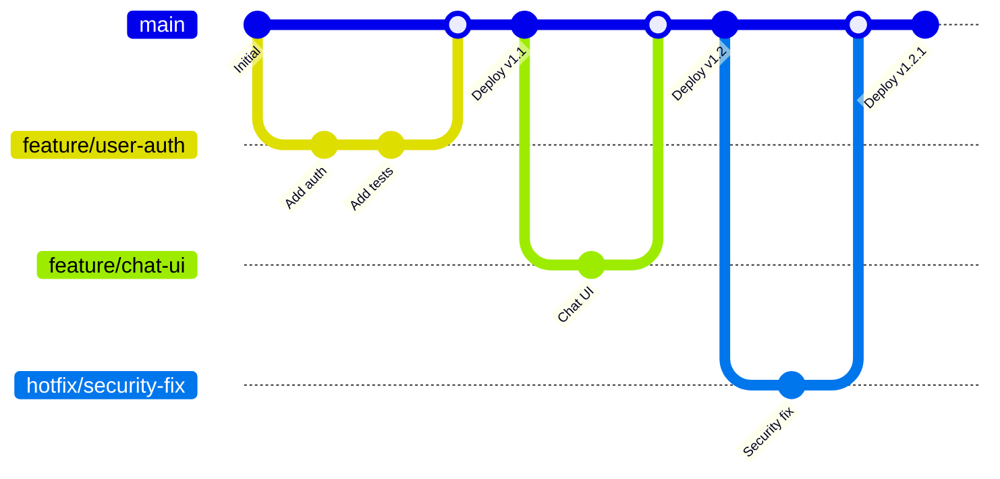
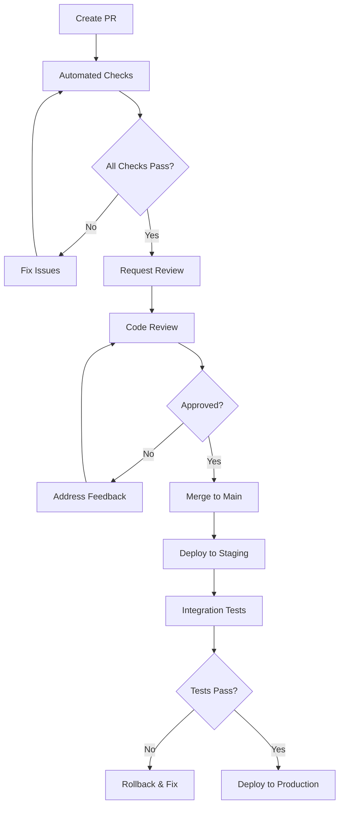

# Trunk-Based Merge Strategy

## Current Implementation Status ✅ PRODUCTION-READY

This document outlines the trunk-based development workflow for the Macro AI project, including branch naming
conventions, pull request requirements, review processes, and continuous integration workflows. The merge strategy
is **fully implemented and enforced** through GitHub branch protection rules and automated workflows.

## 🌳 Trunk-Based Development Overview

### Development Philosophy ✅ IMPLEMENTED

**Core Principles**:

- **Single Main Branch**: All development flows through the `main` branch
- **Short-Lived Feature Branches**: Feature branches exist for days, not weeks
- **Continuous Integration**: Every commit triggers automated testing
- **Small, Frequent Commits**: Encourage small, focused changes
- **Fast Feedback Loops**: Quick validation and integration cycles

### Branch Strategy



## 🏷️ Branch Naming Conventions

### Branch Types ✅ ENFORCED

#### Feature Branches

**Format**: `feature/description-of-feature`

**Examples**:

```bash
feature/user-authentication
feature/chat-streaming-response
feature/database-migration-system
feature/openai-integration
```

**Usage**:

- New features and enhancements
- Non-breaking changes
- Additive functionality

#### Bug Fix Branches

**Format**: `fix/description-of-fix`

**Examples**:

```bash
fix/authentication-token-refresh
fix/chat-message-ordering
fix/database-connection-pool
fix/ui-responsive-layout
```

**Usage**:

- Bug fixes and corrections
- Non-breaking fixes
- Performance improvements

#### Hotfix Branches

**Format**: `hotfix/critical-issue-description`

**Examples**:

```bash
hotfix/security-vulnerability-patch
hotfix/production-database-connection
hotfix/authentication-bypass-fix
```

**Usage**:

- Critical production issues
- Security vulnerabilities
- Emergency fixes requiring immediate deployment

#### Documentation Branches

**Format**: `docs/documentation-update`

**Examples**:

```bash
docs/api-documentation-update
docs/deployment-guide-revision
docs/troubleshooting-guide-expansion
```

**Usage**:

- Documentation updates
- README improvements
- Guide additions

#### Refactoring Branches

**Format**: `refactor/component-or-system-name`

**Examples**:

```bash
refactor/authentication-service
refactor/database-query-optimization
refactor/ui-component-structure
```

**Usage**:

- Code refactoring without functional changes
- Performance optimizations
- Code organization improvements

### Branch Naming Rules ✅ ENFORCED

1. **Use lowercase letters and hyphens**: `feature/user-auth` ✅, `Feature/UserAuth` ❌
2. **Be descriptive but concise**: `feature/chat-ui` ✅, `feature/stuff` ❌
3. **Use present tense**: `feature/add-authentication` ✅, `feature/added-auth` ❌
4. **Avoid special characters**: `feature/user-auth` ✅, `feature/user_auth!` ❌
5. **Maximum 50 characters**: Keep branch names readable and manageable

## 📋 Pull Request Requirements

### PR Creation Requirements ✅ ENFORCED

#### Required Elements

1. **Descriptive Title**: Clear, concise description of changes
2. **Detailed Description**: What, why, and how of the changes
3. **Semantic Version Label**: Exactly one of `major`, `minor`, or `patch`
4. **Linked Issues**: Reference related GitHub issues
5. **Testing Evidence**: Screenshots, test results, or manual testing notes

#### PR Template ✅ IMPLEMENTED

```markdown
## Description

Brief description of the changes made.

## Type of Change

- [ ] Bug fix (non-breaking change which fixes an issue)
- [ ] New feature (non-breaking change which adds functionality)
- [ ] Breaking change (fix or feature that would cause existing functionality to not work as expected)
- [ ] Documentation update

## Testing

- [ ] Unit tests pass
- [ ] Integration tests pass
- [ ] Manual testing completed
- [ ] Screenshots attached (for UI changes)

## Checklist

- [ ] Code follows the project's coding standards
- [ ] Self-review of code completed
- [ ] Code is commented, particularly in hard-to-understand areas
- [ ] Corresponding changes to documentation made
- [ ] No new warnings introduced
- [ ] Tests added that prove the fix is effective or feature works

## Related Issues

Closes #[issue_number]

## Screenshots (if applicable)

[Add screenshots here]

## Additional Notes

[Any additional information]
```

### Semantic Versioning Labels ✅ ENFORCED

#### Label Requirements

**Exactly one label required** (enforced by GitHub Actions):

- **`major`**: Breaking changes that require major version bump
  - API changes that break backward compatibility
  - Database schema changes requiring migration
  - Removal of deprecated features

- **`minor`**: New features that are backward compatible
  - New API endpoints
  - New UI features
  - Enhanced functionality

- **`patch`**: Bug fixes and patches
  - Bug fixes
  - Security patches
  - Performance improvements
  - Documentation updates

#### Label Enforcement ✅ AUTOMATED

```yaml
# .github/workflows/dev-pr-label.yml
- name: Check PR Label
  uses: mheap/github-action-required-labels@v5.4.1
  env:
    GITHUB_TOKEN: ${{ secrets.GITHUB_TOKEN }}
  with:
    mode: exactly
    count: 1
    labels: 'major, minor, patch'
```

## 👥 Code Review Process

### Review Requirements ✅ ENFORCED

#### Mandatory Reviews

1. **Minimum 1 Approval**: At least one team member must approve
2. **Code Owner Review**: Required for changes to critical paths
3. **Dismiss Stale Reviews**: New commits dismiss previous approvals
4. **No Self-Approval**: Authors cannot approve their own PRs

#### Review Criteria

**Code Quality**:

- [ ] Code follows established patterns and conventions
- [ ] Proper error handling implemented
- [ ] Go-style error handling used consistently
- [ ] TypeScript types are properly defined
- [ ] No obvious security vulnerabilities

**Testing**:

- [ ] Adequate test coverage for new code
- [ ] Existing tests still pass
- [ ] Integration tests updated if needed
- [ ] Manual testing completed for UI changes

**Documentation**:

- [ ] Code is self-documenting with clear variable/function names
- [ ] Complex logic is commented
- [ ] API changes are documented
- [ ] README updates if needed

**Performance**:

- [ ] No obvious performance regressions
- [ ] Database queries are optimized
- [ ] Frontend bundle size impact considered
- [ ] Memory usage patterns reviewed

### Review Process Flow



### Review Guidelines

#### For Reviewers

**What to Look For**:

1. **Correctness**: Does the code do what it's supposed to do?
2. **Clarity**: Is the code easy to understand and maintain?
3. **Consistency**: Does it follow project conventions?
4. **Completeness**: Are all edge cases handled?
5. **Security**: Are there any security implications?

**Review Etiquette**:

- Be constructive and specific in feedback
- Explain the "why" behind suggestions
- Acknowledge good practices and improvements
- Use collaborative language ("we could" vs "you should")
- Focus on the code, not the person

#### For Authors

**Before Requesting Review**:

1. Self-review your own code
2. Ensure all automated checks pass
3. Add comprehensive PR description
4. Include testing evidence
5. Update documentation if needed

**Responding to Feedback**:

- Address all feedback points
- Ask for clarification if needed
- Push new commits to address issues
- Re-request review after changes

## 🔄 Continuous Integration Workflow

### Automated Quality Gates ✅ IMPLEMENTED

#### Pre-Merge Checks

1. **Build Validation**: All applications must build successfully
2. **Lint Checks**: Code must pass ESLint and Prettier validation
3. **Type Checking**: TypeScript compilation must succeed
4. **Unit Tests**: All tests must pass with adequate coverage
5. **Integration Tests**: API and UI integration tests must pass

#### GitHub Actions Workflow

```yaml
# Triggered on PR creation and updates
on:
  pull_request:
    types: [opened, reopened, synchronize]
    branches: [main]

jobs:
  hygiene-checks:
    runs-on: ubuntu-latest
    steps:
      - name: Checkout code
      - name: Setup Node.js and pnpm
      - name: Install dependencies
      - name: Run build
      - name: Run lint
      - name: Run tests
      - name: Upload coverage
```

### Branch Protection Rules ✅ ENFORCED

#### Main Branch Protection

```yaml
Protection Rules:
  - Require pull request reviews before merging: ✅
  - Required approving reviews: 1
  - Dismiss stale PR approvals when new commits are pushed: ✅
  - Require review from code owners: ✅
  - Require status checks to pass before merging: ✅
    - build
    - lint
    - test
    - label_check
  - Require branches to be up to date before merging: ✅
  - Require conversation resolution before merging: ✅
  - Restrict pushes that create files: ✅
  - Allow force pushes: ❌
  - Allow deletions: ❌
```

## 🚀 Deployment Integration

### Deployment Triggers ✅ IMPLEMENTED

#### Automatic Staging Deployment

```yaml
deploy-staging:
  if: github.ref == 'refs/heads/main'
  needs: [build, lint, test]
  runs-on: ubuntu-latest
  steps:
    - name: Deploy to staging environment
    - name: Run smoke tests
    - name: Notify team of deployment
```

#### Production Deployment Process

1. **Staging Validation**: Changes must be validated in staging
2. **Manual Approval**: Production deployments require manual approval
3. **Deployment Window**: Deployments during business hours preferred
4. **Rollback Plan**: Automated rollback capability available

### Release Process

#### Version Tagging

```bash
# Automatic version bumping based on PR labels
# major label: 1.0.0 -> 2.0.0
# minor label: 1.0.0 -> 1.1.0
# patch label: 1.0.0 -> 1.0.1

git tag -a v1.2.0 -m "Release version 1.2.0"
git push origin v1.2.0
```

#### Release Notes Generation

```yaml
- name: Generate Release Notes
  uses: release-drafter/release-drafter@v5
  with:
    config-name: release-drafter.yml
    publish: true
  env:
    GITHUB_TOKEN: ${{ secrets.GITHUB_TOKEN }}
```

## 🛠️ Development Workflow

### Daily Development Process ✅ RECOMMENDED

#### 1. Start New Work

```bash
# Ensure main is up to date
git checkout main
git pull origin main

# Create feature branch
git checkout -b feature/new-feature-name

# Make changes and commit frequently
git add .
git commit -m "Add initial feature implementation"
```

#### 2. Keep Branch Updated

```bash
# Regularly sync with main
git checkout main
git pull origin main
git checkout feature/new-feature-name
git rebase main

# Or merge if rebase is complex
git merge main
```

#### 3. Prepare for Review

```bash
# Final sync and cleanup
git rebase -i main  # Interactive rebase to clean up commits
git push origin feature/new-feature-name

# Create pull request with proper labels and description
```

#### 4. Address Review Feedback

```bash
# Make requested changes
git add .
git commit -m "Address review feedback"
git push origin feature/new-feature-name

# Re-request review
```

#### 5. Post-Merge Cleanup

```bash
# After PR is merged
git checkout main
git pull origin main
git branch -d feature/new-feature-name  # Delete local branch
git push origin --delete feature/new-feature-name  # Delete remote branch
```

### Best Practices ✅ RECOMMENDED

#### Commit Guidelines

1. **Atomic Commits**: Each commit should represent a single logical change
2. **Clear Messages**: Use descriptive commit messages
3. **Frequent Commits**: Commit early and often
4. **Test Before Commit**: Ensure tests pass before committing

#### Branch Management

1. **Short-Lived Branches**: Keep feature branches small and focused
2. **Regular Updates**: Sync with main frequently to avoid conflicts
3. **Clean History**: Use interactive rebase to clean up commit history
4. **Delete Merged Branches**: Clean up branches after merging

#### Collaboration

1. **Communicate Changes**: Discuss significant changes with team
2. **Pair Programming**: Use pair programming for complex features
3. **Knowledge Sharing**: Document decisions and share knowledge
4. **Code Reviews**: Participate actively in code review process

## 📊 Metrics and Monitoring

### Development Metrics ✅ TRACKED

#### Pull Request Metrics

- **Average PR Size**: Lines of code changed per PR
- **Review Time**: Time from PR creation to approval
- **Merge Time**: Time from approval to merge
- **Rejection Rate**: Percentage of PRs requiring significant changes

#### Quality Metrics

- **Build Success Rate**: Percentage of successful builds
- **Test Coverage**: Code coverage percentage
- **Bug Escape Rate**: Bugs found in production vs staging
- **Hotfix Frequency**: Number of emergency fixes required

#### Team Metrics

- **Deployment Frequency**: How often we deploy to production
- **Lead Time**: Time from commit to production deployment
- **Mean Time to Recovery**: Time to recover from failures
- **Change Failure Rate**: Percentage of deployments causing issues

### Continuous Improvement ✅ ONGOING

#### Regular Reviews

1. **Weekly Retrospectives**: Review process effectiveness
2. **Monthly Metrics Review**: Analyze development metrics
3. **Quarterly Process Updates**: Refine workflow based on learnings
4. **Annual Strategy Review**: Evaluate overall development strategy

#### Process Optimization

- **Automation Opportunities**: Identify manual processes to automate
- **Bottleneck Analysis**: Find and address development bottlenecks
- **Tool Evaluation**: Assess and adopt new development tools
- **Training Needs**: Identify skill gaps and training opportunities

## 📚 Related Documentation

- **[CI/CD Pipeline](../deployment/ci-cd-pipeline.md)** - Automated testing and deployment workflows
- **[Coding Standards](../development/coding-standards.md)** - Code quality and style guidelines
- **[Testing Strategy](../development/testing-strategy.md)** - Testing approaches and coverage requirements
- **[Release Process](./release-process.md)** - Version management and release procedures
- **[Development Setup](../getting-started/development-setup.md)** - Local development environment setup
