# Git Flow Merge Strategy

## Current Implementation Status ✅ PRODUCTION-READY

This document outlines the Git Flow development workflow for the Macro AI project, including branch naming
conventions, pull request requirements, review processes, and continuous integration workflows. The merge strategy
is **fully implemented and enforced** through GitHub branch protection rules and automated workflows.

## � Git Flow Development Overview

### Development Philosophy ✅ IMPLEMENTED

**Core Principles**:

- **Dual-Branch Strategy**: Development flows through `develop` branch, releases through `main` branch
- **Environment-Aligned Branches**: `develop` = staging environment, `main` = production environment
- **Controlled Release Process**: Explicit release PRs from `develop` to `main`
- **Feature Integration**: All features integrate through `develop` before production
- **Continuous Integration**: Every commit triggers automated testing and deployment

### Branch Strategy


### Environment-Branch Alignment

| Branch    | Environment    | Deployment Trigger | Purpose                         |
| --------- | -------------- | ------------------ | ------------------------------- |
| `develop` | **Staging**    | Push to develop    | Feature integration and testing |
| `main`    | **Production** | Release PR merge   | Stable production releases      |

## 🏷️ Branch Naming Conventions

### Branch Types ✅ ENFORCED

#### Feature Branches

**Format**: `feature/description-of-feature`

**Examples**:

```bash
feature/user-authentication
feature/chat-streaming-response
feature/database-migration-system
feature/openai-integration
```

**Usage**:

- New features and enhancements
- Non-breaking changes
- Additive functionality

#### Bug Fix Branches

**Format**: `fix/description-of-fix`

**Examples**:

```bash
fix/authentication-token-refresh
fix/chat-message-ordering
fix/database-connection-pool
fix/ui-responsive-layout
```

**Usage**:

- Bug fixes and corrections
- Non-breaking fixes
- Performance improvements

#### Hotfix Branches

**Format**: `hotfix/critical-issue-description`

**Examples**:

```bash
hotfix/security-vulnerability-patch
hotfix/production-database-connection
hotfix/authentication-bypass-fix
```

**Usage**:

- Critical production issues
- Security vulnerabilities
- Emergency fixes requiring immediate deployment

#### Documentation Branches

**Format**: `docs/documentation-update`

**Examples**:

```bash
docs/api-documentation-update
docs/deployment-guide-revision
docs/troubleshooting-guide-expansion
```

**Usage**:

- Documentation updates
- README improvements
- Guide additions

#### Refactoring Branches

**Format**: `refactor/component-or-system-name`

**Examples**:

```bash
refactor/authentication-service
refactor/database-query-optimization
refactor/ui-component-structure
```

**Usage**:

- Code refactoring without functional changes
- Performance optimizations
- Code organization improvements

### Branch Naming Rules ✅ ENFORCED

1. **Use lowercase letters and hyphens**: `feature/user-auth` ✅, `Feature/UserAuth` ❌
2. **Be descriptive but concise**: `feature/chat-ui` ✅, `feature/stuff` ❌
3. **Use present tense**: `feature/add-authentication` ✅, `feature/added-auth` ❌
4. **Avoid special characters**: `feature/user-auth` ✅, `feature/user_auth!` ❌
5. **Maximum 50 characters**: Keep branch names readable and manageable

## 📋 Pull Request Requirements

### PR Types and Targets ✅ ENFORCED

#### Feature/Fix PRs → `develop` Branch

**Target**: All feature, fix, docs, and refactor branches create PRs targeting `develop`

**Required Elements**:

1. **Descriptive Title**: Clear, concise description of changes
2. **Detailed Description**: What, why, and how of the changes
3. **Semantic Version Label**: Exactly one of `major`, `minor`, or `patch`
4. **Linked Issues**: Reference related GitHub issues
5. **Testing Evidence**: Screenshots, test results, or manual testing notes

#### Release PRs → `main` Branch

**Target**: Release PRs from `develop` to `main` for production deployment

**Required Elements**:

1. **Release Title**: Format: "Release v{version} - {brief description}"
2. **Release Notes**: Comprehensive changelog with all features and fixes
3. **Staging Validation**: Evidence of successful staging deployment and testing
4. **Breaking Changes**: Clear documentation of any breaking changes
5. **Migration Guide**: Instructions for any required migrations or updates

#### Feature/Fix PR Template ✅ IMPLEMENTED

```markdown
## Description

Brief description of the changes made.

## Type of Change

- [ ] Bug fix (non-breaking change which fixes an issue)
- [ ] New feature (non-breaking change which adds functionality)
- [ ] Breaking change (fix or feature that would cause existing functionality to not work as expected)
- [ ] Documentation update
- [ ] Refactoring (no functional changes)

## Testing

- [ ] Unit tests pass
- [ ] Integration tests pass
- [ ] Manual testing completed
- [ ] Screenshots attached (for UI changes)
- [ ] Staging deployment tested (after merge to develop)

## Checklist

- [ ] Code follows the project's coding standards
- [ ] Self-review of code completed
- [ ] Code is commented, particularly in hard-to-understand areas
- [ ] Corresponding changes to documentation made
- [ ] No new warnings introduced
- [ ] Tests added that prove the fix is effective or feature works
- [ ] PR targets `develop` branch

## Related Issues

Closes #[issue_number]

## Screenshots (if applicable)

[Add screenshots here]

## Additional Notes

[Any additional information]
```

#### Release PR Template ✅ IMPLEMENTED

```markdown
## Release v{version}

Brief description of this release.

## Changes Included

### ✨ New Features

- Feature 1 description
- Feature 2 description

### 🐛 Bug Fixes

- Fix 1 description
- Fix 2 description

### 📚 Documentation

- Documentation updates

### 🔧 Technical Changes

- Refactoring or technical improvements

## Breaking Changes

- [ ] No breaking changes
- [ ] Breaking changes documented below

[Document any breaking changes and migration steps]

## Staging Validation

- [ ] All features tested in staging environment
- [ ] Performance validated
- [ ] Integration tests passing
- [ ] No critical issues identified

## Deployment Notes

[Any special deployment considerations or steps]

## Related PRs

- #[pr_number] - Feature/fix description
- #[pr_number] - Feature/fix description
```

### Semantic Versioning Labels ✅ ENFORCED

#### Label Requirements

**Exactly one label required** (enforced by GitHub Actions):

- **`major`**: Breaking changes that require major version bump
  - API changes that break backward compatibility
  - Database schema changes requiring migration
  - Removal of deprecated features

- **`minor`**: New features that are backward compatible
  - New API endpoints
  - New UI features
  - Enhanced functionality

- **`patch`**: Bug fixes and patches
  - Bug fixes
  - Security patches
  - Performance improvements
  - Documentation updates

#### Label Enforcement ✅ AUTOMATED

```yaml
# .github/workflows/dev-pr-label.yml
- name: Check PR Label
  uses: mheap/github-action-required-labels@v5.4.1
  env:
    GITHUB_TOKEN: ${{ secrets.GITHUB_TOKEN }}
  with:
    mode: exactly
    count: 1
    labels: 'major, minor, patch'
```

## 👥 Code Review Process

### Review Requirements ✅ ENFORCED

#### Mandatory Reviews

1. **Minimum 1 Approval**: At least one team member must approve
2. **Code Owner Review**: Required for changes to critical paths
3. **Dismiss Stale Reviews**: New commits dismiss previous approvals
4. **No Self-Approval**: Authors cannot approve their own PRs

#### Review Criteria

**Code Quality**:

- [ ] Code follows established patterns and conventions
- [ ] Proper error handling implemented
- [ ] Go-style error handling used consistently
- [ ] TypeScript types are properly defined
- [ ] No obvious security vulnerabilities

**Testing**:

- [ ] Adequate test coverage for new code
- [ ] Existing tests still pass
- [ ] Integration tests updated if needed
- [ ] Manual testing completed for UI changes

**Documentation**:

- [ ] Code is self-documenting with clear variable/function names
- [ ] Complex logic is commented
- [ ] API changes are documented
- [ ] README updates if needed

**Performance**:

- [ ] No obvious performance regressions
- [ ] Database queries are optimized
- [ ] Frontend bundle size impact considered
- [ ] Memory usage patterns reviewed

### Review Process Flow

#### Feature/Fix PR Flow

```mermaid
flowchart TD
    A[Create Feature PR → develop] --> B[Automated Checks]
    B --> C{All Checks Pass?}
    C -->|No| D[Fix Issues]
    D --> B
    C -->|Yes| E[Request Review]
    E --> F[Code Review]
    F --> G{Approved?}
    G -->|No| H[Address Feedback]
    H --> F
    G -->|Yes| I[Merge to develop]
    I --> J[Deploy to Staging]
    J --> K[Staging Tests]
    K --> L{Tests Pass?}
    L -->|No| M[Fix in develop]
    L -->|Yes| N[Ready for Release]
```



#### Release PR Flow


### Review Guidelines

#### For Reviewers

**What to Look For**:

1. **Correctness**: Does the code do what it's supposed to do?
2. **Clarity**: Is the code easy to understand and maintain?
3. **Consistency**: Does it follow project conventions?
4. **Completeness**: Are all edge cases handled?
5. **Security**: Are there any security implications?

**Review Etiquette**:

- Be constructive and specific in feedback
- Explain the "why" behind suggestions
- Acknowledge good practices and improvements
- Use collaborative language ("we could" vs "you should")
- Focus on the code, not the person

#### For Authors

**Before Requesting Review**:

1. Self-review your own code
2. Ensure all automated checks pass
3. Add comprehensive PR description
4. Include testing evidence
5. Update documentation if needed

**Responding to Feedback**:

- Address all feedback points
- Ask for clarification if needed
- Push new commits to address issues
- Re-request review after changes

## 🔄 Continuous Integration Workflow

### Automated Quality Gates ✅ IMPLEMENTED

#### Pre-Merge Checks

1. **Build Validation**: All applications must build successfully
2. **Lint Checks**: Code must pass ESLint and Prettier validation
3. **Type Checking**: TypeScript compilation must succeed
4. **Unit Tests**: All tests must pass with adequate coverage
5. **Integration Tests**: API and UI integration tests must pass

#### GitHub Actions Workflow

```yaml
# Triggered on PR creation and updates to develop
on:
  pull_request:
    types: [opened, reopened, synchronize]
    branches: [develop]

# Also triggered on release PRs to main
  pull_request:
    types: [opened, reopened, synchronize]
    branches: [main]

jobs:
  hygiene-checks:
    runs-on: ubuntu-latest
    steps:
      - name: Checkout code
      - name: Setup Node.js and pnpm
      - name: Install dependencies
      - name: Run build
      - name: Run lint
      - name: Run tests
      - name: Upload coverage
```

### Branch Protection Rules ✅ ENFORCED

#### Develop Branch Protection

```yaml
Protection Rules:
  - Require pull request reviews before merging: ✅
  - Required approving reviews: 1
  - Dismiss stale PR approvals when new commits are pushed: ✅
  - Require review from code owners: ✅
  - Require status checks to pass before merging: ✅
    - build
    - lint
    - test
    - label_check
  - Require branches to be up to date before merging: ✅
  - Require conversation resolution before merging: ✅
  - Restrict pushes that create files: ✅
  - Allow force pushes: ❌
  - Allow deletions: ❌
```

#### Main Branch Protection (Release PRs)

```yaml
Protection Rules:
  - Require pull request reviews before merging: ✅
  - Required approving reviews: 2 (higher threshold for production)
  - Dismiss stale PR approvals when new commits are pushed: ✅
  - Require review from code owners: ✅
  - Require status checks to pass before merging: ✅
    - staging-deployment-success
    - integration-tests-pass
    - release-validation
  - Require branches to be up to date before merging: ✅
  - Require conversation resolution before merging: ✅
  - Restrict pushes that create files: ✅
  - Allow force pushes: ❌
  - Allow deletions: ❌
```

## 🚀 Deployment Integration

### Deployment Triggers ✅ IMPLEMENTED

#### Automatic Staging Deployment

```yaml
deploy-staging:
  if: github.ref == 'refs/heads/develop'
  needs: [build, lint, test]
  runs-on: ubuntu-latest
  steps:
    - name: Deploy to staging environment
    - name: Run smoke tests
    - name: Run integration tests
    - name: Notify team of deployment
```

#### Automatic Production Deployment

```yaml
deploy-production:
  if: github.ref == 'refs/heads/main'
  needs: [build, lint, test]
  runs-on: ubuntu-latest
  steps:
    - name: Deploy to production environment
    - name: Run production smoke tests
    - name: Monitor deployment health
    - name: Notify team of release
```

#### Deployment Strategy

1. **Feature Development**: Merge to `develop` → Deploy to staging
2. **Staging Validation**: Test features in staging environment
3. **Release Process**: Create release PR from `develop` to `main`
4. **Production Deployment**: Merge release PR → Deploy to production
5. **Rollback Plan**: Automated rollback capability for both environments

### Release Process

#### Git Flow Release Workflow

1. **Prepare Release**: Ensure all features are merged to `develop` and tested in staging
2. **Create Release PR**: Create PR from `develop` to `main` with release notes
3. **Release Review**: Team reviews release PR and validates staging deployment
4. **Merge Release**: Merge release PR triggers production deployment
5. **Tag Release**: Automatic version tagging based on semantic labels

#### Version Tagging

```bash
# Automatic version bumping based on accumulated PR labels in release
# Highest semantic level determines version bump:
# Any major label in release: 1.0.0 -> 2.0.0
# Any minor label (no major): 1.0.0 -> 1.1.0
# Only patch labels: 1.0.0 -> 1.0.1

# Triggered automatically on main branch merge
git tag -a v1.2.0 -m "Release version 1.2.0"
git push origin v1.2.0
```

#### Release Notes Generation

```yaml
- name: Generate Release Notes
  uses: release-drafter/release-drafter@v5
  with:
    config-name: release-drafter.yml
    publish: true
    tag: ${{ steps.version.outputs.tag }}
  env:
    GITHUB_TOKEN: ${{ secrets.GITHUB_TOKEN }}
```

#### Release Validation Checklist

Before creating release PR from `develop` to `main`:

- [ ] All planned features merged to `develop`
- [ ] Staging deployment successful and stable
- [ ] Integration tests passing in staging
- [ ] Performance validation completed
- [ ] Security review completed (if applicable)
- [ ] Documentation updated
- [ ] Breaking changes documented with migration guide
- [ ] Release notes prepared

## 🛠️ Development Workflow

### Git Flow Development Process ✅ RECOMMENDED

#### 1. Start New Work

```bash
# Ensure develop is up to date
git checkout develop
git pull origin develop

# Create feature branch from develop
git checkout -b feature/new-feature-name

# Make changes and commit frequently
git add .
git commit -m "Add initial feature implementation"
```

#### 2. Keep Branch Updated

```bash
# Regularly sync with develop
git checkout develop
git pull origin develop
git checkout feature/new-feature-name
git rebase develop

# Or merge if rebase is complex
git merge develop
```

#### 3. Prepare for Review

```bash
# Final sync and cleanup
git rebase -i develop  # Interactive rebase to clean up commits
git push origin feature/new-feature-name

# Create pull request targeting develop branch with proper labels
```

#### 4. Address Review Feedback

```bash
# Make requested changes
git add .
git commit -m "Address review feedback"
git push origin feature/new-feature-name

# Re-request review
```

#### 5. Post-Merge Cleanup (Feature PR)

```bash
# After PR is merged to develop
git checkout develop
git pull origin develop
git branch -d feature/new-feature-name  # Delete local branch
git push origin --delete feature/new-feature-name  # Delete remote branch
```

#### 6. Release Process (When Ready)

```bash
# Ensure develop is ready for release
git checkout develop
git pull origin develop

# Create release PR from develop to main
# This is done through GitHub UI with release template

# After release PR is merged
git checkout main
git pull origin main
git checkout develop
git pull origin develop  # Sync develop with any hotfixes
```

### Hotfix Process ✅ IMPLEMENTED

#### Emergency Production Fixes

For critical production issues that can't wait for the normal release cycle:

```bash
# Create hotfix branch from main (current production)
git checkout main
git pull origin main
git checkout -b hotfix/critical-security-fix

# Make minimal fix
git add .
git commit -m "Fix critical security vulnerability"
git push origin hotfix/critical-security-fix

# Create PR to main for immediate production deployment
# After hotfix is merged to main and deployed:

# Merge hotfix back to develop to keep branches in sync
git checkout develop
git pull origin develop
git merge main  # Bring hotfix into develop
git push origin develop
```

#### Hotfix Guidelines

1. **Minimal Changes**: Only fix the critical issue, no additional features
2. **Fast Review**: Expedited review process for critical fixes
3. **Immediate Deployment**: Deploy to production as soon as merged
4. **Sync Branches**: Always merge hotfix back to develop
5. **Documentation**: Update release notes and incident reports

### Best Practices ✅ RECOMMENDED

#### Commit Guidelines

1. **Atomic Commits**: Each commit should represent a single logical change
2. **Clear Messages**: Use descriptive commit messages
3. **Frequent Commits**: Commit early and often
4. **Test Before Commit**: Ensure tests pass before committing

#### Branch Management

1. **Short-Lived Feature Branches**: Keep feature branches small and focused
2. **Regular Updates**: Sync with develop frequently to avoid conflicts
3. **Clean History**: Use interactive rebase to clean up commit history
4. **Delete Merged Branches**: Clean up feature branches after merging
5. **Protect Main Branches**: Never push directly to develop or main
6. **Branch from Develop**: Always create feature branches from develop

#### Git Flow Collaboration

1. **Communicate Changes**: Discuss significant changes with team
2. **Staging Validation**: Test features thoroughly in staging before release
3. **Release Coordination**: Coordinate release timing with team
4. **Hotfix Communication**: Immediately communicate critical production issues
5. **Knowledge Sharing**: Document decisions and share knowledge
6. **Code Reviews**: Participate actively in code review process

## 📊 Metrics and Monitoring

### Development Metrics ✅ TRACKED

#### Pull Request Metrics

- **Average PR Size**: Lines of code changed per PR
- **Review Time**: Time from PR creation to approval
- **Merge Time**: Time from approval to merge
- **Rejection Rate**: Percentage of PRs requiring significant changes

#### Quality Metrics

- **Build Success Rate**: Percentage of successful builds
- **Test Coverage**: Code coverage percentage
- **Bug Escape Rate**: Bugs found in production vs staging
- **Hotfix Frequency**: Number of emergency fixes required

#### Team Metrics

- **Deployment Frequency**: How often we deploy to production
- **Lead Time**: Time from commit to production deployment
- **Mean Time to Recovery**: Time to recover from failures
- **Change Failure Rate**: Percentage of deployments causing issues

### Continuous Improvement ✅ ONGOING

#### Regular Reviews

1. **Weekly Retrospectives**: Review process effectiveness
2. **Monthly Metrics Review**: Analyze development metrics
3. **Quarterly Process Updates**: Refine workflow based on learnings
4. **Annual Strategy Review**: Evaluate overall development strategy

#### Process Optimization

- **Automation Opportunities**: Identify manual processes to automate
- **Bottleneck Analysis**: Find and address development bottlenecks
- **Tool Evaluation**: Assess and adopt new development tools
- **Training Needs**: Identify skill gaps and training opportunities

## 📚 Related Documentation

- **[GitHub Workflows Overview](../ci-cd/github-workflows-overview.md)** - Complete CI/CD pipeline documentation
- **[Environment Optimization Migration Plan](../deployment/environment-optimization-migration-plan.md)** - Git Flow
  implementation details
- **[CI/CD Setup Guide](../deployment/ci-cd-setup-guide.md)** - Deployment automation configuration
- **[Coding Standards](../development/coding-standards.md)** - Code quality and style guidelines
- **[Testing Strategy](../development/testing-strategy.md)** - Testing approaches and coverage requirements
- **[Release Process](./release-process.md)** - Version management and release procedures
- **[Development Setup](../getting-started/development-setup.md)** - Local development environment setup

---

**🌊 Git Flow Summary**: Feature branches → `develop` (staging) → Release PRs → `main` (production)
