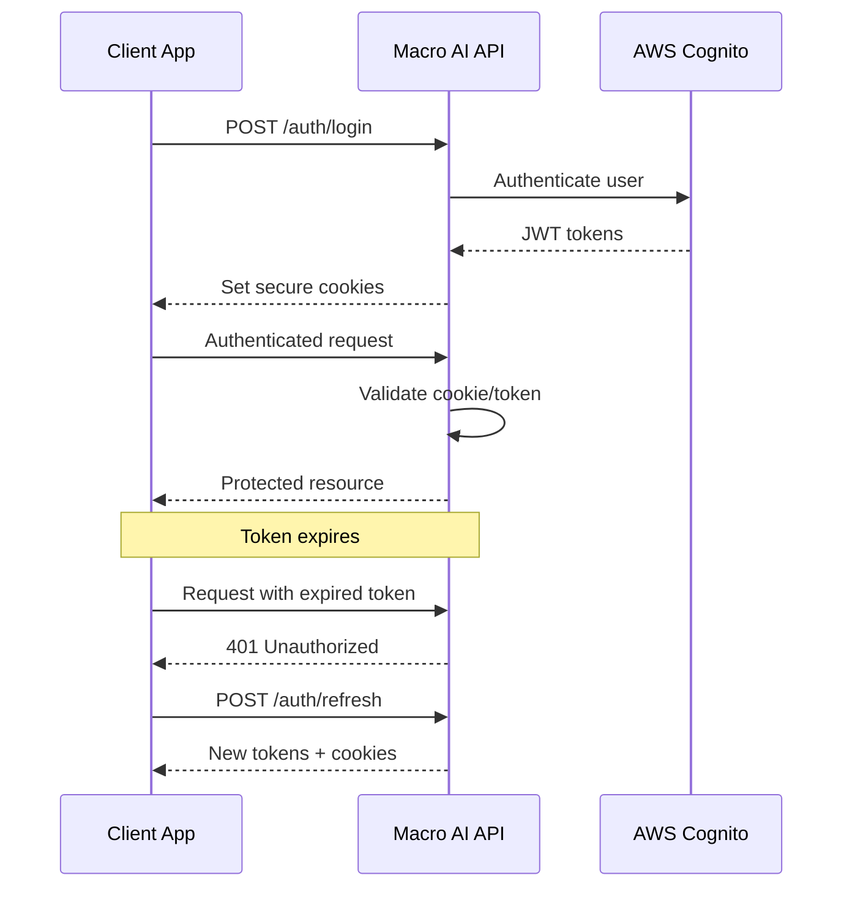

# API Reference

## Current Implementation Status ✅ PRODUCTION-READY

This document provides comprehensive API reference documentation for the Macro AI application, including all
endpoints, authentication methods, request/response schemas, error codes, and usage examples. The API is
**fully implemented and production-ready** with OpenAPI 3.0.0 specification and auto-generated client support.

## 🌐 API Overview

### Base Information ✅ IMPLEMENTED

- **Base URL**: `http://localhost:3030/api` (development) / `https://api.macro-ai.com/api` (production)
- **API Version**: v0.0.1
- **OpenAPI Version**: 3.0.0
- **Content Type**: `application/json`
- **Authentication**: Cookie-based with JWT tokens + API Key support

### Access Points ✅ AVAILABLE

- **Interactive Documentation**: `http://localhost:3030/api-docs` (Swagger UI)
- **OpenAPI Specification**: `http://localhost:3030/swagger.json` (Raw JSON spec)
- **Generated TypeScript Client**: `@repo/macro-ai-api-client` package

## 🔐 Authentication

### Authentication Methods ✅ IMPLEMENTED

#### 1. Cookie Authentication (Primary)

```http
Cookie: macro-ai-accessToken=eyJhbGciOiJIUzI1NiIsInR5cCI6IkpXVCJ9...
```

**Usage**: Automatic for web applications after login
**Expiration**: 1 hour (with automatic refresh)
**Security**: HttpOnly, Secure, SameSite=Strict

#### 2. API Key Authentication (Alternative)

```http
X-API-KEY: your-api-key-here
```

**Usage**: For programmatic access and external integrations
**Management**: Contact support for API key provisioning

### Authentication Flow ✅ IMPLEMENTED



## 📋 API Endpoints

### Authentication Endpoints ✅ IMPLEMENTED

#### Register User

```http
POST /auth/register
```

**Description**: Creates a new user account with email verification

**Request Body**:

```json
{
	"email": "user@example.com",
	"password": "SecurePass123!",
	"confirmPassword": "SecurePass123!",
	"firstName": "John",
	"lastName": "Doe"
}
```

**Response** (201 Created):

```json
{
	"success": true,
	"message": "User registered successfully. Please check your email for verification.",
	"user": {
		"id": "123e4567-e89b-12d3-a456-426614174000",
		"email": "user@example.com",
		"firstName": "John",
		"lastName": "Doe",
		"emailVerified": false,
		"createdAt": "2024-01-15T10:30:00Z"
	}
}
```

**Error Responses**:

- `400 Bad Request`: Invalid input data or password mismatch
- `409 Conflict`: Email already exists
- `429 Too Many Requests`: Rate limit exceeded (10 requests/hour)
- `500 Internal Server Error`: Server or Cognito error

#### User Login

```http
POST /auth/login
```

**Description**: Authenticates user and returns access tokens

**Request Body**:

```json
{
	"email": "user@example.com",
	"password": "SecurePass123!"
}
```

**Response** (200 OK):

```json
{
	"success": true,
	"message": "Login successful",
	"tokens": {
		"accessToken": "eyJhbGciOiJIUzI1NiIsInR5cCI6IkpXVCJ9...",
		"refreshToken": "eyJhbGciOiJIUzI1NiIsInR5cCI6IkpXVCJ9...",
		"expiresIn": 3600
	},
	"user": {
		"id": "123e4567-e89b-12d3-a456-426614174000",
		"email": "user@example.com",
		"firstName": "John",
		"lastName": "Doe",
		"emailVerified": true,
		"lastLogin": "2024-01-15T10:30:00Z"
	}
}
```

**Error Responses**:

- `400 Bad Request`: Invalid credentials format
- `401 Unauthorized`: Invalid email/password or unverified account
- `429 Too Many Requests`: Rate limit exceeded (10 requests/hour)
- `500 Internal Server Error`: Authentication service error

#### Refresh Token

```http
POST /auth/refresh
```

**Description**: Refreshes access token using refresh token

**Request Body**:

```json
{
	"refreshToken": "eyJhbGciOiJIUzI1NiIsInR5cCI6IkpXVCJ9..."
}
```

**Response** (200 OK):

```json
{
	"success": true,
	"message": "Token refreshed successfully",
	"tokens": {
		"accessToken": "eyJhbGciOiJIUzI1NiIsInR5cCI6IkpXVCJ9...",
		"refreshToken": "eyJhbGciOiJIUzI1NiIsInR5cCI6IkpXVCJ9...",
		"expiresIn": 3600
	}
}
```

#### Logout

```http
POST /auth/logout
```

**Description**: Invalidates user session and clears cookies

**Authentication**: Required (Cookie or API Key)

**Response** (200 OK):

```json
{
	"success": true,
	"message": "Logout successful"
}
```

#### Password Reset

```http
POST /auth/forgot-password
```

**Description**: Initiates password reset process

**Request Body**:

```json
{
	"email": "user@example.com"
}
```

**Response** (200 OK):

```json
{
	"success": true,
	"message": "Password reset code sent to your email"
}
```

### Chat Endpoints ✅ IMPLEMENTED

#### List User Chats

```http
GET /chats?page=1&limit=20
```

**Description**: Retrieves paginated list of user's chats

**Authentication**: Required

**Query Parameters**:

- `page` (optional): Page number (default: 1)
- `limit` (optional): Items per page (default: 20, max: 100)

**Response** (200 OK):

```json
{
	"success": true,
	"data": {
		"chats": [
			{
				"id": "chat-123e4567-e89b-12d3-a456-426614174000",
				"title": "My First Chat",
				"createdAt": "2024-01-15T10:30:00Z",
				"updatedAt": "2024-01-15T11:45:00Z",
				"messageCount": 5
			}
		],
		"pagination": {
			"page": 1,
			"limit": 20,
			"total": 1,
			"totalPages": 1
		}
	}
}
```

#### Create New Chat

```http
POST /chats
```

**Description**: Creates a new chat conversation

**Authentication**: Required

**Request Body**:

```json
{
	"title": "My New Chat"
}
```

**Response** (201 Created):

```json
{
	"success": true,
	"data": {
		"id": "chat-123e4567-e89b-12d3-a456-426614174000",
		"title": "My New Chat",
		"userId": "user-123e4567-e89b-12d3-a456-426614174000",
		"createdAt": "2024-01-15T10:30:00Z",
		"updatedAt": "2024-01-15T10:30:00Z"
	}
}
```

#### Get Chat Details

```http
GET /chats/{chatId}
```

**Description**: Retrieves specific chat with messages

**Authentication**: Required

**Path Parameters**:

- `chatId`: UUID of the chat

**Response** (200 OK):

```json
{
	"success": true,
	"data": {
		"id": "chat-123e4567-e89b-12d3-a456-426614174000",
		"title": "My Chat",
		"userId": "user-123e4567-e89b-12d3-a456-426614174000",
		"createdAt": "2024-01-15T10:30:00Z",
		"updatedAt": "2024-01-15T11:45:00Z",
		"messages": [
			{
				"id": "msg-123e4567-e89b-12d3-a456-426614174000",
				"role": "user",
				"content": "Hello, AI!",
				"createdAt": "2024-01-15T10:30:00Z"
			},
			{
				"id": "msg-456e7890-e89b-12d3-a456-426614174000",
				"role": "assistant",
				"content": "Hello! How can I help you today?",
				"createdAt": "2024-01-15T10:30:15Z"
			}
		]
	}
}
```

#### Stream Chat Message

```http
POST /chats/{chatId}/stream
```

**Description**: Sends message and streams AI response in real-time

**Authentication**: Required

**Content-Type**: `application/json`

**Request Body**:

```json
{
	"messages": [
		{
			"role": "user",
			"content": "What is machine learning?"
		}
	]
}
```

**Response**: Server-Sent Events (text/plain)

```text
Machine learning is a subset of artificial intelligence...
```

**Error Responses**:

- `400 Bad Request`: Invalid message format
- `401 Unauthorized`: Authentication required
- `404 Not Found`: Chat not found or access denied
- `429 Too Many Requests`: Rate limit exceeded
- `500 Internal Server Error`: AI service error

#### Update Chat

```http
PATCH /chats/{chatId}
```

**Description**: Updates chat properties (title, etc.)

**Authentication**: Required

**Request Body**:

```json
{
	"title": "Updated Chat Title"
}
```

**Response** (200 OK):

```json
{
	"success": true,
	"data": {
		"id": "chat-123e4567-e89b-12d3-a456-426614174000",
		"title": "Updated Chat Title",
		"userId": "user-123e4567-e89b-12d3-a456-426614174000",
		"updatedAt": "2024-01-15T12:00:00Z"
	}
}
```

#### Delete Chat

```http
DELETE /chats/{chatId}
```

**Description**: Permanently deletes a chat and all its messages

**Authentication**: Required

**Response** (200 OK):

```json
{
	"success": true,
	"message": "Chat deleted successfully"
}
```

### User Endpoints ✅ IMPLEMENTED

#### Get Current User Profile

```http
GET /users/me
```

**Description**: Retrieves authenticated user's profile information

**Authentication**: Required

**Response** (200 OK):

```json
{
	"success": true,
	"user": {
		"id": "123e4567-e89b-12d3-a456-426614174000",
		"email": "user@example.com",
		"firstName": "John",
		"lastName": "Doe",
		"emailVerified": true,
		"createdAt": "2024-01-15T10:30:00Z",
		"lastLogin": "2024-01-15T10:30:00Z"
	}
}
```

#### Get User by ID

```http
GET /users/{userId}
```

**Description**: Retrieves user profile by ID (limited information)

**Authentication**: Required

**Path Parameters**:

- `userId`: UUID of the user

**Response** (200 OK):

```json
{
	"success": true,
	"user": {
		"id": "123e4567-e89b-12d3-a456-426614174000",
		"firstName": "John",
		"lastName": "Doe",
		"createdAt": "2024-01-15T10:30:00Z"
	}
}
```

### System Endpoints ✅ IMPLEMENTED

#### Health Check

```http
GET /health
```

**Description**: Returns API health status

**Authentication**: Not required

**Response** (200 OK):

```json
{
	"status": "healthy",
	"timestamp": "2024-01-15T10:30:00Z",
	"version": "0.0.1",
	"uptime": 3600,
	"database": "connected",
	"redis": "connected"
}
```

#### System Information

```http
GET /system-info
```

**Description**: Returns detailed system information

**Authentication**: Not required

**Response** (200 OK):

```json
{
	"nodeVersion": "v20.10.0",
	"platform": "linux",
	"architecture": "x64",
	"uptime": 3600,
	"memory": {
		"used": 134217728,
		"total": 1073741824,
		"percentage": 12.5
	},
	"cpu": {
		"model": "Intel(R) Core(TM) i7-9750H",
		"cores": 12,
		"usage": 15.2
	}
}
```

## 🚦 Rate Limiting

### Rate Limit Policies ✅ IMPLEMENTED

#### Global Rate Limit

- **Limit**: 100 requests per 15 minutes
- **Scope**: All endpoints
- **Headers**: `RateLimit-Limit`, `RateLimit-Remaining`, `RateLimit-Reset`

#### Authentication Rate Limit

- **Limit**: 10 requests per hour
- **Scope**: `/auth/*` endpoints
- **Purpose**: Prevent brute force attacks

#### API Rate Limit

- **Limit**: 60 requests per minute
- **Scope**: API key authenticated requests
- **Purpose**: Fair usage for programmatic access

### Rate Limit Headers ✅ IMPLEMENTED

```http
RateLimit-Limit: 100
RateLimit-Remaining: 95
RateLimit-Reset: 1642248000
```

### Rate Limit Error Response

```json
{
	"status": 429,
	"message": "Too many requests, please try again later.",
	"retryAfter": 900
}
```

## ❌ Error Handling

### Standard Error Response Format ✅ IMPLEMENTED

```json
{
	"success": false,
	"error": "Error message",
	"code": "ERROR_CODE",
	"details": {
		"field": "Specific field error"
	},
	"timestamp": "2024-01-15T10:30:00Z",
	"requestId": "req-123e4567-e89b-12d3-a456-426614174000"
}
```

### HTTP Status Codes ✅ IMPLEMENTED

| Code  | Description           | Usage                                     |
| ----- | --------------------- | ----------------------------------------- |
| `200` | OK                    | Successful GET, PATCH, DELETE             |
| `201` | Created               | Successful POST (resource created)        |
| `400` | Bad Request           | Invalid request data or validation errors |
| `401` | Unauthorized          | Authentication required or invalid        |
| `403` | Forbidden             | Access denied (insufficient permissions)  |
| `404` | Not Found             | Resource not found                        |
| `409` | Conflict              | Resource already exists (e.g., email)     |
| `429` | Too Many Requests     | Rate limit exceeded                       |
| `500` | Internal Server Error | Server or service error                   |

### Common Error Codes ✅ IMPLEMENTED

- `VALIDATION_ERROR`: Request validation failed
- `AUTHENTICATION_REQUIRED`: Valid authentication required
- `ACCESS_DENIED`: Insufficient permissions
- `RESOURCE_NOT_FOUND`: Requested resource not found
- `RESOURCE_CONFLICT`: Resource already exists
- `RATE_LIMIT_EXCEEDED`: Too many requests
- `INTERNAL_SERVER_ERROR`: Unexpected server error
- `COGNITO_ERROR`: AWS Cognito service error
- `DATABASE_ERROR`: Database operation failed

## 📚 Related Documentation

- **[Auto-Generated Client](../features/api-client/auto-generation.md)** - TypeScript client generation and usage
- **[Usage Examples](../features/api-client/usage-examples.md)** - Practical API client usage patterns
- **[Authentication System](../features/authentication/README.md)** - Detailed authentication implementation
- **[Chat System](../features/chat-system/README.md)** - Chat functionality and streaming
- **[API Development](../development/api-development.md)** - API development guidelines and patterns
