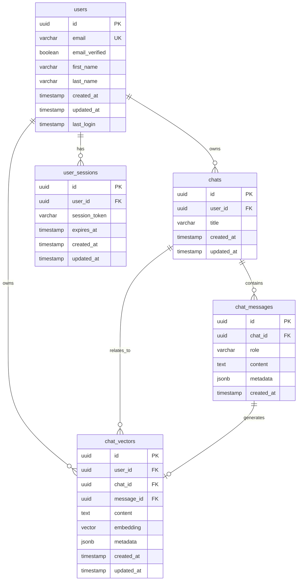

# Database Schema Reference

## Current Implementation Status ✅ PRODUCTION-READY

This document provides comprehensive reference documentation for the Macro AI database schema, including all tables,
relationships, indexes, and constraints. The database schema is **fully implemented and production-ready** with
PostgreSQL 15+ and pgvector extension for vector operations.

## 🗄️ Database Overview

### Technology Stack ✅ IMPLEMENTED

- **Database**: PostgreSQL 15+
- **Vector Extension**: pgvector for semantic search
- **ORM**: Drizzle ORM with TypeScript integration
- **Migrations**: Automated schema versioning
- **Connection Pool**: Optimized connection management

### Schema Architecture



## 📋 Table Definitions

### users

**Purpose**: Store user account information and authentication data

```sql
CREATE TABLE users (
    id UUID PRIMARY KEY DEFAULT gen_random_uuid(),
    email VARCHAR(255) NOT NULL UNIQUE,
    email_verified BOOLEAN DEFAULT FALSE,
    first_name VARCHAR(255),
    last_name VARCHAR(255),
    created_at TIMESTAMP DEFAULT NOW(),
    updated_at TIMESTAMP DEFAULT NOW(),
    last_login TIMESTAMP
);
```

**Columns**:

- `id` - Primary key, auto-generated UUID
- `email` - User email address, unique constraint
- `email_verified` - Email verification status from Cognito
- `first_name` - User's first name
- `last_name` - User's last name
- `created_at` - Account creation timestamp
- `updated_at` - Last profile update timestamp
- `last_login` - Last successful login timestamp

**Indexes**:

- `PRIMARY KEY (id)`
- `UNIQUE INDEX email_idx ON users(email)`

### chats

**Purpose**: Store chat conversation metadata and ownership

```sql
CREATE TABLE chats (
    id UUID PRIMARY KEY DEFAULT gen_random_uuid(),
    user_id UUID NOT NULL REFERENCES users(id) ON DELETE CASCADE,
    title VARCHAR(255) NOT NULL,
    created_at TIMESTAMP DEFAULT NOW(),
    updated_at TIMESTAMP DEFAULT NOW()
);
```

**Columns**:

- `id` - Primary key, auto-generated UUID
- `user_id` - Foreign key to users table
- `title` - Chat conversation title
- `created_at` - Chat creation timestamp
- `updated_at` - Last message or title update timestamp

**Indexes**:

- `PRIMARY KEY (id)`
- `INDEX idx_chats_user_id ON chats(user_id)`
- `INDEX idx_chats_updated_at ON chats(updated_at DESC)`

### chat_messages

**Purpose**: Store individual messages within chat conversations

```sql
CREATE TABLE chat_messages (
    id UUID PRIMARY KEY DEFAULT gen_random_uuid(),
    chat_id UUID NOT NULL REFERENCES chats(id) ON DELETE CASCADE,
    role VARCHAR(50) NOT NULL CHECK (role IN ('user', 'assistant', 'system')),
    content TEXT NOT NULL,
    metadata JSONB,
    created_at TIMESTAMP DEFAULT NOW()
);
```

**Columns**:

- `id` - Primary key, auto-generated UUID
- `chat_id` - Foreign key to chats table
- `role` - Message role: 'user', 'assistant', or 'system'
- `content` - Message text content
- `metadata` - Additional message metadata (JSON)
- `created_at` - Message creation timestamp

**Indexes**:

- `PRIMARY KEY (id)`
- `INDEX idx_chat_messages_chat_id ON chat_messages(chat_id)`
- `INDEX idx_chat_messages_created_at ON chat_messages(created_at ASC)`

### chat_vectors

**Purpose**: Store vector embeddings for semantic search and AI operations

```sql
CREATE EXTENSION IF NOT EXISTS vector;

CREATE TABLE chat_vectors (
    id UUID PRIMARY KEY DEFAULT gen_random_uuid(),
    user_id UUID NOT NULL REFERENCES users(id) ON DELETE CASCADE,
    chat_id UUID NOT NULL REFERENCES chats(id) ON DELETE CASCADE,
    message_id UUID REFERENCES chat_messages(id) ON DELETE SET NULL,
    content TEXT NOT NULL,
    embedding VECTOR(1536),
    metadata JSONB,
    created_at TIMESTAMP DEFAULT NOW(),
    updated_at TIMESTAMP DEFAULT NOW()
);
```

**Columns**:

- `id` - Primary key, auto-generated UUID
- `user_id` - Foreign key to users table for ownership
- `chat_id` - Foreign key to chats table for context
- `message_id` - Optional foreign key to chat_messages table
- `content` - Text content that was vectorized
- `embedding` - Vector embedding (1536 dimensions for OpenAI)
- `metadata` - Additional vector metadata (JSON)
- `created_at` - Vector creation timestamp
- `updated_at` - Last vector update timestamp

**Indexes**:

- `PRIMARY KEY (id)`
- `INDEX idx_chat_vectors_user_id ON chat_vectors(user_id)`
- `INDEX idx_chat_vectors_chat_id ON chat_vectors(chat_id)`
- `INDEX idx_chat_vectors_embedding_hnsw USING hnsw (embedding vector_cosine_ops)`

### user_sessions

**Purpose**: Track active user sessions and authentication tokens

```sql
CREATE TABLE user_sessions (
    id UUID PRIMARY KEY DEFAULT gen_random_uuid(),
    user_id UUID NOT NULL REFERENCES users(id) ON DELETE CASCADE,
    session_token VARCHAR(255) NOT NULL UNIQUE,
    expires_at TIMESTAMP NOT NULL,
    created_at TIMESTAMP DEFAULT NOW(),
    updated_at TIMESTAMP DEFAULT NOW()
);
```

**Columns**:

- `id` - Primary key, auto-generated UUID
- `user_id` - Foreign key to users table
- `session_token` - Unique session identifier
- `expires_at` - Session expiration timestamp
- `created_at` - Session creation timestamp
- `updated_at` - Last session update timestamp

**Indexes**:

- `PRIMARY KEY (id)`
- `UNIQUE INDEX idx_user_sessions_token ON user_sessions(session_token)`
- `INDEX idx_user_sessions_user_id ON user_sessions(user_id)`
- `INDEX idx_user_sessions_expires_at ON user_sessions(expires_at)`

## 🔗 Relationships and Constraints

### Foreign Key Relationships

```sql
-- User ownership relationships
ALTER TABLE chats ADD CONSTRAINT fk_chats_user_id
    FOREIGN KEY (user_id) REFERENCES users(id) ON DELETE CASCADE;

ALTER TABLE chat_messages ADD CONSTRAINT fk_chat_messages_chat_id
    FOREIGN KEY (chat_id) REFERENCES chats(id) ON DELETE CASCADE;

ALTER TABLE chat_vectors ADD CONSTRAINT fk_chat_vectors_user_id
    FOREIGN KEY (user_id) REFERENCES users(id) ON DELETE CASCADE;

ALTER TABLE chat_vectors ADD CONSTRAINT fk_chat_vectors_chat_id
    FOREIGN KEY (chat_id) REFERENCES chats(id) ON DELETE CASCADE;

ALTER TABLE chat_vectors ADD CONSTRAINT fk_chat_vectors_message_id
    FOREIGN KEY (message_id) REFERENCES chat_messages(id) ON DELETE SET NULL;

ALTER TABLE user_sessions ADD CONSTRAINT fk_user_sessions_user_id
    FOREIGN KEY (user_id) REFERENCES users(id) ON DELETE CASCADE;
```

### Check Constraints

```sql
-- Message role validation
ALTER TABLE chat_messages ADD CONSTRAINT chk_message_role
    CHECK (role IN ('user', 'assistant', 'system'));

-- Email format validation
ALTER TABLE users ADD CONSTRAINT chk_email_format
    CHECK (email ~* '^[A-Za-z0-9._%+-]+@[A-Za-z0-9.-]+\.[A-Za-z]{2,}$');

-- Vector dimension validation
ALTER TABLE chat_vectors ADD CONSTRAINT chk_embedding_dimension
    CHECK (array_length(embedding, 1) = 1536);
```

## 📊 Performance Optimizations

### Vector Search Optimization

```sql
-- HNSW index for fast vector similarity search
CREATE INDEX CONCURRENTLY idx_chat_vectors_embedding_hnsw
ON chat_vectors USING hnsw (embedding vector_cosine_ops)
WITH (m = 16, ef_construction = 64);

-- Composite index for user-specific vector searches
CREATE INDEX CONCURRENTLY idx_chat_vectors_user_embedding
ON chat_vectors (user_id) INCLUDE (embedding);
```

### Query Performance Indexes

```sql
-- Composite indexes for common query patterns
CREATE INDEX CONCURRENTLY idx_chats_user_updated
ON chats (user_id, updated_at DESC);

CREATE INDEX CONCURRENTLY idx_messages_chat_created
ON chat_messages (chat_id, created_at ASC);

-- Partial indexes for active data
CREATE INDEX CONCURRENTLY idx_active_sessions
ON user_sessions (user_id, expires_at)
WHERE expires_at > NOW();
```

## 🔧 Maintenance Operations

### Regular Maintenance Tasks

```sql
-- Update table statistics
ANALYZE users, chats, chat_messages, chat_vectors, user_sessions;

-- Reindex vector indexes periodically
REINDEX INDEX CONCURRENTLY idx_chat_vectors_embedding_hnsw;

-- Clean up expired sessions
DELETE FROM user_sessions WHERE expires_at < NOW() - INTERVAL '7 days';

-- Vacuum tables to reclaim space
VACUUM ANALYZE chat_vectors;
```

### Backup Considerations

```sql
-- Full database backup
pg_dump macro_ai_prod > backup_$(date +%Y%m%d_%H%M%S).sql

-- Table-specific backups
pg_dump -t users -t chats -t chat_messages macro_ai_prod > user_data_backup.sql

-- Vector data backup (large files)
pg_dump -t chat_vectors macro_ai_prod | gzip > vectors_backup.sql.gz
```

## 📚 Related Documentation

- **[Database Design](../architecture/database-design.md)** - Architecture and design decisions
- **[Database Operations](../operations/database-operations.md)** - Operational procedures and maintenance
- **[Data Access Patterns](../features/user-management/data-access-patterns.md)** - Application data access patterns
- **[ADR-003: Database Technology](../adr/003-database-technology.md)** - Technology selection rationale
