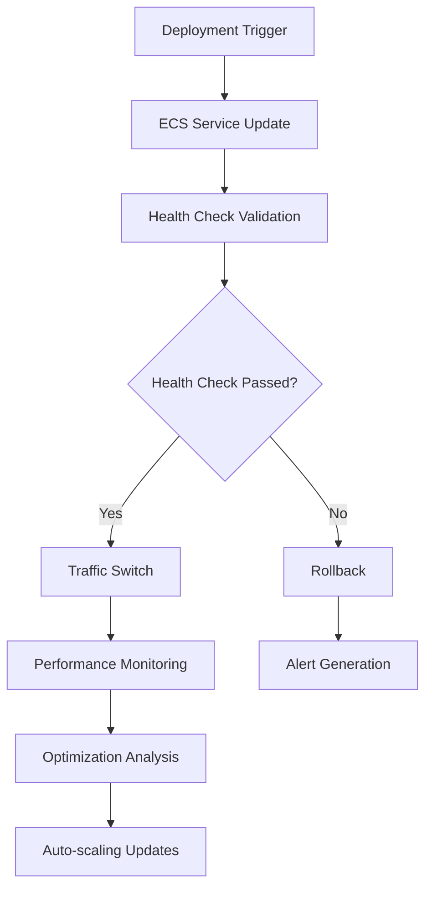

# Infrastructure Lambda Functions

## Overview

This document describes the AWS Lambda functions that support the Macro AI infrastructure operations,

> not application hosting. The application is hosted on ECS Fargate services.

These functions are essential for managing the ECS Fargate-based deployment infrastructure.

## Function Categories

### **1. Health Monitoring & Validation**

#### **comprehensive-health-checker**

- **Purpose**: Coordinates comprehensive health checks across ECS services and dependencies
- **Trigger**: CloudWatch Events (every 5 minutes)
- **Input**: Environment configuration and service endpoints
- **Output**: Health status report with detailed diagnostics
- **Key Features**:
  - Multi-service health validation
  - Dependency chain verification
  - Performance metrics collection
  - Alert generation for failures

#### **application-health-validator**

- **Purpose**: Validates ECS application health (API endpoints, service status)
- **Trigger**: CloudWatch Events (every 2 minutes)
- **Input**: Service endpoints and health check configurations
- **Output**: Health status with detailed error reporting
- **Key Features**:
  - Load balancer target health validation
  - Application endpoint testing
  - Response time monitoring
  - Error rate calculation

#### **deployment-health-validator**

- **Purpose**: Validates deployment health during blue-green deployments to ECS services
- **Trigger**: ECS deployment events
- **Input**: New service configuration and health check parameters
- **Output**: Deployment validation report
- **Key Features**:
  - Validates new ECS service health before traffic switching
  - Performance baseline comparison
  - Rollback decision support
  - Deployment success confirmation

### **2. Performance Optimization**

#### **performance-analyzer**

- **Purpose**: Analyzes ECS service performance metrics and identifies optimization opportunities
- **Trigger**: CloudWatch Events (every 4 hours)
- **Input**: CloudWatch metrics and performance data
- **Output**: Performance analysis report with recommendations
- **Key Features**:
  - Monitors ECS service CPU, memory, and network utilization
  - Identifies performance bottlenecks
  - Generates optimization recommendations
  - Tracks performance trends over time

#### **auto-scaling-optimizer**

- **Purpose**: Automatically optimizes ECS service scaling configurations based on performance data
- **Trigger**: Performance analysis completion
- **Input**: Performance analysis results and current scaling configuration
- **Output**: Optimized scaling configuration
- **Key Features**:
  - Analyzes scaling policy effectiveness
  - Adjusts CPU and memory thresholds
  - Optimizes scaling cooldown periods
  - Implements gradual scaling improvements

#### **cost-optimization-analyzer**

- **Purpose**: Analyzes and implements cost optimization strategies for ECS infrastructure
- **Trigger**: CloudWatch Events (daily)
- **Input**: Cost and usage data from Cost Explorer
- **Output**: Cost optimization recommendations and actions
- **Key Features**:
  - Analyzes ECS service costs and usage patterns
  - Identifies underutilized resources
  - Recommends resource allocation adjustments
  - Implements automatic cost optimizations

### **3. Security & Compliance**

#### **security-monitor**

- **Purpose**: Monitors ECS services and application security
- **Trigger**: CloudWatch Events (every 10 minutes)
- **Input**: Security logs and configuration data
- **Output**: Security status report and alerts
- **Key Features**:
  - Monitors security group changes
  - Tracks IAM role modifications
  - Validates container security configurations
  - Generates security compliance reports

#### **compliance-checker**

- **Purpose**: Validates infrastructure compliance with security policies
- **Trigger**: CloudWatch Events (daily)
- **Input**: Security policies and current configurations
- **Output**: Compliance report with remediation steps
- **Key Features**:
  - Validates security group configurations
  - Checks IAM role permissions
  - Verifies encryption settings
  - Generates compliance reports

## Function Configuration

### **Environment Variables**

```typescript
interface LambdaConfig {
	// ECS Configuration
	ECS_CLUSTER_NAME: string
	ECS_SERVICE_NAME: string

	// Health Check Configuration
	HEALTH_CHECK_ENDPOINTS: string // JSON array of endpoints
	HEALTH_CHECK_TIMEOUT: number // milliseconds

	// Performance Thresholds
	CPU_UTILIZATION_THRESHOLD: number // percentage
	MEMORY_UTILIZATION_THRESHOLD: number // percentage

	// Alerting Configuration
	SNS_TOPIC_ARN: string
	SLACK_WEBHOOK_URL: string
}
```

### **IAM Permissions**

```json
{
	"Version": "2012-10-17",
	"Statement": [
		{
			"Effect": "Allow",
			"Action": [
				"ecs:DescribeServices",
				"ecs:DescribeTasks",
				"ecs:ListTasks",
				"ecs:UpdateService"
			],
			"Resource": "*"
		},
		{
			"Effect": "Allow",
			"Action": [
				"elasticloadbalancing:DescribeTargetHealth",
				"elasticloadbalancing:DescribeTargetGroups"
			],
			"Resource": "*"
		},
		{
			"Effect": "Allow",
			"Action": ["cloudwatch:GetMetricStatistics", "cloudwatch:PutMetricData"],
			"Resource": "*"
		},
		{
			"Effect": "Allow",
			"Action": [
				"logs:CreateLogGroup",
				"logs:CreateLogStream",
				"logs:PutLogEvents"
			],
			"Resource": "*"
		}
	]
}
```

## Integration with ECS Deployment

These Lambda functions work together to support the ECS Fargate-based application deployment:

1. **Deployment Pipeline**: Orchestrates blue-green deployments to ECS services
2. **Health Monitoring**: Continuously monitors ECS application health
3. **Performance Optimization**: Automatically optimizes service configurations
4. **Security Monitoring**: Monitors ECS services and application security

### **Deployment Workflow**



## Monitoring & Alerting

### **CloudWatch Metrics**

Each function publishes custom metrics:

- **Health Check Success Rate**: Percentage of successful health checks
- **Response Time**: Average response time for health checks
- **Error Rate**: Percentage of health check failures
- **Performance Score**: Overall service performance rating

### **Alerting Rules**

```typescript
// Health Check Failure Alert
const healthCheckAlert = new cloudwatch.Alarm(this, 'HealthCheckFailure', {
	metric: healthCheckMetric,
	threshold: 95, // Alert if success rate drops below 95%
	evaluationPeriods: 2,
	alarmDescription: 'Health check failure rate exceeded threshold',
})
```

## Performance Characteristics

| **Function**          | **Name**                     | **Purpose**                | **Trigger**   | **Duration** |
| --------------------- | ---------------------------- | -------------------------- | ------------- | ------------ |
| **Health Monitoring** | comprehensive-health-checker | Coordinate health checks   | Every 5 min   | 2 min        |
| **Health Monitoring** | application-health-validator | Validate ECS app health    | Event-driven  | 3 min        |
| **Deployment**        | deployment-health-validator  | Validate deployment health | Event-driven  | 5 min        |
| **Performance**       | performance-analyzer         | Analyze ECS performance    | Every 4 hours | 10 min       |
| **Scaling**           | auto-scaling-optimizer       | Optimize scaling policies  | Event-driven  | 8 min        |
| **Cost**              | cost-optimization-analyzer   | Analyze cost optimization  | Daily         | 15 min       |
| **Security**          | security-monitor             | Monitor security status    | Every 10 min  | 5 min        |
| **Compliance**        | compliance-checker           | Validate compliance        | Daily         | 12 min       |

## Error Handling & Resilience

### **Retry Logic**

- **Exponential Backoff**: Functions retry failed operations with increasing delays
- **Circuit Breaker**: Prevents cascading failures during service outages
- **Dead Letter Queues**: Failed executions are captured for analysis

### **Fallback Strategies**

- **Graceful Degradation**: Functions continue operating with reduced functionality
- **Default Values**: Use sensible defaults when configuration is unavailable
- **Alert Generation**: Notify operators of critical failures

## Future Enhancements

### **Planned Improvements**

1. **Machine Learning Integration**: Predictive scaling based on historical patterns
2. **Advanced Monitoring**: Custom dashboards and real-time metrics
3. **Automated Remediation**: Self-healing infrastructure capabilities
4. **Multi-region Support**: Cross-region health monitoring and failover

### **Architecture Evolution**

- **Event-driven Architecture**: Enhanced event processing and routing
- **Microservices**: Function decomposition for better maintainability
- **Serverless Integration**: Enhanced integration with other serverless services

---

**Status**: ✅ **UPDATED** - ECS Fargate focused infrastructure management
**Next**: Phase 3B - API Client Documentation Consolidation
