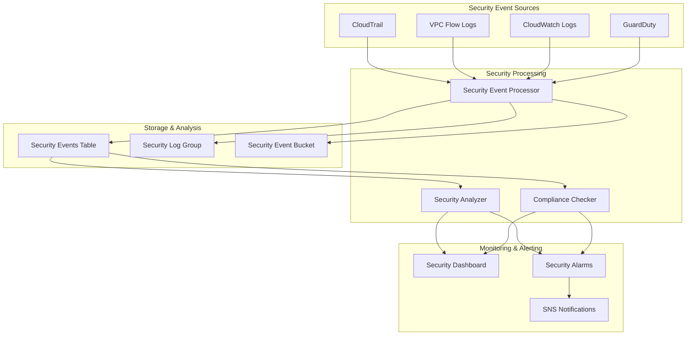

# Phase 4: Advanced Security Monitoring Implementation

## Overview

The Advanced Security Monitoring implementation provides comprehensive security monitoring, compliance tracking, and
security-focused alarms for the MacroAI infrastructure. This LOW PRIORITY Phase 4 task enhances operational security by
implementing real-time security event detection, automated threat analysis, and compliance monitoring.

## Architecture



## Components

### 1. Advanced Security Monitoring Construct

**File**: `infrastructure/src/constructs/advanced-security-monitoring-construct.ts`

The main construct that orchestrates all security monitoring components:

- **CloudTrail Integration**: API activity monitoring with comprehensive logging
- **VPC Flow Logs**: Network traffic analysis for anomaly detection
- **Security Event Processing**: Real-time event processing and classification
- **Compliance Monitoring**: Automated compliance checking with AWS Config
- **Security Analytics**: Pattern detection and threat analysis

### 2. Security Event Processor Lambda

**Purpose**: Process and classify security events from multiple sources

**Key Features**:

- CloudTrail event analysis for privilege escalation detection
- VPC Flow Logs analysis for network anomalies
- Security event classification by type and severity
- Automated threat scoring and risk assessment
- Real-time metrics publishing to CloudWatch

**Event Types Detected**:

- `UNAUTHORIZED_ACCESS`: Suspicious access patterns
- `PRIVILEGE_ESCALATION`: IAM permission changes
- `SUSPICIOUS_LOGIN`: Failed authentication attempts
- `DATA_EXFILTRATION`: Unusual data transfer patterns
- `MALWARE_DETECTION`: Security tool alerts
- `COMPLIANCE_VIOLATION`: Policy violations
- `CONFIGURATION_CHANGE`: Security configuration changes
- `NETWORK_ANOMALY`: Suspicious network activity

### 3. Security Analyzer Lambda

**Purpose**: Analyze security events to identify threats and patterns

**Key Features**:

- Pattern recognition for attack campaigns
- Threat confidence scoring
- Risk assessment and scoring
- Automated recommendation generation
- Trend analysis and reporting

**Analysis Capabilities**:

- Brute force attack detection
- Privilege escalation campaign identification
- Network reconnaissance detection
- Anomaly correlation and clustering

### 4. Compliance Checker Lambda

**Purpose**: Monitor compliance status and violations

**Key Features**:

- AWS Config rule compliance monitoring
- Automated violation detection
- Compliance rate calculation
- Violation severity assessment
- Compliance reporting and metrics

### 5. Security Dashboard

**Purpose**: Comprehensive security monitoring visualization

**Widgets Include**:

- Security events by type and severity
- Real-time threat detection metrics
- Compliance status overview
- Security risk score trending
- Active security alarms

## Configuration

### Environment-Specific Settings

#### Production Configuration

```typescript
{
  securityConfig: {
    enableCloudTrail: true,
    cloudTrailRetentionDays: 90,
    enableVpcFlowLogs: true,
    enableGuardDutyIntegration: true,
    securityEventRetentionDays: 2555, // 7 years for compliance
    enableComplianceMonitoring: true,
  },
  alertingThresholds: {
    criticalEvents: 1, // Immediate alert
    highSeverityEvents: 5, // Alert after 5 events in 15 minutes
    complianceViolations: 1, // Immediate alert
  }
}
```

#### Staging Configuration

```typescript
{
  securityConfig: {
    enableCloudTrail: true,
    cloudTrailRetentionDays: 30,
    enableVpcFlowLogs: true,
    enableGuardDutyIntegration: false,
    securityEventRetentionDays: 365, // 1 year
    enableComplianceMonitoring: true,
  },
  alertingThresholds: {
    criticalEvents: 2,
    highSeverityEvents: 10,
    complianceViolations: 3,
  }
}
```

#### Development Configuration

```typescript
{
  securityConfig: {
    enableCloudTrail: false,
    cloudTrailRetentionDays: 7,
    enableVpcFlowLogs: false,
    enableGuardDutyIntegration: false,
    securityEventRetentionDays: 30,
    enableComplianceMonitoring: false,
  },
  alertingThresholds: {
    criticalEvents: 5,
    highSeverityEvents: 20,
    complianceViolations: 10,
  }
}
```

## Integration Example

```typescript
import { AdvancedSecurityMonitoringConstruct } from '../constructs/advanced-security-monitoring-construct'

// Create security monitoring with full configuration
const securityMonitoring = new AdvancedSecurityMonitoringConstruct(
	this,
	'SecurityMonitoring',
	{
		environmentName: 'production',
		applicationName: 'macro-ai',
		securityConfig: {
			enableCloudTrail: true,
			cloudTrailRetentionDays: 90,
			enableVpcFlowLogs: true,
			enableGuardDutyIntegration: true,
			securityEventRetentionDays: 2555,
			enableComplianceMonitoring: true,
		},
		securityNotificationTopics: {
			criticalSecurityAlert,
			securityWarning,
			complianceViolation,
			suspiciousActivity,
		},
		vpcId: 'vpc-12345678',
	},
)
```

## CLI Usage

### Security Monitoring CLI

**Installation**:

```bash
# Install dependencies
pnpm add commander @aws-sdk/client-cloudwatch @aws-sdk/client-dynamodb @aws-sdk/client-lambda chalk cli-table3

# Install TypeScript execution tools (if not already available)
pnpm add -g tsx
# OR
pnpm add -g ts-node
```

**Commands**:

```bash
# Using tsx (recommended - faster startup)
tsx infrastructure/src/cli/security-monitoring-cli.ts events --environment production --since 24

# Using ts-node
ts-node infrastructure/src/cli/security-monitoring-cli.ts events --environment production --since 24

# Using compiled JavaScript (after pnpm build)
node infrastructure/dist/cli/security-monitoring-cli.js events --environment production --since 24

# View security metrics
tsx infrastructure/src/cli/security-monitoring-cli.ts metrics --environment production --period 24

# Run security analysis
tsx infrastructure/src/cli/security-monitoring-cli.ts analyze --environment production

# Check compliance status
tsx infrastructure/src/cli/security-monitoring-cli.ts compliance --environment production

# View security dashboard
tsx infrastructure/src/cli/security-monitoring-cli.ts dashboard --environment production
```

**Example Output**:

```text
🔍 Fetching security events...
┌──────────────────────┬────────────────────┬──────────────────────┬────────────┬───────────────┬────────────────────────────────────────┐
│ Event ID             │ Timestamp          │ Type                 │ Severity   │ Source        │ Description                            │
├──────────────────────┼────────────────────┼──────────────────────┼────────────┼───────────────┼────────────────────────────────────────┤
│ ct-12345678-abcd...  │ 2024-08-14 10:30   │ PRIVILEGE_ESCALATION │ HIGH       │ CloudTrail    │ IAM policy attachment detected...     │
│ vpc-87654321-efgh... │ 2024-08-14 10:25   │ NETWORK_ANOMALY      │ MEDIUM     │ VPC Flow Logs │ Suspicious network activity...        │
└──────────────────────┴────────────────────┴──────────────────────┴────────────┴───────────────┴────────────────────────────────────────┘

✅ Found 2 security events
```

## Security Event Schema

### DynamoDB Table Structure

**Primary Key**: `eventId` (String)
**Sort Key**: `timestamp` (String)

**Attributes**:

- `eventType`: Security event classification
- `severity`: Event severity level (CRITICAL, HIGH, MEDIUM, LOW, INFO)
- `source`: Event source (CloudTrail, VPC Flow Logs, etc.)
- `description`: Human-readable event description
- `metadata`: Additional event context and details
- `ttl`: Time-to-live for automatic cleanup

**Global Secondary Indexes**:

- `EventTypeIndex`: Query by event type
- `SeverityIndex`: Query by severity level

## Monitoring and Alerting

### CloudWatch Alarms

1. **Critical Security Events Alarm**
   - Threshold: ≥ 1 critical event in 5 minutes
   - Action: Immediate SNS notification

2. **High Severity Events Alarm**
   - Threshold: ≥ 5 high severity events in 15 minutes
   - Action: SNS notification to security team

3. **Compliance Violations Alarm**
   - Threshold: ≥ 1 compliance violation in 1 hour
   - Action: SNS notification to compliance team

### SNS Notifications

- **Critical Security Alert**: Immediate notifications for critical threats
- **Security Warning**: Notifications for high-severity events
- **Compliance Violation**: Notifications for compliance issues
- **Suspicious Activity**: Notifications for anomalous behavior

## Security Best Practices

### Data Protection

- All security events encrypted at rest and in transit
- S3 bucket with versioning and lifecycle policies
- DynamoDB with point-in-time recovery enabled
- CloudWatch Logs with appropriate retention periods

### Access Control

- Lambda functions with least-privilege IAM roles
- VPC endpoints for secure AWS service communication
- Resource-based policies for cross-service access
- CloudTrail for comprehensive audit logging

### Compliance

- 7-year retention for production security events
- Automated compliance checking with AWS Config
- Regular compliance reporting and metrics
- Integration with existing compliance frameworks

## Operational Procedures

### Incident Response

1. **Critical Event Detection**: Automated alerting triggers immediate response
2. **Event Investigation**: Use CLI tools and dashboard for analysis
3. **Threat Assessment**: Review security analyzer recommendations
4. **Remediation**: Follow automated or manual remediation procedures
5. **Post-Incident Review**: Update detection rules and procedures

### Regular Maintenance

- Weekly security metrics review
- Monthly compliance status assessment
- Quarterly threat detection rule updates
- Annual security configuration review

## Cost Optimization

### Resource Optimization

- DynamoDB on-demand billing for variable workloads
- S3 lifecycle policies for cost-effective storage
- Lambda functions with appropriate memory allocation
- CloudWatch Logs retention based on compliance requirements

### Monitoring Costs

- CloudWatch metrics for cost tracking
- Regular cost analysis and optimization
- Resource tagging for cost allocation
- Automated cost alerts and notifications

## Troubleshooting

### Common Issues

1. **Missing Security Events**
   - Verify CloudTrail and VPC Flow Logs configuration
   - Check Lambda function permissions and logs
   - Validate EventBridge rules and targets

2. **High False Positive Rate**
   - Adjust threat detection thresholds
   - Update security event classification rules
   - Review and tune anomaly detection algorithms

3. **Compliance Check Failures**
   - Verify AWS Config service configuration
   - Check compliance checker Lambda permissions
   - Review Config rules and evaluation results

### Debugging Commands

```bash
# Check Lambda function logs
aws logs describe-log-groups --log-group-name-prefix "/aws/lambda/macro-ai-production-security"

# Query recent security events
aws dynamodb scan --table-name macro-ai-production-security-events --limit 10

# Check CloudWatch metrics
aws cloudwatch get-metric-statistics --namespace "MacroAI/Security" --metric-name "SecurityEvent"
```

This implementation provides comprehensive security monitoring capabilities that enhance the operational security
posture of the MacroAI infrastructure while maintaining cost-effectiveness and operational efficiency.
