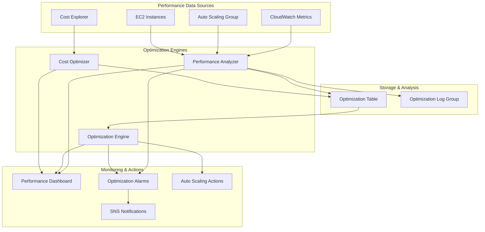

# Phase 4: Performance Optimization & Fine-tuning Implementation

## Overview

The Performance Optimization & Fine-tuning implementation provides comprehensive performance monitoring, automated
optimization recommendations, and cost optimization capabilities for the MacroAI infrastructure. This LOW PRIORITY Phase
4 task enhances operational excellence by implementing intelligent performance analysis, automated scaling optimization,
and cost-effective resource management.

## Architecture



## Components

### 1. Performance Optimization Construct

**File**: `infrastructure/src/constructs/performance-optimization-construct.ts`

The main construct that orchestrates all performance optimization components:

- **Performance Analysis**: Real-time performance monitoring and analysis
- **Optimization Engine**: Automated optimization recommendation processing
- **Cost Optimization**: Cost analysis and savings recommendations
- **Auto Scaling Integration**: Intelligent scaling decisions based on performance data
- **Performance Dashboard**: Comprehensive performance visualization

### 2. Performance Analyzer Lambda

**Purpose**: Analyze performance metrics and generate optimization recommendations

**Key Features**:

- CPU and memory utilization analysis
- Performance bottleneck identification
- Efficiency rating calculation
- Automated recommendation generation
- Real-time performance scoring

**Analysis Capabilities**:

- Resource utilization trending
- Performance threshold monitoring
- Capacity planning recommendations
- Efficiency optimization suggestions

**Performance Metrics Analyzed**:

- CPU utilization (average and peak)
- Memory utilization patterns
- Network I/O performance
- Auto Scaling Group capacity metrics
- Application response times

### 3. Optimization Engine Lambda

**Purpose**: Process optimization recommendations and execute automated actions

**Key Features**:

- Recommendation prioritization and filtering
- Automated scaling actions (when safe)
- Manual intervention requirements for risky changes
- Optimization status tracking
- Success/failure metrics reporting

**Optimization Types**:

- `SCALE_UP`: Increase instance capacity
- `SCALE_DOWN`: Decrease instance capacity (manual approval required)
- `INSTANCE_TYPE_CHANGE`: Recommend different instance types
- `COST_OPTIMIZATION`: Cost-saving opportunities
- `PERFORMANCE_TUNING`: Performance enhancement suggestions

### 4. Cost Optimizer Lambda

**Purpose**: Analyze costs and identify optimization opportunities

**Key Features**:

- Cost trend analysis using Cost Explorer
- Spot instance savings calculations
- Right-sizing recommendations
- Reserved instance optimization
- Cost projection and budgeting

**Cost Analysis Capabilities**:

- Monthly cost tracking and projection
- Instance type cost comparison
- Spot vs. on-demand pricing analysis
- Utilization-based right-sizing
- Cost savings potential calculation

### 5. Performance Dashboard

**Purpose**: Comprehensive performance optimization visualization

**Widgets Include**:

- CPU utilization vs. target thresholds
- Memory utilization trending
- Performance score over time
- Efficiency rating metrics
- Cost savings potential
- Auto Scaling Group capacity metrics
- Optimization recommendations summary

## Configuration

### Environment-Specific Settings

#### Production Configuration

```typescript
{
  enableAutoScalingOptimization: true,
  enableCostOptimization: true,
  enablePerformanceMonitoring: true,
  analysisInterval: Duration.hours(1),
  performanceThresholds: {
    cpuUtilizationTarget: 70,
    memoryUtilizationTarget: 80,
    responseTimeTarget: 500, // ms
    throughputTarget: 1000, // requests/min
  },
  costThresholds: {
    maxHourlyCost: 50,
    utilizationThreshold: 60,
  }
}
```

#### Staging Configuration

```typescript
{
  enableAutoScalingOptimization: true,
  enableCostOptimization: true,
  enablePerformanceMonitoring: true,
  analysisInterval: Duration.hours(2),
  performanceThresholds: {
    cpuUtilizationTarget: 75,
    memoryUtilizationTarget: 85,
    responseTimeTarget: 1000, // ms
    throughputTarget: 500, // requests/min
  },
  costThresholds: {
    maxHourlyCost: 20,
    utilizationThreshold: 50,
  }
}
```

#### Development Configuration

```typescript
{
  enableAutoScalingOptimization: false, // Manual control in dev
  enableCostOptimization: true,
  enablePerformanceMonitoring: true,
  analysisInterval: Duration.hours(4),
  performanceThresholds: {
    cpuUtilizationTarget: 80,
    memoryUtilizationTarget: 90,
    responseTimeTarget: 2000, // ms
    throughputTarget: 100, // requests/min
  },
  costThresholds: {
    maxHourlyCost: 10,
    utilizationThreshold: 40,
  }
}
```

## Integration Example

```typescript
import { PerformanceOptimizationConstruct } from '../constructs/performance-optimization-construct'

// Create performance optimization with full configuration
const performanceOptimization = new PerformanceOptimizationConstruct(
	this,
	'PerformanceOptimization',
	{
		environmentName: 'production',
		applicationName: 'macro-ai',
		autoScalingGroup: existingAutoScalingGroup,
		optimizationConfig: {
			enableAutoScalingOptimization: true,
			enableCostOptimization: true,
			enablePerformanceMonitoring: true,
			analysisInterval: cdk.Duration.hours(1),
			performanceThresholds: {
				cpuUtilizationTarget: 70,
				memoryUtilizationTarget: 80,
				responseTimeTarget: 500,
				throughputTarget: 1000,
			},
			costThresholds: {
				maxHourlyCost: 50,
				utilizationThreshold: 60,
			},
		},
		optimizationNotificationTopics: {
			optimizationRecommendation,
			performanceAlert,
			costAlert,
		},
	},
)
```

## CLI Usage

### Performance Optimization CLI

**Installation**:

```bash
# Install dependencies
pnpm add commander @aws-sdk/client-cloudwatch @aws-sdk/client-dynamodb @aws-sdk/client-lambda @aws-sdk/client-auto-scaling chalk cli-table3

# Install TypeScript execution tools (if not already available)
pnpm add -g tsx
# OR
pnpm add -g ts-node
```

**Commands**:

```bash
# Using tsx (recommended - faster startup)
tsx infrastructure/src/cli/performance-optimization-cli.ts metrics --environment production --period 24

# Using ts-node
ts-node infrastructure/src/cli/performance-optimization-cli.ts metrics --environment production --period 24

# Using compiled JavaScript (after pnpm build)
node infrastructure/dist/cli/performance-optimization-cli.js metrics --environment production --period 24

# View optimization recommendations
tsx infrastructure/src/cli/performance-optimization-cli.ts recommendations --environment production --priority HIGH

# Run performance analysis
tsx infrastructure/src/cli/performance-optimization-cli.ts analyze --environment production

# Analyze cost optimization
./performance-optimization-cli.ts cost --environment production

# View Auto Scaling status
./performance-optimization-cli.ts scaling --environment production

# View performance dashboard
./performance-optimization-cli.ts dashboard --environment production
```

**Example Output**:

```text
📊 Performance Metrics Summary
──────────────────────────────────────────────────
┌─────────────────────────┬───────────────┬───────────────┬──────────┐
│ Metric                  │ Value         │ Status        │ Period   │
├─────────────────────────┼───────────────┼───────────────┼──────────┤
│ CPU Utilization (Avg)   │ 65.2%         │ OPTIMAL       │ 24h      │
│ CPU Utilization (Max)   │ 89.1%         │ HIGH          │ 24h      │
│ Performance Score       │ 85.3          │ GOOD          │ Current  │
│ Efficiency Rating       │ 78.9%         │ GOOD          │ Current  │
└─────────────────────────┴───────────────┴───────────────┴──────────┘

🎯 Overall Performance: GOOD
```

## Optimization Recommendation Schema

### DynamoDB Table Structure

**Primary Key**: `id` (String)
**Sort Key**: `timestamp` (String)

**Attributes**:

- `type`: Optimization type (SCALE_UP, SCALE_DOWN, etc.)
- `priority`: Recommendation priority (HIGH, MEDIUM, LOW)
- `description`: Human-readable recommendation description
- `status`: Processing status (PENDING, COMPLETED, FAILED)
- `expectedImpact`: Expected performance and cost impact
- `implementation`: Implementation details and automation status
- `ttl`: Time-to-live for automatic cleanup

**Global Secondary Indexes**:

- `TypeIndex`: Query by optimization type
- `PriorityIndex`: Query by priority level

## Performance Analysis

### Performance Scoring Algorithm

The performance score (0-100) is calculated based on:

1. **CPU Utilization Analysis** (40% weight)
   - Optimal range: 60-80%
   - Penalties for over/under-utilization

2. **Memory Utilization Analysis** (30% weight)
   - Optimal range: 70-85%
   - Penalties for memory pressure or waste

3. **Capacity Utilization** (20% weight)
   - Auto Scaling Group capacity vs. maximum
   - Penalties for capacity constraints

4. **Response Time Performance** (10% weight)
   - Application response time vs. targets
   - Penalties for degraded performance

### Efficiency Rating Calculation

Efficiency rating measures resource utilization effectiveness:

```typescript
const resourceUtilization = (cpuAverage + memoryAverage) / 2
const capacityUtilization = (instances / maxSize) * 100
const avgUtilization = (resourceUtilization + capacityUtilization) / 2

// Ideal efficiency range: 60-80%
if (avgUtilization >= 60 && avgUtilization <= 80) {
	efficiency = 100
} else if (avgUtilization < 60) {
	efficiency = (avgUtilization / 60) * 100
} else {
	efficiency = Math.max(100 - (avgUtilization - 80), 0)
}
```

## Automated Optimization Actions

### Safe Automated Actions

- **Scale Up**: Automatically increase capacity when performance degrades
- **Metric Publishing**: Continuous performance metrics publication
- **Recommendation Generation**: Automated analysis and recommendation creation

### Manual Approval Required

- **Scale Down**: Requires manual approval to prevent service disruption
- **Instance Type Changes**: Requires manual validation and testing
- **Cost Optimization**: Requires manual review of business impact

### Safety Mechanisms

- **Cooldown Periods**: Prevent rapid scaling oscillations
- **Maximum Limits**: Respect Auto Scaling Group maximum capacity
- **Health Checks**: Ensure instance health before scaling actions
- **Rollback Procedures**: Automated rollback for failed optimizations

## Cost Optimization

### Cost Analysis Features

1. **Monthly Cost Tracking**
   - Historical cost trends
   - Cost projection based on current usage
   - Cost breakdown by service and resource

2. **Spot Instance Analysis**
   - Spot vs. on-demand pricing comparison
   - Potential savings calculation
   - Availability and interruption risk assessment

3. **Right-sizing Recommendations**
   - Instance utilization analysis
   - Over-provisioned resource identification
   - Cost-effective instance type suggestions

4. **Reserved Instance Optimization**
   - Usage pattern analysis
   - Reserved instance recommendations
   - Cost savings potential calculation

### Cost Optimization Recommendations

```typescript
// Example cost optimization recommendation
{
  id: "cost-1234567890-spot",
  type: "COST_OPTIMIZATION",
  priority: "MEDIUM",
  description: "Switch to spot instances (t3.medium) for 65% savings",
  expectedImpact: {
    costSavings: 65, // percentage
    riskLevel: "MEDIUM"
  },
  implementation: {
    automated: false,
    steps: [
      "Create new launch template with spot instances",
      "Update Auto Scaling Group configuration",
      "Monitor instance availability and interruptions"
    ],
    estimatedDuration: "30-60 minutes"
  }
}
```

## Monitoring and Alerting

### CloudWatch Alarms

1. **High CPU Utilization Alarm**
   - Threshold: ≥ 85% for 3 consecutive 5-minute periods
   - Action: Trigger performance analysis

2. **Low CPU Utilization Alarm**
   - Threshold: ≤ 20% for 4 consecutive 15-minute periods
   - Action: Generate cost optimization recommendations

3. **Performance Degradation Alarm**
   - Threshold: Performance score < 70 for 2 consecutive 30-minute periods
   - Action: Immediate performance investigation

### Performance Metrics

- **Performance Score**: Overall system performance rating (0-100)
- **Efficiency Rating**: Resource utilization effectiveness (0-100%)
- **Optimization Recommendations**: Number of active recommendations
- **Cost Savings Potential**: Estimated monthly savings percentage

## Operational Procedures

### Performance Monitoring Workflow

1. **Continuous Monitoring**: Automated performance analysis every hour
2. **Threshold Monitoring**: Real-time alerting for performance issues
3. **Recommendation Generation**: Automated optimization suggestions
4. **Manual Review**: Human validation for critical changes
5. **Implementation**: Automated or manual optimization execution
6. **Monitoring**: Post-optimization performance validation

### Cost Optimization Workflow

1. **Daily Cost Analysis**: Automated cost trend monitoring
2. **Weekly Optimization Review**: Manual review of cost recommendations
3. **Monthly Cost Assessment**: Comprehensive cost optimization analysis
4. **Quarterly Planning**: Strategic cost optimization planning

## Best Practices

### Performance Optimization

- Monitor performance trends, not just point-in-time metrics
- Consider business impact when implementing optimizations
- Test optimizations in staging before production deployment
- Maintain performance baselines for comparison

### Cost Optimization

- Balance cost savings with performance requirements
- Consider long-term trends, not just immediate costs
- Evaluate total cost of ownership, including operational overhead
- Plan for seasonal and growth-related cost variations

### Automation Safety

- Implement gradual rollout for automated optimizations
- Maintain manual override capabilities
- Monitor optimization results and adjust algorithms
- Document all optimization decisions and outcomes

## Troubleshooting

### Common Issues

1. **Optimization Recommendations Not Generated**
   - Check Lambda function permissions and logs
   - Verify CloudWatch metrics availability
   - Validate Auto Scaling Group configuration

2. **Automated Scaling Not Working**
   - Review Auto Scaling Group policies
   - Check Lambda function execution logs
   - Verify IAM permissions for scaling actions

3. **Inaccurate Cost Analysis**
   - Verify Cost Explorer API permissions
   - Check cost data availability and freshness
   - Review cost allocation tags and filters

### Debugging Commands

```bash
# Check performance analyzer logs
aws logs describe-log-groups --log-group-name-prefix "/aws/lambda/macro-ai-production-performance"

# Query optimization recommendations
aws dynamodb scan --table-name macro-ai-production-optimization-recommendations --limit 10

# Check Auto Scaling Group status
aws autoscaling describe-auto-scaling-groups --auto-scaling-group-names macro-ai-production-asg

# Review CloudWatch metrics
aws cloudwatch get-metric-statistics --namespace "MacroAI/Optimization" --metric-name "PerformanceScore"
```

This implementation provides comprehensive performance optimization capabilities that enhance operational efficiency,
reduce costs, and maintain optimal performance for the MacroAI infrastructure.
