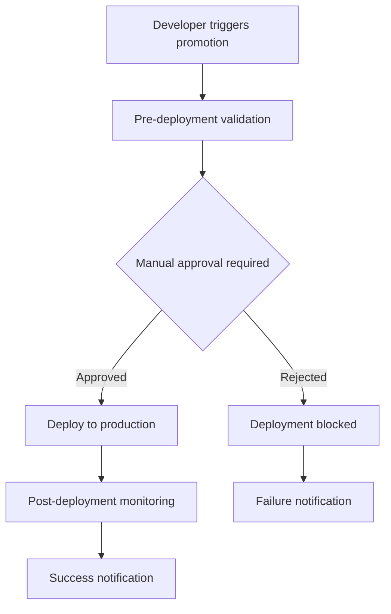

# 🚀 Production Promotion Workflow Implementation Plan

## 📋 Executive Summary

This document outlines a comprehensive implementation plan for transitioning from direct production deployments to a controlled
staging-to-production promotion workflow. The plan addresses manual approval mechanisms, automated semantic versioning, and
GitHub repository tagging aligned with monorepo releases.

## 🎯 Current State Analysis

### Existing Deployment Architecture

- **Preview Environments**: PR-based ephemeral deployments ✅
- **Staging Environment**: Automated deployment from `develop` branch ✅
- **Production Environment**: Direct deployment from `main` branch ⚠️ (untested)

### Identified Risks

- Production deployment pipeline untested in live environment
- No manual approval gates before production deployment
- No controlled promotion process from staging to production
- Manual version management across monorepo packages

## 🏗️ Implementation Overview

### Phase 1: Manual Approval System

### Phase 2: Automated Semantic Versioning

### Phase 3: GitHub Repository Tagging

### Phase 4: Promotion Workflow Integration

---

## 2. 📦 Semantic Versioning (Semver) Determination

### Current Implementation Analysis

Your existing **change detection workflow** already provides excellent foundations for semver determination:

```yaml
# From your reusable-change-detection.yml
BACKEND_CHANGES=$(git diff --name-only | grep -E '^infrastructure/|^apps/express-api/|^packages/macro-ai-api-client/')
FRONTEND_CHANGES=$(git diff --name-only | grep -E '^apps/client-ui/|^packages/ui-library/')
INFRASTRUCTURE_CHANGES=$(git diff --name-only | grep -E '^infrastructure/|\.github/workflows/')
```

### Enhanced Semver Determination Logic

The semver bump is determined by **combining change types with intelligent rules**:

```yaml
# Enhanced logic for semver determination
determine-semver-bump:
  steps:
    - name: Calculate Semver Bump
      run: |
        # Get change detection results
        HAS_BREAKING=$(echo "$CHANGED_FILES" | grep -q "BREAKING CHANGE:" && echo "true" || echo "false")
        HAS_BACKEND="$HAS_BACKEND_CHANGES"
        HAS_FRONTEND="$HAS_FRONTEND_CHANGES"
        HAS_INFRASTRUCTURE="$HAS_INFRASTRUCTURE_CHANGES"

        # Breaking changes always trigger major
        if [[ "$HAS_BREAKING" == "true" ]]; then
          echo "semver=major" >> $GITHUB_OUTPUT
          echo "reason=Breaking changes detected"
        # Infrastructure changes = major (affects compatibility)
        elif [[ "$HAS_INFRASTRUCTURE" == "true" ]]; then
          echo "semver=major" >> $GITHUB_OUTPUT
          echo "reason=Infrastructure changes"
        # Both backend + frontend = minor (new features)
        elif [[ "$HAS_BACKEND" == "true" && "$HAS_FRONTEND" == "true" ]]; then
          echo "semver=minor" >> $GITHUB_OUTPUT
          echo "reason=New features across stack"
        # Single component changes = patch (bug fixes)
        elif [[ "$HAS_BACKEND" == "true" || "$HAS_FRONTEND" == "true" ]]; then
          echo "semver=patch" >> $GITHUB_OUTPUT
          echo "reason=Component-specific changes"
        else
          echo "semver=patch" >> $GITHUB_OUTPUT
          echo "reason=Documentation or minor changes"
        fi
```

### Refined Semver Rules

Based on your existing release process documentation:

**Major (X.0.0)**:

- ✅ Infrastructure changes (affects compatibility)
- ✅ Breaking API changes
- ✅ Database schema migrations
- ✅ Removal of deprecated features

**Minor (x.Y.0)**:

- ✅ New features (backward compatible)
- ✅ New API endpoints
- ✅ Enhanced functionality
- ✅ Cross-stack feature additions

**Patch (x.y.Z)**:

- ✅ Bug fixes
- ✅ Security patches
- ✅ Documentation updates
- ✅ Single-component changes

---

## 3. 🛠️ Leveraging Existing Tools & Libraries

### GitHub Actions & Ecosystem Tools

**Already Available**:

- ✅ **google-github-actions/release-please-action** - Automated releases with semver
- ✅ **cycjimmy/semantic-release-action** - Semantic releases
- ✅ **softprops/action-gh-release** - GitHub releases
- ✅ **actions/create-release** - Release creation

**Recommended Integration**:

```yaml
# Use battle-tested GitHub Actions
- uses: google-github-actions/release-please-action@v4
  with:
    release-type: node
    package-name: macro-ai
    command: github-release

- uses: cycjimmy/semantic-release-action@v4
  with:
    extra_plugins: |
      @semantic-release/git
      @semantic-release/changelog
```

### Pulumi Built-in Features

**Pulumi Stack Management**:

```typescript
// Pulumi already supports version-aware deployments
const stack = new pulumi.StackReference('macro-ai/staging', {
	name: 'staging',
})

// Version-aware deployments with circuit breakers
const deployment = new aws.ecs.Service('api-service', {
	deploymentConfiguration: {
		maximumPercent: 200,
		minimumHealthyPercent: 100,
		deploymentCircuitBreaker: {
			enable: true,
			rollback: true,
		},
	},
})
```

### Node.js Ecosystem Libraries

**Recommended Libraries**:

```bash
# Add to devDependencies
npm install --save-dev \
  semver \
  conventional-changelog-cli \
  @semantic-release/git \
  @semantic-release/changelog
```

**Enhanced Version Management**:

```javascript
// scripts/version-manager.js - Leverages existing patterns
import semver from 'semver'
import { determineBumpFromChanges } from './your-existing-change-logic'

export class VersionManager {
	static async determineBump() {
		const changes = await this.analyzeChanges()
		return this.calculateBump(changes)
	}

	static analyzeChanges() {
		// Use your existing change detection logic
		const gitDiff = execSync('git diff --name-only HEAD~1')
		// Return structured change analysis
	}

	static calculateBump(changes) {
		if (changes.hasBreaking) return 'major'
		if (changes.hasFeatures) return 'minor'
		return 'patch'
	}
}
```

### GitHub Integration Enhancements

**Leverage Existing GitHub Features**:

```yaml
# Enhanced PR labeling for semver
- uses: actions/labeler@v5
  with:
    repo-token: ${{ secrets.GITHUB_TOKEN }}
    configuration-path: .github/labeler.yml

# .github/labeler.yml
'breaking-change':
  - changed-files:
    - any-glob-to-any-file: ['**/*']
    body-contains: 'BREAKING CHANGE:'

'feature':
  - changed-files:
    - any-glob-to-any-file: ['apps/**', 'packages/**']

'bugfix':
  - changed-files:
    - any-glob-to-any-file: ['**/*.ts', '**/*.tsx']
    body-contains: 'fix:'
```

---

## 4. 🎯 Implementation Approach

### Phase 1: Enhance Existing Logic (Week 1)

- [ ] Extend your current change detection with semver calculation
- [ ] Integrate PR labeling for automated semver detection
- [ ] Add version validation checks

### Phase 2: Integrate Popular Tools (Week 2)

- [ ] Implement `google-github-actions/release-please-action` for automated releases
- [ ] Configure `semantic-release-action` for changelog generation
- [ ] Set up automated tagging aligned with package.json versions

### Phase 3: Custom Enhancements (Week 3)

- [ ] Add custom semver logic for infrastructure changes
- [ ] Implement cross-package version synchronization
- [ ] Add version conflict detection and resolution

### Phase 4: Integration & Testing (Week 4)

- [ ] Full integration with promotion workflow
- [ ] End-to-end testing of complete pipeline
- [ ] Team training and documentation updates

### Key Advantages of This Approach

1. **Builds on Existing Logic**: Leverages your sophisticated change detection
2. **Industry Standards**: Uses battle-tested GitHub Actions and libraries
3. **Maintainable**: Relies on well-maintained, popular implementations
4. **Flexible**: Easy to customize while using robust foundations
5. **Future-Proof**: Easy to upgrade as tools evolve

---

## 5. 📊 Implementation Timeline

### Phase 1: Manual Approval System (Week 1)

### How Manual Approval Works

Manual approval in GitHub Actions uses **Environment Protection Rules** combined with **required reviewers**:

```yaml
# .github/workflows/production-promotion.yml
name: Promote to Production

on:
  workflow_dispatch:
    inputs:
      promote_from:
        description: 'Source environment (staging/hotfix)'
        required: true
        type: choice
        options:
          - staging
          - hotfix

jobs:
  # Pre-deployment validation
  validate-deployment:
    runs-on: ubuntu-latest
    environment: production-approval # 👈 This triggers approval requirement
    steps:
      - name: Pre-deployment Validation
        run: |
          echo "🔍 Running comprehensive validation..."
          # Type checking, linting, tests, etc.

  # Manual approval gate
  deploy-production:
    runs-on: ubuntu-latest
    needs: validate-deployment
    environment: production # 👈 Requires approval
    steps:
      - name: Deploy to Production
        run: |
          echo "🚀 Deploying to production after approval..."
```

### GitHub Environment Configuration

**Environment Protection Rules** in GitHub repository settings:

1. **Create Environment**: `production-approval` and `production`
2. **Configure Protection Rules**:

   ```yaml
   # Required reviewers
   - Type: "Required reviewers"
   - Required reviewers: "@org/admins", "@deployment-team"

   # Wait timer (optional)
   - Type: "Wait timer"
   - Minutes: 5

   # Branch protection (optional)
   - Required status checks: "validate-deployment"
   ```

### Approval Workflow



### Benefits

- **Human oversight** before production deployment
- **Audit trail** of who approved what and when
- **Emergency stop** capability
- **Compliance** with organizational policies

---
